# 命名实体识别任务

## ——BiLSTM+CRF

## 1. 问题简介

在句子中我们往往会遇到类似的句子：`Li Hua loves Chinese people`。那么，这个句子中有两类实体——人名和地名，与之相对应在我们的训练集中，有五类标签：

> B-Person， I- Person，B-Organization，I-Organization

设句子$X$由五个字符$w_1,w_2,w_3,w_4,w_5$组成，其中【$w_1,w_2$】为人名类实体，【$w_3$】为地名类实体，其他字符标签为“O”【Other】。

## 2. 模型

以下将给出模型的结构：

### 2.1 嵌入层

句子$X$中的每一个单元都代表着由字嵌入或词嵌入构成的向量。其中，字嵌入一般是随机初始化的，词嵌入是通过数据训练得到的。所有的嵌入在训练过程中都会调整到最优。【由于训练量巨大，而且要求的样本单词量较多，一般采用训练好的词嵌入模型】

### 2.2 BiLSTM-CRF模型

输入：字或词嵌入

输出：句子$X$中每个单元的标签

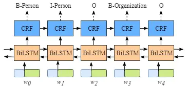

 Bi-LSTM结构图

#### 2.2.1 BiLSTM层

即双向Bi-LSTM【详见之前的LSTM文章】。

这里我们重点理解BiLSTM的输出层。

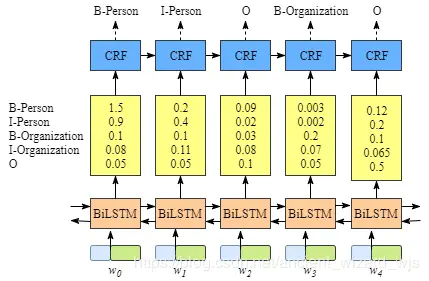

图2.Bi-LSTM标签预测原理图

如上图所示，BiLSTM层的输出为每一个标签的预测分值。

例如，对于单元$w_0$，BiLSTM层输出的是

> 1.5 (B-Person), 0.9 (I-Person),  0.1 (B-Organization),  0.08 (I-Organization)    0.05 (O).

这些分值将作为CRF的输入。

#### 2.2.2 CRF层

##### 2.2.2.1 CRF层的作用

显然，即使没有CRF层，我们也可以训练一个BiLSTM命名实体识别模型，如图所示：

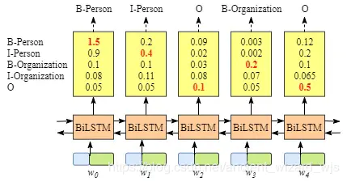

图3.去除CRF的BiLSTM命名实体识别模型

由于BiLSTM的输出为单元的每一个标签分值，我们可以挑选分值最高的一个作为该单元的标签。

例如，对于单元$w_0$,“B-Person”有最高分值—— 1.5，因此我们可以挑选“B-Person”作为$w_0$的预测标签。同理，我们可以得到$w_1$——“I-Person”，$w_2$—— “O” ，$w_3$——“B-Organization”，$w_4$——“O”。

 虽然我们可以得到句子x中每个单元的正确标签，但是我们不能保证标签每次都是预测正确的。

例如，图4.中的例子，标签序列是“I-Organization I-Person” and “B-Organization I-Person”，很显然这是错误的。

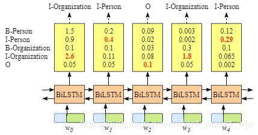

所以CRF层就是为了解决这种显而易见的逻辑性错误而使用的规则性约束

##### 2.2.2.2 CRF层——约束性的规则

CRF层可以为最后预测的标签添加一些约束来保证预测的标签是合法的。

可参考的约束:


- 句子中第一个词总是以标签“B-“ 或 “O”开始，而不是“I-”

- 标签“$B-label_1\ \ I-label_2\ \ I-label_3\ \ I-…$”，其中$label_1, label_2, label_3$应该属于同一类实体。

	- 例如，“B-Person I-Person” 是合法的序列, 但是“B-Person I-Organization” 是非法标签序列.

- 标签序列“O I-label” is 非法的.实体标签的首个标签应该是 “B-“ ，而非 “I-“, 换句话说,有效的标签序列应该是“O B-label”。


有了这些约束，标签序列预测中非法序列出现的概率将会大大降低。

## 3. 标签的评分和损失函数的定义

> https://zhuanlan.zhihu.com/p/27338210

### 3.1 评分标准

Bi-LSTM层的**输出维度**：tag\_size。【表示每个词 $w_i$映射到tag的发射概率值】

设Bi-LSTM的输出矩阵为P，其中$P_{i,j}$代表词$w_i$映射到$tag_j$的**非归一化概率**。

对于CRF来说，我们假定存在一个转移矩阵$A$，则$A_{i,j}$代表$tag_i$转移到$tag_j$的**转移概率**。
 对于输入序列 $X$ 对应的输出tag序列 y，定义分数为:
$$
s(X,y)=\sum^n_{i=0}A_{y_i,y_{i+1}}+\sum^n_{i=1}P_{i,y_i}
$$
即：**句子分数=所有词非归一化概率之和+所有词转移概率之和**。

### 3.2 似然概率

利用Softmax函数，对于每一个正确的tag序列y，都需要定义一个概率值（$Y_X$代表所有的tag序列，包括不可能出现的）
$$
p(y|X)=\frac{e^{s(X,y)}}{\sum_{\tilde y\in Y_X}e^{s(X,\tilde y)}}
$$
 由于已知其正确tag序列，我们只需要最大化似然概率$p(y|X)$即可，这里我们利用对数似然。【softmax层已经能够较好的放大似然概率$p(y|X)$，使用对数似然用于方便计算和进一步最大化$p(y|X)$】
$$
log(p(y|X))=log(\frac{e^{s(X,y)}}{\sum_{\tilde y\in Y_X}e^{s(X,\tilde y)}})=s(X,y)-log(\sum_{\tilde y\in Y_X}e^{s(X,\tilde y)})
$$

### 3.3 损失函数

 所以我们将损失函数定义为$-log(p(y|X))$，就可以利用梯度下降法来进行网络的学习了。
$$
Loss=log(\sum_{\tilde y\in Y_X}e^{s(X,\tilde y)})-s(X,y)
$$


在对损失函数进行计算的时候，$s(X,y)$的计算很简单，而$log(\sum_{\tilde y\in Y_X}e^{s(X,\tilde y)})$（下面记作logsumexp）的计算稍微复杂一些，因为需要计算每一条可能路径的分数。这里用一种简便的方法，对于到词$w_{i+1}$的路径，可以先把到词$w_i$的logsumexp计算出来，因为

设$s(X,\tilde y)$为x
$$
log(\sum e^{log(\sum e^x)+y})=log(\sum\sum e^{x+y})
$$
因此先计算每一步的局部路径分数和直接计算全局分数相同，可以大大减少计算的时间。【分治】

#### 3.3.1 详细解释

这篇文章对于理解十分有用

> https://blog.csdn.net/cuihuijun1hao/article/details/79405740

举例说 【我 爱 中国人民】对应标签【N V N】那这个标签就是一个完整的路径，也就对应一个Score值。

首先这个算法的思想是：假设我们要做一个词性标注的任务，对句子【我 爱 中华人民】，我们要对这个句子求
$$
log(\sum_{\tilde y\in Y_X}e^{s(X,\tilde y)})
$$
意思就是 对这个句子所有可能的标注，都算出来他们的score，然后按照指数次幂加起来，再取对数。

一般来说取所有可能的标注情况比较复杂，我们这里举例是长度为三，但是实际过程中，可能比这个要大得多，所以我们需要有一个简单高效的算法。也就是我们程序中得用的算法。

 先算出【我， 爱】可能标注得所有情况，取 log_sum_exp 然后加上 转换到【中国人民】得特征值。再加上【中国人民】对应得某个标签得特征值。其等价于【我，爱，中国人民】所有可能特征值指数次幂相加，然后取对数。


首先我们假设词性一共只有两种：**名词N** 和 **动词 V**

**1.**那么【我】有两种可能，所以此时的log\_sum\_exp为
$$
log(e^{score(N)})\text{或}log(e^{score(V)})
$$


**2.**那么【爱】标注为N时，得log_sum_exp 为
$$
log(e^{score(N,N)+score(V,N)})
$$


【爱】 标注为 V时，log_sum_exp为
$$
log(e^{score(N,V)+score(V,V)})
$$
于是，我们的forward列表里就是存在着这两个值，即：
$$
[log(e^{score(N,N)+score(V,N)}),log(e^{score(N,V)+score(V,V)})]
$$


**3.**假设【中华人民】得词性为N,我们按照代码来写一下公式,在forward列表对应位置相加就是这样
$$
[log(e^{score(N,N)+score(V,N)}+(N+N->N)),log(e^{score(N,V)+score(V,V)}+(N+V->N))]
$$
此时$N+N->N$可以写成$log(e^{N+N->N})$

那么我们的列表就是：
$$
[log(e^{score(N,N)+score(V,N)+(N+N->N)}),log(e^{score(N,V)+score(V,V)+(N+V->N)})]
$$
**4.**那么这个式子也就等价于
$$
[log(e^{score(*,N,N)}),log(e^{score(*,V,N)})]
$$
此时，我们对这个式子使用log\_sum\_exp就变成了
$$
log(\sum e^{score(*,*,N)})
$$
直观意义：【中华人民】的词性为N时整个score值的log\_sum\_exp。

同理，【中华人民】的词性为V时计算过程类似。

**5.**最后对【中华人民】的这两种N，V情况再做一次log\_sum\_exp我们就完成了对于【我，爱，中国人民】的所有情况的score值的log_sum_exp。

## 4. Viterbi算法——一种剪枝策略

> 参考：https://www.zhihu.com/question/20136144/answer/763021768

如下图，假如你从S和E之间找一条最短的路径，除了遍历完所有路径，还有什么更好的方法？

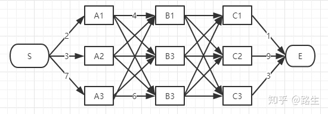

viterbi维特比算法解决的是篱笆型的图的最短路径问题，图的节点按列组织，每列的节点数量可以不一样，每一列的节点只能和相邻列的节点相连，不能跨列相连，节点之间有着不同的距离，距离的值就不在图上一一标注出来了，大家自行脑补

答案：viterbi (维特比)算法。

过程非常简单：

为了找出S到E之间的最短路径，我们先从S开始从左到右一列一列地来看。

首先起点是S，从S到A列的路径有三种可能：$S-A_1、S-A_2、S-A_3$，如下图：


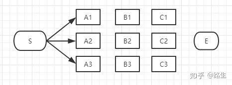


​    当前状况下，我们不能判断$S-A_1、S-A_2、S-A_3$中的哪一段必定是或必定不是全局最短路径中的一部分，目前为止任何一段都有可能是全局最短路径的备选项。

   我们继续往右看，到了B列。按B列的$B_1、B_2、B_3$逐个分析。

先看$B_1$：


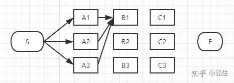


对于$B_1$来说，经过它的所有路径最多只有3条：

$S-A_1-B_1$

$S-A_2-B_1$

$S-A_3-B_1$

以上这三条路径，各节点距离加起来对比一下，我们就可以知道其中哪一条是最短的。

假设经过计算，$S-A_3-B_1$是最短的，那么，显然，途经$B_1$的所有路径中，$S-A_3-B_1$最短，其它两条路径$S-A_1-B_1$和$S-A_2-B_1$都比$S-A_3-B_1$长，绝对不是目标答案，可以大胆地删掉了。**删掉了不可能是答案的路径**，就是viterbi算法（维特比算法）的**重点**，因为后面我们再也不用考虑这些被删掉的路径了。现在经过$B_1$的所有路径只剩一条路径了，如下图：

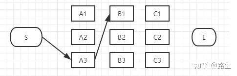

同理，我们可以对所有的节点均进行如上操作，即，B列的每个节点我们都删除了一些不可能是答案的路径，看看我们剩下哪些备选的最短路径，即$S-A_3-B_1、S-A_1-B_2、S-A_2-B_3$【如下图所示】。


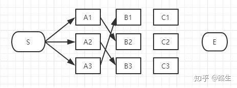

C列也是同理

对于$C_1$来说，经过它的所有路径最多只有3条：

$S-A_3-B_1-C_1$、

$S-A_1-B_2-C_1$、

$S-A_2-B_3-C_1$


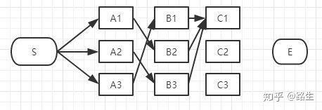

和B列的做法一样，从这三条路径中找到最短的那条（设为$S-A_3-B_1-C_1$），其它两条路径同样道理可以删掉了。那么经过$C_1$的所有路径只剩一条，如下图：

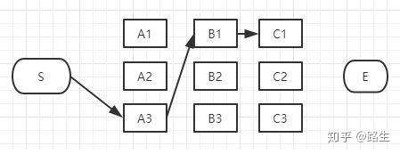

同理，我们可以找到经过C层所有的最短路径：

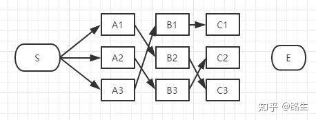

到达C列时最终也**只剩3条**备选的最短路径，我们仍然没有足够信息断定哪条才是全局最短。**【但是我们发现，这个结果已经很不错的剪掉了大量的枝，使每层的计算路径树仅与该层的大小有关。】**

最后，我们继续看E节点。

到E的路径也只有3种可能性：

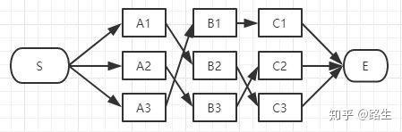

E点已经是终点了，我们稍微对比一下这三条路径的总长度就能知道哪条是最短路径了。

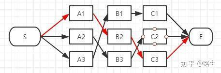


**在效率方面相对于粗暴地遍历所有路径，viterbi 维特比算法到达每一列的时候都会删除不符合最短路径要求的路径，大大降低时间复杂度。同时我们能够归纳出该算法的复杂度大小为：$O(\sum \text{layer_size})$**


## 5. 代码块详细说明：

> https://blog.csdn.net/Jason__Liang/article/details/81772632

先说明两个重要的矩阵:

> **feats:** 
>
> 发射矩阵(emit score)是sentence在embedding后,再经过LSTM后得到的矩阵(也就是LSTM的输出), 维度为11 * 5 (11为sentence.len()*标签数）。这个矩阵表示经过LSTM后sentence的每个word对应的每个labels的得分)。 表示发射概率。

> **transitions:**
>
> 转移矩阵，维度为5\*5，`transitions[i][j]`表示$label_j$转移到$label_i$的概率。`transtion[i]`维度为1\*5,表示每个label转移到$label_i$的概率。  表示概率矩阵

### 5.1  def log_sum_exp(vec)

```python
# 用固定的方法在数值上计算log sum exp,能够方便地用于前馈算法
def log_sum_exp(vec):   #vec.dim=1*5, type=Variable
    #获取vec每行的最大值，维度是1
    max_score = vec[0, argmax(vec)]#argmax(vec)获得最大值索引
    # max_score.view(1,-1)维度是1*1，
    # max_score.view(1, -1).expand(1, vec.size()[1])的维度是1*5
    max_score_broadcast = max_score.view(1, -1).expand(1, vec.size()[1])

    # 里面先做减法，减去最大值可以避免e的指数次的计算上溢
    return max_score + \
        torch.log(torch.sum(torch.exp(vec - max_score_broadcast)))
```

为什么先减去max_score？因为一上来就做指数运算可能会引起计算结果溢出，先减去max_score，则所有的e的指数均小于等于0，且$e^{x-max(x)}$变化较小,集中在0附近，不会造成溢出的风险。经过log_sum_exp后，再把max_score给加上。
$$
log(\sum e^x)=log(\sum(e^{x-max(x)}))+max(x)
$$
即：

```python
return torch.log(torch.sum(torch.exp(vec)))
```

### 5.2 def neg_log_likelihood(self, sentence, tags)

neg_log_likelihood()——损失函数

```
loss = model.neg_log_likelihood(sentence_in, targets)
```

我们来分析一下neg_log_likelihood()函数代码：

```python
    def neg_log_likelihood(self, sentence, tags):
        # feats: 11*5 经过了LSTM+Linear矩阵后输出的特征概率，之后作为CRF的输入。
        feats = self._get_lstm_features(sentence)
        # 前馈获得模型预测句子的分数
        forward_score = self._forward_alg(feats) 
        # 获得真实句子的分数
        gold_score = self._score_sentence(feats, tags)
        # 评估误差【直接使用二者之差作为损失函数】
        return forward_score - gold_score
```

你在这里可能会有疑问：问什么forward_score - gold_score可以作为loss呢。
 这里，我们回顾一下我们在上文中说明的loss function函数公式:
$$
Loss=log(\sum_{\tilde y\in Y_X}e^{s(X,\tilde y)})-s(X,y)
$$


你就会发现forward_score和gold_score分别表示上述等式右边的两项。

### 5.3 def _forward_alg(self, feats)：

我们通过上一个函数的分析得知这个函数就是用来求forward_score的,也就是损失函数等式右边的第一项：

$$
log(\sum_{\tilde y\in Y_X}e^{s(X,\tilde y)})
$$

```python
 # 预测序列的得分
    # 只是根据随机的transitions，前向传播算出的一个score
    #用到了动态规划的思想，但因为用的是随机的转移矩阵，算出的值很大score>20
    def _forward_alg(self, feats):
        # 使用前馈算法计算部分功能
        # 如果开始START标签，后一项不可能是START标签
        init_alphas = torch.full((1, self.tagset_size), -10000.) # 1*5 而且全是-10000

        # START_TAG拥有所有的分数
        # 因为start tag是4，所以tensor([[-10000., -10000., -10000., 0., -10000.]])，
        # 将start的值置为零，表示开始进行网络的传播。
        init_alphas[0][self.tag_to_ix[START_TAG]] = 0

        # 打包variable，会自动进行反向传播
        forward_var = init_alphas # 初始状态的forward_var，随着step t变化

        # 通过句子进行迭代
        # 迭代feats的行数次
        for feat in feats: #feat的维度是5 依次把每一行取出来
            alphas_t = [] # 该time-step的前馈张量
            for next_tag in range(self.tagset_size): #next_tag 就是迭代参数i，从0到len
                # 广播emit_score:
                # 无论previous_tag怎样都是相同的。
                # 维度是1*5 LSTM生成的矩阵是emit_score
                emit_score = feat[next_tag].view(
                    1, -1).expand(1, self.tagset_size)

                # trans_score：transition的第i个项的分数
                trans_score = self.transitions[next_tag].view(1, -1) # 维度是1*5

                # 第一次迭代时理解：
                # trans_score所有其他标签到B标签的概率
                # 由lstm运行进入隐层再到输出层得到标签B的概率，emit_score维度是1*5，5个值是相同的
                next_tag_var = forward_var + trans_score + emit_score

                # 这个标签的前馈变量是所有评估分数的log-sum-exp
                alphas_t.append(log_sum_exp(next_tag_var).view(1))
                # 此时的alphas t 是一个长度为5，例如<class 'list'>:
                # [tensor(0.8259), tensor(2.1739), tensor(1.3526), tensor(-9999.7168), tensor(-0.7102)]
            forward_var = torch.cat(alphas_t).view(1, -1) #到第（t-1）step时５个标签的各自分数
        # 最后只将最后一个单词的forward var与转移 stop tag的概率相加
        # tensor([[   21.1036,    18.8673,    20.7906, -9982.2734, -9980.3135]])
        terminal_var = forward_var + self.transitions[self.tag_to_ix[STOP_TAG]]
        alpha = log_sum_exp(terminal_var) # alpha是一个0维的tensor

        return alpha
```

### 5.4 def _score_sentence(self, feats, tags)

由2的函数分析，我们知道这个函数就是求gold_score,即loss function的第二项

```python
# 根据真实的标签算出的一个score，
    # 这与上面的def _forward_alg(self, feats)共同之处在于：
    # 两者都是用的随机转移矩阵算的score
    # 不同地方在于，上面那个函数算了一个最大可能路径，但实际上可能不是真实的各个标签转移的值
    # 例如：真实标签是N V V,但是因为transitions是随机的，所以上面的函数得到其实是N N N这样，
    # 两者之间的score就有了差距。而后来的反向传播，就能够更新transitions，使得转移矩阵逼近
    # 真实的“转移矩阵”

    # 得到gold_seq tag的score 即根据真实的label 来计算一个score，
    # 但是因为转移矩阵是随机生成的，故算出来的score不是最理想的值
    def _score_sentence(self, feats, tags): #feats 11*5  tag 11 维
        # gives the score of a provied tag sequence
        score = torch.zeros(1)

        # 添加开始tag
        # 将START_TAG的标签3拼接到tag序列最前面，这样tag就是12个了
        tags = torch.cat([torch.tensor([self.tag_to_ix[START_TAG]], dtype=torch.long), tags])

        for i, feat in enumerate(feats):
            # self.transitions[tags[i + 1], tags[i]] 实际得到的是从标签i到标签i+1的转移概率
            # feat[tags[i+1]], feat是step i 的输出结果，有５个值，
            # 对应B, I, E, START_TAG, END_TAG, 取对应标签的值
            # transition【j,i】 就是从i ->j 的转移概率值
            score = score + \
                self.transitions[tags[i+1], tags[i]] + feat[tags[i + 1]]
        score = score + self.transitions[self.tag_to_ix[STOP_TAG], tags[-1]]
        return score
```

### 5.5 def _viterbi_decode(self, feats):

```python
# 维特比解码， 实际上就是在预测的时候使用了， 输出得分与路径值
class ViterbiDecoder(nn.Module):
    def __init__(self, config,transitions):
        super( ViterbiDecoder, self).__init__()
        
        self.transitions = transitions
        self.tagset_size = config.tagset_size
        
        self.START = config.START
        self.STOP = config.STOP
        self.tag_to_ix = config.tag_to_ix
    # 预测序列的得分    
    def forward(self, sents_feats, sents_lens):
        best_paths = []
        best_scores = []
        for idx, length in enumerate(sents_lens):

            backpointers = []
            #初始化维特比变量
            init_vvars = torch.full((1,self.tagset_size), -10000.)
            init_vvars[0][self.tag_to_ix[self.START]] = 0

            #forward_var的值是保存着前一个状态的向量
            forward_var = init_vvars
            for ii in range(length):
                feat = sents_feats[ii][idx]
                bptrs_t = []#保存着本步的backpointers
                viterbivars_t = [] #保存着本步的维特比变量

                for next_tag in range(self.tagset_size):
                    # next-tag_var[i]保存上一步标记i的viterbi变量，加上从标记i转换到next_tag的分数。
                    #不加入发射矩阵因为发射向量的得分和标签的选择无关但是可以在这之后加进去
                    next_tag_var = forward_var + self.transitions[next_tag]
                    best_tag_id = argmax(next_tag_var)
                    bptrs_t.append(best_tag_id)
                    viterbivars_t.append(next_tag_var[0][best_tag_id].view(1))
                # 现在添加emssion分数，并将我们刚刚计算的viterbi_t向量与特征向量相加分配给forward_var
           		# 从step0到step(i-1)时5个序列中每个序列的最大score
                forward_var = (torch.cat(viterbivars_t) + feat).view(1, -1)
                backpointers.append(bptrs_t)
            # STOP_TAG的transition
        	# 其他标签到STOP_TAG的转移概率
            terminal_var = forward_var + self.transitions[self.tag_to_ix[self.STOP]]
            best_tag_id = argmax(terminal_var)
            path_score = terminal_var[0][best_tag_id]

            # 根据back_pointers来解码best_path
            best_path = [best_tag_id]
            for bptrs_t in reversed(backpointers):
                best_tag_id = bptrs_t[best_tag_id]
                best_path.append(best_tag_id)
			# 弹出开始标签
        	# 我们不需要将该标签返回
            start = best_path.pop()
            assert start == self.tag_to_ix[self.START] # 健壮性检查
            # 翻转最佳路径【原本类似于一个栈结构】
            best_path.reverse()
            best_scores.append(path_score)
            best_paths.append(best_path)
        
        return  best_scores ,best_paths
```

如果对于该函数还没有太理解，可以参考这篇博客：

> https://blog.csdn.net/appleml/article/details/78579675