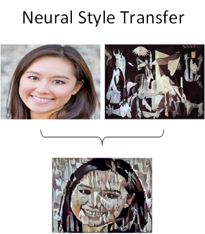
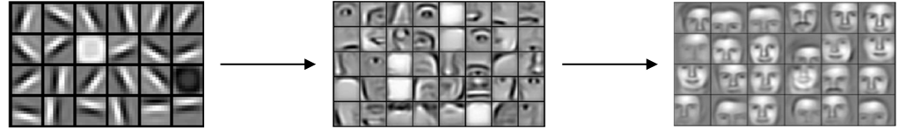
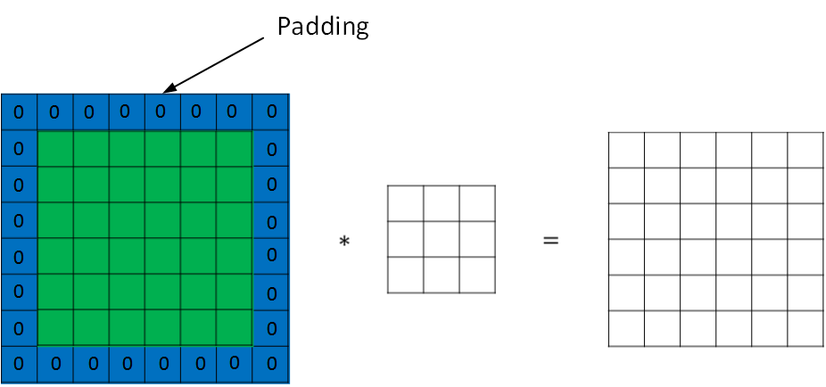
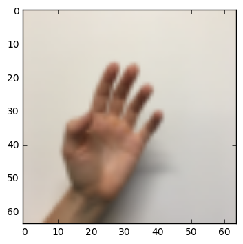

# 卷积神经网络基础

## 计算机视觉

### 应用分类

机器视觉（Computer Vision）是深度学习应用的主要方向之一。一般的CV问题包括以下三类：

- **图像分类**
- **目标检测**
- **神经风格迁移**

下图展示了一个神经风格迁移（Neural Style Transfer）的例子：



### 图像处理问题以及解决方法

使用传统神经网络处理机器视觉的一个主要问题是输入层维度很大。例如一张64x64x3的图片，神经网络输入层的维度为12288。如果图片尺寸较大，例如一张1000x1000x3的图片，神经网络输入层的维度将达到3百万，使得网络权重W非常庞大。这样会造成两个后果，一是神经网络结构复杂，数据量相对不够，容易出现过拟合；二是所需内存、计算量较大。解决这一问题的方法就是使用**卷积神经网络**（CNN）。

## 边缘检测问题

对于CV问题，我们在之前的笔记中介绍过，神经网络由浅层到深层，分别可以检测出图片的**边缘特征** 、**局部特征**（例如眼睛、鼻子等）、**整体面部轮廓**。



这一小节我们将介绍如何检测图片的边缘。

最常检测的图片边缘有两类：一是**垂直边缘**（vertical edges），二是**水平边缘**（horizontal edges）。


### 卷积

图片的边缘检测可以通过与相应滤波器进行卷积来实现。以垂直边缘检测为例，原始图片尺寸为6x6，滤波器filter尺寸为3x3，卷积后的图片尺寸为4x4，得到结果如下：


上图只显示了卷积后的第一个值和最后一个值。

" \* "表示卷积操作。python中，卷积用conv_forward()表示；

### 边缘检测

#### 垂直边缘检测

**垂直边缘检测**能够检测图片的垂直方向边缘。下图对应一个垂直边缘检测的例子：


#### 渐变影响

图片边缘有两种渐变方式，一种是由明变暗，另一种是由暗变明。以垂直边缘检测为例，下图展示了两种方式的区别。实际应用中，这两种渐变方式并不影响边缘检测结果，可以对输出图片取绝对值操作，得到**同样的结果**。


#### 水平边缘检测

垂直边缘检测和水平边缘检测的滤波器算子如下所示：


下图展示一个水平边缘检测的例子：


#### 其它常用的滤波器

除了上面提到的这种简单的垂直、水平滤波器之外，还有其它常用的滤波器，例如Sobel滤波器和Scharr滤波器。这两种滤波器的特点是**增加图片中心区域的权重**。


上图展示的是垂直边缘检测算子，水平边缘检测算子只需将上图顺时针翻转90度即可。

在深度学习中，如果我们想检测图片的各种边缘特征，而不仅限于垂直边缘和水平边缘，那么滤波器的数值一般需要通过模型训练得到，类似于标准神经网络中的权重W一样由梯度下降算法反复迭代求得。CNN的主要目的就是计算出这些滤波器的数值。确定得到了这些滤波器后，CNN浅层网络也就实现了对图片所有边缘特征的检测。

## 填充（padding）

按照我们上面讲的图片卷积，如果原始图片尺寸为n x n，滤波器尺寸为f x f，则卷积后的图片尺寸为(n-f+1) x (n-f+1)，注意f一般为奇数。这样会带来两个问题：

- **卷积运算后，输出图片尺寸缩小**
- **原始图片边缘信息对输出贡献得少，输出图片丢失边缘信息**

为了解决图片缩小的问题，可以使用填充方法，即把原始图片尺寸进行扩展，扩展区域补零，用p来表示每个方向扩展的宽度。



经过padding之后，原始图片尺寸为(n+2p) x (n+2p)，filter尺寸为f x f，则卷积后的图片尺寸为(n+2p-f+1) x (n+2p-f+1)。若要保证卷积前后图片尺寸不变，则p应满足：
$$
p=\frac{f-1}{2}
$$
没有填充操作，p=0，我们称之为“空卷积”；有填充操作，$p=\frac{f-1}{2}$，我们称之为“相同卷积”。

## 卷积步长（Strided Convolutions）

步长stride表示过滤器在原图片中水平方向和垂直方向每次的步进长度。之前我们默认stride=1。若stride=2，则表示过滤器每次步进长度为2，即隔一点移动一次。


我们用s表示步长，p表示填充长度，如果原始图片尺寸为n x n，滤波器尺寸为f x f，则卷积后的图片尺寸为：
$$
\lfloor\frac{n+2p-f}{s}+1\rfloor\ X\ \lfloor\frac{n+2p-f}{s}+1\rfloor
$$
上式中，$\lfloor\cdots\rfloor$表示向下取整。

值得一提的是，**相关系数**（cross-correlations）与**卷积**（convolutions）之间是有区别的。实际上，真正的卷积运算会先将滤波器绕其**中心旋转**180度，然后再将旋转后的滤波器在原始图片上进行**滑动计算**。滤波器旋转如下所示：


比较而言，相关系数的计算过程则**不会**对滤波器进行**旋转**，而是直接在原始图片上进行滑动计算。

其实，目前为止我们介绍的CNN卷积实际上计算的是相关系数，而不是数学意义上的卷积。但是，为了**简化计算**，我们一般把CNN中的这种“相关系数”就称作卷积运算。

之所以可以这么等效，是因为滤波器算子一般是水平或垂直对称的，180度旋转影响不大；而且最终滤波器算子需要通过CNN网络梯度下降算法计算得到，旋转部分可以看作是包含在CNN模型算法中。总的来说，忽略旋转运算可以大大提高CNN网络运算速度，而且不影响模型性能。

卷积运算服从结合律：
$$
(A∗B)∗C=A∗(B∗C)
$$

## 卷积为何有效

对于3通道的RGB图片，其对应的滤波器算子同样也是3通道的。例如一个图片是6 x 6 x 3，分别表示图片的高度（height）、宽度（weight）和通道（channel）。

3通道图片的卷积运算与单通道图片的卷积运算基本一致。过程是将每个单通道（R，G，B）与对应的filter进行卷积运算求和，然后再将3通道的和相加，得到输出图片的一个像素值。


不同通道的滤波算子可以不相同。例如R通道滤波器实现垂直边缘检测，G和B通道不进行边缘检测，全部置零，或者将R，G，B三通道滤波器全部设置为水平边缘检测。

为了进行多个卷积运算，实现更多边缘检测，可以增加更多的滤波器组。例如设置第一个滤波器组实现垂直边缘检测，第二个滤波器组实现水平边缘检测。这样，不同滤波器组卷积得到不同的输出，个数由滤波器组决定。


若输入图片的尺寸为$n × n × n_c$，滤波器尺寸为$f × f × n_c$，则卷积后的图片尺寸为$(n-f+1) × (n-f+1) × n_c'$。其中，$n_c$为**图片通道**数目，$n_c'$为**滤波器组**个数。

## 单层卷积网络

卷积神经网络的单层结构如下所示：


相比之前的卷积过程，CNN的单层结构多了激活函数ReLU和偏移量b。整个过程与标准的神经网络单层结构非常类似：
$$
Z^{[l]}=W^{[l]}A^{[l-1]}+b
$$

$$
A^{[l]}=g^{[l]}(Z^{[l]})
$$

相比之前的卷积过程，CNN的单层结构多了激活函数ReLU和偏移量b。整个过程与标准的神经网络单层结构非常类似：

卷积运算对应着上式中的乘积运算，**滤波器组数值对应着权重**$W^{[l]}$，所选的激活函数为ReLU。

我们来计算一下上图中参数的数目：每个滤波器组有3x3x3=27个参数，还有1个偏移量b，则每个滤波器组有27+1=28个参数，两个滤波器组总共包含28x2=56个参数。我们发现，选定滤波器组后，参数数目与输入图片尺寸无关。所以，就不存在由于图片尺寸过大，造成参数过多的情况。例如一张1000x1000x3的图片，标准神经网络输入层的维度将达到3百万，而在CNN中，参数数目只由滤波器组决定，数目相对来说要少得多，这是CNN的优势之一。

最后，我们总结一下CNN单层结构的所有标记符号，设层数为$l$。

- $f^{[l]} $= 滤波器大小
- $p^{[l]}$ = 填充
- $s^{[l]}$= 步长
- $n_c^{[l]}$ = 滤波器组数量

输入维度为：$n_H^{[l-1]}×n_W^{[l-1]}×n_c^{[l-1]}$

每个滤波器组维度为：$f^{[l]} × f^{[l]} × n_c^{[l-1]}$

权重维度为：$f^{[l]}×f^{[l]}×n_c^{[l-1]}×n_c^{[l]}$

偏置维度为：$1 × 1 × 1 ×n_c^{[l]}$

输出维度为：$n_H^{[l]}×n_W^{[l]}×n_c^{[l]}$

其中，

$$
n_H^{[l]}=\lfloor \frac{n_H^{[l-1]}+2p^{[l]}-f^{[l]}}{s^{[l]}}+1 \rfloor
$$

$$
n_W^{[l]}=\lfloor \frac{n_W^{[l-1]}+2p^{[l]}-f^{[l]}}{s^{[l]}}+1 \rfloor
$$

如果有m个样本，进行向量化运算，相应的输出维度为：$$m × n_H^{[l]}×n_W^{[l]}×n_c^{[l]}$$

## 简单的卷积网络示例

下面介绍一个简单的CNN网络模型：


该CNN模型各层结构如上图所示。需要注意的是，$a^{[3]}$的维度是7 x 7 x 40，将$a^{[3]}$排列成1列，维度为1960 x 1，然后连接最后一级输出层。输出层可以是一个神经元，即二元分类（logistic）；也可以是多个神经元，即多元分类（softmax）。最后得到预测输出$\hat y$。

值得一提的是，随着CNN层数增加，$n_H^{[l]}$和$n_W^{[l]}$一般逐渐减小，而$n_c^{[l]}$一般逐渐增大。

CNN有三种层：

- **卷积层（CONV）**
- **池化层（POOL）**
- **全连接层（FC）**

CONV最为常见也最重要，关于POOL和FC我们之后再介绍。

## 池化层

池化层是CNN中用来减小尺寸，**提高运算速度**的，同样能**减小噪声影响**，让各特征更具有健壮性。

池化层的做法比卷积层简单许多，没有卷积运算，仅仅是在滤波器算子滑动区域内取最大值，即最大池化(max pooling)，这是最常用的做法。注意，超参数p很少在池化层中使用。


最大池化的好处是只保留区域内的最大值（特征），忽略其它值，**降低噪声影响**，提高模型健壮性。而且，噪声需要的超参数仅为滤波器尺寸f和滤波器步进长度s，没有其他参数需要模型训练得到，计算量很小。

如果是多个通道，那么就每个通道单独进行最大池化操作。

除了最大池化之外，还有一种做法：平均池化(average pooling)。顾名思义，平均池化就是在滤波器算子滑动区域计算平均值。


实际应用中，最大池化比平均池化更为常用。

## CNN示例

下面介绍一个简单的数字识别的CNN例子：


图中，CON层后面紧接一个POOL层，CONV1和POOL1构成第一层，CONV2和POOL2构成第二层。特别注意的是FC3和FC4为全连接层FC，它跟标准的神经网络结构一致。最后的输出层（softmax）由10个神经元构成。

整个网络各层的尺寸和参数如下表格所示：


## 使用卷积的原因

相比标准神经网络，CNN的优势之一就是参数数目要少得多。参数数目少的原因有两个：

- **参数共享：一个特征检测器（例如垂直边缘检测）对图片某块区域有用，同时也可能作用在图片其它区域。**
- **连接的稀疏性：因为滤波器算子尺寸限制，每一层的每个输出只与输入部分区域内有关。**

除此之外，由于CNN参数数目较小，所需的训练样本就相对较少，从而一定程度上不容易发生过拟合现象。而且，CNN比较擅长捕捉区域位置偏移。也就是说CNN进行物体检测时，不太受物体所处图片位置的影响，增加检测的准确性和系统的健壮性。

# 一步一步实现CNN

这里，我们将会用numpy实现卷积(CONV)和池化(POOL)层, 包括正向和反向传播。

## 符号注释

- 上标 $[l]$ 表示第 $l$ 层的参数


- 上标 $(i)$ 表示第 $i$ 个样本

- 下标 $i$ 表示第$i$ 个向量分量

- $n_H$, $n_W$ 和 $n_C$ 表示所给层的高，宽和通道数量
- $n_{H_{prev}}$, $n_{W_{prev}}$ 和 $n_{C_{prev}}$ 上一层层的高，宽和通道数量

## 导包

```python
import numpy as np
import h5py
import matplotlib.pyplot as plt

%matplotlib inline
plt.rcParams['figure.figsize'] = (5.0, 4.0) # set default size of plots
plt.rcParams['image.interpolation'] = 'nearest'
plt.rcParams['image.cmap'] = 'gray'

%load_ext autoreload
%autoreload 2

np.random.seed(1)
```

## 任务大纲

您将实现卷积神经网络的构建块!您将实现的每个函数都有详细的说明，这些说明将指导您完成所需的步骤

- 卷积函数，包括：
	- 零填充(Zero Padding)
	- 卷积窗口(Convolve window)
	- 正向卷积(Convolution forward)
	- 反向卷积(Convolution backward)【选做】
- 池化函数，包括：
	- 正向池化(Pooling forward)
	- 创建蒙版(Create mask)
	- 分配数值(Distribute value)
	- 反向池化(Pooling backward) 【选做】

这里是用`numpy`从零开始搭建CNN，下一章会使用TensorFlow实现【也可以去试试pytorch哦】。

**注意**：

对于每个正向函数，都有对应的反向等价函数。因此，在转发模块的每一步中，您将在缓存中存储一些参数。这些参数用于计算反向传播过程中的梯度。

## CNN

尽管编程框架使卷积易于使用，但它们仍然是深度学习中最难理解的概念之一。【卷积层主要是将输入量转换为不同大小的输出量。】

### 零填充

填充的主要优点如下

- 它允许你使用CONV层，而不必缩小样本的高度和宽度。高度/宽度不会随着你进入更深层次而缩小，所以有利于建立更深层次的网络。一个重要的特殊情况是“相同”卷积，即高度/宽度在一层之后被完全保留。
- 它帮助我们在图像的**边界**上保留更多的信息。如果没有填充，很少有下一层的值会被作为图像边缘的像素所影响。

```python
# GRADED FUNCTION: zero_pad

def zero_pad(X, pad):
    """
    Pad with zeros all images of the dataset X. The padding is applied to the height and width of an image, 
    as illustrated in Figure 1.
    
    Argument:
    X -- python numpy array of shape (m, n_H, n_W, n_C) representing a batch of m images
    pad -- integer, amount of padding around each image on vertical and horizontal dimensions
    
    Returns:
    X_pad -- padded image of shape (m, n_H + 2*pad, n_W + 2*pad, n_C)
    """
    
    ### START CODE HERE ### (≈ 1 line)
    #np.pad的参数(要扩充的数组,((第1维度上前/后扩充多少),...),固定值)
    X_pad = np.pad(X, ((0,0), (pad, pad), (pad, pad), (0, 0)), 'constant')
    ### END CODE HERE ###
    
    return X_pad
```

示例

```python
np.random.seed(1)
x = np.random.randn(4, 3, 3, 2)
x_pad = zero_pad(x, 2)
print ("x.shape =", x.shape)
print ("x_pad.shape =", x_pad.shape)
print ("x[1,1] =", x[1,1])
print ("x_pad[1,1] =", x_pad[1,1])

fig, axarr = plt.subplots(1, 2)
axarr[0].set_title('x')
axarr[0].imshow(x[0,:,:,0])
axarr[1].set_title('x_pad')
axarr[1].imshow(x_pad[0,:,:,0])
```

结果


### 单步卷积

在这一部分中，执行一个卷积的步骤，在这个步骤中，你将滤波器应用到输入的单一位置。这将用来构建卷积单元，其中:

- 获取一个输入
- 在每一个输出位置使用一个滤波器
- 输出（往往与输入shape不同）

```python
# GRADED FUNCTION: conv_single_step

def conv_single_step(a_slice_prev, W, b):
    """
    Apply one filter defined by parameters W on a single slice (a_slice_prev) of the output activation 
    of the previous layer.
    
    Arguments:
    a_slice_prev -- slice of input data of shape (f, f, n_C_prev)
    W -- Weight parameters contained in a window - matrix of shape (f, f, n_C_prev)
    b -- Bias parameters contained in a window - matrix of shape (1, 1, 1)
    
    Returns:
    Z -- a scalar value, result of convolving the sliding window (W, b) on a slice x of the input data
    """

    ### START CODE HERE ### (≈ 2 lines of code)
    # 求取 a_slice 和 W 的元素积
    s = a_slice_prev * W
    # 求 s 中所有元素的和.
    Z = np.sum(s)
    # 添加偏置 b 【用float(),使结果Z为标量】
    Z = float(Z + b)
    ### END CODE HERE ###

    return Z
```

#### 示例

```python
np.random.seed(1)
a_slice_prev = np.random.randn(4, 4, 3)
W = np.random.randn(4, 4, 3)
b = np.random.randn(1, 1, 1)

Z = conv_single_step(a_slice_prev, W, b)
print("Z =", Z)
```

#### 结果

```
Z = -6.999089450680221
```

### 前馈

在前馈中，将使用许多过滤器并对输入进行卷积。每个“卷积”都给你一个2D矩阵输出。然后您将堆叠这些输出，以获得三维体积:

#### 前排提醒：

卷积的输出形状与输入形状的关系式为：
$$
n_H = \lfloor \frac{n_{H_{prev}} - f + 2 \times pad}{stride} \rfloor +1
$$

$$
n_W = \lfloor \frac{n_{W_{prev}} - f + 2 \times pad}{stride} \rfloor +1 
$$

$$
n_C = \text{用于卷积的过滤器数量}
$$

在这个练习中，我们不需要担心矢量化，只需要用For循环来实现所有的东西。

```python
# GRADED FUNCTION: conv_forward

def conv_forward(A_prev, W, b, hparameters):
    """
    Implements the forward propagation for a convolution function
    
    Arguments:
    A_prev -- output activations of the previous layer, numpy array of shape (m, n_H_prev, n_W_prev, n_C_prev)
    W -- Weights, numpy array of shape (f, f, n_C_prev, n_C)
    b -- Biases, numpy array of shape (1, 1, 1, n_C)
    hparameters -- python dictionary containing "stride" and "pad"
        
    Returns:
    Z -- conv output, numpy array of shape (m, n_H, n_W, n_C)
    cache -- cache of values needed for the conv_backward() function
    """
    
    ### START CODE HERE ###
    # A_prev的shape中获得维数  (≈1 line)  
    (m, n_H_prev, n_W_prev, n_C_prev) = A_prev.shape
    
    # W的shape中获得维数 (≈1 line)
    (f, f, n_C_prev, n_C) = W.shape
    
    # "hparameters"中获得数据 (≈2 lines)
    stride = hparameters['stride']
    pad = hparameters['pad']
    
    # 计算CONV输出的维数 【注：用int() 来完成 floor的功能】 (≈2 lines)
    n_H = int((n_H_prev + 2 * pad - f) / stride + 1)
    n_W = int((n_W_prev + 2 * pad - f) / stride + 1)
    
    # Z进行零初始化. (≈1 line)
    Z = np.zeros((m, n_H, n_W, n_C))
    
    # 填充 A_prev
    A_prev_pad = zero_pad(A_prev, pad)
    # 循环遍历这批训练样本
    for i in range(m):
        # 选择第i个训练样本的填充激活
        a_prev_pad = A_prev_pad[i, :, :, :]
        # 循环遍历的垂直轴上的输出数值
        for h in range(n_H):
            # 循环遍历的水平轴上的输出数值
            for w in range(n_W):
                # 循环遍历的通道上的输出数值
                for c in range(n_C):                   
                    
                    # 寻找现在的"slice"【切片】 (≈4 lines)
                    vert_start = h * stride
                    vert_end = vert_start + f
                    horiz_start = w * stride
                    horiz_end = horiz_start + f
                    
                    # 取出要卷积的那部分（3D） (≈1 line)
                    a_slice_prev = a_prev_pad[vert_start : vert_end, horiz_start : horiz_end, :]
                    
                    # 用合适的滤波器W和偏置b对(3D)片进行卷积，得到一个输出神经元。 (≈1 line)
                    Z[i, h, w, c] = conv_single_step(a_slice_prev, W[:,:,:,c], b[:,:,:,c])
                                        
    ### END CODE HERE ###
    
    # 确保输出的shape正确
    assert(Z.shape == (m, n_H, n_W, n_C))
    
    # 为反向传播缓存
    cache = (A_prev, W, b, hparameters)
    
    return Z, cache
```

##### 示例

```python
np.random.seed(1)
A_prev = np.random.randn(10,4,4,3)
W = np.random.randn(2,2,3,8)
b = np.random.randn(1,1,1,8)
hparameters = {"pad" : 2,
               "stride": 2}

Z, cache_conv = conv_forward(A_prev, W, b, hparameters)
print("Z's mean =", np.mean(Z))
print("Z[3,2,1] =", Z[3,2,1])
print("cache_conv[0][1][2][3] =", cache_conv[0][1][2][3])
```

##### 结果

```
Z's mean = 0.0489952035289
Z[3,2,1] = [-0.61490741 -6.7439236  -2.55153897  1.75698377  3.56208902  0.53036437
  5.18531798  8.75898442]
cache_conv[0][1][2][3] = [-0.20075807  0.18656139  0.41005165]
```

最后，CONV层还应该包含一个激活，在这种情况下，我们将添加以下代码行

```python
# 卷积窗口得到一个输出神经元
Z[i, h, w, c] = ...
# 激活函数
A[i, h, w, c] = activation(Z[i, h, w, c])
```

## 池化层

池化 (POOL) 层减少了输入的宽和高。它有效地减少了计算量，而且也有助于使特征检测器对其在输入中的位置保持不变性。

### 常见的两种POOL层

- **最大池化层**(Max-pooling layer)：在输入上滑动一个 ($f, f$) 窗口 并且在输出里存储窗口元素的最大值。

- **平均池化层**(Average-pooling layer)：在输入上滑动一个 ($f, f$) 窗口 并且在输出里存储窗口元素的平均值。

这些池化层没有参数供反向传播训练。但是，它们有超参数，比如窗口大小$f$。这里指定了要计算最大值或平均值的 $f×f$ 窗口的高度和宽度。

### 正向池化

由于没有填充，因此将池的输出形状绑定到输入形状的公式为
$$
n_H = \lfloor \frac{n_{H_{prev}} - f}{stride} \rfloor +1 
$$

$$
n_W = \lfloor \frac{n_{W_{prev}} - f}{stride} \rfloor +1 
$$

$$
n_C = n_{C_{prev}}
$$

```python
# GRADED FUNCTION: pool_forward

def pool_forward(A_prev, hparameters, mode = "max"):
    """
    Implements the forward pass of the pooling layer
    
    Arguments:
    A_prev -- Input data, numpy array of shape (m, n_H_prev, n_W_prev, n_C_prev)
    hparameters -- python dictionary containing "f" and "stride"
    mode -- the pooling mode you would like to use, defined as a string ("max" or "average")
    
    Returns:
    A -- output of the pool layer, a numpy array of shape (m, n_H, n_W, n_C)
    cache -- cache used in the backward pass of the pooling layer, contains the input and hparameters 
    """
    
    (m, n_H_prev, n_W_prev, n_C_prev) = A_prev.shape
    f = hparameters["f"]
    stride = hparameters["stride"]
    
    # 定义输出的维度
    n_H = int(1 + (n_H_prev - f) / stride)
    n_W = int(1 + (n_W_prev - f) / stride)
    n_C = n_C_prev
    
    # 初始化输出矩阵 A
    A = np.zeros((m, n_H, n_W, n_C))              
    
    ### START CODE HERE ###
    for i in range(m):                         
        for h in range(n_H):                     
            for w in range(n_W):                
                for c in range (n_C):         
                    vert_start = h * stride
                    vert_end = vert_start + f
                    horiz_start = w * stride
                    horiz_end = horiz_start + f
                    a_prev_slice = A_prev[i, vert_start:vert_end, horiz_start:horiz_end, c]
                    
                    # 在切片上进行池化操作。【这里用mode切换模式】
                    if mode == "max":
                        A[i, h, w, c] = np.max(a_prev_slice)
                    elif mode == "average":
                        A[i, h, w, c] = np.mean(a_prev_slice)
    
    ### END CODE HERE ###
    
    cache = (A_prev, hparameters)
    
    assert(A.shape == (m, n_H, n_W, n_C))
    
    return A, cache
```

#### 示例

```python
np.random.seed(1)
A_prev = np.random.randn(2, 4, 4, 3)
hparameters = {"stride" : 2, "f": 3}

A, cache = pool_forward(A_prev, hparameters)
print("mode = max")
print("A =", A)
print()
A, cache = pool_forward(A_prev, hparameters, mode = "average")
print("mode = average")
print("A =", A)
```

#### 结果

```
mode = max
A = [[[[ 1.74481176  0.86540763  1.13376944]]]
     [[[ 1.13162939  1.51981682  2.18557541]]]]

mode = average
A = [[[[ 0.02105773 -0.20328806 -0.40389855]]]
     [[[-0.22154621  0.51716526  0.48155844]]]]
```


## CNN的反向传播 (选做)

在现代的深度学习框架中，你只需要实现前向传递，而框架会处理后向传递，所以大多数深度学习工程师不需要费心处理后向传递的细节。卷积网络的反向传递是复杂的。但是，如果您愿意，您可以查看这个笔记的可选部分，以了解卷积网络中的反馈是什么样子。

在前面的课程中，您实现了一个简单的(全连接)神经网络，您使用了反向传播来计算与更新参数的代价相关的导数。类似地，在卷积神经网络中，你可以计算关于代价的导数来更新参数。这些反向传播公式并不简单，我们在课堂上没有推导过它们，但我们在下面简要介绍了它们。【**不用弄懂怎么求，知道即可**】

### 卷积层反馈

#### 计算dA:

这是计算 $dA$ 关于对于特定的过滤器$W_c$和一个给定的训练样本的的cost公式:

$$
dA += \sum _{h=0} ^{n_H} \sum_{w=0} ^{n_W} W_c \times dZ_{hw} 
$$

$W_c$ 是一个滤波器且 $dZ_{hw}$是一个标量，对应于cost相对于conv层Z在第h行和第w列的输出的梯度(对应于第i步向左和第j步向下的点积)。

注意，在每次更新dA时，我们都将相同的过滤器$W_c$乘以不同的dZ。我们这样做的主要原因是，在计算正向传播时，每个过滤器都由一个不同的a_slice点加和。因此，当计算dA的反向传播时，我们只是添加了所有a_slice的梯度。

python的公式代码如下：

```python
da_prev_pad[vert_start:vert_end, horiz_start:horiz_end, :] += W[:,:,:,c] * dZ[i, h, w, c]
```

#### 计算dW:

以下是$dW_c$ ($dW_c$是一个过滤器的导数)计算损失的公式:

$$
dW_c  += \sum _{h=0} ^{n_H} \sum_{w=0} ^ {n_W} a_{slice} \times dZ_{hw}
$$

其中$a_{slice}$对应于用于生成激活 $Z_{ij}$的切片。因此，这就给了我们关于那个切片$W$的梯度。因为它是相同的$W$，我们将所有这些梯度相加得到$dW$。

python的公式代码如下：

```python
dW[:,:,:,c] += a_slice * dZ[i, h, w, c]
```

#### 计算db:

这是计算$db$相对于某个过滤器的成本的公式:

$$ db = \sum_h \sum_w dZ_{hw} \tag{3}$$

正如您之前在基本神经网络中看到的，$db$是由$dZ$的总和计算出来的。在这种情况下，您只是将conv输出(Z)相对于cost的所有梯度相加。

python的公式代码如下：

```python
db[:,:,:,c] += dZ[i, h, w, c]
```

```python
def conv_backward(dZ, cache):
    """
    Implement the backward propagation for a convolution function
    
    Arguments:
    dZ -- gradient of the cost with respect to the output of the conv layer (Z), numpy array of shape (m, n_H, n_W, n_C)
    cache -- cache of values needed for the conv_backward(), output of conv_forward()
    
    Returns:
    dA_prev -- gradient of the cost with respect to the input of the conv layer (A_prev),
               numpy array of shape (m, n_H_prev, n_W_prev, n_C_prev)
    dW -- gradient of the cost with respect to the weights of the conv layer (W)
          numpy array of shape (f, f, n_C_prev, n_C)
    db -- gradient of the cost with respect to the biases of the conv layer (b)
          numpy array of shape (1, 1, 1, n_C)
    """
    
    ### START CODE HERE ###
    
    (A_prev, W, b, hparameters) = cache
    
    
    (m, n_H_prev, n_W_prev, n_C_prev) = A_prev.shape
    
    
    (f, f, n_C_prev, n_C) = W.shape
    
    
    stride = hparameters['stride']
    pad = hparameters['pad']
    
    
    (m, n_H, n_W, n_C) = dZ.shape
    
    
    dA_prev = np.zeros((m, n_H_prev, n_W_prev, n_C_prev))                           
    dW = np.zeros((f, f, n_C_prev, n_C))
    db = np.zeros((1, 1, 1, n_C))

    
    A_prev_pad = zero_pad(A_prev, pad)
    dA_prev_pad = zero_pad(dA_prev, pad)
    
    for i in range(m):                       
        
        
        a_prev_pad = A_prev_pad[i,:,:,:]
        da_prev_pad = dA_prev_pad[i,:,:,:]
        
        for h in range(n_H):                  
            for w in range(n_W):               
                for c in range(n_C):           

                    vert_start = h * stride
                    vert_end = vert_start + f
                    horiz_start = w * stride
                    horiz_end = horiz_start + f
                    
                    a_slice = a_prev_pad[vert_start:vert_end, horiz_start:horiz_end, :]

                    # 使用上面给出的代码公式更新窗口的梯度和过滤器的参数
                    da_prev_pad[vert_start:vert_end, horiz_start:horiz_end, :] += W[:,:,:,c] * dZ[i, h, w, c]
                    dW[:,:,:,c] += a_slice * dZ[i, h, w, c]
                    db[:,:,:,c] += dZ[i, h, w, c]
                    
        # 设置第i个训练样本的 dA_prev 为未填充的 da_prev_pad
        dA_prev[i, :, :, :] = da_prev_pad[pad:-pad, pad:-pad, :]
    ### END CODE HERE ###
    
    assert(dA_prev.shape == (m, n_H_prev, n_W_prev, n_C_prev))
    
    return dA_prev, dW, db
```

#### 示例

```python
np.random.seed(1)
dA, dW, db = conv_backward(Z, cache_conv)
print("dA_mean =", np.mean(dA))
print("dW_mean =", np.mean(dW))
print("db_mean =", np.mean(db))
```

#### 结果

```
dA_mean = 1.45243777754
dW_mean = 1.72699145831
db_mean = 7.83923256462
```

## 反向池化

接下来，让我们实现池化层的反向传播，从最大池层开始。即使池化层没有反向传播要更新的参数，您仍然需要通过池化层反向传播梯度，**以便计算**在池化层之前出现的层的**梯度**。

### 最大池化（反馈）

在进入池化层的反向传播之前，您将构建一个名为“create_mask_from_window()”的助手函数，它将执行以下操作:

$$
X = \begin{bmatrix}
1 && 3 \\
4 && 2
\end{bmatrix} \quad \rightarrow  \quad M =\begin{bmatrix}
0 && 0 \\
1 && 0
\end{bmatrix}
$$

正如您所看到的，这个函数创建了一个“掩码”矩阵/"蒙版"矩阵，它跟踪矩阵的最大值在哪里。True(1)表示最大值在X中的位置，其他条目为False(0)。

```python
def create_mask_from_window(x):
    """
    Creates a mask from an input matrix x, to identify the max entry of x.
    
    Arguments:
    x -- Array of shape (f, f)
    
    Returns:
    mask -- Array of the same shape as window, contains a True at the position corresponding to the max entry of x.
    """
    
    ### START CODE HERE ### (≈1 line)
    mask = (x == np.max(x))
    ### END CODE HERE ###
    
    return mask
```

#### 示例

```python
np.random.seed(1)
x = np.random.randn(2,3)
mask = create_mask_from_window(x)
print('x = ', x)
print("mask = ", mask)
```

#### 结果

```
x =  [[ 1.62434536 -0.61175641 -0.52817175]
 [-1.07296862  0.86540763 -2.3015387 ]]
mask =  [[ True False False]
 [False False False]]
```

为什么我们要跟踪最大值的位置?这是因为输入值最终影响了输出，因此也影响了成本cost。反向传播是计算相对于cost的梯度，所以任何影响最终cost的东西都应该有一个非零的梯度。因此，反向传播会将梯度“传播”回这个影响成本的特定输入值。

### 平均池化（反馈）

在最大池化中，对于每个输入窗口，对输出的所有“影响”都来自一个输入值——max。在平均池中，输入窗口的每个元素对输出的影响是相等的。因此，要实现反向传播，现在需要实现一个辅助函数来反映这一点。

例如，如果我们使用一个2x2的过滤器在前向传递中进行平均池化，那么你将用于后向传递的掩码/蒙版是这样的:
$$
dZ = 1 \quad \rightarrow  \quad dZ =\begin{bmatrix}
1/4 && 1/4 \\
1/4 && 1/4
\end{bmatrix}
$$

这意味着$dZ$矩阵中的每个位置对输出的贡献是相等的，因为在前向传递中，我们取了平均值。

```python
def distribute_value(dz, shape):
    """
    Distributes the input value in the matrix of dimension shape
    
    Arguments:
    dz -- input scalar
    shape -- the shape (n_H, n_W) of the output matrix for which we want to distribute the value of dz
    
    Returns:
    a -- Array of size (n_H, n_W) for which we distributed the value of dz
    """
    
    ### START CODE HERE ###
    # 获取shape维度 (≈1 line)
    (n_H, n_W) = shape
    
    # 计算矩阵的值分布【均匀分布】 (≈1 line)
    average = dz / (n_H * n_W)
    
    # 填满平均值 (≈1 line)
    a = np.full(shape, average)
    ### END CODE HERE ###
    
    return a
```

#### 示例

```python
a = distribute_value(2, (2,2))
print('distributed value =', a)
```

#### 结果

```
distributed value = [[ 0.5  0.5]
                     [ 0.5  0.5]]
```

### 组装：反向池化

```python
def pool_backward(dA, cache, mode = "max"):
    """
    Implements the backward pass of the pooling layer
    
    Arguments:
    dA -- gradient of cost with respect to the output of the pooling layer, same shape as A
    cache -- cache output from the forward pass of the pooling layer, contains the layer's input and hparameters 
    mode -- the pooling mode you would like to use, defined as a string ("max" or "average")
    
    Returns:
    dA_prev -- gradient of cost with respect to the input of the pooling layer, same shape as A_prev
    """
    
    ### START CODE HERE ###
    
    # 获得cache的信息 (≈1 line)
    (A_prev, hparameters) = cache
    
    stride = hparameters['stride']
    f = hparameters['f']
    
    # 获得A_prev的shape和dA的shape的维度 (≈2 lines)
    m, n_H_prev, n_W_prev, n_C_prev = A_prev.shape
    m, n_H, n_W, n_C = dA.shape
    
    # 零初始化dA_prev(≈1 line)
    dA_prev = np.zeros((m, n_H_prev, n_W_prev, n_C_prev))
    
    for i in range(m):                       

        a_prev = A_prev[i,:,:,:]
        
        for h in range(n_H):                   
            for w in range(n_W):               
                for c in range(n_C):           
                    
                    vert_start = h * stride
                    vert_end = vert_start + f
                    horiz_start = w * stride
                    horiz_end = horiz_start + f
                    
                    # 计算两种反向传播.
                    if mode == "max":
                        
                        # 使用角点和 "c" 从a_prev 来定义现在的切片  (≈1 line)
                        a_prev_slice = a_prev[vert_start:vert_end, horiz_start:horiz_end, c]
                        # 从a_prev_slice创建掩码/蒙版 (≈1 line)
                        mask = create_mask_from_window(a_prev_slice)
                        # dA_prev = dA_prev + (mask * dA) (≈1 line)
                        dA_prev[i, vert_start: vert_end, horiz_start: horiz_end, c] += np.multiply(mask, dA[i,h,w,c])
                        
                    elif mode == "average":
                        
                        # 获得 dA 的值(≈1 line)
                        da = dA[i,h,w,c]
                        # 将滤波器定义为 fxf 大小 (≈1 line)
                        shape = (f,f)
                        # 分散它以获得正确的 dA_prev 切片【即将da的分布值相加】 (≈1 line)
                        dA_prev[i, vert_start: vert_end, horiz_start: horiz_end, c] += distribute_value(da, shape)
                        
    ### END CODE ###
    
    # 确保输出shape符合要求
    assert(dA_prev.shape == A_prev.shape)
    
    return dA_prev
```

#### 示例

```python
np.random.seed(1)
A_prev = np.random.randn(5, 5, 3, 2)
hparameters = {"stride" : 1, "f": 2}
A, cache = pool_forward(A_prev, hparameters)
dA = np.random.randn(5, 4, 2, 2)

dA_prev = pool_backward(dA, cache, mode = "max")
print("mode = max")
print('mean of dA = ', np.mean(dA))
print('dA_prev[1,1] = ', dA_prev[1,1])  
print()
dA_prev = pool_backward(dA, cache, mode = "average")
print("mode = average")
print('mean of dA = ', np.mean(dA))
print('dA_prev[1,1] = ', dA_prev[1,1]) 
```

#### 结果

```
mode = max
mean of dA =  0.145713902729
dA_prev[1,1] =[  [ 0.          0.        ]
 				 [ 5.05844394 -1.68282702]
 				 [ 0.          0.        ]]

mode = average
mean of dA =  0.145713902729
dA_prev[1,1] =  [[ 0.08485462  0.2787552 ]
                 [ 1.26461098 -0.25749373]
                 [ 1.17975636 -0.53624893]]
```

# CNN的应用

## TensorFlow 模式

在上一个任务中，您使用numpy构建了帮助函数，以理解卷积神经网络背后的机制。目前，深度学习的大多数实际应用程序都是使用编程框架构建的，这些框架具有许多可以简单调用的内置函数。

### 导包

```python
import math
import numpy as np
import h5py
import matplotlib.pyplot as plt
import scipy

from scipy import ndimage

import tensorflow as tf
from tensorflow.python.framework import ops
from cnn_utils import *

%matplotlib inline
np.random.seed(1)
```

### 加载数据集

```python
# 加载数据 (signs)
X_train_orig, Y_train_orig, X_test_orig, Y_test_orig, classes = load_dataset()
```

提醒一下，SIGN数据集是6个符号的集合，它们代表从0到5的数字。

### 查看数据集

```python
# 示例图片
index = 15
plt.imshow(X_train_orig[index])
print ("y = " + str(np.squeeze(Y_train_orig[:, index])))
y = 5
```



#### 研究shape

首先，让我们研究一下数据的形状。

```python
X_train = X_train_orig/255.
X_test = X_test_orig/255.
Y_train = convert_to_one_hot(Y_train_orig, 6).T
Y_test = convert_to_one_hot(Y_test_orig, 6).T
print ("number of training examples = " + str(X_train.shape[0]))
print ("number of test examples = " + str(X_test.shape[0]))
print ("X_train shape: " + str(X_train.shape))
print ("Y_train shape: " + str(Y_train.shape))
print ("X_test shape: " + str(X_test.shape))
print ("Y_test shape: " + str(Y_test.shape))
conv_layers = {}
```

#### 结果

```
number of training examples = 1080
number of test examples = 120
X_train shape: (1080, 64, 64, 3)
Y_train shape: (1080, 6)
X_test shape: (120, 64, 64, 3)
Y_test shape: (120, 6)
```


### 创建占位符

TensorFlow要求您为运行会话时将被输入到模型中的输入数据创建占位符。

```python
# GRADED FUNCTION: create_placeholders

def create_placeholders(n_H0, n_W0, n_C0, n_y):
    """
    Creates the placeholders for the tensorflow session.
    
    Arguments:
    n_H0 -- scalar, height of an input image
    n_W0 -- scalar, width of an input image
    n_C0 -- scalar, number of channels of the input
    n_y -- scalar, number of classes
        
    Returns:
    X -- placeholder for the data input, of shape [None, n_H0, n_W0, n_C0] and dtype "float"
    Y -- placeholder for the input labels, of shape [None, n_y] and dtype "float"
    """

    ### START CODE HERE ### (≈2 lines)
    X = tf.placeholder('float', shape=[None, n_H0, n_W0, n_C0])
    Y = tf.placeholder('float', shape=[None, n_y])
    ### END CODE HERE ###
    
    return X, Y
```

#### 测试

```python
X, Y = create_placeholders(64, 64, 3, 6)
print ("X = " + str(X))
print ("Y = " + str(Y))
```

#### 结果

```
X = Tensor("Placeholder:0", shape=(?, 64, 64, 3), dtype=float32)
Y = Tensor("Placeholder_1:0", shape=(?, 6), dtype=float32)
```


### 初始化参数

你将初始化权重/过滤器$W_1$和$W_2$使用`tf.contrib.layers.xavier_initializer(seed = 0)`。你不需要担心偏差变量b，因为你很快就会看到TensorFlow函数会处理偏差。还要注意，您将只对conv2d函数初始化权重/过滤器。TensorFlow为完全连接的部分自动初始化层。

```python
# GRADED FUNCTION: initialize_parameters

def initialize_parameters():
    """
    Initializes weight parameters to build a neural network with tensorflow. The shapes are:
                        W1 : [4, 4, 3, 8]
                        W2 : [2, 2, 8, 16]
    Returns:
    parameters -- a dictionary of tensors containing W1, W2
    """
    
    tf.set_random_seed(1)                              # 设置随机化种子
        
    ### START CODE HERE ### (approx. 2 lines of code)
    W1 = tf.get_variable("W1", [4, 4, 3, 8], initializer = tf.contrib.layers.xavier_initializer(seed = 0))
    W2 = tf.get_variable("W2", [2, 2, 8, 16], initializer = tf.contrib.layers.xavier_initializer(seed = 0))
    ### END CODE HERE ###

    parameters = {"W1": W1,
                  "W2": W2}
    
    return parameters
```

#### 测试

```python
tf.reset_default_graph()
with tf.Session() as sess_test:
    parameters = initialize_parameters()
    init = tf.global_variables_initializer()
    sess_test.run(init)
    print("W1 = " + str(parameters["W1"].eval()[1,1,1]))
    print("W2 = " + str(parameters["W2"].eval()[1,1,1]))
```

#### 结果

```
W1 = [ 0.00131723  0.14176141 -0.04434952  0.09197326  0.14984085 -0.03514394
 -0.06847463  0.05245192]
W2 = [-0.08566415  0.17750949  0.11974221  0.16773748 -0.0830943  -0.08058
 -0.00577033 -0.14643836  0.24162132 -0.05857408 -0.19055021  0.1345228
 -0.22779644 -0.1601823  -0.16117483 -0.10286498]
```


### 正向传播

在TensorFlow中，有一些内置函数可以帮你完成卷积步骤。

- **tf.nn.conv2d(X,W1, strides = [1,s,s,1], padding = 'SAME'):** 

	给定一个输入 $X$ 和一组filter $W1$，这个函数对 $W1$的filter在 X上进行卷积. 第三个输入([1,f,f,1])表示输入(m, n_H_prev, n_W_prev, n_C_prev)的每个维度的步长。阅读完整文档[此处](https://www.tensorflow.org/api_docs/python/tf/nn/conv2d)

- **tf.nn.max_pool(A, ksize = [1,f,f,1], strides = [1,s,s,1], padding = 'SAME'):** 

	给定输入A，该函数使用大小为(f, f)的窗口和大小的步长(s, s)对每个窗口执行最大池化。阅读完整文档[此处](https://www.tensorflow.org/api_docs/python/tf/nn/max_pool)

- **tf.nn.relu(Z1):** 

	计算ReLU(Z1) (which can be any shape). 阅读完整文档 [此处](https://www.tensorflow.org/api_docs/python/tf/nn/relu)

- **tf.contrib.layers.flatten(P)**: 

	给定一个输入P，这个函数将每个示例扁平化成一维向量，同时保持批处理大小。它返回一个形状为[batch_size, k]的扁平张量。 阅读完整文档 [此处](https://www.tensorflow.org/api_docs/python/tf/contrib/layers/flatten)

- **tf.contrib.layers.fully_connected(F, num_outputs):**

	给定a一个扁平化输入F，它返回使用完全连接层计算的输出。 阅读完整文档 [此处](https://www.tensorflow.org/api_docs/python/tf/contrib/layers/fully_connected)

在上面的最后一个函数(`tf.contrib.layers.fully_connected`)中，全连接层自动初始化图中的权重w，并在你训练模型的同时继续训练它们。因此，在初始化参数时**不需要初始化**这些权重。

```python
# GRADED FUNCTION: forward_propagation

def forward_propagation(X, parameters):
    """
    Implements the forward propagation for the model:
    CONV2D -> RELU -> MAXPOOL -> CONV2D -> RELU -> MAXPOOL -> FLATTEN -> FULLYCONNECTED
    
    Arguments:
    X -- input dataset placeholder, of shape (input size, number of examples)
    parameters -- python dictionary containing your parameters "W1", "W2"
                  the shapes are given in initialize_parameters

    Returns:
    Z3 -- the output of the last LINEAR unit
    """
    
    # 从字典"parameters"获取参数 
    W1 = parameters['W1']
    W2 = parameters['W2']
    
    ### START CODE HERE ###
    # CONV2D: stride of 1, padding 'SAME'
    Z1 = tf.nn.conv2d(X,W1, strides = [1,1,1,1], padding = 'SAME')
    # RELU
    A1 = tf.nn.relu(Z1)
    # MAXPOOL: window 8x8, sride 8, padding 'SAME'
    P1 = tf.nn.max_pool(A1, ksize = [1,8,8,1], strides = [1,8,8,1], padding = 'SAME')
    # CONV2D: filters W2, stride 1, padding 'SAME'
    Z2 = tf.nn.conv2d(P1,W2, strides = [1,1,1,1], padding = 'SAME')
    # RELU
    A2 = tf.nn.relu(Z2)
    # MAXPOOL: window 4x4, stride 4, padding 'SAME'
    P2 = tf.nn.max_pool(A2, ksize = [1,4,4,1], strides = [1,4,4,1], padding = 'SAME')
    # FLATTEN
    P2 = tf.contrib.layers.flatten(P2)
    # FULLY-CONNECTED 不做任何非线性处理
    # 输出层有6个神经元
    Z3 = tf.contrib.layers.fully_connected(P2, 6,activation_fn = None)
    ### END CODE HERE ###

    return Z3
```

#### 测试

```python
tf.reset_default_graph()

with tf.Session() as sess:
    np.random.seed(1)
    X, Y = create_placeholders(64, 64, 3, 6)
    parameters = initialize_parameters()
    Z3 = forward_propagation(X, parameters)
    init = tf.global_variables_initializer()
    sess.run(init)
    a = sess.run(Z3, {X: np.random.randn(2,64,64,3), Y: np.random.randn(2,6)})
    print("Z3 = " + str(a))

```

#### 结果

```
Z3 = [[ 1.44169843 -0.24909666  5.45049906 -0.26189619 -0.20669907  1.36546707]
      [ 1.40708458 -0.02573211  5.08928013 -0.48669922 -0.40940708  1.26248586]]
```


### 计算成本(cost)

- **tf.nn.softmax_cross_entropy_with_logits(logits = Z3, labels = Y):** 

	计算softmax熵损失。这个函数既计算softmax激活函数，也计算结果损失。阅读完整的文档[这里](https://www.tensorflow.org/api_docs/python/tf/nn/softmax_cross_entropy_with_logits)

- **tf.reduce_mean:**

	 计算一个张量的维数中元素的平均值。将所有例子的损失加起来，就得到了总成本cost。阅读完整的文档[这里](https://www.tensorflow.org/api_docs/python/tf/reduce_mean)

```python
# GRADED FUNCTION: compute_cost 

def compute_cost(Z3, Y):
    """
    Computes the cost
    
    Arguments:
    Z3 -- output of forward propagation (output of the last LINEAR unit), of shape (6, number of examples)
    Y -- "true" labels vector placeholder, same shape as Z3
    
    Returns:
    cost - Tensor of the cost function
    """
    
    ### START CODE HERE ### (1 line of code)
    cost = tf.reduce_mean(tf.nn.softmax_cross_entropy_with_logits(logits = Z3,labels = Y))
    ### END CODE HERE ###
    
    return cost
```

#### 测试

```python
tf.reset_default_graph()

with tf.Session() as sess:
    np.random.seed(1)
    X, Y = create_placeholders(64, 64, 3, 6)
    parameters = initialize_parameters()
    Z3 = forward_propagation(X, parameters)
    cost = compute_cost(Z3, Y)
    init = tf.global_variables_initializer()
    sess.run(init)
    a = sess.run(cost, {X: np.random.randn(4,64,64,3), Y: np.random.randn(4,6)})
    print("cost = " + str(a))

```

#### 结果

```
cost = 2.91034
```

## 模型

最后，您将合并上面实现的帮助函数来构建一个模型。您将在符号数据集上训练它。

```python
# GRADED FUNCTION: model

def model(X_train, Y_train, X_test, Y_test, learning_rate = 0.009,
          num_epochs = 100, minibatch_size = 64, print_cost = True):
    """
    Implements a three-layer ConvNet in Tensorflow:
    CONV2D -> RELU -> MAXPOOL -> CONV2D -> RELU -> MAXPOOL -> FLATTEN -> FULLYCONNECTED
    
    Arguments:
    X_train -- training set, of shape (None, 64, 64, 3)
    Y_train -- test set, of shape (None, n_y = 6)
    X_test -- training set, of shape (None, 64, 64, 3)
    Y_test -- test set, of shape (None, n_y = 6)
    learning_rate -- learning rate of the optimization
    num_epochs -- number of epochs of the optimization loop
    minibatch_size -- size of a minibatch
    print_cost -- True to print the cost every 100 epochs
    
    Returns:
    train_accuracy -- real number, accuracy on the train set (X_train)
    test_accuracy -- real number, testing accuracy on the test set (X_test)
    parameters -- parameters learnt by the model. They can then be used to predict.
    """
    
    ops.reset_default_graph()                         # 能够在不覆盖tf变量的情况下重新运行模型
    tf.set_random_seed(1)                             # 保持结果一致(tensorflow	随机种子)
    seed = 3                                          # 保持结果一致(numpy		随机种子)
    (m, n_H0, n_W0, n_C0) = X_train.shape             
    n_y = Y_train.shape[1]                            
    costs = []                                        # 追踪cost
    
    # 创建占位符
    ### START CODE HERE ### (1 line)
    X, Y = create_placeholders(n_H0, n_W0, n_C0, n_y)
    ### END CODE HERE ###

    # 初始化
    ### START CODE HERE ### (1 line)
    parameters = initialize_parameters()
    ### END CODE HERE ###
    
    # 正向传播
    ### START CODE HERE ### (1 line)
    Z3 = forward_propagation(X, parameters)
    ### END CODE HERE ###
    
    # 成本函数
    ### START CODE HERE ### (1 line)
    cost = compute_cost(Z3, Y)
    ### END CODE HERE ###
    
    # 反向传播: 使用 AdamOptimizer 优化cost.
    ### START CODE HERE ### (1 line)
    optimizer = tf.train.AdamOptimizer(learning_rate).minimize(cost)
    ### END CODE HERE ###
    
    # 初始化所有全局变量
    init = tf.global_variables_initializer()
     
    # 开启session计算TensorFlow的计算图
    with tf.Session() as sess:
        
        # 运行初始化
        sess.run(init)
        
        # 训练循环
        for epoch in range(num_epochs):

            minibatch_cost = 0.
            num_minibatches = int(m / minibatch_size) # minibatch的数量
            seed = seed + 1
            minibatches = random_mini_batches(X_train, Y_train, minibatch_size, seed)

            for minibatch in minibatches:

                # 选择一个 minibatch
                (minibatch_X, minibatch_Y) = minibatch
                # 重要: 所有计算图都是在minibatch上运行
                # 运行session来执行优化器和成本，feedict应该包含一个针对(X,Y)的minibatch.
                ### START CODE HERE ### (1 line)
                _ , temp_cost = sess.run([optimizer, cost] , feed_dict={X: minibatch_X, Y: minibatch_Y})
                ### END CODE HERE ###
                
                minibatch_cost += temp_cost / num_minibatches
                

            # 打印cost
            if print_cost == True and epoch % 5 == 0:
                print ("Cost after epoch %i: %f" % (epoch, minibatch_cost))
            if print_cost == True and epoch % 1 == 0:
                costs.append(minibatch_cost)
        
        
        # 绘制 cost 曲线
        plt.plot(np.squeeze(costs))
        plt.ylabel('cost')
        plt.xlabel('iterations (per tens)')
        plt.title("Learning rate =" + str(learning_rate))
        plt.show()

        # 计算正确的预测
        predict_op = tf.argmax(Z3, 1)
        correct_prediction = tf.equal(predict_op, tf.argmax(Y, 1))
        
        # 计算测试集的准确度
        accuracy = tf.reduce_mean(tf.cast(correct_prediction, "float"))
        print(accuracy)
        train_accuracy = accuracy.eval({X: X_train, Y: Y_train})
        test_accuracy = accuracy.eval({X: X_test, Y: Y_test})
        print("Train Accuracy:", train_accuracy)
        print("Test Accuracy:", test_accuracy)
                
        return train_accuracy, test_accuracy, parameters
```

#### 测试

```
_, _, parameters = model(X_train, Y_train, X_test, Y_test)
```

#### 结果

```
Cost after epoch 0: 1.917920
Cost after epoch 5: 1.532475
Cost after epoch 10: 1.014804
Cost after epoch 15: 0.885137
Cost after epoch 20: 0.766963
Cost after epoch 25: 0.651208
Cost after epoch 30: 0.613356
Cost after epoch 35: 0.605931
Cost after epoch 40: 0.534713
Cost after epoch 45: 0.551402
Cost after epoch 50: 0.496976
Cost after epoch 55: 0.454438
Cost after epoch 60: 0.455496
Cost after epoch 65: 0.458359
Cost after epoch 70: 0.450040
Cost after epoch 75: 0.410687
Cost after epoch 80: 0.469005
Cost after epoch 85: 0.389253
Cost after epoch 90: 0.363808
Cost after epoch 95: 0.376132
```

