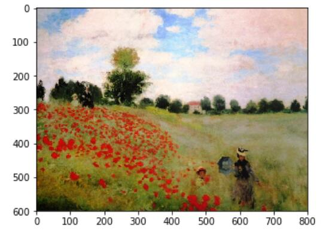

# 人脸识别与神经风格迁移

主要介绍卷积神经网络的特殊应用：人脸识别与风格迁移。

## 什么是人脸识别

首先简单介绍一下人脸验证（face verification）和人脸识别（face recognition）的区别。

- **人脸验证：输入一张人脸图片，验证输出与模板是否为同一人，即一对一问题。**
- **人脸识别：输入一张人脸图片，验证输出是否为K个模板中的某一个，即一对多问题。**

一般地，人脸识别比人脸验证更难一些。因为假设人脸验证系统的错误率是1%，那么在人脸识别中，输出分别与K个模板都进行比较，则相应的错误率就会增加，约K%。模板个数越多，错误率越大一些。

## One-Shot学习

One-shot学习就是说数据库中每个人的训练样本只包含一张照片，然后训练一个CNN模型来进行人脸识别。若数据库有K个人，则CNN模型输出softmax层就是K维的。

### 缺点：

但是One-shot学习的性能并不好，其包含了两个缺点：

- **每个人只有一张图片，训练样本少，构建的CNN网络不够健壮。**
- **若数据库增加另一个人，输出层softmax的维度就要发生变化，相当于要重新构建CNN网络，使模型计算量大大增加，不够灵活。**

为了解决One-shot学习的问题，我们先来介绍相似函数（similarity function）。相似函数表示两张图片的相似程度，用d(img1,img2)来表示。若d(img1,img2)较小，则表示两张图片相似；若d(img1,img2)较大，则表示两张图片不是同一个人。相似函数可以在人脸验证中使用：

- **$d(img1,img2)≤τ$ : 一样**
- **$d(img1,img2)>τ$ : 不一样**

对于人脸识别问题，则只需计算测试图片与数据库中K个目标的相似函数，取其中d(img1,img2)最小的目标为匹配对象。若所有的d(img1,img2)都很大，则表示数据库没有这个人。


## Siamese网络

若一张图片经过一般的CNN网络（包括CONV层、POOL层、FC层），最终得到全连接层FC，该FC层可以看成是原始图片的编码，表征了原始图片的关键特征。这个网络结构我们称之为Siamese网络。也就是说每张图片经过Siamese网络后，由FC层每个神经元来表征。


建立Siamese网络后，两张图片$x^{(1)}$和$x^{(2)}$的相似度函数可由各自FC层$f(x^{(1)})$与$f(x^{(2)})$之差的范数来表示：

$$
d(x^{(1)},x^{(2)})=||f(x^{(1)})-f(x^{(2)})||^2
$$
值得一提的是，不同图片的CNN网络所有结构和参数都是一样的。我们的目标就是利用梯度下降算法，不断调整网络参数，使得属于同一人的图片之间$d(x^{(1)},x^{(2)})$很小，而不同人的图片之间$d(x^{(1)},x^{(2)})$很大。

- **若$x^{(i)}$，$x^{(j)}$是同一个人，则$||f(x^{(1)})-f(x^{(2)})||^2$较小**
- **若$x^{(i)}$，$x^{(j)}$不是同一个人，则$||f(x^{(1)})-f(x^{(2)})||^2$较大**

具体网络构建和训练参数方法我们下一节再详细介绍。

## Triplet损失

构建人脸识别的CNN模型，需要定义合适的损失函数，这里我们将引入Triplet损失。

Triplet损失需要每个样本包含三张图片：靶目标（Anchor）、正例（Positive）、反例（Negative），这就是triplet名称的由来。顾名思义，靶目标和正例是同一人，靶目标和反例不是同一人。Anchor和Positive组成一类样本，Anchor和Negative组成另外一类样本。


我们希望上一小节构建的CNN网络输出编码$f(A)$接近$f(D)$，即$||f(A)−f(D)||^2$尽可能小，而$||f(A)−f(N)||^2$尽可能大，数学上满足：

$$
||f(A)-f(P)||^2\leq ||f(A)-f(N)||^2
$$

$$
||f(A)-f(P)||^2-||f(A)-f(N)||^2\leq 0
$$

根据上面的不等式，如果所有的图片都是零向量，即$f(A)=0,f(P)=0,f(N)=0$，那么上述不等式也满足。但是这对我们进行人脸识别没有任何作用，是不希望看到的。我们希望得到$||f(A)-f(P)||^2$远小于$||f(A)-f(N)||^2$。所以，我们添加一个超参数$\alpha$，且$\alpha>0$，对上述不等式做出如下修改：

$$
||f(A)-f(P)||^2-||f(A)-F(N)||^2\leq -\alpha
$$

$$
||f(A)-f(P)||^2-||f(A)-F(N)||^2+\alpha \leq 0
$$

顺便提一下，这里的$\alpha$也被称为边界(margin)，类似与支持向量机中的边界。举个例子，若$d(A,P)=0.5$，$\alpha=0.2$，则$d(A,N)≥0.7$。

接下来，我们根据A，P，N三张图片，就可以定义损失函数为：

$$
L(A,P,N)=max(||f(A)-f(P)||^2-||f(A)-F(N)||^2+\alpha,\ 0)
$$
L(A,P,N)=max(||f(A)−f(P)||2−||f(A)−F(N)||2+α, 0)L(A,P,N)=max(||f(A)−f(P)||2−||f(A)−F(N)||2+α, 0)

相应地，对于m组训练样本，损失函数为：

$$
J=\sum_{i=1}^mL(A^{(i)},P^{(i)},N^{(i)})
$$
关于训练样本，必须保证同一人包含多张照片，否则无法使用这种方法。例如10k张照片包含1k个不同的人脸，则平均一个人包含10张照片。这个训练样本是满足要求的。

然后，就可以使用梯度下降算法，不断训练优化CNN网络参数，让J不断减小接近0。

同一组训练样本，A，P，N的选择尽可能**不要使用随机选取方法**。因为随机选择的A与P一般比较接近，A与N相差也较大，毕竟是两个不同人脸。这样的话，也许模型不需要经过复杂训练就能实现这种明显识别，但是抓不住关键区别。

所以，最好的做法是人为选择**A与P相差较大**（例如换发型，留胡须等），**A与N相差较小**（例如发型一致，肤色一致等）。这种人为地增加难度和混淆度会让模型本身去寻找学习不同人脸之间关键的差异，“尽力”让$d(A,P)$更小，让$d(A,N)$更大，即让模型性能更好。

下面给出一些A，P，N的例子：


值得一提的是，现在许多商业公司构建的大型人脸识别模型都需要百万级别甚至上亿的训练样本。如此之大的训练样本我们一般很难获取。但是一些公司将他们训练的人脸识别模型发布在了网上，可供我们使用。

## 面部验证与二分类

除了构造triplet损失来解决人脸识别问题之外，还可以使用二分类结构。做法是将两个siamese网络组合在一起，将各自的编码层输出经过一个逻辑输出单元，该神经元使用sigmoid函数，输出1则表示识别为同一人，输出0则表示识别为不同人。结构如下：


每组训练样本包含两张图片，每个siamese网络结构和参数完全相同。这样就把人脸识别问题转化成了一个二分类问题。引入逻辑输出层参数w和b，输出$\hat y$表达式为：

$$
\hat y=\sigma(\sum_{k=1}^Kw_k|f(x^{(i)})_k-f(x^{(j)})_k|+b)
$$
其中参数$w_k$和$b$都是通过梯度下降算法迭代训练得到。

$\hat y$的另外一种表达式为：

$$
\hat y=\sigma(\sum_{k=1}^Kw_k\frac{(f(x^{(i)})_k-f(x^{(j)})_k)^2}{f(x^{(i)})_k+f(x^{(j)})_k}+b)
$$
上式被称为$\chi$方公式，也叫$\chi$方相似度。

在训练好网络之后，进行人脸识别的常规方法是**测试图片与模板**分别进行网络计算，编码层输出比较，计算逻辑输出单元。

为了减少计算量，可以使用**预计算**的方式在训练时就将数据库每个模板的**编码层输出**$f(x)$保存下来,以**节约存储空间**。而且，测试过程中，无须计算模板的siamese网络，只要计算测试图片的siamese网络，得到的$f(x^{(i)})$直接与存储的**模板**$f(x^{(j)})$进行下一步的逻辑输出单元计算即可，计算时间减小了接近一半。这种方法也可以应用在上一节的triplet损失网络中。

## 什么是神经网络风格转换

神经风格迁移是CNN模型一个非常有趣的应用。它可以实现将一张图片的风格“迁移”到另外一张图片中，生成具有其特色的图片。比如我们可以将毕加索的绘画风格迁移到我们自己做的图中，生成类似的“大师作品”，很酷不是吗？

下面列出几个神经风格迁移的例子：


一般用C表示内容图片，S表示风格图片，G表示生成的图片。

## 深度卷积网络在学什么

在进行神经风格迁移之前，我们先来从可视化的角度看一下卷积神经网络每一层到底是什么样子？它们各自学习了哪些东西。

典型的CNN网络如下所示：


首先来看第一层隐藏层，遍历所有训练样本，找出让该层激活函数输出最大的9块图像区域；然后再找出该层的其它单元（不同的滤波器通道）激活函数输出最大的9块图像区域；最后共找9次，得到9 x 9的图像如下所示，其中每个3 x 3区域表示一个运算单元。


可以看出，第一层隐藏层一般检测的是原始图像的边缘和颜色阴影等简单信息。

继续看CNN的更深隐藏层，随着层数的增加，捕捉的区域更大，特征更加复杂，从边缘到纹理再到具体物体。


## 成本函数

神经风格迁移生成图片G的损失函数由两部分组成：C与G的相似程度和S与G的相似程度。

$$
J(G)=\alpha \cdot J_{content}(C,G)+\beta \cdot J_{style}(S,G)
$$
其中，$\alpha ,\beta$是超参数，用来调整$J_{content}(C,G)$与$J_{style}(S,G)$的相对比重。


神经风格迁移的基本算法流程是：首先令G为随机像素点，然后使用梯度下降算法，不断修正G的所有像素点，使得$J(G)$不断减小，从而使G逐渐有C的内容和G的风格，如下图所示。


### 内容成本函数

我们先来看$J(G)$的第一部分$J_{content}(C,G)$，它表示内容图片C与生成图片G之间的相似度。

使用的CNN网络是之前训练好的模型，例如Alex-Net。C，S，G共用相同模型和参数。首先，需要选择合适的层数ll来计算$J_{content}(C,G)$。根据上一小节的内容，CNN的每个隐藏层分别提取原始图片的不同深度特征，由简单到复杂。如果ll太小，则G与C在像素上会非常接近，没有迁移效果；如果ll太深，则G上某个区域将直接会出现C中的物体。因此，ll既不能太浅也不能太深，一般选择网络中间层。

然后比较C和G在$l$层的激活函数输出$a^{[l](C)}$与$a^{[l](G)}$。相应的$J_{content}(C,G)$的表达式为：

$$
J_{content}(C,G)=\frac12||a^{[l](C)}-a^{[l](G)}||^2
$$
$a^{[l](C)}$与$a^{[l](G)}$越相似，则$J_{content}(C,G)$越小。方法就是使用梯度下降算法，不断迭代修正G的像素值，使$J_{content}(C,G)$不断减小。

### 风格成本函数

什么是图片的风格？利用CNN网络模型，图片的风格可以定义成第$l$层隐藏层不同通道间激活函数的乘积（相关性）。


例如，我们选取第$l$层隐藏层，其各通道使用不同颜色标注，如下图所示。

因为每个通道提取图片的特征不同，比如1通道（红色）提取的是图片的垂直纹理特征，2通道（黄色）提取的是图片的橙色背景特征。那么计算这两个通道的**相关性**大小，**相关性**越大，表示原始图片及既包含了垂直纹理也包含了该橙色背景；**相关性**越小，表示原始图片并没有同时包含这两个特征。

也就是说，计算不同通道的相关性，反映了原始**图片特征间的相互关系**，从某种程度上刻画了图片的“风格”。


接下来我们就可以定义图片的风格矩阵（style matrix）为：

$$
G_{kk'}^{[l]}=\sum_{i=1}^{n_H^{[l]}}\sum_{j=1}^{n_W^{[l]}}a_{ijk}^{[l]}a_{ijk'}^{[l]}
$$
其中，$[l]$表示第$l$层隐藏层，k，k'分别表示不同通道，总共通道数为$n_C^{[l]}$。i，j分别表示该隐藏层的高度和宽度。风格矩阵$G_{kk'}^{[l]}$,计算第$l$层隐藏层不同通道对应的所有激活函数输出和。$G_{kk'}^{[l]}$的维度为$n_c^{[l]}×n_c^{[l]}$。若两个通道之间相似性高，则对应的$G_{kk'}^{[l]}$较大；若两个通道之间相似性低，则对应的$G_{kk'}^{[l]}$较小。

风格矩阵$G_{kk'}^{[l](S)}$表征了风格图片S第$l$层隐藏层的“风格”。相应地，生成图片G也有$G_{kk'}^{[l](G)}$。那么，$G_{kk'}^{[l](S)}$与$G_{kk'}^{[l](G)}$越相近，则表示G的风格越接近S。这样，我们就可以定义出的$J^{[l]}_{style}(S,G)$表达式：

$$
J^{[l]}_{style}(S,G)=\frac{1}{(2n_H^{[l]}n_W^{[l]}n_C^{[l]})}\sum_{k=1}^{n_C^{[l]}}\sum_{k'=1}^{n_C^{[l]}}||G_{kk'}^{[l][S]}-G_{kk'}^{[l][G]}||^2
$$
定义完$J^{[l]}_{style}(S,G)$之后，我们的目标就是使用梯度下降算法，不断迭代修正G的像素值，使$J^{[l]}_{style}(S,G)$不断减小。

值得一提的是，以上我们只比较计算了一层隐藏层$l$。为了提取的“风格”更多，也可以使用多层隐藏层，然后相加，表达式为：

$J_{style}(S,G)=\sum_l\lambda^{[l]}\cdot J^{[l]}_{style}(S,G)$

其中，$\lambda^{[l]}$表示累加过程中各层$J^{[l]}_{style}(S,G)$的权重系数，为超参数。

根据以上两小节的推导，最终的损失函数为：

$$
J(G)=\alpha \cdot J_{content}(C,G)+\beta \cdot J_{style}(S,G)
$$
J(G)=α⋅Jcontent(C,G)+β⋅Jstyle(S,G)J(G)=α⋅Jcontent(C,G)+β⋅Jstyle(S,G)

使用梯度下降算法进行迭代优化。

### 一维到三维推广

我们之前介绍的CNN网络处理的都是2D图片，举例来介绍2D卷积的规则：


- **输入图片维度：14 x 14 x 3**
- **滤波器尺寸：5 x 5 x 3，滤波器个数：16**
- **输出图片维度：10 x 10 x 16**

将2D卷积推广到1D卷积，举例来介绍1D卷积的规则：


- **输入时间序列维度：14 x 1**
- **滤波器尺寸：5 x 1，滤波器个数：16**
- **输出时间序列维度：10 x 16**

对于3D卷积，举例来介绍其规则：


- **输入3D图片维度：14 x 14 x 14 x 1**
- **滤波器尺寸：5 x 5 x 5 x 1，滤波器个数：16**
- **输出3D图片维度：10 x 10 x 10 x 16**

# 面部识别--快乐之家

- 人脸识别问题通常分为两类:

	- **面部验证** -“这是本人吗?”例如，在一些机场，你可以通过一个系统扫描你的护照，然后验证你(携带护照的人)是正确的人通过海关。使用面部解锁的手机也使用面部验证。这是一个1:1匹配的问题。

	- **面部识别** -“这个人是谁?”例如，视频讲座展示了百度员工无需身份识别即可进入办公室的人脸识别视频(https://www.youtube.com/watch?v=wr4rx0Spihs)。这是一个1:K匹配的问题。

FaceNet学会了一种神经网络，可以将人脸图像编码成128个数字的矢量。通过比较两个这样的向量，你就可以确定两张图片是否是同一个人。

## 目标

- 实现三联损失函数
- 使用一个预先训练的模型来映射人脸图像到128维编码
- 使用这些编码来执行人脸验证和人脸识别

在这个练习中，我们将使用一个预先训练过的模型，它使用“通道优先”约定来表示卷积激活，而不是在课堂和之前的编程作业中使用的“通道最后”约定。换句话说，一批图像将是形状$(m, n_C, n_H, n_W)$，而不是$(m, n_H, n_W, n_C)$。这两种约定在开源实现中都有一定的吸引力;在深度学习社区中还没有一个统一的标准。

## 导包

```python
from keras.models import Sequential
from keras.layers import Conv2D, ZeroPadding2D, Activation, Input, concatenate
from keras.models import Model
from keras.layers.normalization import BatchNormalization
from keras.layers.pooling import MaxPooling2D, AveragePooling2D
from keras.layers.merge import Concatenate
from keras.layers.core import Lambda, Flatten, Dense
from keras.initializers import glorot_uniform
from keras.engine.topology import Layer
from keras import backend as K
K.set_image_data_format('channels_first')
import cv2
import os
import numpy as np
from numpy import genfromtxt
import pandas as pd
import tensorflow as tf
from fr_utils import *
from inception_blocks_v2 import *

%matplotlib inline
%load_ext autoreload
%autoreload 2

np.set_printoptions(threshold=np.nan)
Using TensorFlow backend.
```

## 初级的的人脸验证

在面部验证中，你会看到两张图片，你必须判断这两张图片是否是同一个人。最简单的方法是逐像素比较这两幅图像。如果原始图像之间的距离小于一个选择的阈值，它可能是同一个人!

当然，这个算法的性能真的很差，因为像素值会因为光照变化、人脸的方向变化、甚至是头部位置的微小变化等等而急剧变化。

你会发现，与其使用原始图像，你还可以学习编码f(img)f(img)，这样，对这种编码进行元素上的比较，就能更准确地判断两张图片是否属于同一个人。

## 将人脸图像编码成128维向量

### 使用卷积网络计算编码

FaceNet模型需要大量的数据和很长时间的训练。所以按照应用深度学习设置中的常见做法，让我们加载别人已经训练过的权重。网络架构遵循了[Szegedy *等人*](https://arxiv.org/abs/1409.4842)的初始模型。我们提供了一个初始网络实现。您可以查看文件`inception_blocks.py`，查看它是如何实现的.

你需要知道的关键事情是:

- 该网络使用96x96维RGB图像作为输入。具体来说，以shape为$(m, n_C, n_H, n_W) = (m, 3, 96, 96)$ 的张量形式输入一张人脸图像(或一批$m$人脸图像)。

- 输出一个形状矩阵$(m,128)$，该矩阵将每个输入的人脸图像编码为一个128维向量

#### 创建模型

运行下面的单元格来创建人脸图像的模型。

```python
FRmodel = faceRecoModel(input_shape=(3, 96, 96))
```

##### 测试

```python
print("Total Params:", FRmodel.count_params())
```

##### 结果

```
Total Params: 3743280
```

模型以128个神经元的全连接层作为最后一层，保证输出为大小为128的编码向量。然后使用编码比较两个人脸图像。

通过计算两幅编码和阈值之间的距离，可以确定这两幅图片是否代表同一个人

所以，如果编码满足一下条件，则这个编码是个优秀的编码:

- 同一人的两幅图像的编码非常相似

- 不同人的两种形象的编码是非常不同的

三联损失函数使之形式化，并试图将同一个人的两幅图像(Anchor and Positive)的编码“推”得更近，而将不同人的两幅图像(Anchor, Negative)的编码“拉”得更远。

### 三联损失

**注**：Anchor (A), Positive (P), Negative (N)

对于图像$x$，我们表示它的编码$f(x)$，其中$f$是由神经网络计算的函数。

训练将使用三联图像 $(A, P, N)$:  

- A是一个目标 ("Anchor" )图像——一张人的照片. 
- P 是一个正("Positive" )图像——一张与A同一个人的照片
- N 是一个负("Negative") 图像——一张与A不同人的照片

这些三联元素是从我们的训练数据集中挑选出来的。我们将编写$(A^{(i)}, P^{(i)}, N^{(i)})$来表示我第$i$个训练的例子。

您希望确保一个个人的图像$A^{(i)}$更接近$P^{(i)}$，且比$N^{(i)}$至少大一个边缘值$\alpha$:

$$
\mid \mid f(A^{(i)}) - f(P^{(i)}) \mid \mid_2^2 + \alpha < \mid \mid f(A^{(i)}) - f(N^{(i)}) \mid \mid_2^2
$$

因此，您需要最小化以下 "三联损失":

$$
\mathcal{J} = \sum^{m}_{i=1} \large[ \small \underbrace{\mid \mid f(A^{(i)}) - f(P^{(i)}) \mid \mid_2^2}_\text{(1)} - \underbrace{\mid \mid f(A^{(i)}) - f(N^{(i)}) \mid \mid_2^2}_\text{(2)} + \alpha \large ] \small_+
$$

这里我们用标记 "$[z]_+$" 来表示 $max(z,0)$.  

注:


- 第(1)项是给定三联中A与P之间的距离的平方;你想让它很小。

- 第(2)项是给定三联中A与N之间的距离的平方，你想要它相对大一些，因此它的前面有一个负号是有意义的。

- $\alpha$称为边际。它是一个超参数，您应该手动选择。我们将使用$\alpha = 0.2$。

大多数实现还将编码向量标准化，使norm等于1(例如: $\mid \mid f(img)\mid \mid_2$=1);这里就不用担心了。

#### 代码实现

```python
# GRADED FUNCTION: triplet_loss

def triplet_loss(y_true, y_pred, alpha = 0.2):
    """
    Implementation of the triplet loss as defined by formula (3)
    
    Arguments:
    y_true -- true labels, required when you define a loss in Keras, you don't need it in this function.
    y_pred -- python list containing three objects:
            anchor -- the encodings for the anchor images, of shape (None, 128)
            positive -- the encodings for the positive images, of shape (None, 128)
            negative -- the encodings for the negative images, of shape (None, 128)
    
    Returns:
    loss -- real number, value of the loss
    """
    
    anchor, positive, negative = y_pred[0], y_pred[1], y_pred[2]
    
    ### START CODE HERE ### (≈ 4 lines)
    # 步骤 1: 计算A与P之间的距离, 你需要求和 axis=-1
    pos_dist = tf.reduce_sum(tf.square(tf.subtract(anchor,positive)),axis=-1)
    # 步骤 2: 计算A与N之间的距离, 你需要求和 axis=-1
    neg_dist = tf.reduce_sum(tf.square(tf.subtract(anchor,negative)),axis=-1)
    # 步骤 3: 前面的两个距离相减，然后加上alpha。
    basic_loss = tf.add(tf.subtract(pos_dist,neg_dist),alpha)
    # 步骤 4: 取basic_loss的最大值和0.0。对训练示例进行求和。
    loss = tf.reduce_sum(tf.maximum(basic_loss,0))
    ### END CODE HERE ###
    
    return loss
```

#### 测试

```python
with tf.Session() as test:
    tf.set_random_seed(1)
    y_true = (None, None, None)
    y_pred = (tf.random_normal([3, 128], mean=6, stddev=0.1, seed = 1),
              tf.random_normal([3, 128], mean=1, stddev=1, seed = 1),
              tf.random_normal([3, 128], mean=3, stddev=4, seed = 1))
    loss = triplet_loss(y_true, y_pred)
    
    print("loss = " + str(loss.eval()))
```

#### 结果

```
loss = 528.143
```

## 加载训练模型

FaceNet是通过最小化三联损失来训练的。但是由于训练需要大量的数据和大量的计算，我们不会在这里从头开始训练。相反，我们加载一个以前训练过的模型。使用以下单元格加载模型;这可能需要几分钟的时间来运行。

```python
FRmodel.compile(optimizer = 'adam', loss = triplet_loss, metrics = ['accuracy'])
load_weights_from_FaceNet(FRmodel)
```

## 应用模型

回到快乐的家!住户们生活得很幸福，因为你在早期的分配中对房子进行了幸福认可。

然而，一些问题不断出现:快乐之家变得如此快乐，以至于邻居中每个快乐的人都来你的客厅闲逛。它变得非常拥挤，这对住在这里的人有负面影响。所有这些快乐的人也会吃掉你所有的食物。

因此，您决定更改入口策略，不再让随机的快乐的人进入，即使他们是快乐的！相反，您需要构建一个人脸验证系统，以便只允许来自指定列表的人进入。为了进入，每个人都必须在门口刷卡来证明自己的身份。然后，人脸识别系统会检查他们是否是他们所声称的那个人。

### 面部识别

让我们为允许进入“快乐之家”的每个人构建一个包含一个编码向量的数据库。为了生成编码，我们使用`img_to_encoding(image_path, model) `，它基本上在指定的图像上运行模型的正向传播。

运行以下代码构建数据库(表示为python字典)。这个数据库将每个人的名字映射到他们面部的128维编码中。

```python
database = {}
database["danielle"] = img_to_encoding("images/danielle.png", FRmodel)
database["younes"] = img_to_encoding("images/younes.jpg", FRmodel)
database["tian"] = img_to_encoding("images/tian.jpg", FRmodel)
database["andrew"] = img_to_encoding("images/andrew.jpg", FRmodel)
database["kian"] = img_to_encoding("images/kian.jpg", FRmodel)
database["dan"] = img_to_encoding("images/dan.jpg", FRmodel)
database["sebastiano"] = img_to_encoding("images/sebastiano.jpg", FRmodel)
database["bertrand"] = img_to_encoding("images/bertrand.jpg", FRmodel)
database["kevin"] = img_to_encoding("images/kevin.jpg", FRmodel)
database["felix"] = img_to_encoding("images/felix.jpg", FRmodel)
database["benoit"] = img_to_encoding("images/benoit.jpg", FRmodel)
database["arnaud"] = img_to_encoding("images/arnaud.jpg", FRmodel)
```

现在，当有人出现在你的前门，刷他们的身份证(这样就给了你他们的名字)，你可以在数据库中查找他们的编码，并使用它来检查站在前门的人是否与身份证上的名字相符。

```python
# GRADED FUNCTION: verify

def verify(image_path, identity, database, model):
    """
    Function that verifies if the person on the "image_path" image is "identity".
    
    Arguments:
    image_path -- path to an image
    identity -- string, name of the person you'd like to verify the identity. Has to be a resident of the Happy house.
    database -- python dictionary mapping names of allowed people's names (strings) to their encodings (vectors).
    model -- your Inception model instance in Keras
    
    Returns:
    dist -- distance between the image_path and the image of "identity" in the database.
    door_open -- True, if the door should open. False otherwise.
    """
    
    ### START CODE HERE ###
    
    # 步骤 1: 计算图像的编码。使用img_to_encoding() (≈ 1 line)
    encoding = img_to_encoding(image_path, model)
    
    # 步骤 2: 利用恒等图像计算距离 (≈ 1 line)
    dist =  np.linalg.norm(database[identity] - encoding ,ord=2)
    
    # 步骤 3: 如果dist < 0.7，就开门，否则就别开门 (≈ 3 lines)
    if dist > 0.7:
        print("It's " + str(identity) + ", welcome home!")
        door_open = True
    else:
        print("It's not " + str(identity) + ", please go away")
        door_open = False
        
    ### END CODE HERE ###
        
    return dist, door_open
```

#### 测试

Younes试图进入“快乐之家”，相机为他拍下了照片("images/camera_0.jpg")。让我们在这张图片上运行您的验证算法:

```python
verify("images/camera_0.jpg", "younes", database, FRmodel)
```

#### 结果

```
It's younes, welcome home!
(0.65938449, True)
```

上周末闯入水族馆的Benoit已被禁止进入水族馆，并被从数据库中删除。他偷了Kian的身份证，然后回到房子里试图证明自己是Kian。前门的摄像头给Benoit拍了一张照片("images/camera_2.jpg ")。让我们运行验证算法来检查Benoit是否可以进入。

```python
verify("images/camera_2.jpg", "kian", database, FRmodel)
```

结果

```
It's not kian, please go away
(0.86225712, False)
```

### 人脸识别

你的面部验证系统基本上工作得很好。但是由于Kian的身份证被偷了，当他晚上回到房子时，他进不去了!

为了减少这种恶作剧，您需要将您的人脸验证系统更改为人脸识别系统。这样，就不用再带身份证了。一个经过授权的人可以直接走进房子，前门会为他们打开!

您将实现一个人脸识别系统，它接受一个图像作为输入，并确定它是否是授权人员之一(如果是，则确定是谁)。与之前的人脸验证系统不同，我们将不再以人名作为另一个输入。

```python
# GRADED FUNCTION: who_is_it

def who_is_it(image_path, database, model):
    """
    Implements face recognition for the happy house by finding who is the person on the image_path image.
    
    Arguments:
    image_path -- path to an image
    database -- database containing image encodings along with the name of the person on the image
    model -- your Inception model instance in Keras
    
    Returns:
    min_dist -- the minimum distance between image_path encoding and the encodings from the database
    identity -- string, the name prediction for the person on image_path
    """
    
    ### START CODE HERE ### 
    
    ## Step 1: Compute the target "encoding" for the image. Use img_to_encoding() see example above. ## (≈ 1 line)
    encoding = img_to_encoding(image_path, model)
    
    ## Step 2: Find the closest encoding ##
    
    # Initialize "min_dist" to a large value, say 100 (≈1 line)
    min_dist = 100
    
    # Loop over the database dictionary's names and encodings.
    for (name, db_enc) in database.items():
        
        # Compute L2 distance between the target "encoding" and the current "emb" from the database. (≈ 1 line)
        dist = np.linalg.norm(db_enc - encoding,ord=2)

        # If this distance is less than the min_dist, then set min_dist to dist, and identity to name. (≈ 3 lines)
        if dist < min_dist:
            min_dist = dist
            identity = name

    ### END CODE HERE ###
    
    if min_dist > 0.7:
        print("Not in the database.")
    else:
        print ("it's " + str(identity) + ", the distance is " + str(min_dist))
        
    return min_dist, identity
```

#### 测试

尤尼斯站在前门，相机给他拍了照(“images/camera_0.jpg”)。让我们看看who_it_is()算法是否识别Younes。

```python
#这里还需要把人脸区域裁出来,再resize成96 * 96 像素的才可以
who_is_it("images/camera_1.jpg", database, FRmodel)

```

#### 结果

```
it's younes, the distance is 0.659393
(0.65939283, 'younes')
```

你可以将“`camera_0.jpg`”(younes的照片)改为“`camera_1.jpg`”(bertrand的照片)，就可以看到结果了。


你的幸福之家运转得很好。它只允许有授权的人进入，人们不再需要带身份证到处走了!

你现在已经看到了最先进的人脸识别系统是如何工作的。

虽然我们不会在这里实现它，这里有一些方法来进一步改进算法:

- 将每个人的更多照片(在不同的光照条件下，在不同的日子，等等)放入数据库。然后给他一张新照片，把这张新面孔和这个人的多张照片进行比较。这将提高准确度。

- 裁剪图像，只包含脸部，和较少的“边界”区域周围的脸。这种预处理去除了脸部周围一些不相关的像素，也使算法更加健壮。

**你应该记住的**:

- 人脸验证解决了一个更简单的1:1匹配问题 ; 人脸识别解决了一个更难的1:K匹配问题。
-  triplet loss是一个训练神经网络学习人脸图像编码的有效的损失函数。
- 相同的编码可用于核实及识别。通过测量两幅图片编码的距离，你就可以确定它们是否是同一个人的照片。


## 参考文献:

- Florian Schroff, Dmitry Kalenichenko, James Philbin (2015). [FaceNet: A Unified Embedding for Face Recognition and Clustering](https://arxiv.org/pdf/1503.03832.pdf)
- Yaniv Taigman, Ming Yang, Marc'Aurelio Ranzato, Lior Wolf (2014). [DeepFace: Closing the gap to human-level performance in face verification](https://research.fb.com/wp-content/uploads/2016/11/deepface-closing-the-gap-to-human-level-performance-in-face-verification.pdf)
- The pretrained model we use is inspired by Victor Sy Wang's implementation and was loaded using his code: https://github.com/iwantooxxoox/Keras-OpenFace.
- Our implementation also took a lot of inspiration from the official FaceNet github repository: https://github.com/davidsandberg/facenet


# 深度学习&艺术:神经类型的迁移

该算法由Gatys等人(2015)创建(https://arxiv.org/abs/1508.06576)。

## 目标

- 实现神经类型的迁移算法

- 使用算法生成新颖的艺术图像

您研究过的大多数算法都是通过优化cost函数来获得一组参数值。在神经类型的传输中，您将优化cost函数以获得像素值!

## 导包

```python
import os
import sys
import scipy.io
import scipy.misc
import matplotlib.pyplot as plt
from matplotlib.pyplot import imshow
from PIL import Image
from nst_utils import *
import numpy as np
import tensorflow as tf

%matplotlib inline
```

## 问题陈述

神经类型迁移(NST)是深度学习中最有趣的技术之一。它将“内容”图像(C)和“风格”图像(S)合并，生成“生成”图像(G)。生成的图像G将图像C的“内容”与图像S的“风格”结合在一起。

在本例中，您将生成一张巴黎卢浮宫的图片(内容图像C)，混合印象派运动领袖克劳德·莫奈的一幅画(风格图像S)。

## 迁移学习

神经类型转移(NST)使用以前训练过的卷积网络，并在此基础上构建。使用一个在不同任务上训练过的网络并将其应用到新的任务上的想法被称为迁移学习。

按照原始的NST论文(https://arxiv.org/abs/1508.06576)，我们将使用VGG网络。具体来说，我们将使用VGG-19, VGG网络的19层版本。这个模型已经在非常大的ImageNet数据库上进行了训练，因此已经学会了识别各种低级特征(在较早的层)和高级特征(在较深的层)。

运行以下代码从VGG模型加载参数。这可能需要几秒钟。

```python
model = load_vgg_model("pretrained-model/imagenet-vgg-verydeep-19.mat")
print(model)
```

### 结果

```
{'input': <tf.Variable 'Variable:0' shape=(1, 300, 400, 3) dtype=float32_ref>, 'conv1_1': <tf.Tensor 'Relu:0' shape=(1, 300, 400, 64) dtype=float32>, 'conv1_2': <tf.Tensor 'Relu_1:0' shape=(1, 300, 400, 64) dtype=float32>, 'avgpool1': <tf.Tensor 'AvgPool:0' shape=(1, 150, 200, 64) dtype=float32>, 'conv2_1': <tf.Tensor 'Relu_2:0' shape=(1, 150, 200, 128) dtype=float32>, 'conv2_2': <tf.Tensor 'Relu_3:0' shape=(1, 150, 200, 128) dtype=float32>, 'avgpool2': <tf.Tensor 'AvgPool_1:0' shape=(1, 75, 100, 128) dtype=float32>, 'conv3_1': <tf.Tensor 'Relu_4:0' shape=(1, 75, 100, 256) dtype=float32>, 'conv3_2': <tf.Tensor 'Relu_5:0' shape=(1, 75, 100, 256) dtype=float32>, 'conv3_3': <tf.Tensor 'Relu_6:0' shape=(1, 75, 100, 256) dtype=float32>, 'conv3_4': <tf.Tensor 'Relu_7:0' shape=(1, 75, 100, 256) dtype=float32>, 'avgpool3': <tf.Tensor 'AvgPool_2:0' shape=(1, 38, 50, 256) dtype=float32>, 'conv4_1': <tf.Tensor 'Relu_8:0' shape=(1, 38, 50, 512) dtype=float32>, 'conv4_2': <tf.Tensor 'Relu_9:0' shape=(1, 38, 50, 512) dtype=float32>, 'conv4_3': <tf.Tensor 'Relu_10:0' shape=(1, 38, 50, 512) dtype=float32>, 'conv4_4': <tf.Tensor 'Relu_11:0' shape=(1, 38, 50, 512) dtype=float32>, 'avgpool4': <tf.Tensor 'AvgPool_3:0' shape=(1, 19, 25, 512) dtype=float32>, 'conv5_1': <tf.Tensor 'Relu_12:0' shape=(1, 19, 25, 512) dtype=float32>, 'conv5_2': <tf.Tensor 'Relu_13:0' shape=(1, 19, 25, 512) dtype=float32>, 'conv5_3': <tf.Tensor 'Relu_14:0' shape=(1, 19, 25, 512) dtype=float32>, 'conv5_4': <tf.Tensor 'Relu_15:0' shape=(1, 19, 25, 512) dtype=float32>, 'avgpool5': <tf.Tensor 'AvgPool_4:0' shape=(1, 10, 13, 512) dtype=float32>}
```

模型存储在python字典中，其中每个变量名是键key，对应的值是包含该变量值的张量。要通过这个网络运行映像，您只需将图像提供给模型。在TensorFlow中，可以使用[tf.assign](https://www.tensorflow.org/api_docs/python/tf/assign)函数。特别地，您将使用赋值函数如下:

```python
model["input"].assign(image)
```

这将图像作为模型的输入。在这之后，如果你想访问一个特定层的激活，当网络在这个图像上运行时，访问层` 4_2 `，你会在正确张量` conv4_2 `上运行一个TensorFlow的session

```python
sess.run(model["conv4_2"])
```

## 神经风格迁移

我们构建 NST 算法需要以下三步:

- 构建内容cost函数 $J_{content}(C,G)$
- 构建风格cost函数 $J_{style}(S,G)$
- 组合来获得 $J(G) = \alpha J_{content}(C,G) + \beta J_{style}(S,G)$. 

### 计算内容成本

在我们的运行示例中，内容图像C将是巴黎卢浮宫博物馆的图片。运行下面的代码可以看到卢浮宫的图片。

```python
content_image = scipy.misc.imread("images/louvre.jpg")
imshow(content_image)
```


内容图(C)展示的是卢浮宫的金字塔被古老的巴黎建筑包围着，在阳光明媚的天空中飘着几朵云彩。

#### 如何确保生成的图像G匹配图像C的内容?

正如我们在课堂上看到的，卷积神经网络的早期(较浅)层倾向于检测**较低级别**的**特征**，如边缘和简单纹理，而后期(较深)层倾向于**检测较高级别的特征**，如更复杂的纹理和对象类。

我们希望“生成”的图像G具有与输入图像C相似的内容。假设你选择了一些层的激活来表示图像的内容。在实践中，如果你在网络的中间选择一个层——既不太浅也不太深，您将获得视觉上最令人满意的结果。(在你完成这个练习之后，你可以随意回来，尝试使用不同的图层，看看效果如何变化。)

假设你选择了一个特定的隐藏层。现在，将图像C设置为预先训练过的VGG网络的输入，并运行正向传播。让$a^{(C)}$是你所选择的层中的隐藏层激活函数值。(在课堂上，我们把它写成$a^{[l](C)}$但这里我们去掉上标$[l]$以简化符号)这将是一个$n_H \times n_W \times n_C$张量。对图像G重复此过程：将G设为输入，并向前推进。

让$a^{(G)}$被相应的隐层激活。我们将定义为内容cost函数：
$$
J_{content}(C,G) =  \frac{1}{4 \times n_H \times n_W \times n_C}\sum _{ \text{all entries}} (a^{(C)} - a^{(G)})^2
$$


这里，$n_H、n_W$和$n_C$是你所选择的隐含层的高度、宽度和通道数量，并出现在cost的正则化项中。

为了清晰起见，请注意$a^{(C)}$和$a^{(G)}$是隐藏层激活函数值相对应的volume。为了计算成本$J_{content}(C,G)$，还可以方便地将这些3Dvolume展开为2D矩阵。(从技术上讲，在计算$J_{content}$时不需要这个展开步骤，但是当您稍后需要执行类似的操作来计算样式const $J_{style}$时，它将是一个很好的实践。)


```python
# GRADED FUNCTION: compute_content_cost

def compute_content_cost(a_C, a_G):
    """
    Computes the content cost
    
    Arguments:
    a_C -- tensor of dimension (1, n_H, n_W, n_C), hidden layer activations representing content of the image C 
    a_G -- tensor of dimension (1, n_H, n_W, n_C), hidden layer activations representing content of the image G
    
    Returns: 
    J_content -- scalar that you compute using equation 1 above.
    """
    
    ### START CODE HERE ###
    # 获取 a_G 的 shape (≈1 line)
    m, n_H, n_W, n_C = a_G.get_shape().as_list()
    
    # Reshape a_C 和 a_G (≈2 lines)
    a_C_unrolled = tf.reshape(a_C,(n_H * n_W,n_C))
    a_G_unrolled = tf.reshape(a_G,(n_H * n_W,n_C))
    
    # 用 tensorflow 计算 cost (≈1 line)
    J_content = 1/(4*n_H*n_W*n_C) * tf.reduce_sum(tf.square(tf.subtract(a_C_unrolled , a_G_unrolled)))
    ### END CODE HERE ###
    
    return J_content
```

##### 测试

```python
tf.reset_default_graph() 

with tf.Session() as test:
    tf.set_random_seed(1)
    a_C = tf.random_normal([1, 4, 4, 3], mean=1, stddev=4)
    a_G = tf.random_normal([1, 4, 4, 3], mean=1, stddev=4)
    J_content = compute_content_cost(a_C, a_G)
    print("J_content = " + str(J_content.eval()))
```

##### 结果

```
J_content = 6.76559
```


##### 注意

- 内容cost采用神经网络的隐藏层激活，并测量$a^{(C)}$和$a^{(G)}$之间的差异。
- 当我们稍后最小化内容cost时，这将有助于确保$G$具有与$C$类似的内容。

### 计算风格成本

```python
style_image = scipy.misc.imread("images/monet_800600.jpg")
```



这幅画的风格是印象派。现在让我们看看如何定义一个风格常函数$J_{style}(S,G)$。

#### 风格矩阵

风格矩阵也被称之为"Gram矩阵"。 在线性代数中，向量 $(v_{1},\dots ,v_{n})$ 的集合G是点积矩阵，其项为${\displaystyle G_{ij} = v_{i}^T v_{j} = np.dot(v_ {}, v_ {j})} $。换句话说，$G_{ij}$比较$v_i$与$v_j$的相似程度:如果它们高度相似，则期望它们有一个较大的点积，因此这时$G_{ij}$应该很大。

**注意：**这里使用的变量名发生了不幸的冲突。我们使用的是文献中使用的常见术语，但是$G$用于表示样式矩阵(或Gram矩阵)以及表示生成的图像$G$。我们将努力确保我们所指的$G$在上下文中始终是清晰的。

在NST中，你可以通过将“展开”的filter矩阵与它们的转置相乘来计算样式矩阵。

结果是维度为$(n_C,n_C)$的矩阵，其中$n_C$是filter的数目。值$G_{ij}$度量$filter_i$的激活与$filter_j$的激活有多相似。

Gram矩阵的一个重要部分是，像$G_{ii}$这样的对角元素也能够度量$filter_i$有多活跃。例如，假设$filter_i$用于检测图像中的垂直纹理。然后$G_{ii}$测量垂直纹理在整个图像中的常见程度:

**如果$G_{ii}$很大，这意味着图像有很多垂直纹理。**

通过捕获不同类型特征的广泛性($G_{ii}$)，以及有多少不同特征同时出现($G_{ij}$)，样式矩阵$G$测量图像的样式。

```python
# GRADED FUNCTION: gram_matrix

def gram_matrix(A):
    """
    Argument:
    A -- matrix of shape (n_C, n_H*n_W)
    
    Returns:
    GA -- Gram matrix of A, of shape (n_C, n_C)
    """
    
    ### START CODE HERE ### (≈1 line)
    GA = tf.matmul(A,tf.transpose(A))
    ### END CODE HERE ###
    
    return GA
```

##### 测试

```python
tf.reset_default_graph()

with tf.Session() as test:
    tf.set_random_seed(1)
    A = tf.random_normal([3, 2*1], mean=1, stddev=4)
    GA = gram_matrix(A)
    
    print("GA = " + str(GA.eval()))
```

##### 结果

```
GA = [[  6.42230511  -4.42912197  -2.09668207]
 [ -4.42912197  19.46583748  19.56387138]
 [ -2.09668207  19.56387138  20.6864624 ]]
```


#### 风格成本

生成风格矩阵(Gram矩阵)后,你的目标是最小化Gram矩阵之间的距离的“风格”形象和“生成”的形象的G .现在,我们只使用一个隐藏层$a^{[l]}$,和相应的风格成本被定义为:

$$
J_{style}^{[l]}(S,G) = \frac{1}{4 \times {n_C}^2 \times (n_H \times n_W)^2} \sum _{i=1}^{n_C}\sum_{j=1}^{n_C}(G^{(S)}_{ij} - G^{(G)}_{ij})^2\tag{2}
$$


其中$G^{(S)}$和$G^{(G)}$分别是“风格”图像和“生成”图像的矩阵，使用网络中特定的隐藏层的隐藏层激活来计算。

##### 实现

实现此功能的3个步骤是:

1. 从隐藏层激活a_G​检索维度:

2. 将隐含层激活a_S和a_G展开成2D矩阵
3. 计算图像S和G的风格矩阵
4. 计算风格成本

```python
# GRADED FUNCTION: compute_layer_style_cost

def compute_layer_style_cost(a_S, a_G):
    """
    Arguments:
    a_S -- tensor of dimension (1, n_H, n_W, n_C), hidden layer activations representing style of the image S 
    a_G -- tensor of dimension (1, n_H, n_W, n_C), hidden layer activations representing style of the image G
    
    Returns: 
    J_style_layer -- tensor representing a scalar value, style cost defined above by equation (2)
    """
    
    ### START CODE HERE ###
    # 从a_G获得维度 (≈1 line)
    m, n_H, n_W, n_C = a_G.get_shape().as_list()
    
    # Reshape 图像使其shape为 (n_C, n_H*n_W) (≈2 lines)
    a_S = tf.reshape(a_S,(n_H*n_W,n_C))
    a_G = tf.reshape(a_G,(n_H*n_W,n_C))

    # 计算图像S和G的 gram_matrices（风格矩阵） (≈2 lines)
    GS = gram_matrix(tf.transpose(a_S))
    GG = gram_matrix(tf.transpose(a_G))
    
    # 计算损失 (≈1 line)
    J_style_layer =1/(4 * (n_C **2) * ((n_H * n_W) **2)) * tf.reduce_sum(tf.square(tf.subtract(GS,GG))) 
    
    ### END CODE HERE ###
    
    return J_style_layer
```

##### 测试

```python
tf.reset_default_graph()

with tf.Session() as test:
    tf.set_random_seed(1)
    a_S = tf.random_normal([1, 4, 4, 3], mean=1, stddev=4)
    a_G = tf.random_normal([1, 4, 4, 3], mean=1, stddev=4)
    J_style_layer = compute_layer_style_cost(a_S, a_G)
    
    print("J_style_layer = " + str(J_style_layer.eval()))

```

##### 结果

```
J_style_layer = 9.19028
```


#### 风格权重

到目前为止，您只从一个层捕获了风格。如果我们从几个不同的层中“合并”风格成本，我们会得到更好的结果。在完成这个练习后，可以用不同的权重来实验，看看它是如何改变所生成的图像GG。但现在，这是一个相当合理的默认值:

```python
STYLE_LAYERS = [
    ('conv1_1', 0.2),
    ('conv2_1', 0.2),
    ('conv3_1', 0.2),
    ('conv4_1', 0.2),
    ('conv5_1', 0.2)]
```

你可以结合不同图层的风格成本如下:

$$
J_{style}(S,G) = \sum_{l} \lambda^{[l]} J^{[l]}_{style}(S,G)
$$

其中 $\lambda^{[l]}$ 是在 `STYLE_LAYERS`中给定的. 

```python
def compute_style_cost(model, STYLE_LAYERS):
    """
    Computes the overall style cost from several chosen layers
    
    Arguments:
    model -- our tensorflow model
    STYLE_LAYERS -- A python list containing:
                        - the names of the layers we would like to extract style from
                        - a coefficient for each of them
    
    Returns: 
    J_style -- tensor representing a scalar value, style cost defined above by equation (2)
    """
    
    # 初始化风格成本
    J_style = 0

    for layer_name, coeff in STYLE_LAYERS:

        # 选择当前所选层的输出张量
        out = model[layer_name]

        # 通过在out上运行session，将a_S设置为我们选择的层的隐藏层激活
        a_S = sess.run(out)

        #设置a_G为来自同一层的隐藏层激活。这里，a_G出自model[layer_name]【即选定模型层】
        #并且还没有被计算。在代码的后面，我们将分配图像G作为模型输入，因此当我们运行session时，
        #这将从适当的层提取的激活，以G作为输入。
        a_G = out
        
        # 计算现在所在层的 style_cost(风格成本)
        J_style_layer = compute_layer_style_cost(a_S, a_G)

        # 添加 coeff * J_style_layer 到所有层的损失中【按比例求取所有层的风格成本】
        J_style += coeff * J_style_layer

    return J_style
```

**注意**:在上面for循环的内循环中，` a_G `是一个张量，还没有求值。当我们在下面的model_nn()中运行TensorFlow图时，它将在每次迭代中被评估和更新。

##### 总结

- 图像的风格可以表示为使用Gram矩阵的隐藏层的激活。然而，我们从**多个不同的层结合**这种表示得到了更好的结果。这与内容表示相反，内容表示通常只**使用一个隐藏层**就足够了。

- 最小化风格成本将导致图像$G$符合图像$S$的风格。

### 定义要优化的总成本

最后，让我们创建一个最小化风格和内容成本的成本函数。这个公式是:

$$
J(G) = \alpha J_{content}(C,G) + \beta J_{style}(S,G)
$$


```python
# GRADED FUNCTION: total_cost

def total_cost(J_content, J_style, alpha = 10, beta = 40):
    """
    Computes the total cost function
    
    Arguments:
    J_content -- content cost coded above
    J_style -- style cost coded above
    alpha -- hyperparameter weighting the importance of the content cost
    beta -- hyperparameter weighting the importance of the style cost
    
    Returns:
    J -- total cost as defined by the formula above.
    """
    
    ### START CODE HERE ### (≈1 line)
    J = alpha * J_content + beta * J_style
    ### END CODE HERE ###
    
    return J
```

#### 测试

```python
tf.reset_default_graph()

with tf.Session() as test:
    np.random.seed(3)
    J_content = np.random.randn()    
    J_style = np.random.randn()
    J = total_cost(J_content, J_style)
    print("J = " + str(J))
```

#### 结果

```
J = 35.34667875478276
```

#### 总结

- 总成本是内容成本$J_{content}(C,G)$和风格成本$J_{style}(S,G)$的线性组合

- $\alpha$和$\beta$是控制内容和样式之间的相对权重的超参数

## 解决优化问题

最后，让我们把所有东西放在一起来实现神经类型的传输!

这是该程序将不得不做的:

1. 创建交互式会话
2. 加载内容图像
3. 加载样式图像

4. 随机初始化要生成的图像

5. 加载VGG16模型

6. 构建TensorFlow图:

	- 通过VGG16模型运行内容图像并计算内容成本
	- 通过VGG16模型运行样式图像并计算风格成本
	- 计算总成本
	- 定义优化器和学习速度

1. 初始化TensorFlow图形并运行它进行大量迭代，在每一步更新生成的图像。

前面已经实现了总成本$J(G)$。现在我们将设置TensorFlow来对$G$进行优化。为此，您的程序必须重置图形并使用“[交互式session](https://www.tensorflow.org/api_docs/python/tf/InteractiveSession)”。与常规session不同，“交互式session”将自己安装为默认session以构建图。这允许您运行变量，而不需要经常引用会话对象，从而简化了代码。

### 开启交互式session

```python
# 重设计算图
tf.reset_default_graph()

# 开启交互式session
sess = tf.InteractiveSession()
```

### “内容”图像

让我们加载，reshape，并正则化我们的“内容”图像(卢浮宫的图片):

```python
content_image = scipy.misc.imread("images/cat.jpg")
content_image = reshape_and_normalize_image(content_image)
```

### “风格”图像

让我们加载，reshape，并正则化我们的“风格”图像(克劳德·莫奈的画):

```python
style_image = scipy.misc.imread("images/camp-nou.jpg")
style_image = reshape_and_normalize_image(style_image)
```

现在，我们将“生成的”图像初始化为从content_image创建的噪声图像。通过初始化生成图像的像素大部分是噪声，但仍然与内容图像略有关联，这将帮助“生成”图像的内容更快地匹配“内容”图像的内容。(请随意查看`nst_utils`。查看` generate_noise_image(…)`的详细信息

```python
generated_image = generate_noise_image(content_image)
#imshow(generated_image[0])
```

### 加载VGG16模型

```
model = load_vgg_model("pretrained-model/imagenet-vgg-verydeep-19.mat")
```

### 计算内容成本

为了让程序能够计算内容成本，我们现在将`a_C `和`a_G `指定为适当的隐藏层激活。我们将使用层`conv4_2 `来计算内容成本。下面的代码可以完成以下工作:

1. 将内容图像指定为VGG模型的输入。
2. 设a_C为层“conv4_2”隐含层激活的张量。
3. 设a_G为张量，给出同一层隐含层的激活。

4. 使用a_C和a_G计算内容成本。

```python
# 将模型的输入指定为“内容”图像
sess.run(model['input'].assign(content_image))

# 选取层conv4_2的输出张量
out = model['conv4_2']

# 设置a_C为我们所选图层的隐藏激活层
a_C = sess.run(out)

a_G = out

# 计算内容成本
J_content = compute_content_cost(a_C, a_G)
```

**注意:**此时a_G是一个张量，还没有求值。当我们在下面的model_nn()中运行Tensorflow图时，它将在每次迭代中被评估和更新。

### 计算风格成本

```python
# 将模型的输入指定为“风格”图像
sess.run(model['input'].assign(style_image))

# 计算风格成本
J_style = compute_style_cost(model, STYLE_LAYERS)
```

### 计算总成本

```python
### START CODE HERE ### (1 line)
J = total_cost(J_content,J_style,10,40)
### END CODE HERE ###
```

### 优化器

您之前学习了如何在TensorFlow中设置Adam优化器。让我们用2.0的学习速率来做这个。[见参考](https://www.tensorflow.org/api_docs/python/tf/train/AdamOptimizer)

```python
# 定义 optimizer (1 line)
optimizer = tf.train.AdamOptimizer(2.0)

# 定义 train_step (1 line)
train_step = optimizer.minimize(J)
```

### 创建模型

```python
def model_nn(sess, input_image, num_iterations = 200):
    
    # 初始化全局变量(需要在初始化器上运行session)
    ### START CODE HERE ### (1 line)
    sess.run(tf.global_variables_initializer())
    ### END CODE HERE ###
    
    # 将有噪声的输入图像(初始生成的图像)通过模型运行。使用assign()。
    ### START CODE HERE ### (1 line)
    generated_image = sess.run(model["input"].assign(input_image))
    ### END CODE HERE ###
    
    for i in range(num_iterations):
    
        # 在train_step上运行session以最小化总成本
        ### START CODE HERE ### (1 line)
        sess.run(train_step)
        ### END CODE HERE ###
        
        # 通过在当前模型上运行会话来计算生成的图像['input']
        ### START CODE HERE ### (1 line)
        generated_image = sess.run(model["input"])
        ### END CODE HERE ###

        # 打印
        if i%20 == 0:
            Jt, Jc, Js = sess.run([J, J_content, J_style])
            print("Iteration " + str(i) + " :")
            print("total cost = " + str(Jt))
            print("content cost = " + str(Jc))
            print("style cost = " + str(Js))
            
            # 将当前生成的图像保存到“/output”目录中
            save_image("output/" + str(i) + ".png", generated_image)
    
    # 保存最后生成的图像
    save_image('output/generated_image.jpg', generated_image)
    
    return generated_image
```

#### 测试

运行以下代码以生成艺术图像。每20次迭代需要占用CPU大约3分钟的时间，但是在≈140次迭代之后，您会开始观察到有吸引力的结果。神经类型的迁移通常使用gpu进行训练。

```python
model_nn(sess, generated_image)
```

#### 结果

```python
Iteration 0 :
total cost = 3.378e+09
content cost = 6779.21
style cost = 8.44484e+07
Iteration 20 :
total cost = 6.06578e+08
content cost = 14132.3
style cost = 1.51609e+07
Iteration 40 :
total cost = 2.49599e+08
content cost = 15234.1
style cost = 6.23617e+06
Iteration 60 :
total cost = 1.34311e+08
content cost = 16017.6
style cost = 3.35378e+06
Iteration 80 :
total cost = 9.01261e+07
content cost = 16375.0
style cost = 2.24906e+06
Iteration 100 :
total cost = 6.92042e+07
content cost = 16545.0
style cost = 1.72597e+06
Iteration 120 :
total cost = 5.68947e+07
content cost = 16688.5
style cost = 1.41819e+06
Iteration 140 :
total cost = 4.86958e+07
content cost = 16806.0
style cost = 1.21319e+06
Iteration 160 :
total cost = 4.28935e+07
content cost = 16923.6
style cost = 1.06811e+06
Iteration 180 :
total cost = 3.84857e+07
content cost = 17036.0
style cost = 957884.0

array([[[[ -36.16042709,  -10.5479002 ,  -16.83213234],
         [  50.42149734,   28.43038177,   59.47467041],
         [  39.37503815,   29.13621521,    3.15614247],
         ..., 
         [  22.05049896,   97.80631256,   57.5896759 ],
         [ -21.67116356,   97.12916565,   21.16929817],
         [ -93.48135376,  -22.81381226,  -12.87886429]],

        [[ -78.36818695,  -28.19713402,  -31.60643387],
         [  42.77455521,   48.09644318,   62.23609924],
         [  51.47885513,   51.64861298,   74.39982605],
         ..., 
         [  46.26527786,  130.73312378,   90.97173309],
         [  46.51071548,  100.68495941,  103.91737366],
         [  20.83648872,  210.69329834,   24.06349182]],

        [[ -93.80913544,  -41.61068726,  -35.17567825],
         [  -8.10842228,  -30.97846222,  -41.10457611],
         [  -6.04685259,    4.45813894,  -22.9856739 ],
         ..., 
         [  65.70767975,   90.01563263,   76.52348328],
         [  53.42876053,   72.96408081,  182.17951965],
         [  59.70411682,   86.51517487,  182.07437134]],

        ..., 
        [[  10.33844852,    3.01373863,  146.026474  ],
         [ -88.36104584,  -62.70292664,   76.65638733],
         [ -65.91890717,  -86.41455841,   42.452034  ],
         ..., 
         [  26.85643196,   46.23838043,   38.80353928],
         [  36.12872696,   60.56376266,   72.28250122],
         [  54.17956161,   65.1802063 ,   66.211586  ]],

        [[ -40.14914703,  -63.30712509,   48.67811966],
         [-102.49437714, -106.5047226 ,  -69.14276886],
         [ -57.79241562, -111.13700867,  -53.71138382],
         ..., 
         [  58.4585228 ,   61.52036285,   58.14968872],
         [  63.92447281,   57.24223328,   58.78475952],
         [  47.21494675,   62.90480804,   69.3052597 ]],

        [[  -9.87302589,  -75.25294495,  101.34101868],
         [ -33.95248032, -153.92001343,   10.20735359],
         [ -20.26525116,  -83.91119385,   26.33274841],
         ..., 
         [  94.82893372,   90.60083008,   50.63745117],
         [  75.85122681,   75.05908966,  114.14029694],
         [  87.15032959,   74.04200745,  107.38037109]]]], dtype=float32)
```

你已经完成了!运行后，在笔记本的上栏点击“文件”，然后“打开”。到“/output”目录查看所有保存的图像。


我们不希望您等待太久才能看到初始结果，因此相应地设置了超参数。为了得到最好的结果，运行优化算法的时间更长(也许学习率更小)可能会更好。在完成并提交这个作业后，我们鼓励你回来多玩这个笔记本，看看你是否能产生更好看的图像。

下面是一些其他的例子:

- 具有梵高风格的波斯波利斯古城美丽的废墟(《星夜》)

- 帕萨加德的赛鲁士大帝墓，风格为伊斯帕罕的陶瓷喀什。

- 科学研究一种具有紊流风格的抽象蓝色流体绘画。

## 测试自己的图片 (选做)

最后，您还可以在您自己的图像上重新运行该算法!

为此，请返回第4部分，用您自己的图片更改内容图像和样式图像。具体来说，你应该这样做:

1. 点击“文件->打开”在笔记本的上方标签

2. 进入“/images”，上传你的图片(要求:(宽度= 300，高度= 225))，将它们重命名为“my_content.png”和“my_style.png”为例。

3.将加载代码从

```python
content_image = scipy.misc.imread("images/louvre.jpg")
style_image = scipy.misc.imread("images/claude-monet.jpg")
```

修改为

```python
content_image = scipy.misc.imread("images/my_content.jpg")
style_image = scipy.misc.imread("images/my_style.jpg")
```

重新运行即可


### 调整你的超参数:

- 哪些层负责表现风格?

	STYLE_LAYERS

- 你想要运行算法多少次迭代?

	num_iterations

- 内容和风格的相对权重是什么?

	alpha/beta

## 结论

现在，您可以使用神经类型转换来生成艺术图像。这也是您第一次构建一个模型，其中优化算法更新像素值，而不是神经网络的参数。深度学习有许多不同类型的模型，这只是其中之一!

你应该记住的是:

- 神经风格迁移是一种算法，给定一个内容图像C和一个风格图像S可以生成一个艺术图像
- 它使用表示(隐藏层激活)基于预先训练的卷积网络。
- 内容成本函数是计算使用一个隐藏层的激活。
- 一层的风格成本函数是使用该层的活动的Gram矩阵计算。利用多个隐层得到总体的风格成本函数。
- 优化总成本函数的结果合成新图像。

### 参考:

神经类型转移算法是由Gatys等人(2015)提出的。Harish Narayanan和Github用户“log0”也有可读性很强的文章，我们从中获得了灵感。本实现中使用的预训练网络是VGG网络，这是Simonyan和Zisserman(2015)提出的。预训练的权重来自MathConvNet团队的工作。

- Leon A. Gatys, Alexander S. Ecker, Matthias Bethge, (2015). A Neural Algorithm of Artistic Style (https://arxiv.org/abs/1508.06576)
- Harish Narayanan, Convolutional neural networks for artistic style transfer. https://harishnarayanan.org/writing/artistic-style-transfer/
- Log0, TensorFlow Implementation of "A Neural Algorithm of Artistic Style". http://www.chioka.in/tensorflow-implementation-neural-algorithm-of-artistic-style
- Karen Simonyan and Andrew Zisserman (2015). Very deep convolutional networks for large-scale image recognition (https://arxiv.org/pdf/1409.1556.pdf)
- MatConvNet. http://www.vlfeat.org/matconvnet/pretrained/
