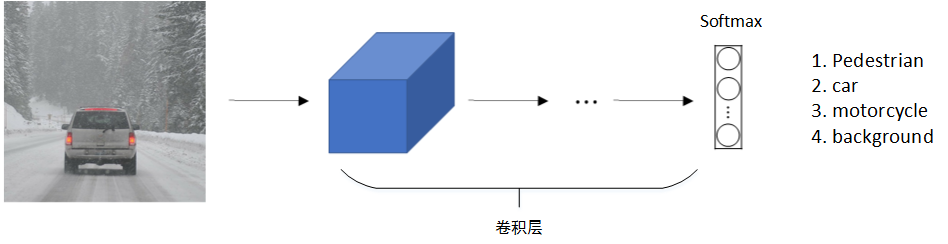
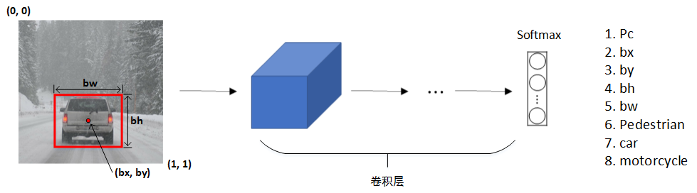
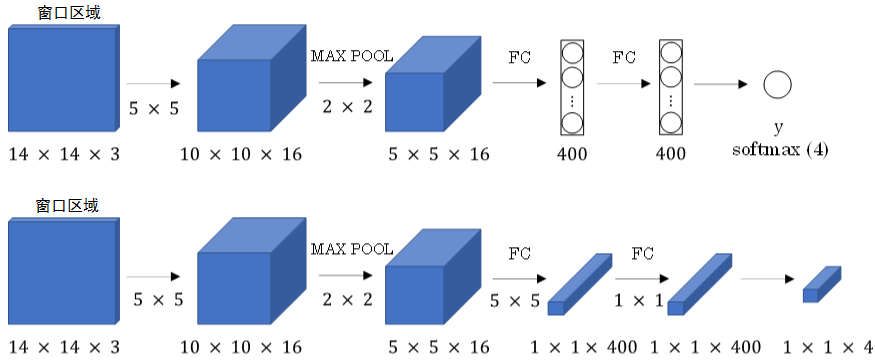
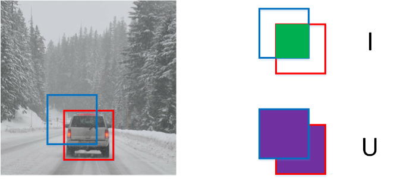
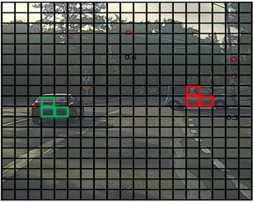

# 目标检测

## 目标定位

前两节课程中，我们介绍的是利用CNN模型进行图像分类。除此之外，本周课程将继续深入介绍目标定位和目标检测（包含多目标检测）。


标准的CNN分类模型我们已经很熟悉了，如下所示：



原始图片经过CONV卷积层后，Softmax层输出4 x 1向量，分别是：

$$
\left [  
\begin{matrix}
1 \\
0 \\
0 \\
0
\end{matrix}  
\right ]
\left [  
\begin{matrix}
0 \\
1 \\
0 \\
0
\end{matrix}  
\right ]
\left [  
\begin{matrix}
0 \\
0 \\
1 \\
0
\end{matrix}  
\right ]
\left [  
\begin{matrix}
0 \\
0 \\
0 \\
1
\end{matrix}  
\right ]
$$


注意，类别标签也可能是概率。上述四个向量分别对应行人，车辆，摩托车和背景四类。

对于目标定位和目标检测问题，其模型如下所示：



原始图片经过CONV卷积层后，Softmax层输出8 x 1向量。

### 向量含义：

上述一般CNN分类3 x 1向量（class label）

(bx, by)，表示目标中心位置坐标；

bh和bw，表示目标所在矩形区域的高和宽；

Pc，表示矩形区域是目标的概率，数值在0～1之间，且越大概率越大。

一般设定图片左上角为原点(0, 0)，右下角为(1, 1)。在模型训练时，bx、by、bh、bw都由人为确定其数值。

例如上图中，可得bx=0.5，by=0.7，bh=0.3，bw=0.4。

输出label可表示为：

$$
\left [  
\begin{matrix}
Pc \\
bx \\
by \\
bh \\
bw \\
c1 \\
c2 \\
c3
\end{matrix}  
\right ]
$$
即
$$
Pc=1:\left [  
\begin{matrix}
1 \\
bx \\
by \\
bh \\
bw \\
c1 \\
c2 \\
c3
\end{matrix}  
\right ]\ \ \ 
Pc:0=\left [  
\begin{matrix}
0 \\
? \\
? \\
? \\
? \\
? \\
? \\
?
\end{matrix}  
\right ]
$$


若Pc=0，表示没有检测到目标，则输出标签后面的7个参数都可以忽略。

### 损失函数

对于损失函数，若使用平方误差形式，有两种情况：

- Pc=1，即$y_1=1$

$$
L(\hat y,y)=(\hat y_1-y_1)^2+(\hat y_2-y_2)^2+\cdots+(\hat y_8-y_8)^2
$$

- Pc=0，即$y_1=0$【忽略后面所有参数】

$$
L(\hat y,y)=(\hat y_1-y_1)^2
$$

当然，除了使用平方误差之外，还可以**逻辑回归损失函数**，类标签$c_1,c_2,c_3$也可以通过softmax输出。比较而言，平方误差已经能够取得比较好的效果。

## 特征点检测

除了使用矩形区域检测目标类别和位置外，我们还可以仅对目标的**关键特征点坐标定位**，这些关键点被称为特征点(landmarks)。

例如人脸识别，可以对人脸部分特征点坐标进行定位检测，并标记出来，如下图所示：


该网络模型共检测人脸上64处特征点，加上是否为人脸的标志位，输出标签共有64x2+1=129个值。通过检测人脸特征点可以进行情绪分类与判断，或者应用于AR领域等等。

除了人脸特征点检测之外，还可以检测人体姿势动作，如下图所示：


## 目标检测

### 滑动窗口算法

目标检测的一种简单方法是**滑动窗口算法**。这种算法首先在训练样本集上搜集相应的各种目标图片和非目标图片。注意训练集图片尺寸较小，尽量仅包含相应目标，如下图所示：


然后，使用这些训练集构建CNN模型，使得模型有较高的识别率。

最后，在测试图片上，选择大小适宜的窗口、合适的步进长度，进行从左到右、从上倒下的滑动。每个窗口区域都送入之前构建好的CNN模型进行识别判断。若判断有目标，则此窗口即为目标区域；若判断没有目标，则此窗口为非目标区域。


#### 优势

滑动窗算法的优点是原理简单，且不需要人为选定目标区域（检测出目标的滑动窗即为目标区域）。

#### 缺点

但是其缺点也很明显，首先滑动窗的大小和步进长度都需要人为直观设定。滑动窗过小或过大，步进长度过大均会降低目标检测正确率。而且，每次滑动窗区域都要进行一次CNN网络计算，如果滑动窗和步进长度较小，整个目标检测的算法运行时间会很长。所以，滑动窗算法虽然简单，但是**性能不佳，不够快，不够灵活**。

### 卷积的滑动窗口实现

滑动窗算法可以使用卷积方式实现，以**提高运行速度，节约重复运算成本**。

首先，单个滑动窗口区域进入CNN网络模型时，包含全连接层。那么滑动窗口算法卷积实现的第一步就是将全连接层转变成为卷积层，如下图所示：



全连接层转变成卷积层的操作很简单，只需要使用与上层尺寸一致的滤波算子进行卷积运算即可。最终得到的输出层维度是1 x 1 x 4，代表4类输出值。

#### 过程演示

单个窗口区域卷积网络结构建立完毕之后，对于待检测图片，即可使用该**网络参数和结构**进行运算。例如16 x 16 x 3的图片，步进长度为2，CNN网络得到的输出层为2 x 2 x 4。其中，2 x 2表示共有4个窗口结果。对于更复杂的28 x 28 x3的图片，CNN网络得到的输出层为8 x 8 x 4，共64个窗口结果。


之前的滑动窗算法需要反复进行CNN正向计算，例如16 x 16 x 3的图片需进行4次，28 x 28 x3的图片需进行64次。

#### 结论

而利用卷积操作代替滑动窗算法，则不管原始图片有多大，只需要进行一次CNN正向计算，因为其中共享了很多重复计算部分，这大大节约了运算成本。值得一提的是，**窗口步进长度与选择的最大池化大小有关**。如果需要步进长度为4，只需设置最大池化的shape为4 x 4即可。

## Bounding Box预测

滑动窗口算法有时会出现滑动窗不能完全涵盖目标的问题，如下图蓝色窗口所示。


### YOLO算法简介

YOLO（You Only Look Once）算法可以解决这类问题，生成更加准确的目标区域（如上图红色窗口）。

#### 过程分析

YOLO算法首先将原始图片分割成n x n网格，每个网格代表一块区域。为简化说明，下图中将图片分成3 x 3网格。


然后，利用上一节卷积形式实现滑动窗口算法的思想，对该原始图片构建CNN网络，得到的的输出层维度为3 x 3 x 8。其中，3 x 3对应9个网格，每个网格的输出包含8个元素：

$$
y=\left [
\begin{matrix}
Pc \\
bx \\
by \\
bh \\
bw \\
c1 \\
c2 \\
c3
\end{matrix}
\right ]
$$
如果目标中心坐标$(b_x,b_y)$不在当前网格内，则当前网格Pc=0；相反，则当前网格Pc=1（即只看中心坐标是否在当前网格内）。判断有目标的网格中，$b_x,b_y,b_h,b_w$限定了目标区域。值得注意的是，当前网格左上角坐标设定为(0, 0)，右下角坐标设定为(1, 1)，$(b_x,b_y)$范围限定在[0,1]之间，但是$b_h,b_w$可以大于1。因为目标可能超出该网格，横跨多个区域，如上图所示。目标占几个网格没有关系，目标中心坐标必然在一个网格之内。

划分的网格可以更密一些。网格越小，则多个目标的中心坐标被划分到一个网格内的概率就越小，这恰恰是我们希望看到的。

### 交并比 (Intersection Over Union)

IoU，即交集与并集之比，可以用来评价目标检测区域的准确性。



如上图所示，红色方框为真实目标区域，蓝色方框为检测目标区域。两块区域的交集为绿色部分，并集为紫色部分。蓝色方框与红色方框的接近程度可以用IoU比值来定义：

$$
IoU=\frac IU
$$
IoU可以表示任意两块区域的接近程度。IoU值介于0～1之间，且越接近1表示两块区域越接近。

## 非极大值抑制

YOLO算法中，可能会出现多个网格都检测出到同一目标的情况，例如几个相邻网格都判断出同一目标的中心坐标在其内。



上图中，三个绿色网格和三个红色网格分别检测的都是同一目标。那如何判断哪个网格最为准确呢？方法是使用非最大值抑制算法。

**非极大值抑制**（Non-max Suppression）做法很简单，图示每个网格的Pc值可以求出，Pc值反映了该网格包含目标中心坐标的可信度。首先选取Pc最大值对应的网格和区域，然后计算该区域与所有其它区域的IoU，剔除掉IoU大于阈值（例如0.5）的所有网格及区域。这样就能保证同一目标只有一个网格与之对应，且该网格Pc最大，最可信。接着，再从剩下的网格中选取Pc最大的网格，重复上一步的操作。最后，就能使得每个目标都仅由一个网格和区域对应。如下图所示：


总结一下非最大值抑制算法的流程：

- **1. 剔除Pc值小于某阈值（例如0.6）的所有网格；**
- **2. 选取Pc值最大的网格，利用IoU，摒弃与该网格交叠较大的网格；**
- **3. 对剩下的网格，重复步骤2。**

## 锚箱(Anchor Boxes)

到目前为止，我们介绍的都是一个网格至多只能检测一个目标。那对于**多个目标重叠**的情况，例如一个人站在一辆车前面，该如何使用YOLO算法进行检测呢？方法是使用不同形状的锚箱。

如下图所示，同一网格出现了两个目标：人和车。为了同时检测两个目标，我们可以设置两个锚箱，锚箱1检测人，锚箱2检测车。也就是说，每个网格多加了一层输出。原来的输出维度是 3 x 3 x 8，现在是3 x 3 x 2 x 8（也可以写成3 x 3 x 16的形式）。这里的2表示有两个锚箱，用来在一个网格中同时检测多个目标。每个锚箱都有一个Pc值，若两个Pc值均大于某阈值，则检测到了两个目标。


$$
y=\left [
\begin{matrix}
Pc \\
bx \\
by \\
bh \\
bw \\
c1 \\
c2 \\
c3 \\
Pc \\
bx \\
by \\
bh \\
bw \\
c1 \\
c2 \\
c3
\end{matrix}
\right ]
$$


在使用YOLO算法时，只需对每个锚箱使用上一节的非极大值抑制即可。锚箱之间并行实现。

顺便提一下，锚箱形状的选择可以通过**人为选取**，也可以使用**其他机器学习算法**，例如k聚类算法对待检测的所有目标进行**形状分类**，选择主要形状作为锚箱。

## YOLO算法

这一节主要介绍YOLO算法的流程，算是对前几节内容的回顾。网络结构如下图所示，包含了两个锚箱。

- **1. 对于调用每个网格，得到2个预测的边界框**
- **2. 避免低概率的预测**
- **3. 对于每个类(行人、汽车、摩托车)使用非极大抑制来生成最终的预测**


## RPN网络

### 候选区域（Region Proposals）

之前介绍的滑动窗算法会对原始图片的每个区域都进行扫描，即使是**一些空白的或明显没有目标的区域**，这样会降低算法运行效率，耗费时间。

例如下图所示。


为了解决这一问题，尽量避免对无用区域的扫描，可以使用**候选区域**的方法。具体做法是先对原始图片**进行分割算法处理**，然后支队分割后的图片中的**块**进行目标检测。


候选区域共有三种方法：

- **R-CNN: 滑动窗的形式，一次只对单个区域块进行目标检测，运算速度慢。**
- **Fast R-CNN: 利用卷积实现滑动窗算法，类似第4节做法。**
- **Faster R-CNN: 利用卷积对图片进行分割，进一步提高运行速度。**

比较而言，Faster R-CNN的运行速度还是比YOLO慢一些。


# 自主驾驶 - 汽车检测

## 参考论文：

YOLO的两篇论文: Redmon et al., 2016 (https://arxiv.org/abs/1506.02640) and Redmon and Farhadi, 2016 (https://arxiv.org/abs/1612.08242).

## 学习目标

- 在一个汽车检测数据集上使用对象检测
- 处理边界框

## 导包

```python
import argparse
import os
import matplotlib.pyplot as plt
from matplotlib.pyplot import imshow
import scipy.io
import scipy.misc
import numpy as np
import pandas as pd
import PIL
import tensorflow as tf
from keras import backend as K
from keras.layers import Input, Lambda, Conv2D
from keras.models import load_model, Model
from yolo_utils import read_classes, read_anchors, generate_colors, preprocess_image, draw_boxes, scale_boxes
from yad2k.models.keras_yolo import yolo_head, yolo_boxes_to_corners, preprocess_true_boxes, yolo_loss, yolo_body

%matplotlib inline
Using TensorFlow backend.
```

## 问题描述

你正在开一辆自驾车。作为这个项目的重要组成部分，您首先要建立一个汽车检测系统。为了收集数据，你已经把摄像头安装在汽车的引擎盖上（意思是前面），在驾驶时每隔几秒就会拍摄前方的道路。

您已经将所有这些图像收集到一个文件夹中，并在您能找到的每辆车周围绘制了边界框来标记它们。

### 定义一个框

如果你需要YOLO识别的类别有80个, 您可以用一个1到80的整数来表示类别标签$c$， 或者用一个80维的向量 (有80个数字)，其中一个是1，其余的是0。

本次练习，你将学习如何使用YOLO，并将其应用于汽车检测。由于YOLO模型在训练时计算起来非常昂贵，我们将加载预先训练好的权重供您使用。

## YOLO

YOLO ("you only look once") 是一个非常流行的算法，因为它的精确率非常高，同时也能实时运行. 这个算法对图像只需处理一次，它只需要一个前向传播就能进行预测。在非极大值抑制后, 它将边界框与识别的对象一起输出。

PS: 非极大值抑制指只需要输出概率最大的分类结果，抑制那些很接近但不是最大的其他预测结果

### 模型细节

首先需要知道的事情是：

- **输入**是一批图片【shape=(m, 608, 608, 3)】
- **输出**是一个边框列表以及已识别的类。 每个边界框用6个数字表示 $(p_c, b_x, b_y, b_h, b_w, c)$。 如果将$c$展开为一个80维向量，那么每个边界框将由85个数字表示。

我们会使用 5 个锚箱anchor boxes。 YOLO 结构如下： 图像 (m, 608, 608, 3) -> 深度 CNN -> 编码ENCODING(m, 19, 19, 5, 85).

现在让我们仔细看看这个 ENCODING 代表什么。

如果一个对象的中心/中点落入一个网格单元中，那么该网格单元负责检测该对象。

由于我们使用了5个 anchor boxes，所以19x19单元中的每一个都编码了5个框的信息. 锚箱仅由其宽度和高度定义。

为了简单起见, 我们将 shape为(19, 19, 5, 85) encoding 的最后两个维度展平. 所以 Deep CNN 的输出是 (19, 19, 425).

现在，对于每个单元格中的每个box，我们进行下面的计算，提取每个box包含某个类别的概率。

下面是一种可视化YOLO图像预测内容的方法：

- 对于每个19x19的网格单元格，找出概率分数的最大值(在5个anchor boxes和不同的类中取最大值)。
- 根据网格单元格认为最可能的对象给该网格单元格着色。

请注意，这种可视化方法并不是YOLO算法本身进行预测的精髓所在; 它只是一个很好的可视化算法中间结果的方法。

另一种可视化YOLO输出的方法是绘制它输出的边界框。

上图中，我们仅仅只绘制了被模型赋予了高概率性的 boxes ，但 boxes 仍然有很多。如果你想对算法的输出进行过滤以减少被检测到的物体的数量，你需要使用“非极大值抑制”。具体来说，您将执行下面的这些步骤：

- 去掉得分较低的box【概率小】
- 当几个boxes相互重叠并且检测到的是相同的对象时，只选择一个boxes。

### 使用类分数的阈值进行过滤

你可以用阈值作为你的第一个过滤器，用它去除那些类别得分低于你指定阈值的边界框（box）。

该模型提供了总共19x19x5x85个数字，每个方框用85个数字描述。它会方便重新排列(19,19,85)(或(19,19,425))维张量为以下变量:

- `box_confidence`: 形状为 $(19 \times 19, 5, 1)$ 的张量，为每个19x19单元格中预测的5个盒子中的每个盒子包含的$p_c$(存在某个对象的概率)。
- `boxes`: 形状为 $(19 \times 19, 5, 4)$的张量，包含了每个单元格五个box中每个box的定位信息$(b_x, b_y, b_h, b_w)$
- `box_class_probs`: 形状为 $(19 \times 19, 5, 80)$ 的张量（tensor），包含了每个单元格每个box对每个类别（ $(c_1, c_2, ... c_{80})$）的检测概率。

```python
# GRADED FUNCTION: yolo_filter_boxes

def yolo_filter_boxes(box_confidence, boxes, box_class_probs, threshold = .6):
    """Filters YOLO boxes by thresholding on object and class confidence.
    
    Arguments:
    box_confidence -- tensor of shape (19, 19, 5, 1)
    boxes -- tensor of shape (19, 19, 5, 4)
    box_class_probs -- tensor of shape (19, 19, 5, 80)
    threshold -- real value, if [ highest class probability score < threshold], then get rid of the corresponding box
    
    Returns:
    scores -- tensor of shape (None,), containing the class probability score for selected boxes
    boxes -- tensor of shape (None, 4), containing (b_x, b_y, b_h, b_w) coordinates of selected boxes
    classes -- tensor of shape (None,), containing the index of the class detected by the selected boxes
    
    Note: "None" is here because you don't know the exact number of selected boxes, as it depends on the threshold. 
    For example, the actual output size of scores would be (10,) if there are 10 boxes.
    """
    
    # 步骤 1: 计算 box 分数
    ### START CODE HERE ### (≈ 1 line)
    box_scores = box_confidence * box_class_probs
    ### END CODE HERE ###
    
    # 步骤 2: 根据最大的box_scores寻找box_classes，并追踪相应的分数
    ### START CODE HERE ### (≈ 2 lines)
    box_classes = K.argmax(box_scores, axis=-1)
    box_class_scores = K.max(box_scores, axis=-1, keepdims=False)
    ### END CODE HERE ###
    
    # 步骤 3: 使用“threshold”创建一个基于“box_class_scores”的过滤mask。
    #mask应该有和 box_class_scores相同的维度，对于你想要保留的盒子值为True的(概率 >= threshold(阈值))
    ### START CODE HERE ### (≈ 1 line)
    filtering_mask = box_class_scores >= threshold
    ### END CODE HERE ###
    
    # Step 4: 将mask应用到 scores, boxes 和 classes 上
    ### START CODE HERE ### (≈ 3 lines)
    scores = tf.boolean_mask(box_class_scores, filtering_mask)
    boxes = tf.boolean_mask(boxes, filtering_mask)
    classes = tf.boolean_mask(box_classes, filtering_mask)
    ### END CODE HERE ###
    
    return scores, boxes, classes
```

#### 测试

```python
with tf.Session() as test_a:
    box_confidence = tf.random_normal([19, 19, 5, 1], mean=1, stddev=4, seed = 1)
    boxes = tf.random_normal([19, 19, 5, 4], mean=1, stddev=4, seed = 1)
    box_class_probs = tf.random_normal([19, 19, 5, 80], mean=1, stddev=4, seed = 1)
    scores, boxes, classes = yolo_filter_boxes(box_confidence, boxes, box_class_probs, threshold = 0.5)
    print("scores[2] = " + str(scores[2].eval()))
    print("boxes[2] = " + str(boxes[2].eval()))
    print("classes[2] = " + str(classes[2].eval()))
    print("scores.shape = " + str(scores.shape))
    print("boxes.shape = " + str(boxes.shape))
    print("classes.shape = " + str(classes.shape))
```

#### 结果

```
scores[2] = 10.750582
boxes[2] = [ 8.426533   3.2713668 -0.5313436 -4.9413733]
classes[2] = 7
scores.shape = (?,)
boxes.shape = (?, 4)
classes.shape = (?,)
```


### 非极大值抑制

尽管在类别得分上你用阈值进行了筛选，你仍然会得到很多重叠的框. 为了选择出正确的 box， 你可以运用的第二个过滤器叫 非极大抑制（non-maximum suppression，简称NMS)。

非极大值抑制指只需要输出概率最大的分类结果，抑制那些很接近但不是最大的其他预测结果。

在这个例子中，模型已经预测了3辆车，但实际上是同一辆车的3个预测。通过非最大抑制你可以选择3个box中最准确（可能性最高）的那个

非极大值抑制使用了一个非常重要的功能，称为**"Intersection over Union"**（交并比，交集和并集的比例），简称IoU. 

#### IoU

```python
# GRADED FUNCTION: iou

def iou(box1, box2):
    """Implement the intersection over union (IoU) between box1 and box2
    
    Arguments:
    box1 -- first box, list object with coordinates (x1, y1, x2, y2)
    box2 -- second box, list object with coordinates (x1, y1, x2, y2)
    """

    # 计算box1和box2的交点的(y1, x1, y2, x2)坐标。计算它的面积。【计算交面积】
    ### START CODE HERE ### (≈ 5 lines)
    xi1 = max(box1[0], box2[0])
    yi1 = max(box1[1], box2[1])
    xi2 = min(box1[2], box2[2])
    yi2 = min(box1[3], box2[3])
    inter_area = (yi2 - yi1) * (xi2 - xi1)
    ### END CODE HERE ###    

    # 通过以下公式计算并区域: Union(A,B) = A + B - Inter(A,B)
    ### START CODE HERE ### (≈ 3 lines)
    box1_area = (box1[3] - box1[1]) * (box1[2] - box1[0])
    box2_area = (box2[3] - box2[1]) * (box2[2] - box2[0])
    union_area = box1_area + box2_area - inter_area
    ### END CODE HERE ###
    
    # 计算 IoU
    ### START CODE HERE ### (≈ 1 line)
    iou = inter_area / union_area
    ### END CODE HERE ###

    return iou
```

##### 测试

```
box1 = (2, 1, 4, 3)
box2 = (1, 2, 3, 4) 
print("iou = " + str(iou(box1, box2)))
```

##### 结果

```
iou = 0.14285714285714285
```

#### 非极大值抑制

现在开始实现非极大值抑制。关键步骤是：

1. 选择概率 $p_c $最高的的边界框
2. 计算这个边界框与其他所有框的 IoU，然后移除掉大于 `iou_threshold` 的边界框.
3. 返回到步骤1并迭代，直到没有比当前所选框分数更低的框

这将删除所有与所选框重叠很大的框，只剩下“最好”的框。

```python
# GRADED FUNCTION: yolo_non_max_suppression

def yolo_non_max_suppression(scores, boxes, classes, max_boxes = 10, iou_threshold = 0.5):
    """
    Applies Non-max suppression (NMS) to set of boxes
    
    Arguments:
    scores -- tensor of shape (None,), output of yolo_filter_boxes()
    boxes -- tensor of shape (None, 4), output of yolo_filter_boxes() that have been scaled to the image size (see later)
    classes -- tensor of shape (None,), output of yolo_filter_boxes()
    max_boxes -- integer, maximum number of predicted boxes you'd like
    iou_threshold -- real value, "intersection over union" threshold used for NMS filtering
    
    Returns:
    scores -- tensor of shape (, None), predicted score for each box
    boxes -- tensor of shape (4, None), predicted box coordinates
    classes -- tensor of shape (, None), predicted class for each box
    
    Note: The "None" dimension of the output tensors has obviously to be less than max_boxes. Note also that this
    function will transpose the shapes of scores, boxes, classes. This is made for convenience.
    """
    
    max_boxes_tensor = K.variable(max_boxes, dtype='int32')     # 准备张量
    K.get_session().run(tf.variables_initializer([max_boxes_tensor])) # 初始化max_boxes_tensor
    
    #使用tf.image.non_max_suppression()获取与保留的方框对应的索引列表
    ### START CODE HERE ### (≈ 1 line)
    nms_indices = tf.image.non_max_suppression(boxes, scores, max_boxes, iou_threshold)
    ### END CODE HERE ###
    
    # 使用K.gather()只从分数、框和类中选择nms_indices
    ### START CODE HERE ### (≈ 3 lines)
    scores = K.gather(scores, nms_indices)
    boxes = K.gather(boxes, nms_indices)
    classes = K.gather(classes, nms_indices)
    ### END CODE HERE ###
    
    return scores, boxes, classes
```

##### 测试

```python
with tf.Session() as test_b:
    scores = tf.random_normal([54,], mean=1, stddev=4, seed = 1)
    boxes = tf.random_normal([54, 4], mean=1, stddev=4, seed = 1)
    classes = tf.random_normal([54,], mean=1, stddev=4, seed = 1)
    scores, boxes, classes = yolo_non_max_suppression(scores, boxes, classes)
    print("scores[2] = " + str(scores[2].eval()))
    print("boxes[2] = " + str(boxes[2].eval()))
    print("classes[2] = " + str(classes[2].eval()))
    print("scores.shape = " + str(scores.eval().shape))
    print("boxes.shape = " + str(boxes.eval().shape))
    print("classes.shape = " + str(classes.eval().shape))
```

##### 结果

```
scores[2] = 6.938395
boxes[2] = [-5.299932    3.1379814   4.450367    0.95942086]
classes[2] = -2.2452729
scores.shape = (10,)
boxes.shape = (10, 4)
classes.shape = (10,)
```

### 整合滤波

是时候整合你之前实现的功能，获取深度卷积网络(19x19x5x85)的输出并过滤所有的边界框。

```python
# GRADED FUNCTION: yolo_eval

def yolo_eval(yolo_outputs, image_shape = (720., 1280.), max_boxes=10, score_threshold=.6, iou_threshold=.5):
    """
    Converts the output of YOLO encoding (a lot of boxes) to your predicted boxes along with their scores, box coordinates and classes.
    
    Arguments:
    yolo_outputs -- output of the encoding model (for image_shape of (608, 608, 3)), contains 4 tensors:
                    box_confidence: tensor of shape (None, 19, 19, 5, 1)
                    box_xy: tensor of shape (None, 19, 19, 5, 2)
                    box_wh: tensor of shape (None, 19, 19, 5, 2)
                    box_class_probs: tensor of shape (None, 19, 19, 5, 80)
    image_shape -- tensor of shape (2,) containing the input shape, in this notebook we use (608., 608.) (has to be float32 dtype)
    max_boxes -- integer, maximum number of predicted boxes you'd like
    score_threshold -- real value, if [ highest class probability score < threshold], then get rid of the corresponding box
    iou_threshold -- real value, "intersection over union" threshold used for NMS filtering
    
    Returns:
    scores -- tensor of shape (None, ), predicted score for each box
    boxes -- tensor of shape (None, 4), predicted box coordinates
    classes -- tensor of shape (None,), predicted class for each box
    """
    
    ### START CODE HERE ### 
    
    # 检索YOLO模型的输出 (≈1 line)
    box_confidence, box_xy, box_wh, box_class_probs = yolo_outputs

    # 转换box，以准备过滤功能
    boxes = yolo_boxes_to_corners(box_xy, box_wh)

    # 执行带有score_threshold阈值的分数的过滤 (≈1 line)
    scores, boxes, classes = yolo_filter_boxes(box_confidence, boxes, box_class_probs, score_threshold)
    
    # 将盒子缩放到原始图像形状。
    boxes = scale_boxes(boxes, image_shape)

    # 执行阈值为iou_threshold的非极大抑制 (≈1 line)
    scores, boxes, classes = yolo_non_max_suppression(scores, boxes, classes, max_boxes, iou_threshold)
    
    ### END CODE HERE ###
    
    return scores, boxes, classes
```

#### 测试

```python
with tf.Session() as test_b:
    yolo_outputs = (tf.random_normal([19, 19, 5, 1], mean=1, stddev=4, seed = 1),
                    tf.random_normal([19, 19, 5, 2], mean=1, stddev=4, seed = 1),
                    tf.random_normal([19, 19, 5, 2], mean=1, stddev=4, seed = 1),
                    tf.random_normal([19, 19, 5, 80], mean=1, stddev=4, seed = 1))
    scores, boxes, classes = yolo_eval(yolo_outputs)
    print("scores[2] = " + str(scores[2].eval()))
    print("boxes[2] = " + str(boxes[2].eval()))
    print("classes[2] = " + str(classes[2].eval()))
    print("scores.shape = " + str(scores.eval().shape))
    print("boxes.shape = " + str(boxes.eval().shape))
    print("classes.shape = " + str(classes.eval().shape))
```

#### 结果

```
scores[2] = 138.79124
boxes[2] = [1292.3297  -278.52167 3876.9893  -835.56494]
classes[2] = 54
scores.shape = (10,)
boxes.shape = (10, 4)
classes.shape = (10,)
```

### YOLO总结

- 输入图像shape（608,608,3）
-  图像经过CNN，输出shape（19,19,5,85）。
- 将最后两个维度数据拉平，形状变为shape（19,19,425）：
-  在输入图像上的19x19网格中的每个单元格给出425个数字。
- 425 = 5 x 85 因为每个单元格包含5个框的预测，对应5个锚箱。
- 85 = 5 + 80 其中5是因为$(p_c,b_x,b_y,b_h,b_w)$有5个数字，80是我们想要检测的类的数量
- 用以下的过滤器过滤，得到最终的边界框：
	- Score-thresholding: 丢弃掉类别检测分数低于阈值的边界框
	- Non-max suppression: 计算交并比，避免选择重叠的边界框
- 输出

## 对YOLO预训练模型进行图像测试

在这一部分，你将使用一个预先训练好的模型，并在汽车检测数据集上测试它。像往常一样，你首先要**创建一个会话**。

```
sess = K.get_session()
```

### 读取数据

回想一下，我们试图检测80个类，并使用 5 个anchor boxes。我们已经收集了80个类别和5个边界框的信息，并把它存储在两个文件"coco_classes.txt" 和 "yolo_anchors.txt" 中。让我们运行下面的单元格去加载这些数据。

汽车检测数据集有720x1280张图像，我们已经将其预处理为608x608张图像。

```python
class_names = read_classes("model_data/coco_classes.txt")
anchors = read_anchors("model_data/yolo_anchors.txt")
image_shape = (720., 1280.)    
```

### 加载预先训练好的模型

训练一个YOLO模型需要很长时间，并且需要一个相当大的已经标好边界框的数据集去处理大量的目标类。您将加载存储在“yolo.h5”中的现有预训练好的 Keras YOLO 模型 (这些权重来自YOLO的官方网站，并使用由Allan Zelener编写的函数进行转换，参考文献在本笔记的末尾)。运行下面的单元格加载模型。

```
yolo_model = load_model("model_data/yolo.h5")
```

This loads the weights of a trained YOLO model. 以下是模型各个图层的摘要。

#### 测试

```python
yolo_model.summary()
```

#### 结果

```
____________________________________________________________________________________________________
Layer (type)                     Output Shape          Param #     Connected to                     
====================================================================================================
input_1 (InputLayer)             (None, 608, 608, 3)   0                                            
____________________________________________________________________________________________________
conv2d_1 (Conv2D)                (None, 608, 608, 32)  864         input_1[0][0]                    
____________________________________________________________________________________________________
batch_normalization_1 (BatchNorm (None, 608, 608, 32)  128         conv2d_1[0][0]                   
____________________________________________________________________________________________________
leaky_re_lu_1 (LeakyReLU)        (None, 608, 608, 32)  0           batch_normalization_1[0][0]      
____________________________________________________________________________________________________
max_pooling2d_1 (MaxPooling2D)   (None, 304, 304, 32)  0           leaky_re_lu_1[0][0]              
____________________________________________________________________________________________________
conv2d_2 (Conv2D)                (None, 304, 304, 64)  18432       max_pooling2d_1[0][0]            
____________________________________________________________________________________________________
batch_normalization_2 (BatchNorm (None, 304, 304, 64)  256         conv2d_2[0][0]                   
____________________________________________________________________________________________________
leaky_re_lu_2 (LeakyReLU)        (None, 304, 304, 64)  0           batch_normalization_2[0][0]      
____________________________________________________________________________________________________
max_pooling2d_2 (MaxPooling2D)   (None, 152, 152, 64)  0           leaky_re_lu_2[0][0]              
____________________________________________________________________________________________________
conv2d_3 (Conv2D)                (None, 152, 152, 128) 73728       max_pooling2d_2[0][0]            
____________________________________________________________________________________________________
batch_normalization_3 (BatchNorm (None, 152, 152, 128) 512         conv2d_3[0][0]                   
____________________________________________________________________________________________________
leaky_re_lu_3 (LeakyReLU)        (None, 152, 152, 128) 0           batch_normalization_3[0][0]      
____________________________________________________________________________________________________
conv2d_4 (Conv2D)                (None, 152, 152, 64)  8192        leaky_re_lu_3[0][0]              
____________________________________________________________________________________________________
batch_normalization_4 (BatchNorm (None, 152, 152, 64)  256         conv2d_4[0][0]                   
____________________________________________________________________________________________________
leaky_re_lu_4 (LeakyReLU)        (None, 152, 152, 64)  0           batch_normalization_4[0][0]      
____________________________________________________________________________________________________
conv2d_5 (Conv2D)                (None, 152, 152, 128) 73728       leaky_re_lu_4[0][0]              
____________________________________________________________________________________________________
batch_normalization_5 (BatchNorm (None, 152, 152, 128) 512         conv2d_5[0][0]                   
____________________________________________________________________________________________________
leaky_re_lu_5 (LeakyReLU)        (None, 152, 152, 128) 0           batch_normalization_5[0][0]      
____________________________________________________________________________________________________
max_pooling2d_3 (MaxPooling2D)   (None, 76, 76, 128)   0           leaky_re_lu_5[0][0]              
____________________________________________________________________________________________________
conv2d_6 (Conv2D)                (None, 76, 76, 256)   294912      max_pooling2d_3[0][0]            
____________________________________________________________________________________________________
batch_normalization_6 (BatchNorm (None, 76, 76, 256)   1024        conv2d_6[0][0]                   
____________________________________________________________________________________________________
leaky_re_lu_6 (LeakyReLU)        (None, 76, 76, 256)   0           batch_normalization_6[0][0]      
____________________________________________________________________________________________________
conv2d_7 (Conv2D)                (None, 76, 76, 128)   32768       leaky_re_lu_6[0][0]              
____________________________________________________________________________________________________
batch_normalization_7 (BatchNorm (None, 76, 76, 128)   512         conv2d_7[0][0]                   
____________________________________________________________________________________________________
leaky_re_lu_7 (LeakyReLU)        (None, 76, 76, 128)   0           batch_normalization_7[0][0]      
____________________________________________________________________________________________________
conv2d_8 (Conv2D)                (None, 76, 76, 256)   294912      leaky_re_lu_7[0][0]              
____________________________________________________________________________________________________
batch_normalization_8 (BatchNorm (None, 76, 76, 256)   1024        conv2d_8[0][0]                   
____________________________________________________________________________________________________
leaky_re_lu_8 (LeakyReLU)        (None, 76, 76, 256)   0           batch_normalization_8[0][0]      
____________________________________________________________________________________________________
max_pooling2d_4 (MaxPooling2D)   (None, 38, 38, 256)   0           leaky_re_lu_8[0][0]              
____________________________________________________________________________________________________
conv2d_9 (Conv2D)                (None, 38, 38, 512)   1179648     max_pooling2d_4[0][0]            
____________________________________________________________________________________________________
batch_normalization_9 (BatchNorm (None, 38, 38, 512)   2048        conv2d_9[0][0]                   
____________________________________________________________________________________________________
leaky_re_lu_9 (LeakyReLU)        (None, 38, 38, 512)   0           batch_normalization_9[0][0]      
____________________________________________________________________________________________________
conv2d_10 (Conv2D)               (None, 38, 38, 256)   131072      leaky_re_lu_9[0][0]              
____________________________________________________________________________________________________
batch_normalization_10 (BatchNor (None, 38, 38, 256)   1024        conv2d_10[0][0]                  
____________________________________________________________________________________________________
leaky_re_lu_10 (LeakyReLU)       (None, 38, 38, 256)   0           batch_normalization_10[0][0]     
____________________________________________________________________________________________________
conv2d_11 (Conv2D)               (None, 38, 38, 512)   1179648     leaky_re_lu_10[0][0]             
____________________________________________________________________________________________________
batch_normalization_11 (BatchNor (None, 38, 38, 512)   2048        conv2d_11[0][0]                  
____________________________________________________________________________________________________
leaky_re_lu_11 (LeakyReLU)       (None, 38, 38, 512)   0           batch_normalization_11[0][0]     
____________________________________________________________________________________________________
conv2d_12 (Conv2D)               (None, 38, 38, 256)   131072      leaky_re_lu_11[0][0]             
____________________________________________________________________________________________________
batch_normalization_12 (BatchNor (None, 38, 38, 256)   1024        conv2d_12[0][0]                  
____________________________________________________________________________________________________
leaky_re_lu_12 (LeakyReLU)       (None, 38, 38, 256)   0           batch_normalization_12[0][0]     
____________________________________________________________________________________________________
conv2d_13 (Conv2D)               (None, 38, 38, 512)   1179648     leaky_re_lu_12[0][0]             
____________________________________________________________________________________________________
batch_normalization_13 (BatchNor (None, 38, 38, 512)   2048        conv2d_13[0][0]                  
____________________________________________________________________________________________________
leaky_re_lu_13 (LeakyReLU)       (None, 38, 38, 512)   0           batch_normalization_13[0][0]     
____________________________________________________________________________________________________
max_pooling2d_5 (MaxPooling2D)   (None, 19, 19, 512)   0           leaky_re_lu_13[0][0]             
____________________________________________________________________________________________________
conv2d_14 (Conv2D)               (None, 19, 19, 1024)  4718592     max_pooling2d_5[0][0]            
____________________________________________________________________________________________________
batch_normalization_14 (BatchNor (None, 19, 19, 1024)  4096        conv2d_14[0][0]                  
____________________________________________________________________________________________________
leaky_re_lu_14 (LeakyReLU)       (None, 19, 19, 1024)  0           batch_normalization_14[0][0]     
____________________________________________________________________________________________________
conv2d_15 (Conv2D)               (None, 19, 19, 512)   524288      leaky_re_lu_14[0][0]             
____________________________________________________________________________________________________
batch_normalization_15 (BatchNor (None, 19, 19, 512)   2048        conv2d_15[0][0]                  
____________________________________________________________________________________________________
leaky_re_lu_15 (LeakyReLU)       (None, 19, 19, 512)   0           batch_normalization_15[0][0]     
____________________________________________________________________________________________________
conv2d_16 (Conv2D)               (None, 19, 19, 1024)  4718592     leaky_re_lu_15[0][0]             
____________________________________________________________________________________________________
batch_normalization_16 (BatchNor (None, 19, 19, 1024)  4096        conv2d_16[0][0]                  
____________________________________________________________________________________________________
leaky_re_lu_16 (LeakyReLU)       (None, 19, 19, 1024)  0           batch_normalization_16[0][0]     
____________________________________________________________________________________________________
conv2d_17 (Conv2D)               (None, 19, 19, 512)   524288      leaky_re_lu_16[0][0]             
____________________________________________________________________________________________________
batch_normalization_17 (BatchNor (None, 19, 19, 512)   2048        conv2d_17[0][0]                  
____________________________________________________________________________________________________
leaky_re_lu_17 (LeakyReLU)       (None, 19, 19, 512)   0           batch_normalization_17[0][0]     
____________________________________________________________________________________________________
conv2d_18 (Conv2D)               (None, 19, 19, 1024)  4718592     leaky_re_lu_17[0][0]             
____________________________________________________________________________________________________
batch_normalization_18 (BatchNor (None, 19, 19, 1024)  4096        conv2d_18[0][0]                  
____________________________________________________________________________________________________
leaky_re_lu_18 (LeakyReLU)       (None, 19, 19, 1024)  0           batch_normalization_18[0][0]     
____________________________________________________________________________________________________
conv2d_19 (Conv2D)               (None, 19, 19, 1024)  9437184     leaky_re_lu_18[0][0]             
____________________________________________________________________________________________________
batch_normalization_19 (BatchNor (None, 19, 19, 1024)  4096        conv2d_19[0][0]                  
____________________________________________________________________________________________________
conv2d_21 (Conv2D)               (None, 38, 38, 64)    32768       leaky_re_lu_13[0][0]             
____________________________________________________________________________________________________
leaky_re_lu_19 (LeakyReLU)       (None, 19, 19, 1024)  0           batch_normalization_19[0][0]     
____________________________________________________________________________________________________
batch_normalization_21 (BatchNor (None, 38, 38, 64)    256         conv2d_21[0][0]                  
____________________________________________________________________________________________________
conv2d_20 (Conv2D)               (None, 19, 19, 1024)  9437184     leaky_re_lu_19[0][0]             
____________________________________________________________________________________________________
leaky_re_lu_21 (LeakyReLU)       (None, 38, 38, 64)    0           batch_normalization_21[0][0]     
____________________________________________________________________________________________________
batch_normalization_20 (BatchNor (None, 19, 19, 1024)  4096        conv2d_20[0][0]                  
____________________________________________________________________________________________________
space_to_depth_x2 (Lambda)       (None, 19, 19, 256)   0           leaky_re_lu_21[0][0]             
____________________________________________________________________________________________________
leaky_re_lu_20 (LeakyReLU)       (None, 19, 19, 1024)  0           batch_normalization_20[0][0]     
____________________________________________________________________________________________________
concatenate_1 (Concatenate)      (None, 19, 19, 1280)  0           space_to_depth_x2[0][0]          
                                                                   leaky_re_lu_20[0][0]             
____________________________________________________________________________________________________
conv2d_22 (Conv2D)               (None, 19, 19, 1024)  11796480    concatenate_1[0][0]              
____________________________________________________________________________________________________
batch_normalization_22 (BatchNor (None, 19, 19, 1024)  4096        conv2d_22[0][0]                  
____________________________________________________________________________________________________
leaky_re_lu_22 (LeakyReLU)       (None, 19, 19, 1024)  0           batch_normalization_22[0][0]     
____________________________________________________________________________________________________
conv2d_23 (Conv2D)               (None, 19, 19, 425)   435625      leaky_re_lu_22[0][0]             
====================================================================================================
Total params: 50,983,561
Trainable params: 50,962,889
Non-trainable params: 20,672
____________________________________________________________________________________________________
```

### 将模型的输出转换为可使用的边界框张量

模型`yolo_model`输出的是一个形状为 (m, 19, 19, 5, 85) 的张量。 它需要做一些特殊的处理与转换。

```python
yolo_outputs = yolo_head(yolo_model.output, anchors, len(class_names))
```

你将 yolo_outputs 添加到你的计算图。这个4张量的集合已经可以作为你 yolo_eval 函数的输入了。

### 过滤

` yolo_outputs `以正确的格式为您提供了` yolo_model `的所有预测框。现在可以执行筛选并只选择最佳框了。现在让我们调用` yolo_eval `来完成此操作。

```python
scores, boxes, classes = yolo_eval(yolo_outputs, image_shape)
```

### 在图像上运行计算图

你已经创建了一个（sess）计算图，它可以总结如下Y

1. yolo_model。输入被提供给`yolo_model`。模型用于计算输出yolo_model.output
2. yolo_model。输出由` yolo_head `处理，会输出给你yolo_outputs
3. yolo_outputs经过一个过滤函数` yolo_eval `。它输出您的预测:分数、框、类

```python
def predict(sess, image_file):
    """
    Runs the graph stored in "sess" to predict boxes for "image_file". Prints and plots the preditions.
    
    Arguments:
    sess -- your tensorflow/Keras session containing the YOLO graph
    image_file -- name of an image stored in the "images" folder.
    
    Returns:
    out_scores -- tensor of shape (None, ), scores of the predicted boxes
    out_boxes -- tensor of shape (None, 4), coordinates of the predicted boxes
    out_classes -- tensor of shape (None, ), class index of the predicted boxes
    
    Note: "None" actually represents the number of predicted boxes, it varies between 0 and max_boxes. 
    """

    # 预处理图像
    image, image_data = preprocess_image("images/" + image_file, model_image_size = (608, 608))

    # 使用正确的张量运行session，并在feed_dict中选择正确的占位符。
    # 你需要使用 feed_dict={yolo_model.input: ... , K.learning_phase(): 0})
    ### START CODE HERE ### (≈ 1 line)
    out_scores, out_boxes, out_classes = sess.run([scores, boxes, classes],feed_dict={yolo_model.input: image_data,K.learning_phase(): 0})
    ### END CODE HERE ###

    # 打印预测信息
    print('Found {} boxes for {}'.format(len(out_boxes), image_file))
    # 为绘制边框生成颜色。
    colors = generate_colors(class_names)
    # 在图像文件上绘制边框
    draw_boxes(image, out_scores, out_boxes, out_classes, class_names, colors)
    # 保存图像上预测的边框
    image.save(os.path.join("out", image_file), quality=90)
    # 显示结果
    output_image = scipy.misc.imread(os.path.join("out", image_file))
    imshow(output_image)
    
    return out_scores, out_boxes, out_classes
```

#### 测试

在“test.jpg”图像上运行以下单元格，以验证函数是否正确。

```python
out_scores, out_boxes, out_classes = predict(sess, "test.jpg")
```

#### 结果

```
Found 7 boxes for test.jpg
car 0.60 (925, 285) (1045, 374)
car 0.66 (706, 279) (786, 350)
bus 0.67 (5, 266) (220, 407)
car 0.70 (947, 324) (1280, 705)
car 0.74 (159, 303) (346, 440)
car 0.80 (761, 282) (942, 412)
car 0.89 (367, 300) (745, 648)
```


**Expected Output**:

| **Found 7 boxes for test.jpg** |                             |
| ------------------------------ | --------------------------- |
| **car**                        | 0.60 (925, 285) (1045, 374) |
| **car**                        | 0.66 (706, 279) (786, 350)  |
| **bus**                        | 0.67 (5, 266) (220, 407)    |
| **car**                        | 0.70 (947, 324) (1280, 705) |
| **car**                        | 0.74 (159, 303) (346, 440)  |
| **car**                        | 0.80 (761, 282) (942, 412)  |
| **car**                        | 0.89 (367, 300) (745, 648)  |

你刚刚运行的模型实际上能够检测出“coco_classes.txt”中列出的80个不同的类。如果想用自己的图像进行测试，

## 注意

YOLO是一个快速准确的最先进的物体检测模型

- YOLO通过运行一个卷积网络，将一张输入图片转换为19x19x5x85维的输出.
- 编码可以看作是一个网格，其中每个19x19单元格包含5个框的信息。
- 你使用 non-max suppression 过滤所有的边界框，特别是：
	- 分数阈值检测概率的一个类只保留准确的(高概率)框
	- 交叉结合(IoU)阈值，以消除重叠框
- 因为通过随机初始化的权值来训练YOLO模型是很重要的，并且需要大量的数据集和大量的计算，所以在这个练习中我们使用了之前训练过的模型参数。如果您愿意，您还可以尝试使用自己的数据集微调YOLO模型，尽管这将是一个相当重要的练习。

## 参考:

这个笔记中的很多想法主要来自两篇YOLO论文。相关实现也受到了它们的启发。代码使用了 Allan Zelener 的 github 仓库中的许多组件。练习中的权重也来自 YOLO 的官方网站。

- Joseph Redmon, Santosh Divvala, Ross Girshick, Ali Farhadi - [You Only Look Once: Unified, Real-Time Object Detection](https://arxiv.org/abs/1506.02640) (2015)
- Joseph Redmon, Ali Farhadi - [YOLO9000: Better, Faster, Stronger](https://arxiv.org/abs/1612.08242) (2016)
- Allan Zelener - [YAD2K: Yet Another Darknet 2 Keras](https://github.com/allanzelener/YAD2K)
- YOLO 官方网站 (https://pjreddie.com/darknet/yolo/)
