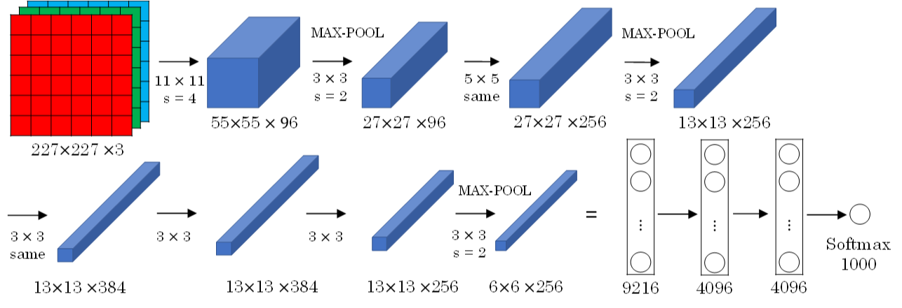
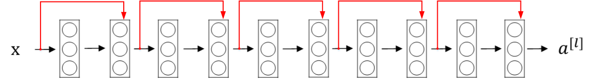
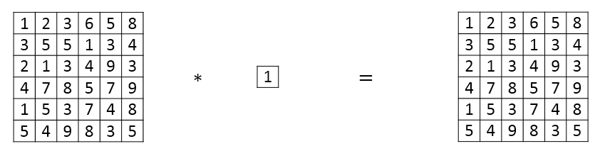
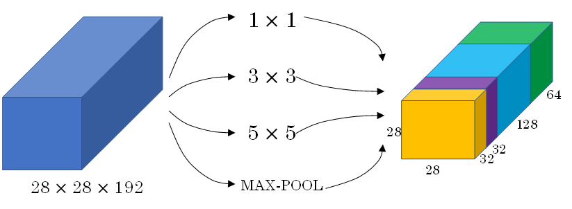
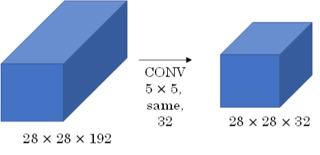
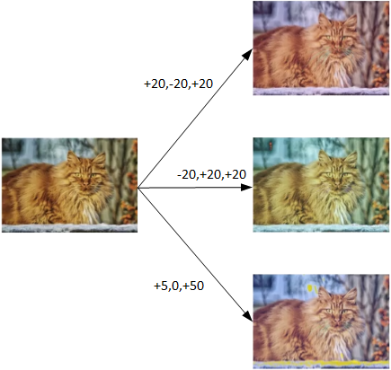
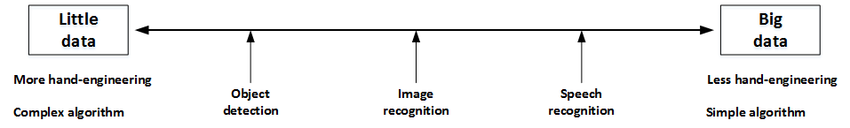
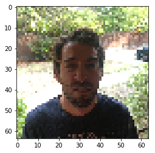
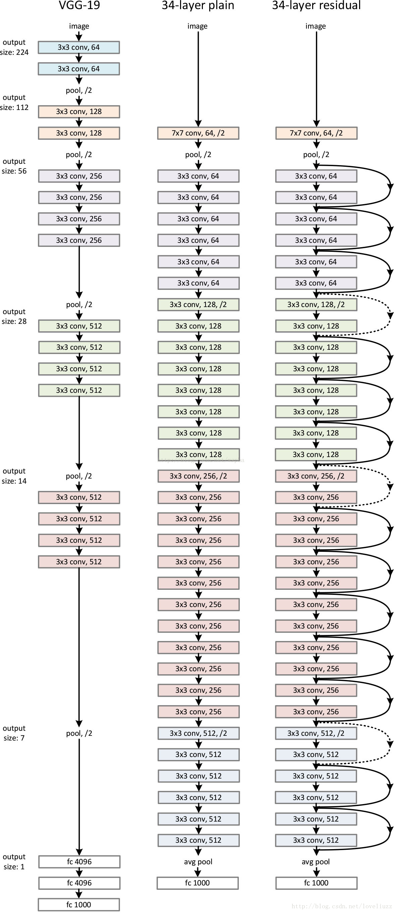
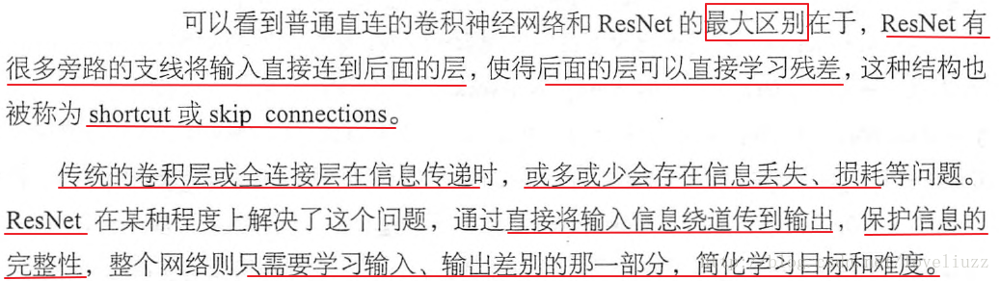

# 深度卷积模型：案例研究

## 为什么要进行实例探究

本周课程将主要介绍几个典型的CNN案例。通过对具体CNN模型及案例的研究，来帮助我们理解知识并训练实际的模型。

典型的CNN模型包括：

- **LeNet-5**
- **AlexNet**
- **VGG**

除了这些性能良好的CNN模型之外，我们还会介绍Residual Network（ResNet）。其特点是可以构建很深很深的神经网络（目前最深的好像有152层）。

另外，还会介绍Inception神经网络。接下来，我们将一一讲解。

### 经典网络

#### LeNet-5模型

LeNet-5模型是Yann LeCun教授于1998年提出来的，它是第一个成功应用于数字识别问题的卷积神经网络。在MNIST数据中，它的准确率达到大约99.2%。

典型的LeNet-5结构包含CONV层，POOL层和FC层，顺序一般是：

CONV层->POOL层->CONV层->POOL层->FC层->FC层->OUTPUT层(即$\hat y$)。下图所示的是一个数字识别的LeNet-5的模型结构：


该LeNet模型总共包含了大约6万个参数。值得一提的是，当时Yann LeCun提出的LeNet-5模型池化层使用的是平均池化average pool，而且各层激活函数一般是Sigmoid和tanh。

现在，我们可以根据需要，做出改进，使用最大池化max pool和激活函数ReLU。

#### AlexNet模型

AlexNet模型是由Alex Krizhevsky、Ilya Sutskever和Geoffrey Hinton共同提出的，其结构如下所示：



AlexNet模型与LeNet-5模型类似，只是要复杂一些，总共包含了大约6千万个参数。同样可以根据实际情况使用激活函数ReLU。原作者还提到了一种优化技巧，叫做**局部响应正则化 Local Response Normalization(LRN)**。 而在实际应用中，LRN的效果并不突出。

#### VGG-16模型

VGG-16模型更加复杂一些，一般情况下，其CONV layer和POOL layer设置如下：

- **CONV = 3x3 filters, s = 1, same**
- **MAX-POOL = 2x2, s = 2**

VGG-16结构如下所示：


VGG-16的参数多达1亿3千万。

## 残差网络

我们知道，如果神经网络层数越多，网络越深，源于梯度消失和梯度爆炸的影响，整个模型难以训练成功。解决的方法之一是人为地让神经网络某些层跳过下一层神经元的连接，隔层相连，弱化每层之间的强联系。这种神经网络被称为**残差网络**(ResNets)。

残差网络由许多隔层相连的神经元子模块组成，我们称之为**残差块**（Residual block）。单个残差块的结构如下图所示：


上图中红色部分就是跳跃式连接(skip connection)，直接建立$a[l]$与$a[l+2]$之间的隔层联系。相应的表达式如下：

$$
z^{[l+1]}=W^{[l+1]}a^{[l]}+b^{[l+1]}
$$

$$
a^{[l+1]}=g(z^{[l+1]})
$$

$$
z^{[l+2]}=W^{[l+2]}a^{[l+1]}+b^{[l+2]}
$$

$$
a^{[l+2]}=g(z^{[l+2]}+a^{[l]})
$$

$a^{[l]}$直接隔层与下一层的线性输出相连，与$z^{[l+2]}$共同通过激活函数（ReLU）输出$a^{[l+2]}$。

该模型由Kaiming He, Xiangyu Zhang, Shaoqing Ren和Jian Sun共同提出。由多个残差块组成的神经网络就是**残差网络**。

实验表明，这种模型结构对于训练非常深的神经网络，效果很好。另外，为了便于区分，我们把非残差网络称为平面网络(Plain Network)。



残差网络的结构如上图所示。

与Plain网络相比，残差网络能够**训练更深层的神经网络**，**有效避免发生发生梯度消失和梯度爆炸**。

从下面两张图的对比中可以看出，随着神经网络层数增加，Plain网络实际性能会变差，训练误差甚至会变大。然而，残差网络的训练效果却很好，训练误差一直呈下降趋势。


## 残差网络原理

下面用个例子来解释为什么残差网络能够训练更深层的神经网络。


如上图所示，输入x经过很多层神经网络后输出$a^{[l]}$，$a^{[l]}$经过一个Residual block输出$a^{[l+2]}$。$a^{[l+2]}$的表达式为：

$$
a^{[l+2]}=g(z^{[l+2]}+a^{[l]})=g(W^{[l+2]}a^{[l+1]}+b^{[l+2]}+a^{[l]})
$$
输入x经过大型神经网络(Big NN)后，如果有$W^{[l+2]}\approx0$，$b^{[l+2]}\approx0$，则有：

$$
a^{[l+2]}=g(a^{[l]})=ReLU(a^{[l]})=a^{[l]}\ \ \ \ when\ a^{[l]}\geq0
$$
可以看出，即使发生了梯度消失$W^{[l+2]}\approx0$，$b^{[l+2]}\approx0$，也能直接建立$a^{[l+2]}$与$a^{[l]}$的线性关系，且$a^{[l+2]}=a^{[l]}$，这其实就是**恒等函数**。

### 评价

**效果**：$a^{[l]}$直接连到$a^{[l+2]}$，从效果来说，相当于直接忽略了$a^{[l]}$之后的这两层神经层。这样，看似很深的神经网络，其实由于许多残差块的存在，**弱化削减**了某些神经层之间的**联系**，实现隔层线性传递，而不是一味追求非线性关系，模型本身也就能“容忍”更深层的神经网络了。

**性能**：这两层额外的残差块也不会降低Big NN的性能。

当然，如果残差块确实能训练得到非线性关系，那么也会忽略小的缩减(short cut)，跟Plain 网络起到同样的效果。

### 维度问题

有一点需要注意的是，如果残差块中$a^{[l+2]}$与$a^{[l]}$的维度不同，通常可以引入矩阵$W_s$，与$a^{[l]}$相乘，使得$W_s∗a^{[l]}$的维度与$a^{[l+2]}$一致。

参数矩阵$W_s$有来两种方法得到：

A.将$W_s$作为学习参数，通过模型训练得到；

B.固定$W_s$值（类似单位矩阵），不需要训练，$W_s$与$a^{[l]}$的乘积仅仅使得$a^{[l]}$截断或者补零。这两种方法都可行。

下图所示的是CNN中残差网络的结构：


残差网络同类型层之间，例如CONV层，大多使用相同类型，保持维度相同。如果是不同类型层之间的连接，例如CONV层r与POOL层之间，如果维度不同，则引入矩阵$W_s$。

## 网络中的网络以及 1×1 卷积核

### 定义

Min Lin, Qiang Chen等人提出了一种新的CNN结构，即1x1 卷积核，也称网络中的网络。这种结构的特点是滤波器算子filter的维度为1x1。

### 效果

对于**单个**filter，1x1的维度，意味着卷积操作等同于乘积操作。



那么，对于**多个**filter，1x1 卷积核的作用实际上类似全连接层的神经网络结构。效果等同于Plain网络中$a^{[l]}$到$a^{[l+1]}$的过程。【压扁！】


1x1 卷积核可以用来**缩减**输入图片的**通道数目**。

方法如下图：


## Inception网络

### 简介

之前我们介绍的CNN单层的滤波算子filter尺寸是固定的，1x1或者3x3等。而Inception网络在单层网络上可以使用多个不同尺寸的filters，进行相同方式的卷积，把各filter下得到的输出拼接起来。除此之外，还可以将CONV层与POOL层混合，同时实现各种效果。但是要注意保持相同的池化。



### 定义

Inception网络由Christian Szegedy, Wei Liu等人提出。与其它只选择单一尺寸和功能的filter不同，Inception网络使用不同尺寸的filters并将CONV和POOL混合起来，将所有功能输出组合拼接，再由神经网络本身去学习参数并选择最好的模块。

### 评价

Inception网络在**提升性能**的同时，会带来**计算量大**的问题。例如下面这个例子：



#### 优化

此CONV层需要的计算量为：28x28x32x5x5x192=120M，其中M表示百万单位。可以看出但这一层的计算量都是很大的。为此，我们可以引入1x1卷积来**减少其计算量**，结构如下图所示：


通常我们把该1x1卷积称为“瓶颈层”（bottleneck layer）。引入瓶颈层之后，总共需要的计算量为：28x28x16x192+28x28x32x5x5x16=12.4M。明显地，虽然多引入了1x1卷积层，但是总共的计算量减少了近90%，效果还是非常明显的。由此可见，1x1 卷积还可以有效减少CONV层的计算量。

### 形成Inception网络

上一节我们使用1x1 卷积来减少Inception网络计算量大的问题。引入1x1 卷积后的Inception模块如下图所示：


多个Inception模块组成Inception网络，效果如下图所示：


#### 注意

上述Inception网络k除了由许多Inception模块组成之外，值得一提的是网络中间隐藏层也可以作为输出层Softmax，有利于防止发生过拟合。

## 使用开源的实现方案（略）

本节主要介绍GitHub的使用，GitHub是一个面向开源及私有软件项目的托管平台，上面包含有许多优秀的CNN开源项目。

## 迁移学习（略）

详见上周的迁移学习

## 数据扩充

常用的**数据扩充**方法是对已有的样本集进行**镜像**和**随机裁剪**处理。


另一种数据扩充的方法是调色。调色就是对图片的RGB通道数值进行随意增加或者减少，改变图片色调。



除了随意改变RGB通道数值外，还可以更有针对性地对图片的RGB通道进行PCA 颜色扩充，也就是对图片颜色进行主成分分析，对主要的通道颜色进行增加或减少，可以采用高斯扰动做法。这样也能增加有效的样本数量。具体的PCA 颜色扩充做法可以查阅AlexNet的相关论文。

最后提一下，在构建大型神经网络的时候，数据扩充和训练可以由**两个不同的线程**来进行。

### 计算机视觉扩充

神经网络需要数据，不同的网络模型所需的数据量是不同的。目标检测，图像识别，语音识别所需的数据量依次增加。一般来说，如果数据较少，那么就需要更多的手动设计，对已有数据进行处理，比如上一节介绍的数据扩充。模型算法也会相对要复杂一些。如果数据很多，可以构建深层神经网络，不需要太多的手动设计，模型算法也就相对简单一些。



值得一提的是手动设计是一项非常重要也比较困难的工作。很多时候，手动设计对模型训练效果影响很大，特别是在数据量不多的情况下。

在模型研究或者竞赛方面，有一些方法能够有助于提升神经网络模型的性能：

- **集成:独立地训练几个网络并平均它们的输出。**
- **测试时多重裁剪:对多个版本的测试图像和平均结果运行分类器。**


但是由于这两种方法计算成本较大，一般不适用于实际项目开发。

## 注意

最后，我们还要灵活使用开源代码：

- **使用文献中发布的网络架构**
- **尽可能使用开源实现**
- **使用预先训练好的模型并对数据集进行微调**

# Keras 教程 - 开心的房子（Happy House）

在这个任务中，您将：

1. 学习使用Keras，这是一个用Python编写的高级神经网络API（编程框架），能够在包括TensorFlow和CNTK在内的几个底层框架上运行。
2. 看看如何在几个小时内建立一个深度学习算法。

为什么我们使用Keras？Keras的开发是为了让深度学习的工程师能够非常快速地建立和尝试不同的模型。就像TensorFlow是一个比Python更高级别的框架一样，Keras是一个更高层次的框架，并提供额外的抽象。能够以最少的时间根据ideal获取结果是寻找好模型的关键。可是，Keras相对底层框架拥有更多的限制，所以有些能在TensorFlow中实现的非常复杂的模型在Keras中却不能实现。也就是说，Keras 只对常见的模型支持良好。

## 导包

```python
import numpy as np
from keras import layers
from keras.layers import Input, Dense, Activation, ZeroPadding2D, BatchNormalization, Flatten, Conv2D
from keras.layers import AveragePooling2D, MaxPooling2D, Dropout, GlobalMaxPooling2D, GlobalAveragePooling2D
from keras.models import Model
from keras.preprocessing import image
from keras.utils import layer_utils
from keras.utils.data_utils import get_file
from keras.applications.imagenet_utils import preprocess_input
import pydot
from IPython.display import SVG
from keras.utils.vis_utils import model_to_dot
from keras.utils import plot_model
from kt_utils import *

import keras.backend as K
K.set_image_data_format('channels_last')
import matplotlib.pyplot as plt
from matplotlib.pyplot import imshow

%matplotlib inline
```

## 开心的房子

你的下一个假期，你决定花一个星期与你学校里的五个朋友在一起玩。这是一个非常方便的房子，附近有很多事情可以做。但最重要的好处是，每个人在房子里的时候都感到快乐。任何想要进入房子的人都必须证明自己当前是开心快乐的。

### 开心的房子

作为一名深度学习专家，为了确保 "开心" 的规则得到严格实施, 您将打算使用前门摄像头拍摄的图片来检查该人是否快乐。只有当人感到快乐时，门才会打开。

你收集了你的朋友和你自己的照片，由前门摄像头拍摄。数据集是带有标签的。

#### 了解数据的shape

运行下面的代码来标准化数据集并了解它的形状。

```python
X_train_orig, Y_train_orig, X_test_orig, Y_test_orig, classes = load_dataset()

# 正则化向量
X_train = X_train_orig/255.
X_test = X_test_orig/255.

# Reshape
Y_train = Y_train_orig.T
Y_test = Y_test_orig.T

print ("number of training examples = " + str(X_train.shape[0]))
print ("number of test examples = " + str(X_test.shape[0]))
print ("X_train shape: " + str(X_train.shape))
print ("Y_train shape: " + str(Y_train.shape))
print ("X_test shape: " + str(X_test.shape))
print ("Y_test shape: " + str(Y_test.shape))
```

#### 结果

```
number of training examples = 600
number of test examples = 150
X_train shape: (600, 64, 64, 3)
Y_train shape: (600, 1)
X_test shape: (150, 64, 64, 3)
Y_test shape: (150, 1)
```


**“Happy”数据集的详细信息：**:

- Images are of shape (64,64,3)
- Training: 600 pictures
- Test: 150 pictures

It is now time to solve the "Happy" Challenge.

## 用Keras建立模型

Keras 非常适合快速制作原型。在很短的时间内，你就能够构建一个模型，并获得出色的成果。

```python
def model(input_shape):
    # 将输入占位符定义为shape为input_shape的张量。把它看作您的输入图像!
    X_input = Input(input_shape)

    # Zero-Padding: 零填充
    X = ZeroPadding2D((3, 3))(X_input)

    # CONV -> 正则化BN -> RELU
    X = Conv2D(32, (7, 7), strides = (1, 1), name = 'conv0')(X)
    X = BatchNormalization(axis = 3, name = 'bn0')(X)
    X = Activation('relu')(X)

    # MAXPOOL
    X = MaxPooling2D((2, 2), name='max_pool')(X)

    # FLATTEN X 扁平化 + FULLYCONNECTED 全连接
    X = Flatten()(X)
    X = Dense(1, activation='sigmoid', name='fc')(X)

    # 创建模型。这会创建你的Keras模型实例，你将使用这个实例来训练/测试模型。
    model = Model(inputs = X_input, outputs = X, name='HappyModel')

    return model
```

注意，Keras对变量名使用的约定与我们之前对numpy和TensorFlow使用的不同。特别是，而不是在前向传播的每一步创建和分配一个新的变量，如 `X`, `Z1`, `A1`, `Z2`, `A2`等。对于不同层的计算，在Keras代码中，上面的每一行都使用`X =…`将` X`重新赋值给一个新值。换句话说，在正向传播的每一步中，我们只是将分配中的最新值写入同一个变量`X`中。 唯一的例外是`X_input`，我们将它分离，没有覆盖它，因为我们需要它在最后创建Keras模型实例(`model = Model(inputs = X_input, ...)` ).

```python
# GRADED FUNCTION: HappyModel

def HappyModel(input_shape):
    """
    Implementation of the HappyModel.
    
    Arguments:
    input_shape -- shape of the images of the dataset

    Returns:
    model -- a Model() instance in Keras
    """
    
    ### START CODE HERE ###
    
    X_input = Input(input_shape)

    X = ZeroPadding2D((3, 3))(X_input)

    X = Conv2D(32, (7, 7), strides = (1, 1), name = 'conv0')(X)
    X = BatchNormalization(axis = 3, name = 'bn0')(X)
    X = Activation('relu')(X)

    # MAXPOOL
    X = MaxPooling2D((2, 2), name='max_pool')(X)

    # FLATTEN + FULLYCONNECTED
    X = Flatten()(X)
    X = Dense(1, activation='sigmoid', name='fc')(X)

    model = Model(inputs = X_input, outputs = X, name='HappyModel')
    
    
    ### END CODE HERE ###
    
    return model
```

现在您已经构建了一个函数来描述您的模型。为了训练和测试该模型，Keras分为四个步骤:

1. 通过调用上面的函数来创建模型
2. 通过调用 `model.compile(optimizer = "...", loss = "...", metrics = ["accuracy"])`来编译模型
3. 通过调用 `model.fit(x = ..., y = ..., epochs = ..., batch_size = ...)`来训练模型
4. 通过调用 `model.evaluate(x = ..., y = ...)`来测试模型


### 创建模型

```python
### START CODE HERE ### (1 line)
happyModel = HappyModel(X_train.shape[1:])
### END CODE HERE ###
```

### 编译模型

```python
### START CODE HERE ### (1 line)
happyModel.compile(optimizer = "Adam", loss = "binary_crossentropy", metrics = ["accuracy"])
### END CODE HERE ###
```

### 训练模型

```python
### START CODE HERE ### (1 line)
happyModel.fit(x=X_train, y = Y_train, epochs = 39, batch_size = 16)
### END CODE HERE ###
```

#### 结果

```
Epoch 1/39
600/600 [==============================] - 26s - loss: 1.5768 - acc: 0.7183    
Epoch 2/39
600/600 [==============================] - 26s - loss: 0.3022 - acc: 0.8850    
Epoch 3/39
600/600 [==============================] - 25s - loss: 0.1880 - acc: 0.9183    
Epoch 4/39
600/600 [==============================] - 25s - loss: 0.1269 - acc: 0.9567    
Epoch 5/39
600/600 [==============================] - 25s - loss: 0.1374 - acc: 0.9433    
Epoch 6/39
600/600 [==============================] - 26s - loss: 0.1624 - acc: 0.9550    
Epoch 7/39
600/600 [==============================] - 27s - loss: 0.0701 - acc: 0.9767    
Epoch 8/39
600/600 [==============================] - 26s - loss: 0.1520 - acc: 0.9417    
Epoch 9/39
600/600 [==============================] - 25s - loss: 0.1620 - acc: 0.9483    
Epoch 10/39
600/600 [==============================] - 25s - loss: 0.1383 - acc: 0.9467    
Epoch 11/39
600/600 [==============================] - 25s - loss: 0.1588 - acc: 0.9517    
Epoch 12/39
600/600 [==============================] - 25s - loss: 0.1038 - acc: 0.9683    
Epoch 13/39
600/600 [==============================] - 25s - loss: 0.0895 - acc: 0.9683    
Epoch 14/39
600/600 [==============================] - 25s - loss: 0.0828 - acc: 0.9717    
Epoch 15/39
600/600 [==============================] - 25s - loss: 0.0456 - acc: 0.9917    
Epoch 16/39
600/600 [==============================] - 26s - loss: 0.0616 - acc: 0.9800    
Epoch 17/39
600/600 [==============================] - 25s - loss: 0.0463 - acc: 0.9817    
Epoch 18/39
600/600 [==============================] - 28s - loss: 0.0772 - acc: 0.9683    
Epoch 19/39
600/600 [==============================] - 28s - loss: 0.0486 - acc: 0.9850    
Epoch 20/39
600/600 [==============================] - 26s - loss: 0.0235 - acc: 0.9900    
Epoch 21/39
600/600 [==============================] - 25s - loss: 0.0403 - acc: 0.9933    
Epoch 22/39
600/600 [==============================] - 25s - loss: 0.0554 - acc: 0.9850    
Epoch 23/39
600/600 [==============================] - 25s - loss: 0.0221 - acc: 0.9967    
Epoch 24/39
600/600 [==============================] - 25s - loss: 0.0430 - acc: 0.9800    
Epoch 25/39
600/600 [==============================] - 25s - loss: 0.0286 - acc: 0.9967    
Epoch 26/39
600/600 [==============================] - 25s - loss: 0.0245 - acc: 0.9917    
Epoch 27/39
600/600 [==============================] - 25s - loss: 0.0168 - acc: 0.9933    
Epoch 28/39
600/600 [==============================] - 25s - loss: 0.0414 - acc: 0.9867    
Epoch 29/39
600/600 [==============================] - 25s - loss: 0.0281 - acc: 0.9900    
Epoch 30/39
600/600 [==============================] - 26s - loss: 0.0445 - acc: 0.9883    
Epoch 31/39
600/600 [==============================] - 25s - loss: 0.0693 - acc: 0.9733    
Epoch 32/39
600/600 [==============================] - 25s - loss: 0.1834 - acc: 0.9383    
Epoch 33/39
600/600 [==============================] - 25s - loss: 0.3500 - acc: 0.9150    
Epoch 34/39
600/600 [==============================] - 25s - loss: 0.0899 - acc: 0.9683    
Epoch 35/39
600/600 [==============================] - 26s - loss: 0.1298 - acc: 0.9717    
Epoch 36/39
600/600 [==============================] - 26s - loss: 0.1342 - acc: 0.9667    
Epoch 37/39
600/600 [==============================] - 25s - loss: 0.0550 - acc: 0.9767    
Epoch 38/39
600/600 [==============================] - 25s - loss: 0.0812 - acc: 0.9767    
Epoch 39/39
600/600 [==============================] - 25s - loss: 0.0726 - acc: 0.9867    
```

### 评估模型

```python
### START CODE HERE ### (1 line)
preds = happyModel.evaluate(x = X_test, y = Y_test)
### END CODE HERE ###
print()
print ("Loss = " + str(preds[0]))
print ("Test Accuracy = " + str(preds[1]))
```

#### 结果

```
150/150 [==============================] - 3s     

Loss = 0.596558374564
Test Accuracy = 0.846666665872
```


给你一个用于比较节点，我们的模型**在40个epoch时能够达到95%的测试准确度**(和99%的训练准确度)【minibatch大小为16，采用“adam”优化器】。但是我们的模型在2-5个epoch之后就得到了不错的精度，所以如果你比较不同的模型，你也可以在几个epoch上训练不同的模型，看看它们效果如何。

如果你还没有达到一个非常好的准确度(假设超过80%)，这里有一些东西你可以尝试实现它:

- 尝试使用 CONV->BATCHNORM->RELU

	```python
	X = Conv2D(32, (3, 3), strides = (1, 1), name = 'conv0')(X)
	X = BatchNormalization(axis = 3, name = 'bn0')(X)
	X = Activation('relu')(X)
	```

	直到你的高度和宽度尺寸非常低，而通道的数量非常大(例如≈32)。然后你可以扁平化这个volume，使用一个完全连接的层。

- 你可以使用 MAXPOOL 。可以帮助你降低高和宽的维度。

- 改变优化器

- 如果模型运行困难，而您遇到内存问题，那么降低batch_size(12通常是一个不错的方案)

- 运行更多epoch，直到训练准确度停滞。

即使您已经取得了一个很好的精度，请放心继续玩您的模型，以获得更好的结果。

**注意**:如果您对模型执行超参数调优，那么测试集实际上会变成开发集，并且您的模型最终可能会过度拟合测试(dev)集。

## 总结

- Keras是我们推荐用于快速原型的一个工具。它允许您快速尝试不同的模型架构。你是否想用Keras来实现日常生活中的深度学习应用?
- 记得如何在Keras中编写一个模型，以及在测试集中评估你的模型的四个步骤。

## 测试自己的图片 (选做)

```python
### START CODE HERE ###
img_path = 'images/my_image.jpg'
### END CODE HERE ###
img = image.load_img(img_path, target_size=(64, 64))
imshow(img)

x = image.img_to_array(img)
x = np.expand_dims(x, axis=0)
x = preprocess_input(x)

print(happyModel.predict(x))
```

结果

```
[[  8.44492405e-08]]
```



## Keras中其他有用的函数 (选做)

- `model.summary()`: 

	打印你的层的详细信息在一个表【输入/输出的大小】

- `plot_model()`: 

	以良好的布局绘制您的图表。你甚至可以使用SVG() 把它存为 ".png" 格式。

#### 测试

```python
happyModel.summary()
```

#### 结果

```
_________________________________________________________________
Layer (type)                 Output Shape              Param #   
=================================================================
input_1 (InputLayer)         (None, 64, 64, 3)         0         
_________________________________________________________________
zero_padding2d_1 (ZeroPaddin (None, 70, 70, 3)         0         
_________________________________________________________________
conv0 (Conv2D)               (None, 64, 64, 32)        4736      
_________________________________________________________________
bn0 (BatchNormalization)     (None, 64, 64, 32)        128       
_________________________________________________________________
activation_1 (Activation)    (None, 64, 64, 32)        0         
_________________________________________________________________
max_pool (MaxPooling2D)      (None, 32, 32, 32)        0         
_________________________________________________________________
flatten_1 (Flatten)          (None, 32768)             0         
_________________________________________________________________
fc (Dense)                   (None, 1)                 32769     
=================================================================
Total params: 37,633
Trainable params: 37,569
Non-trainable params: 64
_________________________________________________________________
```


# 残差网络

本章将学习如何使用残差网络(ResNets)构建非常深的卷积网络。理论上，深度很深的网络可以代表非常复杂的功能;但实际上，他们很难训练。残差网络由[He等人](https://arxiv.org/pdf/1512.03385.pdf)推荐，它允许你训练比以前实际可行的更深层次的网络。

## 目标

- 实现残差网络的基本构建块。
- 把这些构建块放在一起来实现和训练一个最先进的图像分类神经网络。

## 导包

```python
import numpy as np
from keras import layers
from keras.layers import Input, Add, Dense, Activation, ZeroPadding2D, BatchNormalization, Flatten, Conv2D, AveragePooling2D, MaxPooling2D, GlobalMaxPooling2D
from keras.models import Model, load_model
from keras.preprocessing import image
from keras.utils import layer_utils
from keras.utils.data_utils import get_file
from keras.applications.imagenet_utils import preprocess_input
import pydot
from IPython.display import SVG
from keras.utils.vis_utils import model_to_dot
from keras.utils import plot_model
from resnets_utils import *
from keras.initializers import glorot_uniform
import scipy.misc
from matplotlib.pyplot import imshow
%matplotlib inline

import keras.backend as K
K.set_image_data_format('channels_last')
K.set_learning_phase(1)
Using TensorFlow backend.
```

##  深度神经网络的问题

近年来，神经网络变得更加深入，最先进的网络从只有几层(如AlexNet)发展到超过100层。

深度网络的主要好处是它可以代表非常复杂的功能。它还可以学习许多不同抽象级别的特性，从边缘(较低的层)到非常复杂的特性(较深的层)。

然而，使用更深层次的网络并不总是有帮助。训练它们的一个巨大障碍是梯度消失:深度很深的网络通常会有一个梯度信号迅速变为零，从而使**梯度下降慢得难以接受**。更具体地说,在梯度下降法,从最后一层反向传播回到第一层,每一步你乘以权重矩阵,从而能够迅速减少指数梯度为零(或者,在罕见的情况下,成倍增长迅速,“爆炸”非常大的值)。

现在将通过构建一个残差网络来解决这个问题!

## 构建残差网络

在残差网络中， "shortcut" 或者 "skip connection" 允许梯度直接反馈到更前的层中。

残差网络在课堂上我们也看到,ResNet块也很容易学习一个恒等（identity）函数块。这意味着您可以堆叠额外的ResNet块，几乎没有损害训练集性能的风险。(也有一些证据表明，ResNets的卓越性能是由于易于学习标识函数，甚至比跳过连接更有助于消除梯度消失。)

ResNet中主要使用两种类型的块，主要取决于输入/输出维度是相同的还是不同的。您将同时实现它们。





### Identity块

identity块是ResNets中使用的标准块，它对应于输入激活(比如$a^{[l]}$)与输出激活(比如$a^{[l+2]}$)具有**相同维度**的情况。

```python
# GRADED FUNCTION: identity_block

def identity_block(X, f, filters, stage, block):
    """
    Implementation of the identity block as defined in Figure 3
    
    Arguments:
    X -- input tensor of shape (m, n_H_prev, n_W_prev, n_C_prev)
    f -- integer, specifying the shape of the middle CONV's window for the main path
    filters -- python list of integers, defining the number of filters in the CONV layers of the main path
    stage -- integer, used to name the layers, depending on their position in the network
    block -- string/character, used to name the layers, depending on their position in the network
    
    Returns:
    X -- output of the identity block, tensor of shape (n_H, n_W, n_C)
    """
    
    # 定义名称
    conv_name_base = 'res' + str(stage) + block + '_branch'
    bn_name_base = 'bn' + str(stage) + block + '_branch'
    
    # 取得filters
    F1, F2, F3 = filters
    
    # 保存输出值。稍后需要将其添加回main路径。
    X_shortcut = X
    
    # main路径的第一个组成部分（2D卷积，正则化，激活）
    X = Conv2D(filters = F1, kernel_size = (1, 1), strides = (1,1), padding = 'valid', name = conv_name_base + '2a', kernel_initializer = glorot_uniform(seed=0))(X)
    X = BatchNormalization(axis = 3, name = bn_name_base + '2a')(X)
    X = Activation('relu')(X)
    
    ### START CODE HERE ###
    
    # main路径的第二个组成部分（2D卷积，正则化，激活） (≈3 lines)
    X = Conv2D(filters = F2, kernel_size = (f, f), strides = (1,1), padding = 'same', name = conv_name_base + '2b', kernel_initializer = glorot_uniform(seed=0))(X)
    X = BatchNormalization(axis = 3, name = bn_name_base + '2b')(X)
    X = Activation('relu')(X)

    # main路径的第三个组成部分（2D卷积，正则化） (≈2 lines)
    X = Conv2D(filters = F3, kernel_size = (1, 1), strides = (1,1), padding = 'valid', name = conv_name_base + '2c',kernel_initializer = glorot_uniform(seed=0))(X)
    X = BatchNormalization(axis = 3, name = bn_name_base + '2c')(X)

    # 最后一步: 将shortcut的值添加到main路径，并且用ReLU激活 (≈2 lines)
    X = Add()([X, X_shortcut])
    X = Activation('relu')(X)
    
    ### END CODE HERE ###
    
    return X
```

#### 测试运行

```python
tf.reset_default_graph()

with tf.Session() as test:
    np.random.seed(1)
    A_prev = tf.placeholder("float", [3, 4, 4, 6])
    X = np.random.randn(3, 4, 4, 6)
    A = identity_block(A_prev, f = 2, filters = [2, 4, 6], stage = 1, block = 'a')
    test.run(tf.global_variables_initializer())
    out = test.run([A], feed_dict={A_prev: X, K.learning_phase(): 0})
    print("out = " + str(out[0][1][1][0]))

```

#### 结果

```
out = [ 0.94822985  0.          1.16101444  2.747859    0.          1.36677003]
```


### 卷积块

您已经实现了ResNet的恒等块。接下来，ResNet的“卷积块”是另一种类型的块。当**输入和输出维度不匹配**时，可以使用这种类型的块。与标识块不同的是，在shortcut路径中有一个CONV2D层。

shortcut路径中的CONV2D层用于将输入$x$的大小调整为不同的维度，以便在将shortcut值添加回main路径时，最终添加的维度与之匹配。(其作用类似于课堂上讨论的矩阵$W_s$)例如，要将激活维度的高度和宽度减小到原来的2倍，可以使用一个1×1卷积，步长为2。在快捷路径上的CONV2D层不使用任何非线性激活函数。它的主要**作用**是应用一个(学习过的)线性函数来**降低输入的维数**，以便维数与后面的加法步骤相匹配。

```python
# GRADED FUNCTION: convolutional_block

def convolutional_block(X, f, filters, stage, block, s = 2):
    """
    Implementation of the convolutional block as defined in Figure 4
    
    Arguments:
    X -- input tensor of shape (m, n_H_prev, n_W_prev, n_C_prev)
    f -- integer, specifying the shape of the middle CONV's window for the main path
    filters -- python list of integers, defining the number of filters in the CONV layers of the main path
    stage -- integer, used to name the layers, depending on their position in the network
    block -- string/character, used to name the layers, depending on their position in the network
    s -- Integer, specifying the stride to be used
    
    Returns:
    X -- output of the convolutional block, tensor of shape (n_H, n_W, n_C)
    """
    
    
    conv_name_base = 'res' + str(stage) + block + '_branch'
    bn_name_base = 'bn' + str(stage) + block + '_branch'
    
    
    F1, F2, F3 = filters
    
    # 保存输出值
    X_shortcut = X


    ##### MAIN PATH #####
    # main路径的第一组成部分
    X = Conv2D(filters = F1, kernel_size = (1, 1), strides = (s,s), padding = 'valid', name = conv_name_base + '2a', kernel_initializer = glorot_uniform(seed=0))(X)
    X = BatchNormalization(axis = 3, name = bn_name_base + '2a')(X)
    X = Activation('relu')(X)
    
    ### START CODE HERE ###

    # main路径的第二组成部分 (≈3 lines)
    X = Conv2D(filters = F2, kernel_size = (f, f), strides = (1, 1), padding = 'same', name = conv_name_base + '2b', kernel_initializer = glorot_uniform(seed=0))(X)
    X = BatchNormalization(axis = 3, name = bn_name_base + '2b')(X)
    X = Activation('relu')(X)

    # main路径的第三组成部分 (≈2 lines)
    X = Conv2D(filters = F3, kernel_size = (1, 1), strides = (1, 1), padding = 'valid', name = conv_name_base + '2c', kernel_initializer = glorot_uniform(seed=0))(X)
    X = BatchNormalization(axis = 3, name = bn_name_base + '2c')(X)

    ##### SHORTCUT PATH #### (≈2 lines)
    X_shortcut = Conv2D(filters = F3, kernel_size = (1, 1), strides = (s, s), padding = 'valid', name = conv_name_base + '1', kernel_initializer = glorot_uniform(seed=0))(X_shortcut)
    X_shortcut = BatchNormalization(axis = 3, name = bn_name_base + '1')(X_shortcut)

    # 最后一步: 将shortcut的值添加到main，并且用ReLU激活 (≈2 lines)
    X = Add()([X, X_shortcut])
    X = Activation('relu')(X)
    
    ### END CODE HERE ###
    
    return X
```

#### 测试

```python
tf.reset_default_graph()

with tf.Session() as test:
    np.random.seed(1)
    A_prev = tf.placeholder("float", [3, 4, 4, 6])
    X = np.random.randn(3, 4, 4, 6)
    A = convolutional_block(A_prev, f = 2, filters = [2, 4, 6], stage = 1, block = 'a')
    test.run(tf.global_variables_initializer())
    out = test.run([A], feed_dict={A_prev: X, K.learning_phase(): 0})
    print("out = " + str(out[0][1][1][0]))
```

#### 结果

```
out = [ 0.09018463  1.23489773  0.46822017  0.0367176   0.          0.65516603]
```


## 构建ResNet模型(50层)

```python
# GRADED FUNCTION: ResNet50

def ResNet50(input_shape = (64, 64, 3), classes = 6):
    """
    Implementation of the popular ResNet50 the following architecture:
    CONV2D -> BATCHNORM -> RELU -> MAXPOOL -> CONVBLOCK -> IDBLOCK*2 -> CONVBLOCK -> IDBLOCK*3
    -> CONVBLOCK -> IDBLOCK*5 -> CONVBLOCK -> IDBLOCK*2 -> AVGPOOL -> TOPLAYER

    Arguments:
    input_shape -- shape of the images of the dataset
    classes -- integer, number of classes

    Returns:
    model -- a Model() instance in Keras
    """
    
    # 将输出定义为一个tensor【shape为input_shape】
    X_input = Input(input_shape)

    
    # 零填充
    X = ZeroPadding2D((3, 3))(X_input)
    
    # 阶段 1
    X = Conv2D(64, (7, 7), strides = (2, 2), name = 'conv1', kernel_initializer = glorot_uniform(seed=0))(X)
    X = BatchNormalization(axis = 3, name = 'bn_conv1')(X)
    X = Activation('relu')(X)
    X = MaxPooling2D((3, 3), strides=(2, 2))(X)

    # 阶段 2
    X = convolutional_block(X, f = 3, filters = [64, 64, 256], stage = 2, block='a', s = 1)
    X = identity_block(X, 3, [64, 64, 256], stage=2, block='b')
    X = identity_block(X, 3, [64, 64, 256], stage=2, block='c')

    ### START CODE HERE ###

    # 阶段 3 (≈4 lines)
    X = convolutional_block(X, f = 3, filters = [128, 128, 512], stage = 3, block='a', s = 2)
    X = identity_block(X, 3, [128, 128, 512], stage=3, block='b')
    X = identity_block(X, 3, [128, 128, 512], stage=3, block='c')
    X = identity_block(X, 3, [128, 128, 512], stage=3, block='d')

    # 阶段 4 (≈6 lines)
    X = convolutional_block(X, f = 3, filters = [256, 256, 1024], stage = 4, block='a', s = 2)
    X = identity_block(X, 3, [256, 256, 1024], stage=4, block='b')
    X = identity_block(X, 3, [256, 256, 1024], stage=4, block='c')
    X = identity_block(X, 3, [256, 256, 1024], stage=4, block='d')
    X = identity_block(X, 3, [256, 256, 1024], stage=4, block='e')
    X = identity_block(X, 3, [256, 256, 1024], stage=4, block='f')

    # 阶段 5 (≈3 lines)
    X = convolutional_block(X, f = 3, filters = [512, 512, 2048], stage = 5, block='a', s = 2)
    X = identity_block(X, 3, [512, 512, 2048], stage=5, block='b')
    X = identity_block(X, 3, [512, 512, 2048], stage=5, block='c')

    # AVGPOOL (≈1 line). Use "X = AveragePooling2D(...)(X)"
    X = AveragePooling2D((2, 2), strides=(2, 2))(X)
    
    ### END CODE HERE ###

    # 输出层
    X = Flatten()(X)
    X = Dense(classes, activation='softmax', name='fc' + str(classes), kernel_initializer = glorot_uniform(seed=0))(X)
    
    
    # 创建模型
    model = Model(inputs = X_input, outputs = X, name='ResNet50')

    return model
```

### 实例化模型

```
model = ResNet50(input_shape = (64, 64, 3), classes = 6)
```

### 编译模型

```
model.compile(optimizer='adam', loss='categorical_crossentropy', metrics=['accuracy'])
```

### 准备数据集

```python
X_train_orig, Y_train_orig, X_test_orig, Y_test_orig, classes = load_dataset()

# Normalize image vectors
X_train = X_train_orig/255.
X_test = X_test_orig/255.

# Convert training and test labels to one hot matrices
Y_train = convert_to_one_hot(Y_train_orig, 6).T
Y_test = convert_to_one_hot(Y_test_orig, 6).T

```

#### 测试shape

```python
print ("number of training examples = " + str(X_train.shape[0]))
print ("number of test examples = " + str(X_test.shape[0]))
print ("X_train shape: " + str(X_train.shape))
print ("Y_train shape: " + str(Y_train.shape))
print ("X_test shape: " + str(X_test.shape))
print ("Y_test shape: " + str(Y_test.shape))
```

#### 结果

```
number of training examples = 1080
number of test examples = 120
X_train shape: (1080, 64, 64, 3)
Y_train shape: (1080, 6)
X_test shape: (120, 64, 64, 3)
Y_test shape: (120, 6)
```


### 训练模型

```
model.fit(X_train, Y_train, epochs = 2, batch_size = 32)
```

#### 结果

```
Epoch 1/2
1080/1080 [==============================] - 288s - loss: 3.1092 - acc: 0.2380   
Epoch 2/2
1080/1080 [==============================] - 256s - loss: 2.2482 - acc: 0.3306   
```

### 查看效果

```python
preds = model.evaluate(X_test, Y_test)
print ("Loss = " + str(preds[0]))
print ("Test Accuracy = " + str(preds[1]))
```

#### 结果

```
120/120 [==============================] - 10s    
Loss = 2.35326625506
Test Accuracy = 0.166666666667
```

ResNet50是一个强大的图像分类模型，当训练它足够的迭代次数。我们希望您可以使用您所学到的，并将其应用到您自己的分类问题，以执行最先进的准确性。

## 测试自己的图片 (选做)

```python
img_path = 'images/my_image.jpg'
img = image.load_img(img_path, target_size=(64, 64))
x = image.img_to_array(img)
x = np.expand_dims(x, axis=0)
x = preprocess_input(x)
print('Input image shape:', x.shape)
my_image = scipy.misc.imread(img_path)
imshow(my_image)
print("class prediction vector [p(0), p(1), p(2), p(3), p(4), p(5)] = ")
print(model.predict(x))

```

### 结果

```
Input image shape: (1, 64, 64, 3)
class prediction vector [p(0), p(1), p(2), p(3), p(4), p(5)] = 
[[ 0.  0.  0.  0.  1.  0.]]
```


### 打印摘要

您还可以通过运行以下代码打印模型的摘要。

```python
model.summary()
```

#### 结果

```
____________________________________________________________________________________________________
Layer (type)                     Output Shape          Param #     Connected to                     
====================================================================================================
input_1 (InputLayer)             (None, 64, 64, 3)     0                                            
____________________________________________________________________________________________________
zero_padding2d_1 (ZeroPadding2D) (None, 70, 70, 3)     0           input_1[0][0]                    
____________________________________________________________________________________________________
conv1 (Conv2D)                   (None, 32, 32, 64)    9472        zero_padding2d_1[0][0]           
____________________________________________________________________________________________________
bn_conv1 (BatchNormalization)    (None, 32, 32, 64)    256         conv1[0][0]                      
____________________________________________________________________________________________________
activation_4 (Activation)        (None, 32, 32, 64)    0           bn_conv1[0][0]                   
____________________________________________________________________________________________________
max_pooling2d_1 (MaxPooling2D)   (None, 15, 15, 64)    0           activation_4[0][0]               
____________________________________________________________________________________________________
res2a_branch2a (Conv2D)          (None, 15, 15, 64)    4160        max_pooling2d_1[0][0]            
____________________________________________________________________________________________________
bn2a_branch2a (BatchNormalizatio (None, 15, 15, 64)    256         res2a_branch2a[0][0]             
____________________________________________________________________________________________________
activation_5 (Activation)        (None, 15, 15, 64)    0           bn2a_branch2a[0][0]              
____________________________________________________________________________________________________
res2a_branch2b (Conv2D)          (None, 15, 15, 64)    36928       activation_5[0][0]               
____________________________________________________________________________________________________
bn2a_branch2b (BatchNormalizatio (None, 15, 15, 64)    256         res2a_branch2b[0][0]             
____________________________________________________________________________________________________
activation_6 (Activation)        (None, 15, 15, 64)    0           bn2a_branch2b[0][0]              
____________________________________________________________________________________________________
res2a_branch2c (Conv2D)          (None, 15, 15, 256)   16640       activation_6[0][0]               
____________________________________________________________________________________________________
res2a_branch1 (Conv2D)           (None, 15, 15, 256)   16640       max_pooling2d_1[0][0]            
____________________________________________________________________________________________________
bn2a_branch2c (BatchNormalizatio (None, 15, 15, 256)   1024        res2a_branch2c[0][0]             
____________________________________________________________________________________________________
bn2a_branch1 (BatchNormalization (None, 15, 15, 256)   1024        res2a_branch1[0][0]              
____________________________________________________________________________________________________
add_2 (Add)                      (None, 15, 15, 256)   0           bn2a_branch2c[0][0]              
                                                                   bn2a_branch1[0][0]               
____________________________________________________________________________________________________
activation_7 (Activation)        (None, 15, 15, 256)   0           add_2[0][0]                      
____________________________________________________________________________________________________
res2b_branch2a (Conv2D)          (None, 15, 15, 64)    16448       activation_7[0][0]               
____________________________________________________________________________________________________
bn2b_branch2a (BatchNormalizatio (None, 15, 15, 64)    256         res2b_branch2a[0][0]             
____________________________________________________________________________________________________
activation_8 (Activation)        (None, 15, 15, 64)    0           bn2b_branch2a[0][0]              
____________________________________________________________________________________________________
res2b_branch2b (Conv2D)          (None, 15, 15, 64)    36928       activation_8[0][0]               
____________________________________________________________________________________________________
bn2b_branch2b (BatchNormalizatio (None, 15, 15, 64)    256         res2b_branch2b[0][0]             
____________________________________________________________________________________________________
activation_9 (Activation)        (None, 15, 15, 64)    0           bn2b_branch2b[0][0]              
____________________________________________________________________________________________________
res2b_branch2c (Conv2D)          (None, 15, 15, 256)   16640       activation_9[0][0]               
____________________________________________________________________________________________________
bn2b_branch2c (BatchNormalizatio (None, 15, 15, 256)   1024        res2b_branch2c[0][0]             
____________________________________________________________________________________________________
add_3 (Add)                      (None, 15, 15, 256)   0           bn2b_branch2c[0][0]              
                                                                   activation_7[0][0]               
____________________________________________________________________________________________________
activation_10 (Activation)       (None, 15, 15, 256)   0           add_3[0][0]                      
____________________________________________________________________________________________________
res2c_branch2a (Conv2D)          (None, 15, 15, 64)    16448       activation_10[0][0]              
____________________________________________________________________________________________________
bn2c_branch2a (BatchNormalizatio (None, 15, 15, 64)    256         res2c_branch2a[0][0]             
____________________________________________________________________________________________________
activation_11 (Activation)       (None, 15, 15, 64)    0           bn2c_branch2a[0][0]              
____________________________________________________________________________________________________
res2c_branch2b (Conv2D)          (None, 15, 15, 64)    36928       activation_11[0][0]              
____________________________________________________________________________________________________
bn2c_branch2b (BatchNormalizatio (None, 15, 15, 64)    256         res2c_branch2b[0][0]             
____________________________________________________________________________________________________
activation_12 (Activation)       (None, 15, 15, 64)    0           bn2c_branch2b[0][0]              
____________________________________________________________________________________________________
res2c_branch2c (Conv2D)          (None, 15, 15, 256)   16640       activation_12[0][0]              
____________________________________________________________________________________________________
bn2c_branch2c (BatchNormalizatio (None, 15, 15, 256)   1024        res2c_branch2c[0][0]             
____________________________________________________________________________________________________
add_4 (Add)                      (None, 15, 15, 256)   0           bn2c_branch2c[0][0]              
                                                                   activation_10[0][0]              
____________________________________________________________________________________________________
activation_13 (Activation)       (None, 15, 15, 256)   0           add_4[0][0]                      
____________________________________________________________________________________________________
res3a_branch2a (Conv2D)          (None, 8, 8, 128)     32896       activation_13[0][0]              
____________________________________________________________________________________________________
bn3a_branch2a (BatchNormalizatio (None, 8, 8, 128)     512         res3a_branch2a[0][0]             
____________________________________________________________________________________________________
activation_14 (Activation)       (None, 8, 8, 128)     0           bn3a_branch2a[0][0]              
____________________________________________________________________________________________________
res3a_branch2b (Conv2D)          (None, 8, 8, 128)     147584      activation_14[0][0]              
____________________________________________________________________________________________________
bn3a_branch2b (BatchNormalizatio (None, 8, 8, 128)     512         res3a_branch2b[0][0]             
____________________________________________________________________________________________________
activation_15 (Activation)       (None, 8, 8, 128)     0           bn3a_branch2b[0][0]              
____________________________________________________________________________________________________
res3a_branch2c (Conv2D)          (None, 8, 8, 512)     66048       activation_15[0][0]              
____________________________________________________________________________________________________
res3a_branch1 (Conv2D)           (None, 8, 8, 512)     131584      activation_13[0][0]              
____________________________________________________________________________________________________
bn3a_branch2c (BatchNormalizatio (None, 8, 8, 512)     2048        res3a_branch2c[0][0]             
____________________________________________________________________________________________________
bn3a_branch1 (BatchNormalization (None, 8, 8, 512)     2048        res3a_branch1[0][0]              
____________________________________________________________________________________________________
add_5 (Add)                      (None, 8, 8, 512)     0           bn3a_branch2c[0][0]              
                                                                   bn3a_branch1[0][0]               
____________________________________________________________________________________________________
activation_16 (Activation)       (None, 8, 8, 512)     0           add_5[0][0]                      
____________________________________________________________________________________________________
res3b_branch2a (Conv2D)          (None, 8, 8, 128)     65664       activation_16[0][0]              
____________________________________________________________________________________________________
bn3b_branch2a (BatchNormalizatio (None, 8, 8, 128)     512         res3b_branch2a[0][0]             
____________________________________________________________________________________________________
activation_17 (Activation)       (None, 8, 8, 128)     0           bn3b_branch2a[0][0]              
____________________________________________________________________________________________________
res3b_branch2b (Conv2D)          (None, 8, 8, 128)     147584      activation_17[0][0]              
____________________________________________________________________________________________________
bn3b_branch2b (BatchNormalizatio (None, 8, 8, 128)     512         res3b_branch2b[0][0]             
____________________________________________________________________________________________________
activation_18 (Activation)       (None, 8, 8, 128)     0           bn3b_branch2b[0][0]              
____________________________________________________________________________________________________
res3b_branch2c (Conv2D)          (None, 8, 8, 512)     66048       activation_18[0][0]              
____________________________________________________________________________________________________
bn3b_branch2c (BatchNormalizatio (None, 8, 8, 512)     2048        res3b_branch2c[0][0]             
____________________________________________________________________________________________________
add_6 (Add)                      (None, 8, 8, 512)     0           bn3b_branch2c[0][0]              
                                                                   activation_16[0][0]              
____________________________________________________________________________________________________
activation_19 (Activation)       (None, 8, 8, 512)     0           add_6[0][0]                      
____________________________________________________________________________________________________
res3c_branch2a (Conv2D)          (None, 8, 8, 128)     65664       activation_19[0][0]              
____________________________________________________________________________________________________
bn3c_branch2a (BatchNormalizatio (None, 8, 8, 128)     512         res3c_branch2a[0][0]             
____________________________________________________________________________________________________
activation_20 (Activation)       (None, 8, 8, 128)     0           bn3c_branch2a[0][0]              
____________________________________________________________________________________________________
res3c_branch2b (Conv2D)          (None, 8, 8, 128)     147584      activation_20[0][0]              
____________________________________________________________________________________________________
bn3c_branch2b (BatchNormalizatio (None, 8, 8, 128)     512         res3c_branch2b[0][0]             
____________________________________________________________________________________________________
activation_21 (Activation)       (None, 8, 8, 128)     0           bn3c_branch2b[0][0]              
____________________________________________________________________________________________________
res3c_branch2c (Conv2D)          (None, 8, 8, 512)     66048       activation_21[0][0]              
____________________________________________________________________________________________________
bn3c_branch2c (BatchNormalizatio (None, 8, 8, 512)     2048        res3c_branch2c[0][0]             
____________________________________________________________________________________________________
add_7 (Add)                      (None, 8, 8, 512)     0           bn3c_branch2c[0][0]              
                                                                   activation_19[0][0]              
____________________________________________________________________________________________________
activation_22 (Activation)       (None, 8, 8, 512)     0           add_7[0][0]                      
____________________________________________________________________________________________________
res3d_branch2a (Conv2D)          (None, 8, 8, 128)     65664       activation_22[0][0]              
____________________________________________________________________________________________________
bn3d_branch2a (BatchNormalizatio (None, 8, 8, 128)     512         res3d_branch2a[0][0]             
____________________________________________________________________________________________________
activation_23 (Activation)       (None, 8, 8, 128)     0           bn3d_branch2a[0][0]              
____________________________________________________________________________________________________
res3d_branch2b (Conv2D)          (None, 8, 8, 128)     147584      activation_23[0][0]              
____________________________________________________________________________________________________
bn3d_branch2b (BatchNormalizatio (None, 8, 8, 128)     512         res3d_branch2b[0][0]             
____________________________________________________________________________________________________
activation_24 (Activation)       (None, 8, 8, 128)     0           bn3d_branch2b[0][0]              
____________________________________________________________________________________________________
res3d_branch2c (Conv2D)          (None, 8, 8, 512)     66048       activation_24[0][0]              
____________________________________________________________________________________________________
bn3d_branch2c (BatchNormalizatio (None, 8, 8, 512)     2048        res3d_branch2c[0][0]             
____________________________________________________________________________________________________
add_8 (Add)                      (None, 8, 8, 512)     0           bn3d_branch2c[0][0]              
                                                                   activation_22[0][0]              
____________________________________________________________________________________________________
activation_25 (Activation)       (None, 8, 8, 512)     0           add_8[0][0]                      
____________________________________________________________________________________________________
res4a_branch2a (Conv2D)          (None, 4, 4, 256)     131328      activation_25[0][0]              
____________________________________________________________________________________________________
bn4a_branch2a (BatchNormalizatio (None, 4, 4, 256)     1024        res4a_branch2a[0][0]             
____________________________________________________________________________________________________
activation_26 (Activation)       (None, 4, 4, 256)     0           bn4a_branch2a[0][0]              
____________________________________________________________________________________________________
res4a_branch2b (Conv2D)          (None, 4, 4, 256)     590080      activation_26[0][0]              
____________________________________________________________________________________________________
bn4a_branch2b (BatchNormalizatio (None, 4, 4, 256)     1024        res4a_branch2b[0][0]             
____________________________________________________________________________________________________
activation_27 (Activation)       (None, 4, 4, 256)     0           bn4a_branch2b[0][0]              
____________________________________________________________________________________________________
res4a_branch2c (Conv2D)          (None, 4, 4, 1024)    263168      activation_27[0][0]              
____________________________________________________________________________________________________
res4a_branch1 (Conv2D)           (None, 4, 4, 1024)    525312      activation_25[0][0]              
____________________________________________________________________________________________________
bn4a_branch2c (BatchNormalizatio (None, 4, 4, 1024)    4096        res4a_branch2c[0][0]             
____________________________________________________________________________________________________
bn4a_branch1 (BatchNormalization (None, 4, 4, 1024)    4096        res4a_branch1[0][0]              
____________________________________________________________________________________________________
add_9 (Add)                      (None, 4, 4, 1024)    0           bn4a_branch2c[0][0]              
                                                                   bn4a_branch1[0][0]               
____________________________________________________________________________________________________
activation_28 (Activation)       (None, 4, 4, 1024)    0           add_9[0][0]                      
____________________________________________________________________________________________________
res4b_branch2a (Conv2D)          (None, 4, 4, 256)     262400      activation_28[0][0]              
____________________________________________________________________________________________________
bn4b_branch2a (BatchNormalizatio (None, 4, 4, 256)     1024        res4b_branch2a[0][0]             
____________________________________________________________________________________________________
activation_29 (Activation)       (None, 4, 4, 256)     0           bn4b_branch2a[0][0]              
____________________________________________________________________________________________________
res4b_branch2b (Conv2D)          (None, 4, 4, 256)     590080      activation_29[0][0]              
____________________________________________________________________________________________________
bn4b_branch2b (BatchNormalizatio (None, 4, 4, 256)     1024        res4b_branch2b[0][0]             
____________________________________________________________________________________________________
activation_30 (Activation)       (None, 4, 4, 256)     0           bn4b_branch2b[0][0]              
____________________________________________________________________________________________________
res4b_branch2c (Conv2D)          (None, 4, 4, 1024)    263168      activation_30[0][0]              
____________________________________________________________________________________________________
bn4b_branch2c (BatchNormalizatio (None, 4, 4, 1024)    4096        res4b_branch2c[0][0]             
____________________________________________________________________________________________________
add_10 (Add)                     (None, 4, 4, 1024)    0           bn4b_branch2c[0][0]              
                                                                   activation_28[0][0]              
____________________________________________________________________________________________________
activation_31 (Activation)       (None, 4, 4, 1024)    0           add_10[0][0]                     
____________________________________________________________________________________________________
res4c_branch2a (Conv2D)          (None, 4, 4, 256)     262400      activation_31[0][0]              
____________________________________________________________________________________________________
bn4c_branch2a (BatchNormalizatio (None, 4, 4, 256)     1024        res4c_branch2a[0][0]             
____________________________________________________________________________________________________
activation_32 (Activation)       (None, 4, 4, 256)     0           bn4c_branch2a[0][0]              
____________________________________________________________________________________________________
res4c_branch2b (Conv2D)          (None, 4, 4, 256)     590080      activation_32[0][0]              
____________________________________________________________________________________________________
bn4c_branch2b (BatchNormalizatio (None, 4, 4, 256)     1024        res4c_branch2b[0][0]             
____________________________________________________________________________________________________
activation_33 (Activation)       (None, 4, 4, 256)     0           bn4c_branch2b[0][0]              
____________________________________________________________________________________________________
res4c_branch2c (Conv2D)          (None, 4, 4, 1024)    263168      activation_33[0][0]              
____________________________________________________________________________________________________
bn4c_branch2c (BatchNormalizatio (None, 4, 4, 1024)    4096        res4c_branch2c[0][0]             
____________________________________________________________________________________________________
add_11 (Add)                     (None, 4, 4, 1024)    0           bn4c_branch2c[0][0]              
                                                                   activation_31[0][0]              
____________________________________________________________________________________________________
activation_34 (Activation)       (None, 4, 4, 1024)    0           add_11[0][0]                     
____________________________________________________________________________________________________
res4d_branch2a (Conv2D)          (None, 4, 4, 256)     262400      activation_34[0][0]              
____________________________________________________________________________________________________
bn4d_branch2a (BatchNormalizatio (None, 4, 4, 256)     1024        res4d_branch2a[0][0]             
____________________________________________________________________________________________________
activation_35 (Activation)       (None, 4, 4, 256)     0           bn4d_branch2a[0][0]              
____________________________________________________________________________________________________
res4d_branch2b (Conv2D)          (None, 4, 4, 256)     590080      activation_35[0][0]              
____________________________________________________________________________________________________
bn4d_branch2b (BatchNormalizatio (None, 4, 4, 256)     1024        res4d_branch2b[0][0]             
____________________________________________________________________________________________________
activation_36 (Activation)       (None, 4, 4, 256)     0           bn4d_branch2b[0][0]              
____________________________________________________________________________________________________
res4d_branch2c (Conv2D)          (None, 4, 4, 1024)    263168      activation_36[0][0]              
____________________________________________________________________________________________________
bn4d_branch2c (BatchNormalizatio (None, 4, 4, 1024)    4096        res4d_branch2c[0][0]             
____________________________________________________________________________________________________
add_12 (Add)                     (None, 4, 4, 1024)    0           bn4d_branch2c[0][0]              
                                                                   activation_34[0][0]              
____________________________________________________________________________________________________
activation_37 (Activation)       (None, 4, 4, 1024)    0           add_12[0][0]                     
____________________________________________________________________________________________________
res4e_branch2a (Conv2D)          (None, 4, 4, 256)     262400      activation_37[0][0]              
____________________________________________________________________________________________________
bn4e_branch2a (BatchNormalizatio (None, 4, 4, 256)     1024        res4e_branch2a[0][0]             
____________________________________________________________________________________________________
activation_38 (Activation)       (None, 4, 4, 256)     0           bn4e_branch2a[0][0]              
____________________________________________________________________________________________________
res4e_branch2b (Conv2D)          (None, 4, 4, 256)     590080      activation_38[0][0]              
____________________________________________________________________________________________________
bn4e_branch2b (BatchNormalizatio (None, 4, 4, 256)     1024        res4e_branch2b[0][0]             
____________________________________________________________________________________________________
activation_39 (Activation)       (None, 4, 4, 256)     0           bn4e_branch2b[0][0]              
____________________________________________________________________________________________________
res4e_branch2c (Conv2D)          (None, 4, 4, 1024)    263168      activation_39[0][0]              
____________________________________________________________________________________________________
bn4e_branch2c (BatchNormalizatio (None, 4, 4, 1024)    4096        res4e_branch2c[0][0]             
____________________________________________________________________________________________________
add_13 (Add)                     (None, 4, 4, 1024)    0           bn4e_branch2c[0][0]              
                                                                   activation_37[0][0]              
____________________________________________________________________________________________________
activation_40 (Activation)       (None, 4, 4, 1024)    0           add_13[0][0]                     
____________________________________________________________________________________________________
res4f_branch2a (Conv2D)          (None, 4, 4, 256)     262400      activation_40[0][0]              
____________________________________________________________________________________________________
bn4f_branch2a (BatchNormalizatio (None, 4, 4, 256)     1024        res4f_branch2a[0][0]             
____________________________________________________________________________________________________
activation_41 (Activation)       (None, 4, 4, 256)     0           bn4f_branch2a[0][0]              
____________________________________________________________________________________________________
res4f_branch2b (Conv2D)          (None, 4, 4, 256)     590080      activation_41[0][0]              
____________________________________________________________________________________________________
bn4f_branch2b (BatchNormalizatio (None, 4, 4, 256)     1024        res4f_branch2b[0][0]             
____________________________________________________________________________________________________
activation_42 (Activation)       (None, 4, 4, 256)     0           bn4f_branch2b[0][0]              
____________________________________________________________________________________________________
res4f_branch2c (Conv2D)          (None, 4, 4, 1024)    263168      activation_42[0][0]              
____________________________________________________________________________________________________
bn4f_branch2c (BatchNormalizatio (None, 4, 4, 1024)    4096        res4f_branch2c[0][0]             
____________________________________________________________________________________________________
add_14 (Add)                     (None, 4, 4, 1024)    0           bn4f_branch2c[0][0]              
                                                                   activation_40[0][0]              
____________________________________________________________________________________________________
activation_43 (Activation)       (None, 4, 4, 1024)    0           add_14[0][0]                     
____________________________________________________________________________________________________
res5a_branch2a (Conv2D)          (None, 2, 2, 512)     524800      activation_43[0][0]              
____________________________________________________________________________________________________
bn5a_branch2a (BatchNormalizatio (None, 2, 2, 512)     2048        res5a_branch2a[0][0]             
____________________________________________________________________________________________________
activation_44 (Activation)       (None, 2, 2, 512)     0           bn5a_branch2a[0][0]              
____________________________________________________________________________________________________
res5a_branch2b (Conv2D)          (None, 2, 2, 512)     2359808     activation_44[0][0]              
____________________________________________________________________________________________________
bn5a_branch2b (BatchNormalizatio (None, 2, 2, 512)     2048        res5a_branch2b[0][0]             
____________________________________________________________________________________________________
activation_45 (Activation)       (None, 2, 2, 512)     0           bn5a_branch2b[0][0]              
____________________________________________________________________________________________________
res5a_branch2c (Conv2D)          (None, 2, 2, 2048)    1050624     activation_45[0][0]              
____________________________________________________________________________________________________
res5a_branch1 (Conv2D)           (None, 2, 2, 2048)    2099200     activation_43[0][0]              
____________________________________________________________________________________________________
bn5a_branch2c (BatchNormalizatio (None, 2, 2, 2048)    8192        res5a_branch2c[0][0]             
____________________________________________________________________________________________________
bn5a_branch1 (BatchNormalization (None, 2, 2, 2048)    8192        res5a_branch1[0][0]              
____________________________________________________________________________________________________
add_15 (Add)                     (None, 2, 2, 2048)    0           bn5a_branch2c[0][0]              
                                                                   bn5a_branch1[0][0]               
____________________________________________________________________________________________________
activation_46 (Activation)       (None, 2, 2, 2048)    0           add_15[0][0]                     
____________________________________________________________________________________________________
res5b_branch2a (Conv2D)          (None, 2, 2, 512)     1049088     activation_46[0][0]              
____________________________________________________________________________________________________
bn5b_branch2a (BatchNormalizatio (None, 2, 2, 512)     2048        res5b_branch2a[0][0]             
____________________________________________________________________________________________________
activation_47 (Activation)       (None, 2, 2, 512)     0           bn5b_branch2a[0][0]              
____________________________________________________________________________________________________
res5b_branch2b (Conv2D)          (None, 2, 2, 512)     2359808     activation_47[0][0]              
____________________________________________________________________________________________________
bn5b_branch2b (BatchNormalizatio (None, 2, 2, 512)     2048        res5b_branch2b[0][0]             
____________________________________________________________________________________________________
activation_48 (Activation)       (None, 2, 2, 512)     0           bn5b_branch2b[0][0]              
____________________________________________________________________________________________________
res5b_branch2c (Conv2D)          (None, 2, 2, 2048)    1050624     activation_48[0][0]              
____________________________________________________________________________________________________
bn5b_branch2c (BatchNormalizatio (None, 2, 2, 2048)    8192        res5b_branch2c[0][0]             
____________________________________________________________________________________________________
add_16 (Add)                     (None, 2, 2, 2048)    0           bn5b_branch2c[0][0]              
                                                                   activation_46[0][0]              
____________________________________________________________________________________________________
activation_49 (Activation)       (None, 2, 2, 2048)    0           add_16[0][0]                     
____________________________________________________________________________________________________
res5c_branch2a (Conv2D)          (None, 2, 2, 512)     1049088     activation_49[0][0]              
____________________________________________________________________________________________________
bn5c_branch2a (BatchNormalizatio (None, 2, 2, 512)     2048        res5c_branch2a[0][0]             
____________________________________________________________________________________________________
activation_50 (Activation)       (None, 2, 2, 512)     0           bn5c_branch2a[0][0]              
____________________________________________________________________________________________________
res5c_branch2b (Conv2D)          (None, 2, 2, 512)     2359808     activation_50[0][0]              
____________________________________________________________________________________________________
bn5c_branch2b (BatchNormalizatio (None, 2, 2, 512)     2048        res5c_branch2b[0][0]             
____________________________________________________________________________________________________
activation_51 (Activation)       (None, 2, 2, 512)     0           bn5c_branch2b[0][0]              
____________________________________________________________________________________________________
res5c_branch2c (Conv2D)          (None, 2, 2, 2048)    1050624     activation_51[0][0]              
____________________________________________________________________________________________________
bn5c_branch2c (BatchNormalizatio (None, 2, 2, 2048)    8192        res5c_branch2c[0][0]             
____________________________________________________________________________________________________
add_17 (Add)                     (None, 2, 2, 2048)    0           bn5c_branch2c[0][0]              
                                                                   activation_49[0][0]              
____________________________________________________________________________________________________
activation_52 (Activation)       (None, 2, 2, 2048)    0           add_17[0][0]                     
____________________________________________________________________________________________________
average_pooling2d_1 (AveragePool (None, 1, 1, 2048)    0           activation_52[0][0]              
____________________________________________________________________________________________________
flatten_1 (Flatten)              (None, 2048)          0           average_pooling2d_1[0][0]        
____________________________________________________________________________________________________
fc6 (Dense)                      (None, 6)             12294       flatten_1[0][0]                  
====================================================================================================
Total params: 23,600,006
Trainable params: 23,546,886
Non-trainable params: 53,120
____________________________________________________________________________________________________
```

