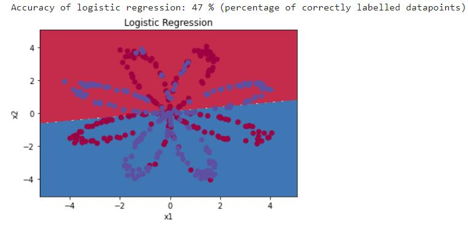

 

# 神经网络


## 神经元


## 神经网络


注意：维度间的转换

如果仅有3层，维度转换为：

输入层 3×1->隐藏层 4×1->输出层 1×1

隐藏层有两个相关参数$W^{[1]}_{4×3}，B^{[1]}_{4×1}$

输出层也有类似的相关参数$W^{[2]}_{1×4}【隐藏层有四个隐藏单元】，B^{[2]}_{1×1}$

## 神经层

$$
z=w^Tx+b\ ->\ a=\sigma(Z)\ ->\ L(a,y)
$$

### 计算过程

多个x中作用于同一个神经元从而获得$\hat y$

$X->(Z=W^TX+B->\sigma(Z))->\hat y$

# 浅层神经网络

只有一层或少量层数的神经元。

## 为什么必须使用非线性激活函数？

$$
\hat y=W_2(W_1X+b_1)+b_2
$$

$$
=W_2·W_1·X+(W_2·b_1+b_2)
$$

$$
=W·X+b
$$

由上文，线性反复迭代只能的到线性。和迭代一次效果是一样的，永远都是线性组合，还难以做到修正的效果。

这样不如直接去掉隐藏层，因为不管多少层网络都得到的只能是线性函数，无法得到非线性的。只有一个地方可以使用线性激活函数，如果g(z)=z就是你要机器学习的是回归问题。所以y是一个实数，比如说你想预测房地产价格，而y不是0和1，而是一个实数。这样线性激活函数也许是可行的，你的输入输出也都属于R。所以通常只能在输出层使用。

## 激活函数

### sigmoid函数

$\sigma(z)=\frac {1}{1+e^{-z}}$


#### 优点：

在这个函数中，中部的导数是比较大的，能够进行有效的更新。

#### 缺点：

但是如果x接近无穷，则导数会无限趋近于0，则更新会停滞。而且由下文的性质，a趋于0，梯度也会趋于零从而停滞

#### 性质：

设g(z)=a

$dg(z)=a(1-a)$。

### tanh函数

$tanh(z)=\frac{e^z-e^{-z}}{e^z+e^{-z}}$


#### 优点：

上文有说明为什么sigmoid函数（σ函数）效果不佳。

在(-1,1)范围内tanh函数比σ函数有着更好的效果，而且还有一种类似于数据中心化的效果，使得数据的平均值接近0，实际上让下一层的学习更加方便。（几乎在所有场合都更优越）。一个例外是输出层。因为如果y是0或1，那么你希望$\hat y∈(0,1)$之间更合理。而不是$(-1,1)$。所以往往只在**二元分类**(二元决策问题)用**σ激活函数**，这里将该函数作为输出层的函数。

#### 缺点：

不过这两个函数都有一个缺点：当z特别大或者特别小的时候，这个函数的斜率可能很小，趋于0。

#### 性质：

设g(z)=a

$dg(z)=1-a^2$。

### ReLU函数：

$ReLU(z)=max(0,z)$。


#### 优点：

所以在机器学习中有个很有趣的玩具，即ReLU函数，公式为a=max(0,z)。所谓的修正线性单元。现在已经变成激活函数的默认选择了。【不知道用啥时，就用它就ok】。

#### 缺点：

唯一的缺点是当z<0时导数等于0。

### leaky ReLU函数

$ReLU(z)=max(0.01z,z)$。

所以，他有个一种改进叫做带泄露的ReLU(leaky ReLU)，在z<0时，有一个很平缓的斜率。


## 反向传播算法

### 示意图


### 具体操作


## 初始化

### 法一：全部置0

$$
W^{[1]}=\left[
 \begin{matrix}
   0 & 0 \\
   0 & 0 \\
  \end{matrix} 
\right]
$$

给网络输入任何样本，$a^{[1]}_1$和$a^{[1]}_2$是一样的，即两个激活函数完全一样，对于反向传播，事实证明，处于对称性，$dz^{[1]}_1$和$dz^{[1]}_2$也是相同的。所以，
$$
W^{[2]}=\left[
 \begin{matrix}
   0 & 0 \\
  \end{matrix} 
\right]
$$

$a^{[1]}_1$和$a^{[1]}_2$节点计算完全一样的函数，称之为完全对称。


$$
dW=\left[
 \begin{matrix}
   u & v \\
   u & v \\
  \end{matrix} 
\right]
$$

$W^{[1]}=W^{[1]}-\alpha dW$由数学归纳反复迭代可以证明是完全对称的。不管梯度如何下降，都在计算完全一样的函数。


### 法二：随机初始化

这个问题的解决方案就是随机初始化所有参数。

我们可以令$W^{[1]}=np.random.randn((2,2))*0.01$

```python
rd=np.random.randn((2,2))#产生参数为(2,2)矩阵的高斯分布随机变量。
W1=rd*0.01#将权重初始化成很小的随机数,由于是用sigmoid或tanh激活函数，如果权重太大，就会跑到导数趋于0的点，就会很慢。更深的深度学习时可能需要0.01以外的常数
b1=np.zeros((2,1))#b1不影响对称性，所以置零即可
W2=np.random.randn((1,2))*0.01
b2=0
```

## 代码应用

建立你的第一个神经网络，它将有一个隐藏的层。

**要点：**

- 实现具有单个隐藏层的2类分类神经网络
- 使用具有非线性激活功能的单位，例如tanh
- 计算交叉熵损失
- 实现向前和向后传播

```python
# 导包
import numpy as np
import matplotlib.pyplot as plt
from testCases import *
import sklearn
import sklearn.datasets
import sklearn.linear_model
from planar_utils import plot_decision_boundary, sigmoid, load_planar_dataset, load_extra_datasets

%matplotlib inline

np.random.seed(1) # 设置固定种子
```

如果不在Coursera上练习没有包，我把包代码贴在下方供参考：

### **planar_utils**

```python
import matplotlib.pyplot as plt
import numpy as np
import sklearn
import sklearn.datasets
import sklearn.linear_model
 
def plot_decision_boundary(model, X, y):
    # Set min and max values and give it some padding
    x_min, x_max = X[0, :].min() - 1, X[0, :].max() + 1
    y_min, y_max = X[1, :].min() - 1, X[1, :].max() + 1
    h = 0.01
    # Generate a grid of points with distance h between them
    xx, yy = np.meshgrid(np.arange(x_min, x_max, h), np.arange(y_min, y_max, h))
    # Predict the function value for the whole grid
    Z = model(np.c_[xx.ravel(), yy.ravel()])
    Z = Z.reshape(xx.shape)
    # Plot the contour and training examples
    plt.contourf(xx, yy, Z, cmap=plt.cm.Spectral)
    plt.ylabel('x2')
    plt.xlabel('x1')
    plt.scatter(X[0, :], X[1, :], c=y[0], cmap=plt.cm.Spectral)
 
def sigmoid(x):
    """
    Compute the sigmoid of x
    Arguments:
    x -- A scalar or numpy array of any size.
    Return:
    s -- sigmoid(x)
    """
    s = 1/(1+np.exp(-x))
    return s
 
def load_planar_dataset():
    np.random.seed(1)
    m = 400 # number of examples
    N = int(m/2) # number of points per class
    D = 2 # dimensionality
    X = np.zeros((m,D)) # data matrix where each row is a single example
    Y = np.zeros((m,1), dtype='uint8') # labels vector (0 for red, 1 for blue)
    a = 4 # maximum ray of the flower
 
    for j in range(2):
        ix = range(N*j,N*(j+1))
        t = np.linspace(j*3.12,(j+1)*3.12,N) + np.random.randn(N)*0.2 # theta
        r = a*np.sin(4*t) + np.random.randn(N)*0.2 # radius
        X[ix] = np.c_[r*np.sin(t), r*np.cos(t)]
        Y[ix] = j
        
    X = X.T
    Y = Y.T
 
    return X, Y
def load_extra_datasets():  
    N = 200
    noisy_circles = sklearn.datasets.make_circles(n_samples=N, factor=.5, noise=.3)
    noisy_moons = sklearn.datasets.make_moons(n_samples=N, noise=.2)
    blobs = sklearn.datasets.make_blobs(n_samples=N, random_state=5, n_features=2, centers=6)
    gaussian_quantiles = sklearn.datasets.make_gaussian_quantiles(mean=None, cov=0.5, n_samples=N, n_features=2, n_classes=2, shuffle=True, random_state=None)
    no_structure = np.random.rand(N, 2), np.random.rand(N, 2)
    
    return noisy_circles, noisy_moons, blobs, gaussian_quantiles, no_structure

```

### testCases

```python
import numpy as np
 
 
def layer_sizes_test_case():
    np.random.seed(1)
    X_assess = np.random.randn(5, 3)
    Y_assess = np.random.randn(2, 3)
    return X_assess, Y_assess
 
 
def initialize_parameters_test_case():
    n_x, n_h, n_y = 2, 4, 1
    return n_x, n_h, n_y
 
 
def forward_propagation_test_case():
    np.random.seed(1)
    X_assess = np.random.randn(2, 3)
 
    parameters = {'W1': np.array([[-0.00416758, -0.00056267],
                                  [-0.02136196, 0.01640271],
                                  [-0.01793436, -0.00841747],
                                  [0.00502881, -0.01245288]]),
                  'W2': np.array([[-0.01057952, -0.00909008, 0.00551454, 0.02292208]]),
                  'b1': np.array([[0.],
                                  [0.],
                                  [0.],
                                  [0.]]),
                  'b2': np.array([[0.]])}
 
    return X_assess, parameters
 
 
def compute_cost_test_case():
    np.random.seed(1)
    Y_assess = np.random.randn(1, 3)
    parameters = {'W1': np.array([[-0.00416758, -0.00056267],
                                  [-0.02136196, 0.01640271],
                                  [-0.01793436, -0.00841747],
                                  [0.00502881, -0.01245288]]),
                  'W2': np.array([[-0.01057952, -0.00909008, 0.00551454, 0.02292208]]),
                  'b1': np.array([[0.],
                                  [0.],
                                  [0.],
                                  [0.]]),
                  'b2': np.array([[0.]])}
 
    a2 = (np.array([[0.5002307, 0.49985831, 0.50023963]]))
 
    return a2, Y_assess, parameters
 
 
def backward_propagation_test_case():
    np.random.seed(1)
    X_assess = np.random.randn(2, 3)
    Y_assess = np.random.randn(1, 3)
    parameters = {'W1': np.array([[-0.00416758, -0.00056267],
                                  [-0.02136196, 0.01640271],
                                  [-0.01793436, -0.00841747],
                                  [0.00502881, -0.01245288]]),
                  'W2': np.array([[-0.01057952, -0.00909008, 0.00551454, 0.02292208]]),
                  'b1': np.array([[0.],
                                  [0.],
                                  [0.],
                                  [0.]]),
                  'b2': np.array([[0.]])}
 
    cache = {'A1': np.array([[-0.00616578, 0.0020626, 0.00349619],
                             [-0.05225116, 0.02725659, -0.02646251],
                             [-0.02009721, 0.0036869, 0.02883756],
                             [0.02152675, -0.01385234, 0.02599885]]),
             'A2': np.array([[0.5002307, 0.49985831, 0.50023963]]),
             'Z1': np.array([[-0.00616586, 0.0020626, 0.0034962],
                             [-0.05229879, 0.02726335, -0.02646869],
                             [-0.02009991, 0.00368692, 0.02884556],
                             [0.02153007, -0.01385322, 0.02600471]]),
             'Z2': np.array([[0.00092281, -0.00056678, 0.00095853]])}
    return parameters, cache, X_assess, Y_assess
 
 
def update_parameters_test_case():
    parameters = {'W1': np.array([[-0.00615039, 0.0169021],
                                  [-0.02311792, 0.03137121],
                                  [-0.0169217, -0.01752545],
                                  [0.00935436, -0.05018221]]),
                  'W2': np.array([[-0.0104319, -0.04019007, 0.01607211, 0.04440255]]),
                  'b1': np.array([[-8.97523455e-07],
                                  [8.15562092e-06],
                                  [6.04810633e-07],
                                  [-2.54560700e-06]]),
                  'b2': np.array([[9.14954378e-05]])}
 
    grads = {'dW1': np.array([[0.00023322, -0.00205423],
                              [0.00082222, -0.00700776],
                              [-0.00031831, 0.0028636],
                              [-0.00092857, 0.00809933]]),
             'dW2': np.array([[-1.75740039e-05, 3.70231337e-03, -1.25683095e-03,
                               -2.55715317e-03]]),
             'db1': np.array([[1.05570087e-07],
                              [-3.81814487e-06],
                              [-1.90155145e-07],
                              [5.46467802e-07]]),
             'db2': np.array([[-1.08923140e-05]])}
    return parameters, grads
 
 
def nn_model_test_case():
    np.random.seed(1)
    X_assess = np.random.randn(2, 3)
    Y_assess = np.random.randn(1, 3)
    return X_assess, Y_assess
 
 
def predict_test_case():
    np.random.seed(1)
    X_assess = np.random.randn(2, 3)
    parameters = {'W1': np.array([[-0.00615039, 0.0169021],
                                  [-0.02311792, 0.03137121],
                                  [-0.0169217, -0.01752545],
                                  [0.00935436, -0.05018221]]),
                  'W2': np.array([[-0.0104319, -0.04019007, 0.01607211, 0.04440255]]),
                  'b1': np.array([[-8.97523455e-07],
                                  [8.15562092e-06],
                                  [6.04810633e-07],
                                  [-2.54560700e-06]]),
                  'b2': np.array([[9.14954378e-05]])}
    return parameters, X_assess

```

### 准备数据集

```python
X, Y = load_planar_dataset() 
# 画出data的分布:
plt.scatter(X[0, :], X[1, :], c=Y, s=40, cmap=plt.cm.Spectral);
```

#### 结果：


### 了解样本

```python
### START CODE HERE ### (≈ 3 lines of code)
shape_X = X.shape
shape_Y = Y.shape
m = shape_X[1]  # 训练集的size
### END CODE HERE ###

print ('The shape of X is: ' + str(shape_X))
print ('The shape of Y is: ' + str(shape_Y))
print ('I have m = %d training examples!' % (m))
```

#### 结果：

```
The shape of X is: (2, 400)
The shape of Y is: (1, 400)
I have m = 400 training examples!
```

### 简单的逻辑回归

在建立一个完整的神经网络之前，先让我们看看逻辑回归在这个问题上是如何执行的。你可以使用sklearn的内置函数来做到这一点。运行下面的代码来训练数据集上的逻辑回归分类器。

```python
# 训练logistic回归分类器
clf = sklearn.linear_model.LogisticRegressionCV();
clf.fit(X.T, Y.T);
```

上述代码可能会有警告，忽略就好，实在看不顺眼，把Y改成(\*,)的shape即可。

现在你就能初步绘制这些模型的决策边界。

### 绘制初步决策边界

```python
# Plot画出logistic回归的分界线
plot_decision_boundary(lambda x: clf.predict(x), X, Y)
plt.title("Logistic Regression")

# 打印准确度
LR_predictions = clf.predict(X.T)
print ('Accuracy of logistic regression: %d ' % float((np.dot(Y,LR_predictions) + np.dot(1-Y,1-LR_predictions))/float(Y.size)*100) +
       '% ' + "(percentage of correctly labelled datapoints)")
```

#### 结果：



### 神经网络模型

我们上面可以看出，logistic回归模型只能较好的解决二分类问题，但是对于花瓣这种多分类问题就没那么优秀了。所以使用神经网络模型，套用以下的公式：

设 $x^{(i)}$:
$$
z^{[1] (i)} =  W^{[1]} x^{(i)} + b^{[1] (i)}
$$

$$
a^{[1] (i)} = \tanh(z^{[1] (i)})
$$

$$
z^{[2] (i)} = W^{[2]} a^{[1] (i)} + b^{[2] (i)}
$$

$$
\hat{y}^{(i)} = a^{[2] (i)} = \sigma(z^{ [2] (i)})
$$

$$
y^{(i)}_{prediction} = \begin{cases} 1 & \mbox{if } a^{[2](i)} > 0.5 \\ 0 & \mbox{otherwise } \end{cases}
$$

给出所有例子的预测，你可以用如下方式计算成本 $J$: 
$$
J = - \frac{1}{m} \sum\limits_{i = 0}^{m} \large\left(\small y^{(i)}\log\left(a^{[2] (i)}\right) + (1-y^{(i)})\log\left(1- a^{[2] (i)}\right)  \large  \right) \small
$$

### 定义神经网络结构

```python
# GRADED FUNCTION: layer_sizes

def layer_sizes(X, Y):
    """
    Arguments:
    X -- input dataset of shape (input size, number of examples)
    Y -- labels of shape (output size, number of examples)
    
    Returns:
    n_x -- the size of the input layer
    n_h -- the size of the hidden layer
    n_y -- the size of the output layer
    """
    ### START CODE HERE ### (≈ 3 lines of code)
    n_x = X.shape[0] # 输入层size
    n_h = 4
    n_y = Y.shape[0] # 输出层size
    ### END CODE HERE ###
    return (n_x, n_h, n_y)
```

#### 测试

```python
X_assess, Y_assess = layer_sizes_test_case()
(n_x, n_h, n_y) = layer_sizes(X_assess, Y_assess)
print("The size of the input layer is: n_x = " + str(n_x))
print("The size of the hidden layer is: n_h = " + str(n_h))
print("The size of the output layer is: n_y = " + str(n_y))
```

#### 结果

```
The size of the input layer is: n_x = 5
The size of the hidden layer is: n_h = 4
The size of the output layer is: n_y = 2
```

### 初始化模型参数

```python
# GRADED FUNCTION: initialize_parameters

def initialize_parameters(n_x, n_h, n_y):
    """
    Argument:
    n_x -- size of the input layer
    n_h -- size of the hidden layer
    n_y -- size of the output layer
    
    Returns:
    params -- python dictionary containing your parameters:
                    W1 -- weight matrix of shape (n_h, n_x)
                    b1 -- bias vector of shape (n_h, 1)
                    W2 -- weight matrix of shape (n_y, n_h)
                    b2 -- bias vector of shape (n_y, 1)
    """
    
    np.random.seed(2) # 尽管初始化是随机的，但是我们建立了一个种子，以便输出与我们的结果匹配
    
    ### START CODE HERE ### (≈ 4 lines of code)
    W1 = np.random.randn(n_h, n_x)* 0.01
    b1 = np.zeros((n_h, 1))
    W2 = np.random.randn(n_y, n_h)* 0.01
    b2 = np.zeros((n_y, 1))
    ### END CODE HERE ###
    
    # 深度学习常见的bug就是维度异常
    # 吴恩达的经验：编码中嵌入assert代码，检测维度
    assert (W1.shape == (n_h, n_x))
    assert (b1.shape == (n_h, 1))
    assert (W2.shape == (n_y, n_h))
    assert (b2.shape == (n_y, 1))
    
    parameters = {"W1": W1,
                  "b1": b1,
                  "W2": W2,
                  "b2": b2}
    
    return parameters
```

## **循环**

### 正向传播

- 请看上面分类器的数学表达式.
- 使用`sigmoid()`.
- 使用 `np.tanh()`. 
- 您必须完成的步骤是：
	1. 通过使用 `parameters[".."]`从字典"parameters"中检索参数 ( `initialize_parameters()`的输出) .
	2. 计算 $Z^{[1]}, A^{[1]}, Z^{[2]}$ 和$A^{[2]}$ (向量运算).
- **反向传播所需的值存储在“ cache”中. **

```python
# GRADED FUNCTION: forward_propagation

def forward_propagation(X, parameters):
    """
    Argument:
    X -- input data of size (n_x, m)
    parameters -- python dictionary containing your parameters (output of initialization function)
    
    Returns:
    A2 -- The sigmoid output of the second activation
    cache -- a dictionary containing "Z1", "A1", "Z2" and "A2"
    """
    # 检索参数
    ### START CODE HERE ### (≈ 4 lines of code)
    W1 = parameters['W1']
    b1 = parameters['b1']
    W2 = parameters['W2']
    b2 = parameters['b2']
    ### END CODE HERE ###
    
    # 向前传播计算A2 (可能性)
    ### START CODE HERE ### (≈ 4 lines of code)
    Z1 = np.dot(W1, X) + b1
    A1 = np.tanh(Z1)
    Z2 = np.dot(W2, A1) + b2
    A2 = sigmoid(Z2)
    ### END CODE HERE ###
    
    assert(A2.shape == (1, X.shape[1]))
    
    cache = {"Z1": Z1,
             "A1": A1,
             "Z2": Z2,
             "A2": A2}
    
    return A2, cache
```

### 计算成本

```python
# GRADED FUNCTION: compute_cost

def compute_cost(A2, Y, parameters):
    """
    Computes the cross-entropy cost given in equation (13)
    
    Arguments:
    A2 -- The sigmoid output of the second activation, of shape (1, number of examples)
    Y -- "true" labels vector of shape (1, number of examples)
    parameters -- python dictionary containing your parameters W1, b1, W2 and b2
    
    Returns:
    cost -- cross-entropy cost given equation (13)
    """
    
    m = Y.shape[1] # number of example

    # 计算交叉熵损失
    ### START CODE HERE ### (≈ 2 lines of code)
    logprobs = np.multiply(np.log(A2),Y) + np.multiply((1-Y), (np.log(1-A2)))
    cost = -1/m * np.sum(logprobs)
    ### END CODE HERE ###
    
    cost = np.squeeze(cost)     # 确保成本cost的维度
                                # E.g., turns [[17]] into 17 
    assert(isinstance(cost, float))
    
    return cost
```

### 反向传播

```python
# GRADED FUNCTION: backward_propagation

def backward_propagation(parameters, cache, X, Y):
    """
    Implement the backward propagation using the instructions above.
    
    Arguments:
    parameters -- python dictionary containing our parameters 
    cache -- a dictionary containing "Z1", "A1", "Z2" and "A2".
    X -- input data of shape (2, number of examples)
    Y -- "true" labels vector of shape (1, number of examples)
    
    Returns:
    grads -- python dictionary containing your gradients with respect to different parameters
    """
    m = X.shape[1]
    
    # 首先，从"parameters"中查询W1，W2
    ### START CODE HERE ### (≈ 2 lines of code)
    W1 = parameters['W1']
    W2 = parameters['W2']
    ### END CODE HERE ###
        
    # 然后，从"cache"中查询A1，A2
    ### START CODE HERE ### (≈ 2 lines of code)
    A1 = cache['A1']
    A2 = cache['A2']
    ### END CODE HERE ###
    
    # 反向传播: 计算 dW1, db1, dW2, db2. 
    ### START CODE HERE ### (≈ 6 lines of code, corresponding to 6 equations on slide above)
    dZ2 = A2 - Y
    dW2 = 1/m * np.dot(dZ2, A1.T)
    db2 = 1/m * np.sum(dZ2, axis=1, keepdims=True)
    dZ1 = np.dot(W2.T, dZ2) * (1 - np.power(A1, 2))
    dW1 = 1/m * np.dot(dZ1, X.T)
    db1 = 1/m * np.sum(dZ1, axis=1, keepdims=True)
    ### END CODE HERE ###
    
    grads = {"dW1": dW1,
             "db1": db1,
             "dW2": dW2,
             "db2": db2}
    
    return grads
```

### 更新参数【优化】

```python
# GRADED FUNCTION: update_parameters

def update_parameters(parameters, grads, learning_rate = 1.2):
    """
    Updates parameters using the gradient descent update rule given above
    
    Arguments:
    parameters -- python dictionary containing your parameters 
    grads -- python dictionary containing your gradients 
    
    Returns:
    parameters -- python dictionary containing your updated parameters 
    """
    # 从"parameters"中查询W1，b1，W2,b2
    ### START CODE HERE ### (≈ 4 lines of code)
    W1 = parameters['W1']
    b1 = parameters['b1']
    W2 = parameters['W2']
    b2 = parameters['b2']
    ### END CODE HERE ###
    
    # 从"grads"中查询dW1，db1，dW2,d/b2
    ### START CODE HERE ### (≈ 4 lines of code)
    dW1 = grads["dW1"]
    db1 = grads["db1"]
    dW2 = grads["dW2"]
    db2 = grads["db2"]
    ## END CODE HERE ###
    
    # 更新W1，b1，W2,b2
    ### START CODE HERE ### (≈ 4 lines of code)
    W1 -= learning_rate * dW1
    b1 -= learning_rate * db1
    W2 -= learning_rate * dW2
    b2 -= learning_rate * db2
    ### END CODE HERE ###
    
    parameters = {"W1": W1,
                  "b1": b1,
                  "W2": W2,
                  "b2": b2}
    
    return parameters
```

### 建立神经模型

```python
# GRADED FUNCTION: nn_model

def nn_model(X, Y, n_h, num_iterations = 10000, print_cost=False):
    """
    Arguments:
    X -- dataset of shape (2, number of examples)
    Y -- labels of shape (1, number of examples)
    n_h -- size of the hidden layer
    num_iterations -- Number of iterations in gradient descent loop
    print_cost -- if True, print the cost every 1000 iterations
    
    Returns:
    parameters -- parameters learnt by the model. They can then be used to predict.
    """
    
    np.random.seed(3)
    n_x = layer_sizes(X, Y)[0]
    n_y = layer_sizes(X, Y)[2]
    
    # 初始化 parameters, 并获取 W1, b1, W2, b2. Inputs: "n_x, n_h, n_y". Outputs = "W1, b1, W2, b2, parameters".
    ### START CODE HERE ### (≈ 5 lines of code)
    n_x, n_h, n_y = layer_sizes(X, Y)
    parameters = initialize_parameters(n_x, n_h, n_y)
    W1 = parameters['W1']
    b1 = parameters['b1']
    W2 = parameters['W2']
    b2 = parameters['b2']
    ### END CODE HERE ###
    
    # Loop (gradient descent)

    for i in range(0, num_iterations):
         
        ### START CODE HERE ### (≈ 4 lines of code)
        # 正向传播. Inputs: "X, parameters". Outputs: "A2, cache".
        A2, cache = forward_propagation(X, parameters)
        
        # 成本函数. Inputs: "A2, Y, parameters". Outputs: "cost".
        cost = compute_cost(A2, Y, parameters)
 
        # 反向传播. Inputs: "parameters, cache, X, Y". Outputs: "grads".
        grads = backward_propagation(parameters, cache, X, Y)
 
        # 梯度下降并更新. Inputs: "parameters, grads". Outputs: "parameters".
        parameters = update_parameters(parameters, grads)
        
        ### END CODE HERE ###
        
        # 每1000次循环打印一次
        if print_cost and i % 1000 == 0:
            print ("Cost after iteration %i: %f" %(i, cost))

    return parameters
```

### 预测

```python
# GRADED FUNCTION: predict

def predict(parameters, X):
    """
    Using the learned parameters, predicts a class for each example in X
    
    Arguments:
    parameters -- python dictionary containing your parameters 
    X -- input data of size (n_x, m)
    
    Returns
    predictions -- vector of predictions of our model (red: 0 / blue: 1)
    """
    
    # Computes probabilities using forward propagation, and classifies to 0/1 using 0.5 as the threshold.
    ### START CODE HERE ### (≈ 2 lines of code)
    A2, cache = forward_propagation(X, parameters)
    predictions = np.array( [1 if x >0.5 else 0 for x in A2.reshape(-1,1)] ).reshape(A2.shape) # 这一行代码的作用详见下面代码示例
    ### END CODE HERE ###
    
    return predictions
```

### 分类运算画图

```python
# 建立一个有一个 n_h-维隐藏层的模型
parameters = nn_model(X, Y, n_h = 4, num_iterations = 10000, print_cost=True)

# Plot 分界线
plot_decision_boundary(lambda x: predict(parameters, x.T), X, Y)
plt.title("Decision Boundary for hidden layer size " + str(4))
```

#### 结果


### 准确率

```python
# 打印准确率
predictions = predict(parameters, X)
print ('Accuracy: %d' % float((np.dot(Y,predictions.T) + np.dot(1-Y,1-predictions.T))/float(Y.size)*100) + '%')
```

#### 结果

```
Accuracy: 90%
```

### 不同的隐藏层大小影响

```python
plt.figure(figsize=(16, 32))
hidden_layer_sizes = [1, 2, 3, 4, 5, 10, 20]
for i, n_h in enumerate(hidden_layer_sizes):
    plt.subplot(5, 2, i+1)
    plt.title('Hidden Layer of size %d' % n_h)
    parameters = nn_model(X, Y, n_h, num_iterations = 5000)
    plot_decision_boundary(lambda x: predict(parameters, x.T), X, Y)
    predictions = predict(parameters, X)
    accuracy = float((np.dot(Y,predictions.T) + np.dot(1-Y,1-predictions.T))/float(Y.size)*100)
    print ("Accuracy for {} hidden units: {} %".format(n_h, accuracy))
```


#### **解读**：

- 较大的模型（具有更多的隐藏单元）能够更好地适应训练集，直到最终的最大模型过度拟合数据。
- 最好的隐藏层大小似乎在n_h = 5左右。事实上，这里的一个值似乎很适合数据，而且不会引起显着的过度拟合。
- 您还将学习有关正则化的内容，这可以让您使用非常大的模型（如n_h = 50），而不会出现太多的过度拟合。

### 其他数据集测试

```python
# Datasets
noisy_circles, noisy_moons, blobs, gaussian_quantiles, no_structure = load_extra_datasets()

datasets = {"noisy_circles": noisy_circles,
            "noisy_moons": noisy_moons,
            "blobs": blobs,
            "gaussian_quantiles": gaussian_quantiles}


### START CODE HERE ### (choose your dataset)
i = 0
plt.figure(figsize=(8, 16))
for dataset in datasets:
    plt.subplot(4, 2, i+1)
    i += 1
    plt.title(dataset)
    ### END CODE HERE ###

    X, Y = datasets[dataset]
    X, Y = X.T, Y.reshape(1, Y.shape[0])
    
    # make blobs binary
    if dataset == "blobs":
        Y = Y%2

    # Visualize the data
    plt.scatter(X[0, :], X[1, :], c=Y, s=40, cmap=plt.cm.Spectral);
    
    
    # Build a model with a n_h-dimensional hidden layer
    parameters = nn_model(X, Y, n_h = 4, num_iterations = 10000, print_cost=False)

    # Plot the decision boundary
    plt.subplot(4, 2, i+1)
    i += 1
    plot_decision_boundary(lambda x: predict(parameters, x.T), X, Y)
    plt.title(dataset + 'Classifier')
```

#### 结果：


