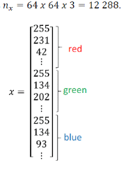
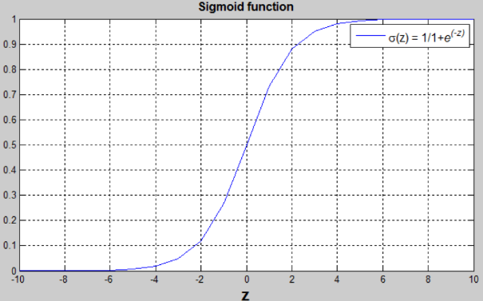
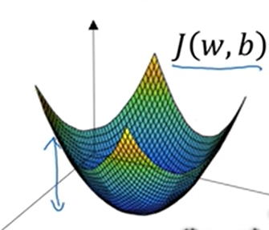
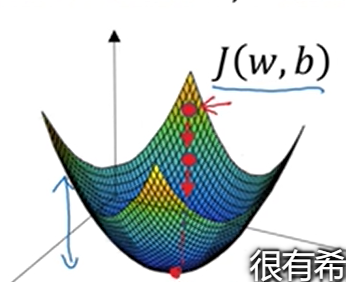
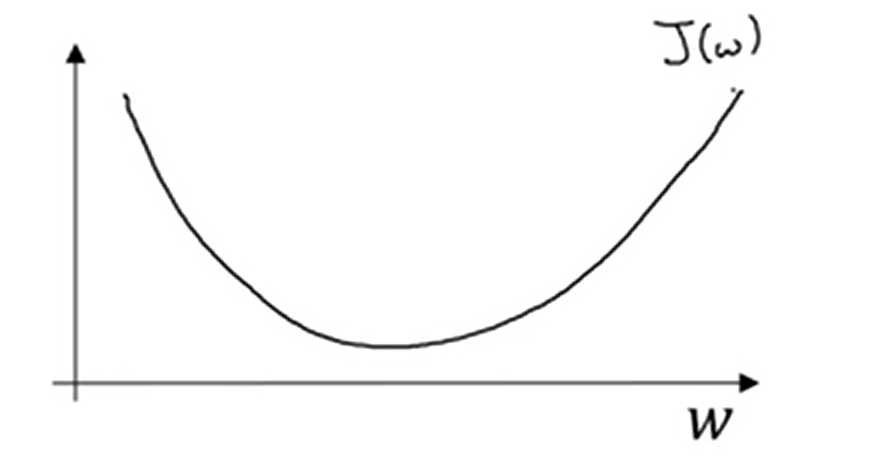
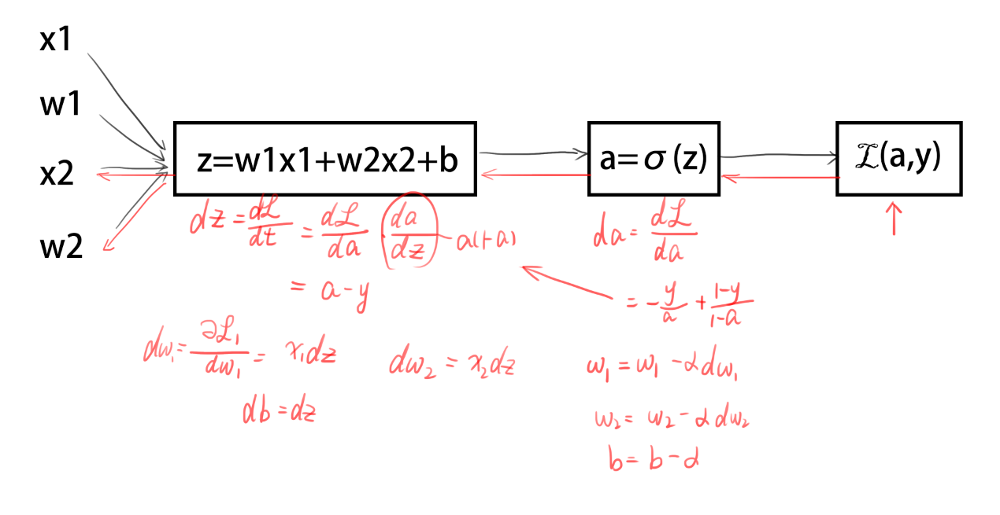

# Logistic回归

## 二分分类

| 模型（3层NN）  | 训练准确度 | 问题/评价      |
| -------------- | ---------- | -------------- |
| 零初始化       | 50%        | 不能破坏对称   |
| 大型随机初始化 | 83%        | 权重过大       |
| He初始化       | 99%        | 要求一定的方法 |

### 引子

比如有这样一张图


如果这张图判定为有小猫则输出1，否则输出0，我们用y来表示输出结果标签。

首先，图像在计算机中是由RGB三种颜色组成的。如果该图为64×64像素大小，那么就有三个64×64的矩阵。对应红绿蓝三种颜色的亮度。


把里面所有元素（即像素值）都提取出来放入一个特征向量x，那么结果就会是这样：



## 将来用到的符号

用一对(x,y)来表示一个单独的样本，x是$n_x$维的特征向量，y值为0或1。训练集由m个训练样本构成。

$（x^{(1)},y^{(1)})$表示样本1的输入与输出，$（x^{(2)},y^{(2)})$表示样本2的输入与输出.....$（x^{(m)},y^{(m)})$表示样本m的输入与输出

m为训练集总数，$m=m_{train}$，$m_{test}$表示测试集的数量。

最后用更紧凑的符号表示训练集

$$
X=\left[
 \begin{matrix}
   | & | & | & | & |\\
   | & | & | & | & | \\
   x_1 & x_2 & * & * & x_m \\
   | & | & | & | & |
  \end{matrix} 
\right]_{m×n_x}
$$

$$
Y=\left[
 \begin{matrix}
   y_1 & y_2 & * & * & y_m\\
  \end{matrix} 
\right]_{1×m}
$$

## logistic回归

已知:	x，

要求:	$\hat{y}=P(y=1|x)$

参数:	X为$n_x$维向量($x∈R^{n_x}$)，回归参数$w∈R^{n_x}$,$b∈R$

输出:	$\hat{y}=w^Tx+b$

但是因为希望$\hat{y}$为y=1的概率，所以$\hat{y}$应介于0,1之间。

所以$\hat{y}=σ(w^Tx+b)$【取sigmoid函数】。

$σ(z)=\frac{1}{1+e^{-z}}$




为了训练logistic回归模型的参数w以及b，需要定义一个成本函数。

$\hat{y}$是对一个训练样本x来说，对于每个训练样本使用这些带有圆括号的上标。方便应用说明，还有区分样本，你的训练样本(i)对应的预测值是$\hat{y}^{(i)}$是用训练样本通过sigmoid函数作用到$w^Tx+b$得到的。

### 损失函数/误差函数

可以用来衡量算法的运行情况。我们可以定义损失为$L(\hat{y},y)=\frac{(\hat{y}-y)^2}{2}$，但是大家一般不会这样做，因为之后讨论的优化问题会变成非凸的，最后会得到很多个局部最优解，梯度下降法可能找不到全局最优值。

因此，为了能够达到平方相似的目的，误差平方越小越好，我们定义损失函数为：
$$
L(\hat{y},y)=-(ylog\hat{y}+(1-y)log(1-\hat{y}))
$$
当y=1时：$L(\hat{y},y)=-log\hat{y}$ 需要$\hat{y}$足够的大，但$\hat{y}<1$,所以$\hat{y}->1$

当y=0时：$L(\hat{y},y)=-log(1-\hat{y})$ 需要$\hat{y}$足够的小，但$\hat{y}>0$,所以$\hat{y}->0$.

损失函数是在单个训练样本中定义的，它衡量了在单个训练样本上的表现。

### 成本函数（Cost Function）

它衡量的是在全体训练样本上的表现

$$
J(w,b)=\frac{\sum { L(\hat{y}^{(i)},y^{(i)})}}{m}=-\frac{\sum { y^{(i)}log\hat{y}^{(i)}+(1-y^{(i)})log(1-\hat{y}^{(i)})}}{m}
$$

损失函数只适用于单个训练样本，成本函数基于参数总成本，所以在训练logistic回归模型时，我们要找到合适的w和b是这里的成本函数J尽可能地小

### 梯度下降法

用梯度下降法训练或学习训练集上的参数w和b。

J(w,b)是在水平轴w和b上的曲面，其高度代表了J(w,b)在某一点的值。



如图，J是这样的一个凸函数。用某个初始值，初始化w和b。对于logistic回归而言，几乎任意的初始化方案都有效，通常用0。但是对于logistic回归，我们通常不这么做。但由于该函数是凸的，无论哪里初始化，都应该达到统一点火大致相同的点。梯度下降法所做的就是，从初始点开始，朝最陡的下坡方向一步步往下走，并很有希望收敛到这个（接近）全局最优解。



希望得到最小化J(w)，为了简化，首先忽略b，仅用一维曲线，代替多维曲线。



梯度下降法是这样做的：

重复执行以下的更新操作：
$$
w=w-\alpha\frac{dJ(w)}{dw}
$$


$\alpha$表示学习率，可以控制每一次迭代，可以控制每一次迭代，或者梯度下降法中的步长。之后会讨论如何选择$\alpha$。其次，在这里，这个数是导数，这就是对参数w的更新，或者变化量。代码中，我们会用dw表示导数。即:


$$
w=w-\alpha dw
$$


根据公式，该函数反复更新，会逐渐的接近最低点。


$$
w=w-\alpha\frac{dJ(w,b)}{dw}\\
b=b-\alpha\frac{dJ(w,b)}{db}
$$
例如：

$$J(a,b,c)=3(a+bc)$$当a=5,b=3,c=2时，

### 正向传播

```mermaid
graph LR

a=5-->A[v=a+u=11]
b=3-->B[u=bc=6]
c=2-->B
B-->A
A-->J=3v=33

```

### 反向传播

```mermaid
graph RL

A[v=a+u]-->C[a=5]
B[u=bc]-->b=3
B-->c=2
A-->B
D[J=3v]-->A
dv=dJ/dv=3-.-A
da=dJ/da=3-.-C
du=dJ/du=3-.-B
```

### 最小化损失函数



### 伪代码

m个样本的logistic回归

```
J=0;
for i=1 to n
	dw[i]=0
db=0;
for i=1 to m
	z[i]=w^T*x[i]+b;
	a[i]=sigmoid(z[i]);
	J+=-[(y[i])*log(a[i])+(1-y[i])*log(1-a[i])];
	dz[i]=a[i]-y[i];
	//n个w,n个feature，n个循环
	for j=1 to n
		dw[j]+=x1[i]*dz[i];
	db+=dz[i];
J/=m;
for j=1 to n
	dw[i]/=m;
db/=m;
```

$dw_1=\frac {\partial J}{\partial w_1}$

$w_1=w_1-\alpha dw_1$

$w_2=w_2-\alpha dw_2$

$b=b-\alpha db$

这样反复迭代就可以修正$w_1,w_2$,减少损失，来逼近真相

## 向量化

### 什么是向量化？

在logistic回归中你需要去计算$z=w^Tx+b$，w是列向量，x也是列向量。如果有很多特征，他们就是非常大的向量，所以w和x都是R内的$n_x$维的向量。所以去计算W'X需要向量化，后会加快其速度。

$Z=W^TX+B$

此时$W= \left[ \begin{matrix} w_1 \\ w_2 \\ \vdots \\ w_m \end{matrix} \right] $，$X= \left[ \begin{matrix} x_1 \\ x_2 \\ \vdots \\ x_m \end{matrix} \right] $。

numpy提供了优化过的向量运算，能够使原来的循环运算变得非常快。

```python
import numpy as np
z=np.dot(w.T,x)+b
```

上文的伪代码中，


```python
for i=1 to n
	dw[i]=0
```

可以写为

```python
dw=np.zero((n-x,1))
```

同样的

```python
for j=1 to n
		dw[j]+=x1[i]*dz[i];
```

可以写为

```python
dw+=x[i]*dz[i]
```

同理

```python
for j=1 to n
	dw[i]/=m;
```

可以写为

```python
dw/=m
```

当然，db的求法也有优化

```python
db=np.sum(dz)/m
```

所以，综上，所有for循环都可以用向量来代替其功能，优化其性能。

```python
z=np.dot(w.T,x)+b
A=sigmoid(z)
dz=A-Y
dw=(X*dz.T)/m
db=np.sum(dz)/m
w-=lr*dw
b-=lr*db
```

### for示例：

```python
import time
import numpy as np

x1 = [9, 2, 5, 0, 0, 7, 5, 0, 0, 0, 9, 2, 5, 0, 0]
x2 = [9, 2, 2, 9, 0, 9, 2, 5, 0, 0, 9, 2, 5, 0, 0]

### CLASSIC DOT PRODUCT OF VECTORS IMPLEMENTATION ###
tic = time.process_time()
dot = 0
for i in range(len(x1)):
    dot+= x1[i]*x2[i]
toc = time.process_time()
print ("dot = " + str(dot) + "\n ----- Computation time = " + str(1000*(toc - tic)) + "ms")

### CLASSIC OUTER PRODUCT IMPLEMENTATION ###
tic = time.process_time()
outer = np.zeros((len(x1),len(x2))) # we create a len(x1)*len(x2) matrix with only zeros
for i in range(len(x1)):
    for j in range(len(x2)):
        outer[i,j] = x1[i]*x2[j]
toc = time.process_time()
print ("outer = " + str(outer) + "\n ----- Computation time = " + str(1000*(toc - tic)) + "ms")

### CLASSIC ELEMENTWISE IMPLEMENTATION ###
tic = time.process_time()
mul = np.zeros(len(x1))
for i in range(len(x1)):
    mul[i] = x1[i]*x2[i]
toc = time.process_time()
print ("elementwise multiplication = " + str(mul) + "\n ----- Computation time = " + str(1000*(toc - tic)) + "ms")

### CLASSIC GENERAL DOT PRODUCT IMPLEMENTATION ###
W = np.random.rand(3,len(x1)) # Random 3*len(x1) numpy array
tic = time.process_time()
gdot = np.zeros(W.shape[0])
for i in range(W.shape[0]):
    for j in range(len(x1)):
        gdot[i] += W[i,j]*x1[j]
toc = time.process_time()
print ("gdot = " + str(gdot) + "\n ----- Computation time = " + str(1000*(toc - tic)) + "ms")
```

### for结果

```
dot = 278
 ----- Computation time = 0.0ms
outer = [[81. 18. 18. 81.  0. 81. 18. 45.  0.  0. 81. 18. 45.  0.  0.]
 [18.  4.  4. 18.  0. 18.  4. 10.  0.  0. 18.  4. 10.  0.  0.]
 [45. 10. 10. 45.  0. 45. 10. 25.  0.  0. 45. 10. 25.  0.  0.]
 [ 0.  0.  0.  0.  0.  0.  0.  0.  0.  0.  0.  0.  0.  0.  0.]
 [ 0.  0.  0.  0.  0.  0.  0.  0.  0.  0.  0.  0.  0.  0.  0.]
 [63. 14. 14. 63.  0. 63. 14. 35.  0.  0. 63. 14. 35.  0.  0.]
 [45. 10. 10. 45.  0. 45. 10. 25.  0.  0. 45. 10. 25.  0.  0.]
 [ 0.  0.  0.  0.  0.  0.  0.  0.  0.  0.  0.  0.  0.  0.  0.]
 [ 0.  0.  0.  0.  0.  0.  0.  0.  0.  0.  0.  0.  0.  0.  0.]
 [ 0.  0.  0.  0.  0.  0.  0.  0.  0.  0.  0.  0.  0.  0.  0.]
 [81. 18. 18. 81.  0. 81. 18. 45.  0.  0. 81. 18. 45.  0.  0.]
 [18.  4.  4. 18.  0. 18.  4. 10.  0.  0. 18.  4. 10.  0.  0.]
 [45. 10. 10. 45.  0. 45. 10. 25.  0.  0. 45. 10. 25.  0.  0.]
 [ 0.  0.  0.  0.  0.  0.  0.  0.  0.  0.  0.  0.  0.  0.  0.]
 [ 0.  0.  0.  0.  0.  0.  0.  0.  0.  0.  0.  0.  0.  0.  0.]]
 ----- Computation time = 0.0ms
elementwise multiplication = [81.  4. 10.  0.  0. 63. 10.  0.  0.  0. 81.  4. 25.  0.  0.]
 ----- Computation time = 15.625ms
gdot = [19.95612413 22.84490116 16.60013824]
 ----- Computation time = 0.0ms
```

### numpy示例

```python
x1 = [9, 2, 5, 0, 0, 7, 5, 0, 0, 0, 9, 2, 5, 0, 0]
x2 = [9, 2, 2, 9, 0, 9, 2, 5, 0, 0, 9, 2, 5, 0, 0]

### VECTORIZED DOT PRODUCT OF VECTORS ###
tic = time.process_time()
dot = np.dot(x1,x2)
toc = time.process_time()
print ("dot = " + str(dot) + "\n ----- Computation time = " + str(1000*(toc - tic)) + "ms")

### VECTORIZED OUTER PRODUCT ###
tic = time.process_time()
outer = np.outer(x1,x2)
toc = time.process_time()
print ("outer = " + str(outer) + "\n ----- Computation time = " + str(1000*(toc - tic)) + "ms")

### VECTORIZED ELEMENTWISE MULTIPLICATION ###
tic = time.process_time()
mul = np.multiply(x1,x2)
toc = time.process_time()
print ("elementwise multiplication = " + str(mul) + "\n ----- Computation time = " + str(1000*(toc - tic)) + "ms")

### VECTORIZED GENERAL DOT PRODUCT ###
tic = time.process_time()
dot = np.dot(W,x1)
toc = time.process_time()
print ("gdot = " + str(dot) + "\n ----- Computation time = " + str(1000*(toc - tic)) + "ms")
```

### 结果

```
dot = 278
 ----- Computation time = 0.0ms
outer = [[81 18 18 81  0 81 18 45  0  0 81 18 45  0  0]
 [18  4  4 18  0 18  4 10  0  0 18  4 10  0  0]
 [45 10 10 45  0 45 10 25  0  0 45 10 25  0  0]
 [ 0  0  0  0  0  0  0  0  0  0  0  0  0  0  0]
 [ 0  0  0  0  0  0  0  0  0  0  0  0  0  0  0]
 [63 14 14 63  0 63 14 35  0  0 63 14 35  0  0]
 [45 10 10 45  0 45 10 25  0  0 45 10 25  0  0]
 [ 0  0  0  0  0  0  0  0  0  0  0  0  0  0  0]
 [ 0  0  0  0  0  0  0  0  0  0  0  0  0  0  0]
 [ 0  0  0  0  0  0  0  0  0  0  0  0  0  0  0]
 [81 18 18 81  0 81 18 45  0  0 81 18 45  0  0]
 [18  4  4 18  0 18  4 10  0  0 18  4 10  0  0]
 [45 10 10 45  0 45 10 25  0  0 45 10 25  0  0]
 [ 0  0  0  0  0  0  0  0  0  0  0  0  0  0  0]
 [ 0  0  0  0  0  0  0  0  0  0  0  0  0  0  0]]
 ----- Computation time = 0.0ms
elementwise multiplication = [81  4 10  0  0 63 10  0  0  0 81  4 25  0  0]
 ----- Computation time = 0.0ms
gdot = [23.67976052 25.20760724 22.84591973]
 ----- Computation time = 0.0ms

```


可以看到向量化速度远远快于for，所以一定要尽量避免for循环。所以，以后使用for前先看看有没有numpy的内置方法【比如向量的exp方法，log方法，等等】。

### Python中的广播

$$
\left[ \begin{matrix} 
1 \\ 2 \\ 3 \\4 
\end{matrix} \right]+100=
\left[ \begin{matrix} 
1 \\ 2 \\ 3 \\4 
\end{matrix} \right]+
\left[ \begin{matrix} 
100 \\ 100 \\ 100 \\100 
\end{matrix} \right]=
\left[ \begin{matrix} 
101 \\ 102 \\ 103 \\104 
\end{matrix} \right]
$$

$$
\left[ \begin{matrix} 
1 & 2 & 3 \\ 4 & 5 & 6
\end{matrix} \right]+
\left[ \begin{matrix} 
100 \\ 200
\end{matrix} \right]=
\left[ \begin{matrix} 
1 & 2 & 3 \\ 4 & 5 & 6
\end{matrix} \right]+
\left[ \begin{matrix} 
100 & 100 & 100\\ 200 & 200 & 200
\end{matrix} \right]=
\left[ \begin{matrix} 
101 & 102 & 103\\ 204 & 205 & 206
\end{matrix} \right]
$$

#### 优点：

极其方便快捷

#### 缺点：

可能会产生一些奇怪的内在逻辑错误。

```python
a=np.random.randn(5)
print(a.shape)
```

结果就是

```
(5,)
```

然后你会发现，a和a.T是一样的向量。

但是

```python
print(np.dot(a,a.T))
```

会生成一个数字。

尽量少用形如（n,）的这种秩为1的数组，使用(n,1)确保不会出现a*a.T不会出现问题。

# Logistic回归代码：

## 导包

```python
import numpy as np
import matplotlib.pyplot as plt
import h5py
import scipy
from PIL import Image
from scipy import ndimage
#找不到lrutils文档及其使用方法，就在网上找了训练数据集即加载代替
#from lrutils import load_dataset
%matplotlib inline
```

```python
#网上下的加载器
def load_dataset():
    train_dataset = h5py.File('train_catvnoncat.h5', "r")
    train_set_x_orig = np.array(train_dataset["train_set_x"][:]) # your train set features
    train_set_y_orig = np.array(train_dataset["train_set_y"][:]) # your train set labels

    test_dataset = h5py.File('test_catvnoncat.h5', "r")
    test_set_x_orig = np.array(test_dataset["test_set_x"][:]) # your test set features
    test_set_y_orig = np.array(test_dataset["test_set_y"][:]) # your test set labels

    classes = np.array(test_dataset["list_classes"][:]) # the list of classes
    
    train_set_y_orig = train_set_y_orig.reshape((1, train_set_y_orig.shape[0]))
    test_set_y_orig = test_set_y_orig.reshape((1, test_set_y_orig.shape[0]))
    
    return train_set_x_orig, train_set_y_orig, test_set_x_orig, test_set_y_orig, classes
```

## 问题的描述: 

你拥有("data.h5")数据集，包含:

- 一个训练集包含 m_train，images 被标记为 cat (y=1) 或 non-cat (y=0)
- 一个测试集包含 m_test，images 被标记为 cat 或 non-cat
- 每张图片都满足shape (num_px, num_px, 3) 3:3个通道(RGB). 因此，每个图像height = num_px，width = num_px。

你将构建一个简单的图像识别算法，可以正确地将图片分类为猫或非猫。下面开始加载数据。

```python
# 加载数据 (cat/non-cat)
train_set_x_orig, train_set_y, test_set_x_orig, test_set_y, classes = load_dataset()
```

下面开始测试数据集

```python
# Example of a picture
index = 5
plt.imshow(train_set_x_orig[index])
print ("y = " + str(train_set_y[:, index]) + ", it's a '" + classes[np.squeeze(train_set_y[:, index])].decode("utf-8") +  "' picture.")
```

结果是这样的：


## 查看变量及shape测试【防止bug】

 - m_train (训练样本的数量)
 - m_test (测试样本的数量)
 - num_px (训练集的高和宽)
	记住 `train_set_x_orig` 是一个numpy-array，他的shape为 (m_train, num_px, num_px, 3). 比如，你可以通过 `m_train=train_set_x_orig.shape[0]`来表现训练集的数量。

```python
### START CODE HERE ### (≈ 3 lines of code)
m_train = train_set_x_orig.shape[0]
m_test = test_set_x_orig.shape[0]
num_px = train_set_x_orig.shape[1]
### END CODE HERE ###

print ("Number of training examples: m_train = " + str(m_train))
print ("Number of testing examples: m_test = " + str(m_test))
print ("Height/Width of each image: num_px = " + str(num_px))
print ("Each image is of size: (" + str(num_px) + ", " + str(num_px) + ", 3)")
print ("train_set_x shape: " + str(train_set_x_orig.shape))
print ("train_set_y shape: " + str(train_set_y.shape))
print ("test_set_x shape: " + str(test_set_x_orig.shape))
print ("test_set_y shape: " + str(test_set_y.shape))
```

结果是这样的

```
Number of training examples: m_train = 209
Number of testing examples: m_test = 50
Height/Width of each image: num_px = 64
Each image is of size: (64, 64, 3)
train_set_x shape: (209, 64, 64, 3)
train_set_y shape: (1, 209)
test_set_x shape: (50, 64, 64, 3)
test_set_y shape: (1, 50)
```

现在，将shape为$(num_{px}, num_{px}, 3)$的三维矩阵进行预处理【扁平化】， 转换为shape为$(num_{px} * num_{px} * 3, 1)$的向量方便后续操作。

```python
# Reshape训练数据并且进行简单测试

### START CODE HERE ### (≈ 2 lines of code)
train_set_x_flatten = train_set_x_orig.reshape(train_set_x_orig.shape[0], -1).T
test_set_x_flatten = test_set_x_orig.reshape(test_set_x_orig.shape[0], -1).T
### END CODE HERE ###

print ("train_set_x_flatten shape: " + str(train_set_x_flatten.shape))
print ("train_set_y shape: " + str(train_set_y.shape))
print ("test_set_x_flatten shape: " + str(test_set_x_flatten.shape))
print ("test_set_y shape: " + str(test_set_y.shape))
print ("sanity check after reshaping: " + str(train_set_x_flatten[0:5,0]))
```

结果:

```
train_set_x_flatten shape: (12288, 209)
train_set_y shape: (1, 209)
test_set_x_flatten shape: (12288, 50)
test_set_y shape: (1, 50)
sanity check after reshaping: [17 31 56 22 33]
```

## 标准化

为了表示彩色图像，必须为每个像素指定红色，绿色和蓝色通道（RGB），因此像素值实际上是从0到255的三个数字的向量。

机器学习中一个常见的预处理步骤是对数据集进行中心化和标准化，这意味着您从每个示例中减去整个numpy数组的平均值，然后将每个示例除以整个numpy数组的标准偏差。但是对于图片数据集来说，它更简单，更方便，几乎可以将数据集的每一行除以255（像素通道的最大值）。

所以让我们标准化我们的数据集。

```python
train_set_x = train_set_x_flatten/255.
test_set_x = test_set_x_flatten/255.
```

## 你需要记住的是：!!

### 预处理

面对一个新的数据集，常见的**预处理**步骤如下：

- 辨清**维度**以及问题的shape(m_train, m_test, num_px, ...)
- 将数据集从几个一维向量**reshape**成可使用的矩阵 (num_px \* num_px \* 3, 1)
- "**标准化**"数据

### 建立神经网络

建立神经网络的**主要步骤**是：

1. 定义模型结构（如输入特征的个数）
2. 初始化模型的参数
3. 循环：

  - 计算当前成本（正向传播）
  - 计算当前梯度（反向传播）
  - 更新参数（梯度下降）

我们经常分别建立1-3，并把它们整合到我们所说的一个函数中model()。

首先，我们先自己使用numpy构造一个sigmoid函数，即$\sigma(z)=\frac {1}{1+e^{-z}}$。

```python
# 子函数: sigmoid

def sigmoid(z):
    """
    Compute the sigmoid of z

    Arguments:
    z -- A scalar or numpy array of any size.

    Return:
    s -- sigmoid(z)
    """

    ### START CODE HERE ### (≈ 1 line of code)
    s = 1 / (1 + np.exp(-z))
    ### END CODE HERE ###
    
    return s
```

## 初始化函数

下面构造初始化函数【构建一个全0向量】

```python
# 子函数: initialize_with_zeros

def initialize_with_zeros(dim):
    """
    This function creates a vector of zeros of shape (dim, 1) for w and initializes b to 0.
    
    Argument:
    dim -- size of the w vector we want (or number of parameters in this case)
    
    Returns:
    w -- initialized vector of shape (dim, 1)
    b -- initialized scalar (corresponds to the bias)
    """
    
    ### START CODE HERE ### (≈ 1 line of code)
    w = np.zeros((dim, 1))
    b = 0
    ### END CODE HERE ###

    assert(w.shape == (dim, 1))
    assert(isinstance(b, float) or isinstance(b, int))
    
    return w, b
```

## 传播

```python
# 子函数: propagate

def propagate(w, b, X, Y):
    """
    Implement the cost function and its gradient for the propagation explained above

    Arguments:
    w -- weights, a numpy array of size (num_px * num_px * 3, 1)
    b -- bias, a scalar
    X -- data of size (num_px * num_px * 3, number of examples)
    Y -- true "label" vector (containing 0 if non-cat, 1 if cat) of size (1, number of examples)

    Return:
    cost -- negative log-likelihood cost for logistic regression
    dw -- gradient of the loss with respect to w, thus same shape as w
    db -- gradient of the loss with respect to b, thus same shape as b
    
    Tips:
    - Write your code step by step for the propagation. np.log(), np.dot()
    """
    
    m = X.shape[1]
    
    # 正向反馈(从 X 得到 COST)
    ### START CODE HERE ### (≈ 2 lines of code)
    # 激活函数
    A = sigmoid(np.dot(w.T, X) + b) 
    # 计算成本函数
    cost = -1 / m * np.sum(Y * np.log(A) + (1 - Y) * np.log(1 - A))    
    ### END CODE HERE ###
    
    # 反向传播(求梯度)
    ### START CODE HERE ### (≈ 2 lines of code)
    dw = 1 / m * np.dot(X, (A - Y).T)
    db = 1 / m * np.sum(A - Y)
    ### END CODE HERE ###
    assert(dw.shape == w.shape)
    assert(db.dtype == float)
    cost = np.squeeze(cost)
    assert(cost.shape == ())
    
    grads = {"dw": dw,
             "db": db}
    
    return grads, cost
```

## 优化器

来回修改w和b【感觉就是在相互磨合】，不断优化w和b的值，是其更加贴近预测。

```python
# 子函数: optimize

def optimize(w, b, X, Y, num_iterations, learning_rate, print_cost = False):
    """
    This function optimizes w and b by running a gradient descent algorithm
    
    Arguments:
    w -- weights, a numpy array of size (num_px * num_px * 3, 1)
    b -- bias, a scalar
    X -- data of shape (num_px * num_px * 3, number of examples)
    Y -- true "label" vector (containing 0 if non-cat, 1 if cat), of shape (1, number of examples)
    num_iterations -- number of iterations of the optimization loop
    learning_rate -- learning rate of the gradient descent update rule
    print_cost -- True to print the loss every 100 steps
    
    Returns:
    params -- dictionary containing the weights w and bias b
    grads -- dictionary containing the gradients of the weights and bias with respect to the cost function
    costs -- list of all the costs computed during the optimization, this will be used to plot the learning curve.
    
    Tips:
    You basically need to write down two steps and iterate through them:
        1) Calculate the cost and the gradient for the current parameters. Use propagate().
        2) Update the parameters using gradient descent rule for w and b.
    """
    
    costs = []
    
    for i in range(num_iterations):
        
        
        # 计算grads, cost的值 (≈ 1-4 lines of code)
        ### START CODE HERE ### 
        grads, cost = propagate(w, b, X, Y)
        ### END CODE HERE ###
        
        # 获得w和b的梯度
        dw = grads["dw"]
        db = grads["db"]
        
        # 更新w和b(≈ 2 lines of code)
        ### START CODE HERE ###
        w = w - learning_rate * dw
        b = b - learning_rate * db
        ### END CODE HERE ###
        
        # 记录成本
        if i % 100 == 0:
            costs.append(cost)
        
        # 每100次训练打印一次成本
        if print_cost and i % 100 == 0:
            print ("Cost after iteration %i: %f" %(i, cost))
    
    params = {"w": w,
              "b": b}
    
    grads = {"dw": dw,
             "db": db}
    
    return params, grads, costs
```

## 预测函数

```python
# 子函数: predict

def predict(w, b, X):
    '''
    Predict whether the label is 0 or 1 using learned logistic regression parameters (w, b)
    
    Arguments:
    w -- weights, a numpy array of size (num_px * num_px * 3, 1)
    b -- bias, a scalar
    X -- data of size (num_px * num_px * 3, number of examples)
    
    Returns:
    Y_prediction -- a numpy array (vector) containing all predictions (0/1) for the examples in X
    '''
    
    m = X.shape[1]
    Y_prediction = np.zeros((1,m))
    w = w.reshape(X.shape[0], 1)
    
    # 计算向量"A"【正向传播】预测可能是猫猫的概率
    ### START CODE HERE ### (≈ 1 line of code)
    A = sigmoid(np.dot(w.T, X) + b)
    ### END CODE HERE ###

    for i in range(A.shape[1]):
        
        # 将 A[0,i] 映射到 p[0,i]的01序列
        ### START CODE HERE ### (≈ 4 lines of code)
        if A[0, i] <= 0.5:
            Y_prediction[0, i] = 0
        else:
            Y_prediction[0, i] = 1
        ### END CODE HERE ###
    
    assert(Y_prediction.shape == (1, m))
    
    return Y_prediction
```

## 模型层

最后，终于到了拼积木的时候了【组装函数构建模型】

```python
# 函数: model

def model(X_train, Y_train, X_test, Y_test, num_iterations = 2000, learning_rate = 0.5, print_cost = False):
    """
    Builds the logistic regression model by calling the function you've implemented previously
    
    Arguments:
    X_train -- training set represented by a numpy array of shape (num_px * num_px * 3, m_train)
    Y_train -- training labels represented by a numpy array (vector) of shape (1, m_train)
    X_test -- test set represented by a numpy array of shape (num_px * num_px * 3, m_test)
    Y_test -- test labels represented by a numpy array (vector) of shape (1, m_test)
    num_iterations -- hyperparameter representing the number of iterations to optimize the parameters
    learning_rate -- hyperparameter representing the learning rate used in the update rule of optimize()
    print_cost -- Set to true to print the cost every 100 iterations
    
    Returns:
    d -- dictionary containing information about the model.
    """
    
    ### START CODE HERE ###
    
    # 0向量初始化(≈ 1 line of code)
    w, b = initialize_with_zeros(X_train.shape[0])

    # 梯度下降(≈ 1 line of code)
    parameters, grads, costs = optimize(w, b, X_train, Y_train, num_iterations, learning_rate, print_cost)
    
    # 从"parameters"取出参数w,b
    w = parameters["w"]
    b = parameters["b"]
    
    # 预测测试和训练集(≈ 2 lines of code)
    Y_prediction_test = predict(w, b, X_test)
    Y_prediction_train = predict(w, b, X_train)

    ### END CODE HERE ###

    # 打印准确度
    print("train accuracy: {} %".format(100 - np.mean(np.abs(Y_prediction_train - Y_train)) * 100))
    print("test accuracy: {} %".format(100 - np.mean(np.abs(Y_prediction_test - Y_test)) * 100))

    
    d = {"costs": costs,
         "Y_prediction_test": Y_prediction_test, 
         "Y_prediction_train" : Y_prediction_train, 
         "w" : w, 
         "b" : b,
         "learning_rate" : learning_rate,
         "num_iterations": num_iterations}
    
    return d
```

好了，到了激动人心的训练时刻了！！开始训练！！

```python
d = model(train_set_x, train_set_y, test_set_x, test_set_y, num_iterations = 2000, learning_rate = 0.005, print_cost = True)
```

## 训练结果：

```
Cost after iteration 0: 0.693147
Cost after iteration 100: 0.584508
Cost after iteration 200: 0.466949
Cost after iteration 300: 0.376007
Cost after iteration 400: 0.331463
Cost after iteration 500: 0.303273
Cost after iteration 600: 0.279880
Cost after iteration 700: 0.260042
Cost after iteration 800: 0.242941
Cost after iteration 900: 0.228004
Cost after iteration 1000: 0.214820
Cost after iteration 1100: 0.203078
Cost after iteration 1200: 0.192544
Cost after iteration 1300: 0.183033
Cost after iteration 1400: 0.174399
Cost after iteration 1500: 0.166521
Cost after iteration 1600: 0.159305
Cost after iteration 1700: 0.152667
Cost after iteration 1800: 0.146542
Cost after iteration 1900: 0.140872
train accuracy: 99.04306220095694 %
test accuracy: 70.0 %
```

## 自己测试看看：

```python
# 看看图片是否被正确识别的样例
index = 1
plt.imshow(test_set_x[:,index].reshape((num_px, num_px, 3)))
print ("y = " + str(test_set_y[0,index]) + ", you predicted that it is a \"" + classes[int(d["Y_prediction_test"][0,index])].decode("utf-8") +  "\" picture.")
```

### 结果：


plot它的成本函数图像

```python
# Plot学习曲线 (with costs)
costs = np.squeeze(d['costs'])
plt.plot(costs)
plt.ylabel('cost')
plt.xlabel('iterations (per hundreds)')
plt.title("Learning rate =" + str(d["learning_rate"]))
plt.show()
```

结果：


## 深度分析：

为了使梯度下降起作用，我们必须明智地选择学习速度。学习率 α 决定了我们更新参数的速度。如果学习率太高，我们可能会“超过”最优值。同样，如果它太小，我们将需要太多迭代来收敛到最佳值。这就是为什么使用良好的学习率至关重要。

下面，我们对不同学习率下的

```python
learning_rates = [0.01, 0.001, 0.0001]
models = {}
for i in learning_rates:
    print ("learning rate is: " + str(i))
    models[str(i)] = model(train_set_x, train_set_y, test_set_x, test_set_y, num_iterations = 1500, learning_rate = i, print_cost = False)
    print ('\n' + "-------------------------------------------------------" + '\n')

for i in learning_rates:
    plt.plot(np.squeeze(models[str(i)]["costs"]), label= str(models[str(i)]["learning_rate"]))

plt.ylabel('cost')
plt.xlabel('iterations')

legend = plt.legend(loc='upper center', shadow=True)
frame = legend.get_frame()
frame.set_facecolor('0.90')
plt.show()
```

### 结果：


由上面的图可以看出，不同的学习率会带来不同的成本，因此会出现不同的预测结果。如果学习率太大(0.01)，成本可能会上下波动。它甚至可能会偏离(尽管在本例中，使用0.01最终仍然会以较好的成本结束)。

更低的成本并不意味着更好的模型。你必须检查是否会产生过拟合。当训练精度远远高于测试精度时就会发生这种情况。所以在深度学习中，通常建议选择更好地最小化成本函数的学习率。

## 测试自己的图片

注：由于scipy的更新，许多api已经不能使用，这里做了一些替换，

```python
import imageio
from skimage.transform import resize
## START CODE HERE ## (PUT YOUR IMAGE NAME) 
my_image = "cat1.jpg"   # change this to the name of your image file 
## END CODE HERE ##

# We preprocess the image to fit your algorithm.
fname =  "images/" +my_image
image = np.array(imageio.imread(fname))

my_image = resize(image, output_shape=(num_px,num_px)).reshape((1, num_px*num_px*3)).T
my_predicted_image = predict(d["w"], d["b"], my_image)

plt.imshow(image)
print("y = " + str(np.squeeze(my_predicted_image)) + ", your algorithm predicts a \"" + classes[int(np.squeeze(my_predicted_image)),].decode("utf-8") +  "\" picture.")
```


### 结果

