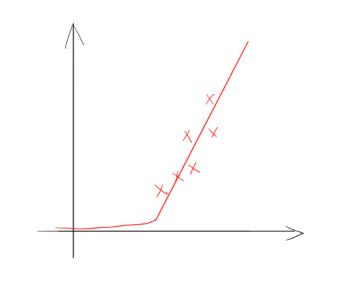
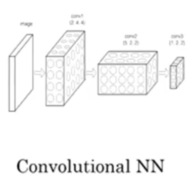
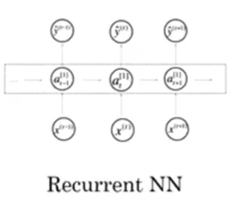
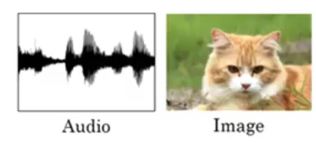
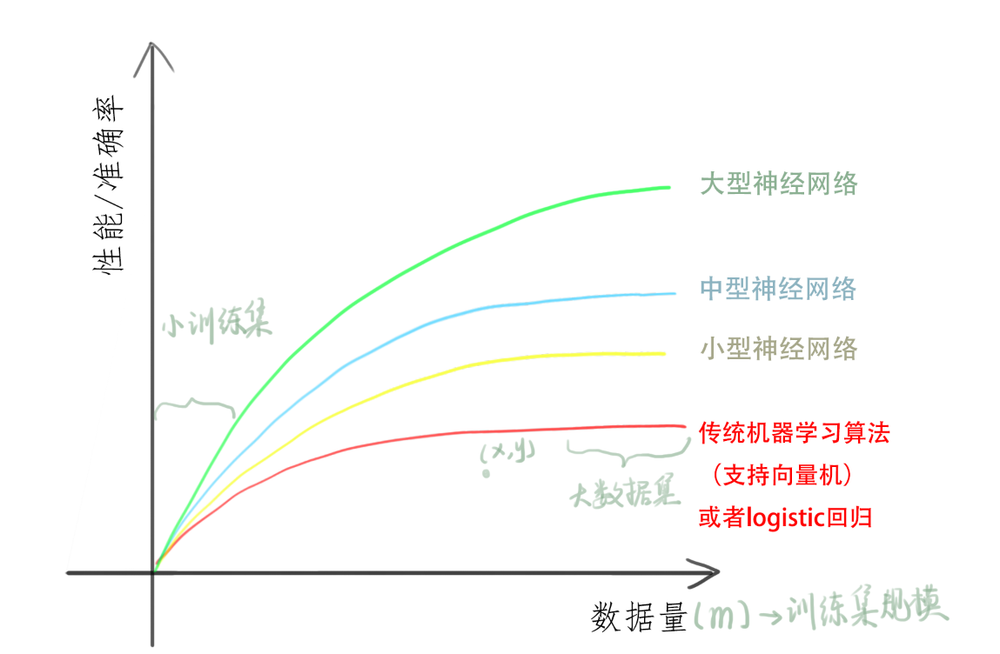
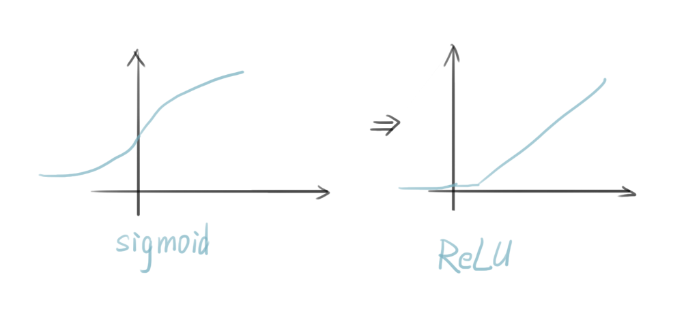

# 概论

## 深度学习是什么？

深度学习指的是训练很大的神经网络

## 神经网络是什么？

房价预测模型

假设有6间房屋的数据集（房屋面积s已知,价格已知）

想要找到一个函数能够很好地预测房价的趋势 

如果你懂得线性回归，就可以拟合一条曲线

由于房价永远不为负，所以纯粹的直线不大合适

这个房屋加上拟合曲线，看城市一个非常简单的神经网络。

### 神经元

我们把房屋的面积，作为神经网络的输入x，通过一个节点，最后输出了价格y，这个节点就是独立的**神经元**

这个神经元所做的就是输入面积，进行线性运算，取不小于0的值最后得到输出预测价格。

### ReLU函数

形如上文的这种函数，被称为ReLU函数（修正线性单元）rectified linear unit。修正指的是取不小于0的值

### 神经网络

把这些单个的神经元堆叠，就形成了一张网络，及神经网络

同样的，如果不仅仅是房屋的面积，我们还知道一些其他的特征影响房价信息。比如卧室数量（影响家庭人口数量），邮编（影响高度步行化，学校质量），富裕程度（影响学校质量）

$x_i$为输入层， 中间三个圈称为隐藏单元，每个输入都同时来自四个特征（中间连接数很高）需要给予足够的x，y训练样本，神经网络就能计算从x到y的精准映射函数

## 监督学习

| 输入(x)   | 输出(y)        | 应用         |                                    |
| --------- | -------------- | ------------ | ---------------------------------- |
| 房产状况  | 价格           | 预测评估房价 | Standard NN                        |
| 用户信息  | 是否推送广告   | 在线广告     | Standard NN                        |
| 图像      | 判断物体       | 图像识别     | CNN                                |
| 音频      | 文本           | 语音识别     | RNN                                |
| 英语      | 中文           | 机器翻译     | RNNs                               |
| 图像+雷达 | 与其他车的距离 | 自动驾驶     | Hybrid neural network architecture |

对于序列数据，比如音频中的时间元素，音频是随着时间播放的，所以音频很自然的被表示为一维时间序列，对于序列数据，经常使用RNN循环神经网络。语言英语汉语字母或单词都是逐个出现的。所以语言最自然的表示方式也是序列数据。更为复杂的RNNs往往会应用这些方面。

更加复杂的如无人驾驶等等，包含图像(经常使用CNN卷积神经网络架构处理)，雷达（其他类型）等信息会使用更加复杂的混合神经网络结构

### 图例

#### Standard NN

#### CNN

#### RNN

### 结构化数据

有一定结构存放的数据

### 非结构化数据

例如图片，音频等信息数据

多亏机器学习和深度学习，计算机现在能够更好的解释非结构化数据。同时也创造出了大量的应用场景，如语音识别，图像识别，自然语言文字处理。神经网络在很多短期经济价值的创造是基于结构化数据的，比如更好的广告，更好的获利建议。所以对于结构化数据，神经网络有更好的能力去处理海量的数据库。

## 深度学习的性能

### 数据规模驱动

### 计算性能提升

### 算法改进

使卷积神经网络更快。

例如对于sigmoid函数，在两段倒数会无限趋近于0，学习效率会大大减慢，通过改变激活函数，将其优化成ReLU，使梯度下降法更快

### 实践过程

