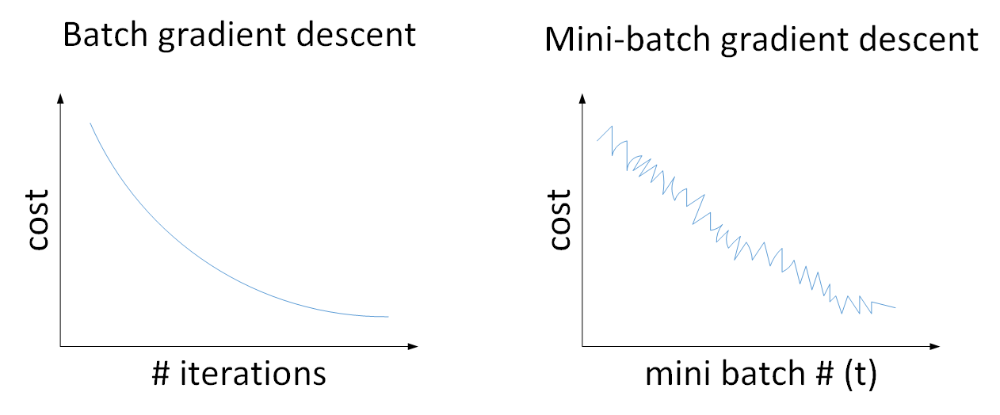
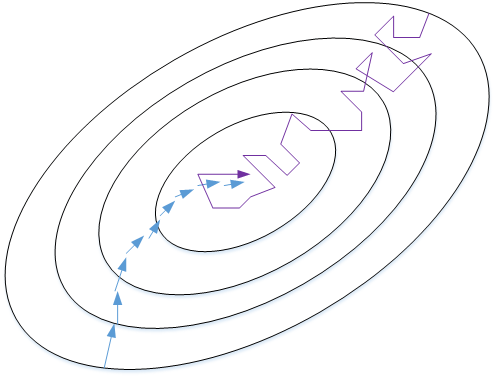
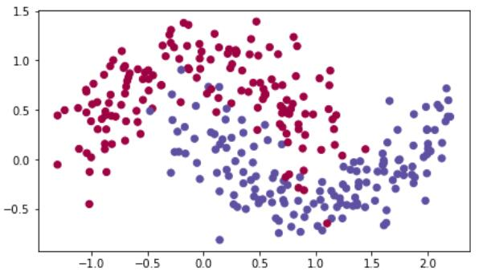

# 优化算法

本节课，我们将继续讨论深度神经网络中的一些优化算法，通过使用这些技巧和方法来提高神经网络的训练速度和精度。

##  Mini-batch梯度下降法

之前我们介绍的神经网络训练过程是对所有m个样本，称为batch，通过**向量化**计算方式。

同时进行的。如果m很大，例如达到百万数量级，训练速度往往会很慢，因为每次迭代都要对所有样本进行进行求和运算和矩阵运算。

为了解决这一问题，我们可以把m个训练样本分成若干个子集，称为mini-batch，这样每个子集包含的数据量就小了。

例如只有1000，然后每次在单一子集上进行神经网络训练，速度就会大大提高。这种梯度下降算法叫做Mini-batch梯度下降法。

假设总的训练样本个数m=5,000,000，其维度为$(n_x,m)$。将其分成5,000个子集，每个mini-batch含有1000个样本。我们将每个mini-batch记为$X^{\{t\}}$，其维度为$(n_x,1000)$。相应的每个mini-batch的输出记为$Y^{\{t\}}$，其维度为$(1,1000)$，且$t=1,2,⋯,5000$。

### 字母的上标含义：

- **$X^{(i)}$ ：第i个训练集里的值**
- **$Z^{[l]}$：神经网络第l层网络的线性输出**
- **$X^{\{t\}},Y^{\{t\}}$：第t组mini-batch**

### 流程

 Mini-batch梯度下降法的实现过程是先将总的训练样本分成T个子集（mini-batches），然后对每个mini-batch进行神经网络训练，包括正向传播，计算成本，反向传播，循环至T个mini-batch都训练完毕。

#### 伪代码:

```python
for t in range(1,T):
	#正向传播
    z[1]=w[1]x[t]+b[1]
    a[1]=g[1](z[1])
    ...
    a[l]=g[l](z[l])
	#计算成本
    J{t}=1/1000*sum(loss(y_hat(i),y(i))+λ/(2*1000)*sum(F(w[t])^2)
	#反向传播
    ....
	w=w-lr*dw
	b=b-lr*db
```

#### 应用拓展

经过T次循环之后，所有m个训练样本都进行了梯度下降计算。这个过程，我们称之为经历了一个**epoch**。

对于非划分的Batch 梯度下降而言，一个epoch只进行一次梯度下降算法；而Mini-Batches 梯度下降，一个epoch会进行T次梯度下降算法。

值得一提的是，对于Mini-Batch梯度下降，可以进行多次epoch训练。而且，每次epoch，最好是将总体训练数据重新打乱、重新分成T组mini-batch，这样有利于训练出最佳的神经网络模型。

#### 理解含义：

Batch梯度下降和Mini-batch梯度下降的成本曲线如下图所示：



对于一般的神经网络模型，使用Batch梯度下降，随着迭代次数增加，cost是不断减小的。然而，使用Mini-batch梯度下降，随着在不同的mini-batch上迭代训练，其**成本**不是单调下降，而是受类似**噪声**的影响，出现振荡。但整体的趋势是下降的，最终也能得到较低的成本值。

之所以出现细微振荡的原因是不同的mini-batch之间是有差异的。例如可能第一个子集$(X^{\{1\}},Y^{\{1\}})$是好的子集，而第二个子集$(X^{\{2\}},Y^{\{2\}})$包含了一些噪声noise。出现细微振荡是正常的。

如何选择每个mini-batch的大小，即包含的样本个数呢？

有两个极端：

如果mini-batch size=m，即为Batch梯度下降，只包含一个子集为$(X^{\{1\}},Y^{\{1\}})=(X,Y)$；

如果mini-batch size=1，即为随机梯度下降(Stachastic gradient descent)，每个样本就是一个子集$(X^{\{1\}},Y^{\{1\}})=(x^{(1)},x^{(1)})$，共有m个子集。

如下图所示，蓝色的线代表Batch梯度下降。这样梯度下降会比较平稳地接近全局最小值，但是因为使用了所有m个样本，每次前进的速度有些慢。

紫色的线代表随机梯度下降。每次前进速度很快，但是路线曲折，有较大的振荡，最终会在最小值附近来回波动，难以真正达到最小值处。而且在数值处理上就不能使用向量化的方法来提高运算速度。



实际使用中，mini-batch size不能设置得太大，也不能设置得太小。

这样，相当于结合了二者的优点，既能使用向量化优化算法，又能叫快速地找到最小值。

mini-batch梯度下降的梯度下降曲线如下图绿色所示，每次前进速度较快，且振荡较小，基本能接近全局最小值。


一般来说，如果总体样本数量m不太大时，例如$m≤200$，建议直接使用Batch反向传播。

如果总体样本数量m很大时，建议将样本分成许多mini-batch。推荐常用的mini-batch的size为64,128,256,512。这些都是2的幂。之所以这样设置的原因是计算机存储数据一般是2的幂，这样设置可以提高运算速度。


## 指数加权平均

### 引例

举个例子，记录半年内伦敦市的气温变化，并在二维平面上绘制出来，如下图所示：


看上去，温度数据似乎有noise，而且抖动较大。如果我们希望看到半年内气温的整体变化趋势，可以通过移动平均（moving average）的方法来对每天气温进行平滑处理。

例如我们可以设$V_0=0$，当成第0天的气温值。

第一天的气温与第0天的气温有关：

$$
V_1=0.9V_0+0.1θ_1
$$


第二天的气温与第一天的气温有关：

$$
V_2=0.9V_1+0.1θ_2=0.9(0.9V_0+0.1θ_1)+0.1θ_2
$$


第三天的气温与第二天的气温有关：
$$
V3=0.9V_2+0.1θ_3
$$
$$
= 0.9(0.9^2 V_0+0.9⋅0.1θ_1+0.1θ_2)+0.1θ_3 
$$

$$
=0.9^3 V_0+0.9^2⋅0.1θ_1+0.9⋅0.1θ_2+0.1θ_3
$$


即第t天与第t-1天的气温迭代关系为：

$$
V_t=0.9V_{t−1}+0.1θ_t
$$

$$
=0.9^tV_0+0.9^{t−1}⋅0.1θ_1+0.9^{t−2}⋅0.1θ_2+⋯+0.9⋅0.1θ_{t−1}+0.1θ_t
$$

经过移动平均处理得到的气温如下图红色曲线所示：


这种滑动平均算法称为指数加权平均（exponentially weighted average）。根据之前的推导公式，其一般形式为：

$$
V_t=βV_{t−1}+(1−β)θ_t
$$
上面的例子中，β=0.9。β值决定了指数加权平均的天数，近似表示为:$\frac{1}{1−β}$

例如，当β=0.9，则$\frac{1}{1−β}$=10，表示将前10天进行指数加权平均。当β=0.98，则$\frac{1}{1−β}$=50，表示将前50天进行指数加权平均。β值越大，则指数加权平均的天数越多，平均后的趋势线就越平缓，但是同时也会向右平移。下图绿色曲线和黄色曲线分别表示了β=0.98和β=0.5时，指数加权平均的结果。


这里简单解释一下公式$\frac{1}{1−β}$是怎么来的。准确来说，指数加权平均算法跟之前所有天的数值都有关系，根据之前的推导公式就能看出。但是指数是衰减的，一般认为衰减到$\frac{1}{e}$就可以忽略不计了。因此，根据之前的推导公式，我们只要证明

$$
\beta^{\frac{1}{1−\beta}}\approx \frac 1 e
$$
易知：
$$
\lim_{N\rightarrow \infty}(1-\frac 1 N)^N=\frac 1 e
$$
所以当$N=\frac 1 {1-\beta}$时，$\lim_{\beta\rightarrow 1}N=\infty$显然是成立的，

至此，简单解释完毕。

### 理解含义

我们将指数加权平均公式的一般形式写下来：
$$
V_t=βV_{t−1}+(1−β)θ_t
$$

$$
=(1−β)θ_t+(1−β)⋅β⋅θ_{t−1}+(1−β)⋅β^2⋅θ_{t−2}+...+(1−β)⋅β^{t−1}⋅θ_1+β^t⋅V_0
$$

观察上面这个式子，$θ_t,θ_{t−1},⋯,θ_1$是原始数据值，$(1−β),(1−β)β,(1−β)β^2,⋯(1−β)β^{t−1}$,是类似指数曲线，从右向左，呈指数下降的。

$V_t$的值就是这两个子式的点乘，将原始数据值与衰减指数点乘，相当于做了指数衰减，离得越近(指数t越小)，影响越大，离得越远(指数t越大)，影响越小，衰减越厉害。


我们已经知道了指数加权平均的递推公式。实际应用中，为了减少内存的使用，我们可以使用这样的语句来实现指数加权平均算法：

$V_θ=0$

$Repeat \{$

​	$Get next θ_t $

​	$V_θ:=βV_θ+(1−β)θ_t$

$\}$

### 指数加权平均的偏差修正

上文中提到当$\beta=0.98$时，指数加权平均结果如下图绿色曲线所示。但是实际上，真实曲线如紫色曲线所示。


我们注意到，紫色曲线与绿色曲线的区别是，紫色曲线开始的时候相对较低一些。这是因为开始时我们设置$V_0=0$，所以初始值会相对小一些，直到后面受前面的影响渐渐变小，趋于正常。

修正这种问题的方法是进行偏移校正（bias correction），即在每次计算完$V_t$后，对$V_t$进行下式处理
$$
\frac{V_t}{1−β^t}
$$
在刚开始的时候，t比较小，$(1−β^t)<1$，这样就将$V_t$修正得更大一些，效果是把紫色曲线开始部分向上提升一些，与绿色曲线接近重合。

随着t增大，$(1−β^t)≈1$，$V_t$基本不变，紫色曲线与绿色曲线依然重合。这样就实现了简单的偏移校正，得到我们希望的绿色曲线。

#### 注意：

偏移校正并不是必须的。因为，在迭代一次次数后（t较大），$V_t$受初始值影响微乎其微，紫色曲线与绿色曲线基本重合。所以，一般可以**忽略初始迭代过程**，等到一定迭代之后再取值，这样就不需要进行偏移校正了。

## Momentum梯度下降法（动量梯度下降法）

该部分将介绍动量梯度下降算法，其速度要比传统的梯度下降算法快很多。做法是在每次训练时，对梯度进行指数加权平均处理，然后用得到的梯度值更新权重W和常数项b。下面介绍具体的实现过程。


原始的梯度下降算法如上图蓝色折线所示，梯度下降的振荡较大，尤其对于W、b之间数值范围差别较大的情况，产生类似折线的效果，前进缓慢。

而如果对梯度进行指数加权平均，这样使当前梯度不仅与当前方向有关，还与之前的方向有关，这样处理让梯度前进方向更加平滑【减少竖直位移，增大水平位移】，减少振荡，能够更快地到达最小值处。

### 从动量的角度理解

权重W和常数项b的指数加权平均表达式如下：

$$
V_{dW}=β⋅V_{dW}+(1−β)⋅dW
$$

$$
V_{db}=β⋅V_{db}+(1−β)⋅db
$$

从动量/速度的角度来看，以权重W为例，$V_{dW}$可以看成速度V，$dW$可以看成是加速度a。指数加权平均实际上是计算当前的速度，当前速度由之前的速度和现在的加速度共同影响。而$β<1$，又能限制速度$V_{dW}$过大。也就是说，当前的速度是渐变的，而不是瞬变的，是动量的过程。这保证了梯度下降的平稳性和准确性，减少振荡，较快地达到最小值处。

动量梯度下降算法的过程如下：
	#在t中迭代:
	for ...:
    	#在mini-batch上计算dW,db
	 	...
		$V_{dW}=β⋅V_{dW}+(1−β)⋅dW$
		$V_{db}=β⋅V_{db}+(1−β)⋅db$
		$W=W-\alpha V_{dW},b=b-\alpha V_{db}$

初始时，令$V_{dW}=0,V_{db}=0$。一般设置$β=0.9$，即指数加权平均前10天的数据，实际应用效果较好。

另外，关于偏移校正，可以不使用。因为经过10次迭代后，随着滑动平均的过程，偏移情况会逐渐消失。

### 另一种写法

补充一下，在其它文献资料中，动量梯度下降还有另外一种写法：

$$
V_{dW}=βV_{dW}+dW
$$
即消去了$dW$和$db$前的系数$(1−β)$。这样简化了表达式，但是学习因子α相当于变成了$\frac{α}{1−β}$，表示α也受β的影响。

从效果上来说，这种写法也是可以的，但是不够直观，且调参涉及到α，不够方便。所以，实际应用中，推荐第一种动量梯度下降的表达式。

## RMSprop

RMSprop是另外一种优化梯度下降速度的算法。每次迭代训练过程中，其权重W和常数项b的更新表达式为：
$$
S_{dW}=βS_{dW}+(1−β)dW^2
$$

$$
S_{db}=βS_{db}+(1−β)db^2
$$

$$
W:=W−α\frac {dW}{\sqrt{S_{dW}}}, b:=b−α\frac {db}{\sqrt{S_{db}}}
$$

下面简单解释一下RMSprop算法的原理，仍然以下图为例，为了便于分析，令**水平方向为W**的方向，**垂直方向为b**的方向。


从图中可以看出，梯度下降（蓝色折线）在垂直方向(b)上振荡较大【即$db$较大】，在水平方向(W)上振荡较小【即$dW$较小】。

因此，$S_b$较大，所以$\frac {db}{\sqrt{S_b}}$较小。而$S_W$较小，所以，$\frac {dW}{\sqrt{S_W}}$较大。

也就使得水平方向(W)上速度加快，垂直方向(b)速度减慢，从而减小了振荡，实现快速梯度下降算法，其梯度下降过程如绿色折线所示。

总得来说，就是如果哪个方向振荡大，就减小该方向的更新速度，从而减小振荡。

#### 避免分母为零

还有一点需要注意的是为了**避免**RMSprop算法中**分母为零**，通常可以在分母增加一个极小的常数$\varepsilon$：

$$
W:=W−α\frac {dW}{\sqrt{S_W}+\varepsilon}, b:=b−α\frac {db}{\sqrt{S_b}+\varepsilon}
$$
其中，$\varepsilon=10^{−8}$，或者其它较小值。

## Adam优化算法(Adaptive Moment Estimation）

Adam（Adaptive Moment Estimation）算法结合了动量梯度下降算法和RMSprop算法。其算法流程为：
	$V_{dW}=0, S_{dW}=0, V_{db}=0, S_{db}=0$
	#在t中迭代:
	for ...:
		#计算 dW, db
		...
		$V_{dW}=β_1V_{dW}+(1−β_1)dW$
		$V_{db}=β_1V_{db}+(1−β_1)db$
		$S_{dW}=β_2S_{dW}+(1−β_2)dW^2$
		$S_{db}=β_2S_{db}+(1−β_2)db^2$
		$V^{corrected}_{dW}=\frac{V_{dW}}{1−β^t_1}$
		$V^{corrected}_{db}=\frac{V_{db}}{1−β^t_1}$
		$S^{corrected}_{dW}=\frac{S_{dW}}{1−β^t_2}$
		$S^{corrected}_{db}=\frac{S_{db}}{1−β^t_2}$
  		$W=W−α\frac{V^{corrected}_{dW}}{S^{corrected}_{dW}+ε}$
        $b=b−α\frac{V^{corrected}_{db}}{S^{corrected}_{db}+ε}$

Adam算法包含了几个超参数，分别是：$α,β_1,β_2,ε$。其中，$β_1$通常设置为0.9，$β_2$通常设置为0.999，$ε$通常设置为10^{−8}。一般只需要对$β_1$和$β_2$进行调试。

实际应用中，Adam算法结合了动量梯度下降和RMSprop各自的优点，使得神经网络训练速度大大提高。

## 学习率衰减

减小学习因子α也能有效提高神经网络训练速度，这种方法被称为学习率衰减。即，随着迭代次数增加，学习因子α逐渐减小。

下图中，蓝色折线表示使用恒定的学习因子α，由于每次训练α相同，步进长度不变，在接近最优值处的振荡也大，在最优值附近较大范围内振荡，与最优值距离就比较远。

绿色折线表示使用不断减小的α，随着训练次数增加，**α逐渐减小，步进长度减小**，使得能够在最优值处较小范围内微弱振荡，不断逼近最优值。相比较恒定的α来说，学习率衰减更接近最优值。


学习率衰减中对α可由下列公式得到：

$$
α=\frac{1}{1+decay\_rate∗epoch}α0
$$
其中，deacy_rate是参数（可调），epoch是训练完所有样本的次数。随着epoch增加，α会不断变小。

除了上面计算α的公式之外，还有其它可供选择的计算公式：

$$
α=0.95^{epoch}⋅α_0
$$

$$
α=\frac {k}{\sqrt {epoch}}⋅α_0\ or\ \frac {k}{\sqrt {t}}⋅α_0
$$

其中，k为可调参数，t为mini-bach的数量。

除此之外，还可以设置α为关于t的离散值，随着t增加，α呈阶梯式减小。也可以根据训练情况灵活调整当前的α值，但会比较耗时间。

## 局部最优问题

在使用梯度下降算法不断减小cost函数时，可能会得到局部最优解（local optima）而不是全局最优解（global optima）。

之前我们对局部最优解的理解是形如碗状的凹槽，如下图左边所示。但是在神经网络中，局部最优解的概念发生了变化。准确地来说，大部分梯度为零的“最优点”并不是这些凹槽处，而是形如右边所示的马鞍状，称为鞍点。也就是说，梯度为零并不能保证都是极小值，也有可能是极大值。特别是在神经网络中参数很多的情况下，所有参数梯度为零的点很可能都是右边所示的马鞍状的鞍点(saddle point)，而不是左边那样的局部最优点。


类似马鞍状的鞍部由于导数趋近于0，会降低神经网络学习速度。如下图所示，在鞍部上梯度小，前进缓慢，到达鞍点需要很长时间。

到达鞍点后，由于随机扰动，梯度一般能够沿着图中绿色箭头，离开鞍点，继续前进，只是在鞍部上花费了太多时间。


总的来说，关于局部最优问题，有两点总结：

- **只要选择合理的强大的神经网络，一般不太可能陷入局部最优**
- **鞍部可能会使梯度下降变慢，降低学习速度**

值得一提的是，上文介绍的动量梯度下降，RMSprop，Adam算法都能有效解决在鞍部的下降过慢的问题，大大提高神经网络的学习速度。

# 优化练习

到目前为止，你一直使用梯度下降来更新参数并**最小化**成本函数。本次练习中，你将学习更先进的**优化方法**，它在加快学习速度的同时，甚至可以让您获得更好的最终值。一个好的优化算法可以让你几个小时内就获得一个结果，而不是等待几天。

注：一般情况下，$\frac{\partial J}{\partial a } = $ `da` 

### 导包

```python
import numpy as np
import matplotlib.pyplot as plt
import scipy.io
import math
import sklearn
import sklearn.datasets

from opt_utils import load_params_and_grads, initialize_parameters, forward_propagation, backward_propagation
from opt_utils import compute_cost, predict, predict_dec, plot_decision_boundary, load_dataset
from testCases import *

import warnings
warnings.filterwarnings("ignore")


%matplotlib inline
plt.rcParams['figure.figsize'] = (7.0, 4.0) # set default size of plots
plt.rcParams['image.interpolation'] = 'nearest'
plt.rcParams['image.cmap'] = 'gray'
```

### **梯度下降**

在机器学习中，有一个简单的优化方法叫梯度下降。 当你每次迭代使用 $m$ 个样本时，它也叫批量梯度下降/Batch梯度下降(Batch Gradient Descent). 

```python
# GRADED FUNCTION: update_parameters_with_gd

def update_parameters_with_gd(parameters, grads, learning_rate):
    """
    Update parameters using one step of gradient descent
    
    Arguments:
    parameters -- python dictionary containing your parameters to be updated:
                    parameters['W' + str(l)] = Wl
                    parameters['b' + str(l)] = bl
    grads -- python dictionary containing your gradients to update each parameters:
                    grads['dW' + str(l)] = dWl
                    grads['db' + str(l)] = dbl
    learning_rate -- the learning rate, scalar.
    
    Returns:
    parameters -- python dictionary containing your updated parameters 
    """

    L = len(parameters) // 2 # number of layers in the neural networks

    # 对每个w,b参数更新
    for l in range(L):
        ### START CODE HERE ### (approx. 2 lines)
        parameters["W" + str(l+1)] = parameters['W'+str(l+1)] - learning_rate * grads['dW'+str(l+1)]
        parameters["b" + str(l+1)] = parameters['b'+str(l+1)] - learning_rate * grads['db'+str(l+1)]
        ### END CODE HERE ###
        
    return parameters
```

这是一个随机梯度下降（Stochastic Gradient Descent），相当于小批量梯度下降的变种，每个小批量只有1个例子。您刚刚实现的更新规则不会更改. 变化的是你一次只能在一个训练样例上计算梯度，而不是在整个训练集上。下面的示例代码说明了随机梯度下降和批量梯度下降之间的差异。

### Batch梯度下降

``` python
X = data_input
Y = labels
parameters = initialize_parameters(layers_dims)
for i in range(0, num_iterations):
    # 正向传播
    a, caches = forward_propagation(X, parameters)
    # 计算成本
    cost = compute_cost(a, Y)
    # 反向传播
    grads = backward_propagation(a, caches, parameters)
    # 更新参数
    parameters = update_parameters(parameters, grads)
        
```

#### 随机梯度下降

```python
X = data_input
Y = labels
parameters = initialize_parameters(layers_dims)
for i in range(0, num_iterations):
    for j in range(0, m):
        # Forward propagation
        a, caches = forward_propagation(X[:,j], parameters)
        # Compute cost
        cost = compute_cost(a, Y[:,j])
        # Backward propagation
        grads = backward_propagation(a, caches, parameters)
        # Update parameters.
        parameters = update_parameters(parameters, grads)
```

随机梯度下降每次更新梯度只使用了1个训练样本。

当训练集很大时，随机梯度下降可以更快的收敛。但参数最终会在最小值附近“**摆动**”而不是平稳地收敛到最小值。

**另外请注意**，实现随机梯度下降一共需要3个for循环

1. 遍历迭代次数
2. 遍历 $m$ 个训练样本
3. 遍历层数 

在实践中，每次更新如果您不是使用整个训练集，也不是只使用一个训练样本，每次使用小批量（Mini-Batch）的样本，通常会更快地得到结果。

#### 注意

- 梯度下降，小批量梯度下降和随机梯度下降之间的差异在于你每次迭代更新时使用的样本数量不同
- 你需要学会调整超参数 $\alpha$.
- 小批量梯度下降的性能通常优于梯度下降和随机梯度下降（特别是当训练集较大时）

### Mini-Batch梯度下降

现在让我们学习如何从训练集(X, Y)中构建小批量数据集.

主要分为两步：
- ###### **随机取样**: 

	将训练集(X, Y)的数据进行随机混洗. X 和 Y 的每一列代表一个训练样本。随机混洗是洗牌算法在X和Y之间随机交换，才能保证X标签和Y标签相匹配。随机混洗是为了确保样本被随机的划分到不同的小批量集中。

- **分区**: 

	将混洗的数据(X, Y)按固定大小进行分区。请注意，训练样本的总数并不一定能被整除。划分的最后一个小批量可能小一点。

实现 `random_mini_batches`. 随机混洗的代码我们已经帮你实现了. 为了帮助您进行分区，我们为您提供了以下代码用来索引某个特定的小批量集，比如第一个和第二个小批量集:

```python
first_mini_batch_X = shuffled_X[:, 0 : mini_batch_size]
second_mini_batch_X = shuffled_X[:, mini_batch_size : 2 * mini_batch_size]
...
```

#### 随机Mini-Batches

```python
# GRADED FUNCTION: random_mini_batches

def random_mini_batches(X, Y, mini_batch_size = 64, seed = 0):
    """
    Creates a list of random minibatches from (X, Y)
    
    Arguments:
    X -- input data, of shape (input size, number of examples)
    Y -- true "label" vector (1 for blue dot / 0 for red dot), of shape (1, number of examples)
    mini_batch_size -- size of the mini-batches, integer
    
    Returns:
    mini_batches -- list of synchronous (mini_batch_X, mini_batch_Y)
    """
    
    np.random.seed(seed)            # 设置随机种子
    m = X.shape[1]                  # 训练样本数
    mini_batches = []
        
    # 步骤 1: 随机化 (X, Y)
    permutation = list(np.random.permutation(m))#随机排列
    shuffled_X = X[:, permutation]
    shuffled_Y = Y[:, permutation].reshape((1,m))

    # 步骤 2: 划分 (shuffled_X, shuffled_Y)
    num_complete_minibatches = math.floor(m/mini_batch_size) # 在你分区中的Mini-Batch数量
    for k in range(0, num_complete_minibatches):
        ### START CODE HERE ### (approx. 2 lines)
        mini_batch_X = shuffled_X[:, k*mini_batch_size:(k+1)*mini_batch_size]
        mini_batch_Y = shuffled_Y[:, k*mini_batch_size:(k+1)*mini_batch_size]
        ### END CODE HERE ###
        mini_batch = (mini_batch_X, mini_batch_Y)
        mini_batches.append(mini_batch)
    
    # 处理最后的一组（可能未满mini-batch）
    if m % mini_batch_size != 0:
        ### START CODE HERE ### (approx. 2 lines)
        mini_batch_X = shuffled_X[:, num_complete_minibatches*mini_batch_size:]
        mini_batch_Y = shuffled_Y[:, num_complete_minibatches*mini_batch_size:]
        ### END CODE HERE ###
        mini_batch = (mini_batch_X, mini_batch_Y)
        mini_batches.append(mini_batch)
    
    return mini_batches
```

#### 检查shape

```python
X_assess, Y_assess, mini_batch_size = random_mini_batches_test_case()
mini_batches = random_mini_batches(X_assess, Y_assess, mini_batch_size)

print ("shape of the 1st mini_batch_X: " + str(mini_batches[0][0].shape))
print ("shape of the 2nd mini_batch_X: " + str(mini_batches[1][0].shape))
print ("shape of the 3rd mini_batch_X: " + str(mini_batches[2][0].shape))
print ("shape of the 1st mini_batch_Y: " + str(mini_batches[0][1].shape))
print ("shape of the 2nd mini_batch_Y: " + str(mini_batches[1][1].shape)) 
print ("shape of the 3rd mini_batch_Y: " + str(mini_batches[2][1].shape))
print ("mini batch sanity check: " + str(mini_batches[0][0][0][0:3]))
```

##### 结果

```
shape of the 1st mini_batch_X: (12288, 64)
shape of the 2nd mini_batch_X: (12288, 64)
shape of the 3rd mini_batch_X: (12288, 20)
shape of the 1st mini_batch_Y: (1, 64)
shape of the 2nd mini_batch_Y: (1, 64)
shape of the 3rd mini_batch_Y: (1, 20)
mini batch sanity check: [ 0.90085595 -0.7612069   0.2344157 ]
```

#### **注意！！**

- **随机化**和**划分**是构建小批量所需的两个步骤
- mini-batch的大小通常选择的是2的幂次方, 比如 16, 32, 64, 128.

### Momentum梯度下降

由于小批量梯度下降是用整体样本的一个子集进行的参数更新，所以更新的方向会发生一定变化，小批量梯度下降会在不断摆动中趋于收敛。使用动量优化法可以减少这些振荡。

动量法会把过去的梯度变化考虑进来用来平滑更新。我们把以前梯度变化的“方向”存储在变量 $v$ 中。形式上，你可以把它看成前面步骤中梯度的指数加权平均值。你可以想象有一个球从上坡上滚下来，$v$ 就是它的“速度”，速度（和动量）的构建取决于山坡的坡度/方向

#### 初始化

```python
# GRADED FUNCTION: initialize_velocity

def initialize_velocity(parameters):
    """
    Initializes the velocity as a python dictionary with:
                - keys: "dW1", "db1", ..., "dWL", "dbL" 
                - values: numpy arrays of zeros of the same shape as the corresponding gradients/parameters.
    Arguments:
    parameters -- python dictionary containing your parameters.
                    parameters['W' + str(l)] = Wl
                    parameters['b' + str(l)] = bl
    
    Returns:
    v -- python dictionary containing the current velocity.
                    v['dW' + str(l)] = velocity of dWl
                    v['db' + str(l)] = velocity of dbl
    """
    
    L = len(parameters) // 2 # number of layers in the neural networks
    v = {}
    
    # 初始化速度
    for l in range(L):
        ### START CODE HERE ### (approx. 2 lines)
        v["dW" + str(l+1)] = np.zeros_like(parameters['W'+str(l+1)])
        v["db" + str(l+1)] = np.zeros_like(parameters['b'+str(l+1)])
        ### END CODE HERE ###
        
    return v
```

 现在，用 momentum 实现参数的更新。momentum 更新的规则是, for $l = 1, ..., L$: 

$$ \begin{cases}
v_{dW^{[l]}} = \beta v_{dW^{[l]}} + (1 - \beta) dW^{[l]} \\
W^{[l]} = W^{[l]} - \alpha v_{dW^{[l]}}
\end{cases}\tag{3}$$

$$\begin{cases}
v_{db^{[l]}} = \beta v_{db^{[l]}} + (1 - \beta) db^{[l]} \\
b^{[l]} = b^{[l]} - \alpha v_{db^{[l]}} 
\end{cases}\tag{4}$$

其中L是层数, $\beta$ 是 momentum，$\alpha$ 是学习率。所有参数都存储在字典`parameters`中。

#### 更新参数

```python
# GRADED FUNCTION: update_parameters_with_momentum

def update_parameters_with_momentum(parameters, grads, v, beta, learning_rate):
    """
    Update parameters using Momentum
    
    Arguments:
    parameters -- python dictionary containing your parameters:
                    parameters['W' + str(l)] = Wl
                    parameters['b' + str(l)] = bl
    grads -- python dictionary containing your gradients for each parameters:
                    grads['dW' + str(l)] = dWl
                    grads['db' + str(l)] = dbl
    v -- python dictionary containing the current velocity:
                    v['dW' + str(l)] = ...
                    v['db' + str(l)] = ...
    beta -- the momentum hyperparameter, scalar
    learning_rate -- the learning rate, scalar
    
    Returns:
    parameters -- python dictionary containing your updated parameters 
    v -- python dictionary containing your updated velocities
    """

    L = len(parameters) // 2 # number of layers in the neural networks
    
    # 用Momentum对每个参数进行更新
    for l in range(L):
        
        ### START CODE HERE ### (approx. 4 lines)
        # 计算速度
        v["dW" + str(l+1)] = beta * v["dW" + str(l+1)] + (1 - beta) * grads['dW'+str(l+1)]
        v["db" + str(l+1)] = beta * v["db" + str(l+1)] + (1 - beta) * grads['db'+str(l+1)]
        # 更新参数
        parameters["W" + str(l+1)] = parameters["W" + str(l+1)] - learning_rate * v["dW" + str(l+1)]
        parameters["b" + str(l+1)] = parameters["b" + str(l+1)] - learning_rate * v["db" + str(l+1)]
        ### END CODE HERE ###
        
    return parameters, v
```

#### 注意

- 速度被初始化为零。因此，该算法将需要几次迭代来“提高”速度，并开始采取更大的步骤。
- 如果 $\beta = 0$，这就变成了没有动量的标准梯度下降。

#### 如何选择 $\beta$?

- $\beta$越大，更新越平缓因为我们需要拿更多的先前梯度来计算。【太大可能过于平缓而效果变差】
- $\beta$ 的常用值范围是从0.8到0.999. 如果你不想调整它, $\beta = 0.9$ 通常是一个合理的默认值.
- 为您的模型调试最佳$\beta$可能需要尝试多个值，以查看在降低成本函数J的值方面哪个效果最好。

#### **注意！！**

- 动量考虑过去的梯度，以平滑梯度下降的步骤。它能被应用在批量梯度下降、小批量梯度下降和随机梯度下降中。
- 你需要去调整动量超参数 $\beta$ 和学习率 $\alpha$.

###  Adam

Adam是训练神经网络最有效的优化算法之一。它结合了RMSProp和Momentum。

#### 原理

更新原理：$for\ l = 1, ..., L$: 

$$\begin{cases}
v_{dW^{[l]}} = \beta_1 v_{dW^{[l]}} + (1 - \beta_1) \frac{\partial \mathcal{J} }{ \partial W^{[l]} } \\
v^{corrected}_{dW^{[l]}} = \frac{v_{dW^{[l]}}}{1 - (\beta_1)^t} \\
s_{dW^{[l]}} = \beta_2 s_{dW^{[l]}} + (1 - \beta_2) (\frac{\partial \mathcal{J} }{\partial W^{[l]} })^2 \\
s^{corrected}_{dW^{[l]}} = \frac{s_{dW^{[l]}}}{1 - (\beta_1)^t} \\
W^{[l]} = W^{[l]} - \alpha \frac{v^{corrected}_{dW^{[l]}}}{\sqrt{s^{corrected}_{dW^{[l]}}} + \varepsilon}
\end{cases}$$

##### 参数含义

- t ：Adam执行次数 
- L ：层数
- $\beta_1$ ，$\beta_2$ ：是控制两个指数加权平均值的超参数。
- $\alpha$ ：学习率
- $\varepsilon$ ：防止被0除的小数值

像往常一样，我们将所有的参数存储在 parameters 字典中.

```python
# GRADED FUNCTION: initialize_adam

def initialize_adam(parameters) :
    """
    Initializes v and s as two python dictionaries with:
                - keys: "dW1", "db1", ..., "dWL", "dbL" 
                - values: numpy arrays of zeros of the same shape as the corresponding gradients/parameters.
    
    Arguments:
    parameters -- python dictionary containing your parameters.
                    parameters["W" + str(l)] = Wl
                    parameters["b" + str(l)] = bl
    
    Returns: 
    v -- python dictionary that will contain the exponentially weighted average of the gradient.
                    v["dW" + str(l)] = ...
                    v["db" + str(l)] = ...
    s -- python dictionary that will contain the exponentially weighted average of the squared gradient.
                    s["dW" + str(l)] = ...
                    s["db" + str(l)] = ...

    """
    
    L = len(parameters) // 2 # number of layers in the neural networks
    v = {}
    s = {}
    
    # 初始化v,s。
    #Input: "parameters". Outputs: "v, s".
    for l in range(L):
    ### START CODE HERE ### (approx. 4 lines)
        v["dW" + str(l+1)] = np.zeros_like(parameters['W'+str(l+1)])
        v["db" + str(l+1)] = np.zeros_like(parameters['b'+str(l+1)])
        s["dW" + str(l+1)] = np.zeros_like(parameters['W'+str(l+1)])
        s["db" + str(l+1)] = np.zeros_like(parameters['b'+str(l+1)])
    ### END CODE HERE ###
    
    return v, s
```

现在，用Adam实现参数更新

for $l = 1, ..., L$: 

$$\begin{cases}
v_{W^{[l]}} = \beta_1 v_{W^{[l]}} + (1 - \beta_1) \frac{\partial J }{ \partial W^{[l]} } \\
v^{corrected}_{W^{[l]}} = \frac{v_{W^{[l]}}}{1 - (\beta_1)^t} \\
s_{W^{[l]}} = \beta_2 s_{W^{[l]}} + (1 - \beta_2) (\frac{\partial J }{\partial W^{[l]} })^2 \\
s^{corrected}_{W^{[l]}} = \frac{s_{W^{[l]}}}{1 - (\beta_2)^t} \\
W^{[l]} = W^{[l]} - \alpha \frac{v^{corrected}_{W^{[l]}}}{\sqrt{s^{corrected}_{W^{[l]}}}+\varepsilon}
\end{cases}$$

```python
# GRADED FUNCTION: update_parameters_with_adam

def update_parameters_with_adam(parameters, grads, v, s, t, learning_rate = 0.01,
                                beta1 = 0.9, beta2 = 0.999,  epsilon = 1e-8):
    """
    Update parameters using Adam
    
    Arguments:
    parameters -- python dictionary containing your parameters:
                    parameters['W' + str(l)] = Wl
                    parameters['b' + str(l)] = bl
    grads -- python dictionary containing your gradients for each parameters:
                    grads['dW' + str(l)] = dWl
                    grads['db' + str(l)] = dbl
    v -- Adam variable, moving average of the first gradient, python dictionary
    s -- Adam variable, moving average of the squared gradient, python dictionary
    learning_rate -- the learning rate, scalar.
    beta1 -- Exponential decay hyperparameter for the first moment estimates 
    beta2 -- Exponential decay hyperparameter for the second moment estimates 
    epsilon -- hyperparameter preventing division by zero in Adam updates

    Returns:
    parameters -- python dictionary containing your updated parameters 
    v -- Adam variable, moving average of the first gradient, python dictionary
    s -- Adam variable, moving average of the squared gradient, python dictionary
    """
    
    L = len(parameters) // 2                 # number of layers in the neural networks
    v_corrected = {}                         # 用于初始化v(估计),格式：python dictionary
    s_corrected = {}                         # 用于初始化s(估计),格式：python dictionary
    
    # 通过Adam更新所有参数
    for l in range(L):
        # 移动所有梯度的平均值。
        #Inputs: "v, grads, beta1". Output: "v".
        ### START CODE HERE ### (approx. 2 lines)
        v["dW" + str(l+1)] = beta1 * v["dW" + str(l+1)] + (1 - beta1) * grads['dW'+str(l+1)]
        v["db" + str(l+1)] = beta1 * v["db" + str(l+1)] + (1 - beta1) * grads['db'+str(l+1)]
        ### END CODE HERE ###

        # Compute bias-corrected first moment estimate. Inputs: "v, beta1, t". Output: "v_corrected".
        ### START CODE HERE ### (approx. 2 lines)
        v_corrected["dW" + str(l+1)] = v["dW" + str(l+1)] / (1 - beta1**t)
        v_corrected["db" + str(l+1)] = v["db" + str(l+1)] / (1 - beta1**t)
        ### END CODE HERE ###

        # Moving average of the squared gradients. Inputs: "s, grads, beta2". Output: "s".
        ### START CODE HERE ### (approx. 2 lines)
        s["dW" + str(l+1)] = beta2 * s["dW" + str(l+1)] + (1 - beta2) * (grads["dW" + str(l+1)])**2
        s["db" + str(l+1)] = beta2 * s["db" + str(l+1)] + (1 - beta2) * (grads["db" + str(l+1)])**2
        ### END CODE HERE ###

        # Compute bias-corrected second raw moment estimate. Inputs: "s, beta2, t". Output: "s_corrected".
        ### START CODE HERE ### (approx. 2 lines)
        s_corrected["dW" + str(l+1)] = s["dW" + str(l+1)] / (1 - beta2**t)
        s_corrected["db" + str(l+1)] = s["db" + str(l+1)] / (1 - beta2**t)
        ### END CODE HERE ###

        # Update parameters. Inputs: "parameters, learning_rate, v_corrected, s_corrected, epsilon". Output: "parameters".
        ### START CODE HERE ### (approx. 2 lines)
        parameters["W" + str(l+1)] = parameters["W" + str(l+1)] - learning_rate * v_corrected["dW" + str(l+1)] / (np.sqrt(s_corrected["dW" + str(l+1)]) + epsilon)
        parameters["b" + str(l+1)] = parameters["b" + str(l+1)] - learning_rate * v_corrected["db" + str(l+1)] / (np.sqrt(s_corrected["db" + str(l+1)]) + epsilon)
        ### END CODE HERE ###

    return parameters, v, s
```

你现在有了三种可用的优化算法(mini-batch gradient descent、Momentum和Adam)。让我们用每一个优化器实现一个模型，并观察它们的区别。

### 模型层

让我们使用下面的"moons"数据集来测试不同的优化方法。

```python
train_X, train_Y = load_dataset()
```



我们有一个已经实现的三层神经网络，你将用下面的优化算法去训练它: 
- **Mini-batch 梯度下降**

    `update_parameters_with_gd()`
- **Mini-batch Momentum**

    `initialize_velocity()` 和`update_parameters_with_momentum()`
- **Mini-batch Adam**

    `initialize_adam()` 和 `update_parameters_with_adam()`

```python
def model(X, Y, layers_dims, optimizer, learning_rate = 0.0007, mini_batch_size = 64, beta = 0.9,
          beta1 = 0.9, beta2 = 0.999,  epsilon = 1e-8, num_epochs = 10000, print_cost = True):
    """
    3-layer neural network model which can be run in different optimizer modes.
    
    Arguments:
    X -- input data, of shape (2, number of examples)
    Y -- true "label" vector (1 for blue dot / 0 for red dot), of shape (1, number of examples)
    layers_dims -- python list, containing the size of each layer
    learning_rate -- the learning rate, scalar.
    mini_batch_size -- the size of a mini batch
    beta -- Momentum hyperparameter
    beta1 -- Exponential decay hyperparameter for the past gradients estimates 
    beta2 -- Exponential decay hyperparameter for the past squared gradients estimates 
    epsilon -- hyperparameter preventing division by zero in Adam updates
    num_epochs -- number of epochs
    print_cost -- True to print the cost every 1000 epochs

    Returns:
    parameters -- python dictionary containing your updated parameters 
    """

    L = len(layers_dims)             # number of layers in the neural networks
    costs = []                       # 追踪成本
    t = 0                            # 初始化Adam更新所需的计数器
    seed = 10                        # 随机种子
    
    # 初始化parameters
    parameters = initialize_parameters(layers_dims)

    # 初始化optimizer
    if optimizer == "gd":
        pass # 不需要优化器
    elif optimizer == "momentum":
        v = initialize_velocity(parameters)
    elif optimizer == "adam":
        v, s = initialize_adam(parameters)
    
    # Optimization loop
    for i in range(num_epochs):
        
        # 定义随机的minibatches. 在每个epoch后。我们增加种子来重新排列数据集
        seed = seed + 1
        minibatches = random_mini_batches(X, Y, mini_batch_size, seed)

        for minibatch in minibatches:

            # 选择minibatch
            (minibatch_X, minibatch_Y) = minibatch

            # 正向传播
            a3, caches = forward_propagation(minibatch_X, parameters)

            # 计算成本
            cost = compute_cost(a3, minibatch_Y)

            # 反向传播
            grads = backward_propagation(minibatch_X, minibatch_Y, caches)

            # 更新参数
            if optimizer == "gd":
                parameters = update_parameters_with_gd(parameters, grads, learning_rate)
            elif optimizer == "momentum":
                parameters, v = update_parameters_with_momentum(parameters, grads, v, beta, learning_rate)
            elif optimizer == "adam":
                t = t + 1 # Adam计数器
                parameters, v, s = update_parameters_with_adam(parameters, grads, v, s,
                                                               t, learning_rate, beta1, beta2,  epsilon)
        
        # Print the cost every 1000 epoch
        if print_cost and i % 1000 == 0:
            print ("Cost after epoch %i: %f" %(i, cost))
        if print_cost and i % 100 == 0:
            costs.append(cost)
                
    # plot the cost
    plt.plot(costs)
    plt.ylabel('cost')
    plt.xlabel('epochs (per 100)')
    plt.title("Learning rate = " + str(learning_rate))
    plt.show()

    return parameters
```

现在您将用3种优化方法依次运行这个3层的神经网络。

####  Mini-batch梯度下降

运行下面的代码，查看模型如何处理小批量梯度下降。

```python
# train 3-layer model
layers_dims = [train_X.shape[0], 5, 2, 1]
parameters = model(train_X, train_Y, layers_dims, optimizer = "gd")

# Predict
predictions = predict(train_X, train_Y, parameters)

# Plot decision boundary
plt.title("Model with Gradient Descent optimization")
axes = plt.gca()
axes.set_xlim([-1.5,2.5])
axes.set_ylim([-1,1.5])
plot_decision_boundary(lambda x: predict_dec(parameters, x.T), train_X, train_Y)
```

##### 效果


#### 带momentum的Mini-batch 梯度下降

运行下面的代码查看使用 momentum 的模型表现如何. 由于这个例子比较简单，使用 momemtum 带来的收益较小; 如果面对的是更复杂的问题，momemtum 带来的收益会更大。

```python
# train 3-layer model
layers_dims = [train_X.shape[0], 5, 2, 1]
parameters = model(train_X, train_Y, layers_dims, beta = 0.9, optimizer = "momentum")

# Predict
predictions = predict(train_X, train_Y, parameters)

# Plot decision boundary
plt.title("Model with Momentum optimization")
axes = plt.gca()
axes.set_xlim([-1.5,2.5])
axes.set_ylim([-1,1.5])
plot_decision_boundary(lambda x: predict_dec(parameters, x.T), train_X, train_Y)
```

##### 效果


#### 带Adam的Mini-batch

运行下面的代码查看使用 Adam 的模型表现如何。

```python
# train 3-layer model
layers_dims = [train_X.shape[0], 5, 2, 1]
parameters = model(train_X, train_Y, layers_dims, optimizer = "adam")

# Predict
predictions = predict(train_X, train_Y, parameters)

# Plot decision boundary
plt.title("Model with Adam optimization")
axes = plt.gca()
axes.set_xlim([-1.5,2.5])
axes.set_ylim([-1,1.5])
plot_decision_boundary(lambda x: predict_dec(parameters, x.T), train_X, train_Y)
```

##### 效果


#### 总结

| 优化方法 | 准确度 | 成本函数图像形状 |
| -------- | ------ | ---------------- |
| 梯度下降 | 79.7%  | 振荡             |
| Momentum | 79.7%  | 振荡             |
| Adam     | 94%    | 平滑             |


动量梯度下降通常是有用的，但由于给的是一个较小的学习率，并且数据集简单，它的影响几乎可以忽略不计。 而且，你在cost中看到的巨大振荡，来自于优化算法中一些小批量比其他小批量更难处理的事实。

再来看Adam，它的表现明显胜过小批量梯度下降和动量梯度下降。如果你在这个简单的数据集上运行更多次epochs，这三种方法都会带来非常好的结果。不过，你现在已经看到Adam更快地收敛了。

Adam的优势:
- 相对较低的内存需求（尽管高于梯度下降和动量梯度下降）
- 通常工作得很好，即使微调的超参数 (除了学习率 $\alpha$)

## 总结

这节课我们主要介绍了深度神经网络的优化算法。

包括对原始数据集进行**分割**，使用**mini-batch梯度下降算法**。然后介绍了**指数加权平均**（Exponentially weighted averages）的概念以及**偏移校正**（bias correction）方法。

接着，我们着重介绍了三种常用的**加速**神经网络学习速度的三种算法：**动量梯度下降、RMSprop和Adam算法**。其中，Adam结合了动量梯度下降和RMSprop各自的优点，实际应用中表现更好。

然后，我们介绍了另外一种**提高学习速度**的方法：**学习率衰减**，通过不断减小学习因子，减小步进长度，来减小梯度振荡。最后，我们对深度学习中**局部最优**的概念作了更深入的解释。