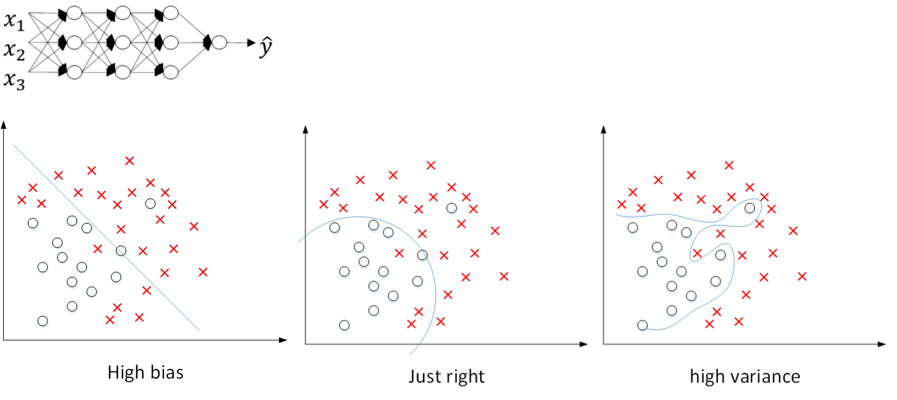

# 深度学习的实用层面

## 训练/开发/测试集

如果想转变模型，等等，不可能都知道最有参数是什么，这节课来讲解如何调整参数，使其达到最优（或较优）

数据集数据我们往往把它分为训练集(training set), 验证集/开发集(development set(dev set)), 测试集(test set)。

我们通过验证集或简单交叉验证集选择最好的模型，然后就可以在测试集上进行评估了。

在小数据时代，往往这么划分70% / 30%或60% / 20% / 20%【10,1k级, 1w级都是比较有效的】

在大数据时代，那么验证集和测试接站数据总量的比例会趋向于变得更小，因为验证集的目的就是验证不同的算法哪种更有效，因此，验证集要足够大才能评估。比如2个甚至10个不同算法，并迅速判断树那种算法更加有效。比如【100w级】数据，那么取1w条数据便足以进行评估，同样的，根据最终选择的分类器，1k个数据编足以评估单个分类器。所以可以是98% / 1% / 1%，99.5% / 0.4% / 0.1%等等。

随着人工智能的流行，和技术的普及，现在越来越多人在训练集和测试集分布不匹配的情况下进行训练。现假设你要构建一个用户可以上传大量图片的应用程序。目的是找出并呈现所有的猫咪图片，训练集是你网上抓取的照片【大量是高清+精修】，而验证集和测试集是用户上传的照片【可能随手一拍或是十分模糊】，这样就会导致识别度不高。

所以，最好确保训练集和测试集分布匹配，尽可能的优化性能。为了获取大量数据，我们往往采取网页抓取的方法，但是代价就是训练集与验证集和测试集数据，可能分布不一致，但是遵从一致原则，你会发现机器学习算法会变得更快。

注意：没有test集也没有关系，test集是为了进行无偏评估，如果无需无偏评估，那就不需要了。【对于没有test集的模型，有时候会把dev集称作test集】

## 偏差/方差(bias/variance)

所有机器学习的从业者都期望深刻理解**偏差**和**方差**。

很重要，但是易学难精。这两个都影响着机器学习的效果，但深度学习的误差很少权衡二者。

并不能很好地拟合曲线，即当**偏差高**的情况下，称之为**欠拟合**。【直线太过僵直】

相反地如果拟合一个过度复杂的分类器，比如深度神经网络或含有隐藏单元的神经网络，会过于完美地拟合这个曲线。即分类器**方差较高**，称之为**过拟合**。【曲线灵活性过高】


现实中，往往很少有直接这样的界面划分，但是也有类似的现象，比如下面这个猫猫分类器。

假设训练集误差和验证集误差。

### A.高方差

训练集误差：1%【假设肉眼识别+标签几乎没错】

验证集误差：11%

这样可以发现，训练集的设置较好，但验证集的设置相对较差，则我们可能会过度拟合了训练集。

某种程度上，验证集并没有利用交叉验证集的作用。我们称这样的数据为**高方差**，通过查看训练集误差和验证集误差，我们便可以诊断算法是否具有高方差。

### B.高偏差

训练集误差：15%

验证集误差：16%

假设该案例中人的错误率几乎为0%。与之相对的，训练集的识别误差较大，算法并没有在训练集中得到很好的训练。如果训练数据的拟合度不高，就是**欠拟合**。

但是他对与验证集产生的结果却是合理的，验证集中的错误率只比训练集多了1%，这样的数据**高偏差**。因为他甚至不能拟合训练集

### C.高方差+高偏差

训练集误差：15%

验证集误差：30%

两个情况都很糟糕【别训练了，接下去训练没啥用换个模型吧，滑稽】

### D.低方差+低偏差

训练集误差：0.5%

验证集误差：1%

当然，这个假设的前提都是，假设该案例中人的错误率几乎为0%。一般来说最优误差也被称为**贝叶斯误差**【接近0%，如果人的分辨错误率都能达到15%，那么B组也许是更好的选择】

那么当所有分类器都不顶用时，该如何分析偏差和方差呢？当人的错误率都比较高时，那么贝叶斯误差也就改变了，那么分析过程也就要做些改变了。

我们主要先判断是否方差过高，可以根据数据的拟合情况来判断，然后查看错误率有多高，检查验证集判断方差是否过高。同时，我们要求训练集和验证集来自相同分布，并且错误率差距较小。

## 机器学习基础

在算法训练完成时，我们首先要知道算法的偏差高不高，如果搞，试着评估训练集或训练数据的性能，如果偏差也很高，甚至无法拟合训练集，【训练集的表现：如查看成本曲线，训练集的准确率等等】那么你就需要选择一个新网络，比如含有**更多隐层或隐藏单元的网络**，训练更长时间等等。

检查偏差是否降低到可接受的值，一旦是，检查方差是否有问题，【测试集集的表现：如查看成本曲线，准确率等等】。如果有，最好的解决办法是，采集更多数据。如果没有更多数据，我们可以采用**正则化**来减少过拟合。改变某些神经网络架构可能起到一箭双雕的效果。【加粗部分对另一因素影响是比较小的】当然，如果你偏差高，增加数据量是没有用的。

总之，这样反复查找，改进，获得低方差低偏差的模型，你就成功了。


## 正则化

上文说明了正则化的作用，下面我们来说明正则化的可行性。

### L2范数

这里，我们用logistic回归来实现这些设想，并求出成本函数J的最小值$min_{w,b}J(w,b)$。在原有的logistic回归的基础上，我们添加了参数$\lambda$，也就是正则化参数。

$$
J=\frac{1}{m}\sum^m_{i=1}L(\hat y^{(i)},y{(i)})+\frac{\lambda}{2m}||w||^2_2
$$
$||w||^2_2$表示w的平方范数。
$$
L2正则化：||w||^2_2=\sum^{n_x}_{j=1}w_j^2=w^Tw
$$
因为使用了欧几里得法线，就被称为向量参数W的L2范数.

但为什么只正则化w呢？这里的b往往省略不写，因为W通常是一个高维参数矢量，已经可以表达高偏差的问题。我们不可能拟合所有参数，而b只是单个数字，所以w几乎涵盖了所有参数，而不是b，所以可以省略不计。

### L1范数


$$
L1正则化：\frac{k\lambda}{m}\sum^{n_x}_{i=1}|w_i|=\frac{k\lambda}{m}||w||_1
$$
如果使用L1正则化，W最终会是稀疏的，也就是说W向量中有很多0。有人说能够有利于压缩空间，但是效果不是很明显。

### 神经网络

那么神经网络如何实现L2正则化呢？

设该神经网络有m层
$$
J(w^{[1]},b^{[1]},...,w^{[L]},b^{[L]})=\frac 1 m \sum^{m}_{i=1}L(\hat y^{(i)},y^{(i)})+\frac{\lambda}{2m}\sum^L_{l=1}||w^{[l]}||^2_F
$$
此时：
$$
||w^{[l]}||^2=\sum_{i=1}^{n^{[l-1]}}\sum_{j=1}^{n^{[l]}}(w_{ij})^2
$$
w是一个$(n^{[l-1]},n^{[l]})$大小的多维矩阵，$n^{[l-1]}$表示上一层隐藏单元的数量，$n^{[l]}$表示 l 层单元的数量。该矩阵范数被称作**弗罗贝尼乌斯范数（Frobenius norm of matrix)**，用下标F标注。

对于反馈来说，会变成这样：
$$
\frac{\partial J}{\partial w^{[l]}}=dw^{[l]}=(原来的反馈函数)+\frac{\lambda}{m}w^{[l]}
$$
$$
w^{[l]}=w^{[l]}-\alpha dw^{[l]}=（原来的更新）-\frac{\lambda}{m}w^{[l]}
$$

所以我们也把L2正则化称为“**权重衰减**”，加快了w权重的更新速率。

### 如何实现防止过拟合？

为什么正则化能够有效避免高方差，防止过拟合呢？下面我们通过几个例子说明。

还是之前那张图，从左到右，分别表示了欠拟合，刚好拟合，过拟合三种情况。



假如我们选择了非常复杂的神经网络模型，如上图左上角所示。在未使用正则化的情况下，我们得到的分类超平面可能是类似上图右侧的过拟合。但是，如果使用L2正则化，当λ很大时，w[l]≈0。w[l]近似为零，意味着该神经网络模型中的某些神经元实际的作用很小，可以忽略。从效果上来看，其实是将某些神经元给忽略掉了。这样原本过于复杂的神经网络模型就变得不那么复杂了，而变得非常简单化了。

如下图所示，整个简化的神经网络模型变成了一个逻辑回归模型。问题就从高方差变成了高偏差了。


因此，选择合适大小的λ值，就能够同时避免高方差和高偏差，得到最佳模型。

还有另外一个直观的例子来解释为什么正则化能够避免发生过拟合。

假设激活函数是tanh函数。tanh函数的特点是在z接近零的区域，函数近似是线性的，而当$|z|$很大的时候，函数非线性且变化缓慢。

当使用正则化，$λ$较大，即对权重$w^{[l]}$的**惩罚**较大，$w^{[l]}$减小。

因为$z^{[l]}=w^{[l]}a^{[l]}+b^{[l]}$，当$w^{[l]}$减小的时候，$z^{[l]}$也会减小。则此时的$z^{[l]}$分布在tanh函数的近似线性区域。那么这个神经元起的作用就相当于是线性回归。如果每个神经元对应的权重$w^{[l]}$都比较小，那么整个神经网络模型相当于是多个线性回归的组合，即可看成一个线性神经网络。得到的分类超平面就会比较简单，不会出现过拟合现象。


### Dropout正则化

Dropout通过每次迭代训练时，**随机选择不同的神经元**，相当于每次都在不同的神经网络上进行训练，能够防止过拟合。

除此之外，还可以从权重w的角度来解释为什么dropout能够有效防止过拟合。对于某个神经元来说，某次训练时，它的某些输入在dropout的作用被过滤了。而在下一次训练时，又有不同的某些输入被过滤。经过多次训练后，某些输入被过滤，某些输入被保留。这样，该神经元就不会受某个输入非常大的影响，影响被均匀化了。也就是说，对应的权重w不会很大。这从从效果上来说，与L2 正则化是类似的，都是对权重w进行“**惩罚**”，减小了w的值。


总结一下，对于同一组训练数据，利用不同的神经网络训练之后，求其输出的平均值可以减少过拟合。Dropout就是利用这个原理，每次丢掉一定数量的隐藏层神经元，**相当于在不同的神经网络上进行训练**，这样就**减少了神经元之间的依赖性**，即每个神经元不能依赖于某几个其他的神经元（指层与层之间相连接的神经元），使神经网络更加能学习到与其他神经元之间的更加健壮的特征。

#### 注意：

首先，不同隐藏层的dropout系数keep_prob可以不同。一般来说，神经元越多的隐藏层，keep_out可以设置得小一些，例如0.5；神经元越少的隐藏层，keep_out可以设置的大一些，例如0.8，设置是1。

另外，实际应用中，不建议对输入层进行dropout，如果输入层维度很大，例如图片，那么可以设置dropout，但keep_out应设置的大一些，例如0.8，0.9。总体来说，就是越容易出现overfitting的隐藏层，其keep_prob就设置的相对小一些。没有准确固定的做法，通常可以根据validation进行选择。

Dropout在电脑视觉CV领域应用比较广泛，因为输入层维度较大，而且没有足够多的样本数量。值得注意的是dropout是一种regularization技巧，用来防止过拟合的，最好只在需要regularization的时候使用dropout。

使用dropout的时候，可以通过绘制cost function来进行debug，看看dropout是否正确执行。一般做法是，将所有层的keep_prob全设置为1，再绘制cost function，即涵盖所有神经元，看J是否单调下降。下一次迭代训练时，再将keep_prob设置为其它值。

设置一定概率去掉一些点，防止过度拟合，减少运算。


#### 随机反向失活

好像每次迭代后，神经网络都会变得比以前更小，感觉上好像小规模的神经网络效果是一样的。我们从单个神经元入手，如图，这个单元的工作就是输入并生成一些有意义的输出，这个神经元不能依靠任何单一的特征输入，因为所有输入都有可能被清除。因此该单元应该通过这种方式积极的传播开，并为单元的四个输入增加一点权重。


担心过度拟合，就可以把可能产生过拟合的大量神经元的神经网络层的keep-prob值设置的比其它层低，缺点是为了使用交叉验证，你需要搜索更多的超级参数。另一种是在某些层使用dropout，有些不使用，应用dropout的层只含有一个超级参数（hyper parameter）。【除了计算机视觉领域，其他领域应用较少】除非一直存在过拟合。

#### 缺点

cost函数J不再被明确定义。

难以复查其性能。

### 其他正则化方法

#### 泛化

假设你正在拟合猫咪图片分类器，为了更好地泛化，我们可以翻转或随意裁剪，旋转这个图像，尽管这些额外的假数据没有全新的数据那么多信息，但是我们这么做基本没有话费，代价几乎为0。【除了一些对抗性代价】以这种方式扩增算法数据，进而正则化数据集，减少过拟合比较廉价。

当然对于某些图像也可以进行适当的扭曲，来进行泛化处理


机器学习包括几个步骤，其中一步是选择一个算法来优化cost函数J，我们有许多工具来解决这个问题，如梯度下降，Momentum，RMSProp，Adam等等。

但是优化J后我也不想发生过拟合，我们也有一些工具来解决这个问题，如正则化，扩增数据等等。

在机器学习中，超参数激增，选出可行的算法也变得越来越复杂。我发现，如果我们用一组工具优化函数J,机器学习就会变得更简单。在重点优化代价函数J时，你只需要留意w和b，J(w,b)的值越小越好。你只需要想办法减小这个值，其他的不用关注。然后，预防过拟合还有其他任务，换句话说就是减少方差。这个原理有时候被称为**“正交化”**。

#### 提前停止

训练过度会过拟合，所以我们应当提早停止训练神经网络。

##### 优点

只运行一次坡度下降，你可以找出W的较小值，中间值和较大值，而无需尝试L2正则化超参数$\lambda$的很多值。


##### 缺点

不能独立的处理上述的两个问题，因为提前停止了循环，也就停止了优化cost函数J

#### L2正则化

这导致超参搜索空间更容易分解，也更容易搜索，但缺点是你必须尝试很多正则化参数$\lambda$的值。这也导致搜索大量$\lambda$值的计算代价太高

## 正则化输入/归一化输入

训练神经网络时，其中一个加速训练的方法就是归一化输入。

假设，我们有一个训练集，他有两个输入特征，所以输入特征x是二维的。

归一化输入往往有两步。

### 第一步：零均值化

$$
\mu =\frac{1}{m}\sum^m_{i=1}x^{(i)}
$$

$$
x=x-\mu
$$

意思是移动训练集，直到它完成零均值化。【散落在y=0周围】


### 第二步：归一化方差（Normalize Variances）

注意：特征x1的方差比特征x2的方差大得多。我们要做的是给$\sigma$赋值.
$$
\sigma ^2=\frac{1}{m}\sum^M_{i=1} x^{(i)}**2
$$

$$
x/=\sigma ^2
$$


这样就能较好的分布在方差较小【方差均为1】的范围内了。所以，之所以要对输入进行标准化操作，主要是为了让所有输入归一化同样的尺度上，方便进行梯度下降算法时能够更快更准确地找到全局最优解。

**提示：**由于训练集进行了标准化处理，那么对于测试集或在实际应用时，应该使用**同样**的$μ$和$σ^2$对其进行标准化处理。这样保证了训练集合测试集的标准化操作一致。因为我们希望能得到相同的数据转换，所以不论$\mu$和$\sigma ^2$的值是什么，这两个x相关的公式中都会用到它，所以你要用相同方法调整测试集。而不是分别预估训练集和测试集的$\mu$和$\sigma ^2$。

### 例子：

如果$x_1\in(0, 1000),x_2\in(0,1)$，结果是参数w1和w2值的范围或比率将会非常不同。

如果不进行标准化处理，x1与x2之间分布极不平衡，训练得到的w1和w2也会在数量级上差别很大。这样导致的结果是cost function与w和b的关系可能是一个非常细长的椭圆形碗。对其进行梯度下降算法时，由于w1和w2数值差异很大，只能选择很小的学习因子α，来避免J发生振荡。一旦α较大，必然发生振荡，J不再单调下降。如下左图所示。

如果进行了标准化操作，x1与x2分布均匀，w1和w2数值差别不大，得到的cost函数与w和b的关系是类似圆形碗。对其进行梯度下降算法时，α可以选择相对大一些，且J一般不会发生振荡，保证了J是单调下降的。如下右图所示。


另外一种情况，如果输入特征之间的范围本来就比较接近，那么不进行标准化操作也是没有太大影响的。但是，标准化处理在大多数场合下还是值得推荐的。

## 梯度消失与梯度爆炸

训练神经网络，尤其是深度神经网络所面临的的问题是，梯度消失或梯度爆炸，指导数会变得非常大或者非常小，这显著地加大了训练的难度，本章你将会了解梯度消失与梯度爆炸的真正含义，以及如何更加明智的选择随机初始化权重。假设你正在训练这样一个极深的神经网络。

举个例子来说明，假设一个多层的每层只包含两个神经元的深度神经网络模型，如下图所示：


为了简化复杂度，便于分析，我们令各层的激活函数为线性函数，即$g(Z)=Z$。且忽略各层常数项b的影响，令b全部为零。那么，该网络的预测输出$\hat Y$为：

$\hat Y=W^{[L]}W^{[L−1]}⋯W^{[1]}X$

如果各层权重$W^{[l]}$的元素都稍大于1，例如1.5，则预测输出$\hat Y$将正比于$1.5^L$。L越大，$\hat Y$越大，且呈指数型增长。我们称之为数值爆炸。相反，如果各层权重$W^{[l]}$的元素都稍小于1，例如0.5，则预测输出$\hat Y$将正比于$0.5^L$。网络层数L越多，$\hat Y$呈指数型减小。我们称之为数值消失。

也就是说，如果各层权重$W^{[l]}$都大于1或者都小于1，那么各层激活函数的输出将随着层数ll的增加，呈指数型增大或减小。当层数很大时，出现数值爆炸或消失。同样，这种情况也会引起梯度呈现同样的指数型增大或减小的变化。L非常大时，例如L=150，则梯度会非常大或非常小，引起每次更新的步进长度过大或者过小，这让训练过程十分困难。

## 神经网络的权重初始化

最终，针对该问题，我们想出了一个不完整的解决方案，虽然不能彻底解决问题，却很有用。有助于我们为神经网络更加谨慎地选择随机初始化参数。

这个方法就是对权重w进行一些初始化处理。

在这里，我们不妨以单个神经元为例，设其的输入个数为n，其输出为【这里忽略了常数项b】：

$$
z=w_1x_1+w_2x_2+⋯+w_nx_n
$$

$$
a=g(z)
$$


为了z防止过大或过小，就要使w与n相关联，且n越大，w应该越小才好。这样能够保证z不会过大。

所以按照这个规定，这里提供了一种方法，就是在初始化w时，令其方差为$\frac1 n$。相应的python伪代码为：

```python
w[l] = np.random.randn(n[l],n[l-1])*np.sqrt(1/n[l-1]) 
```

如果激活函数是tanh，一般选择上面的初始化方法。

如果激活函数是ReLU，权重w的初始化一般令其方差为$\frac 2 n$：

```python
w[l] = np.random.randn(n[l],n[l-1])*np.sqrt(2/n[l-1]) 
```

除此之外，Yoshua Bengio提出了另外一种初始化w的方法，令其方差为$\frac{2}{n^{[l−1]}+n^{[l]}}$：

```python
w[l] = np.random.randn(n[l],n[l-1])*np.sqrt(2/n[l-1]+n[l]) 
```

至于选择哪种初始化方法因人而异，可以根据不同的激活函数选择不同方法。另外，我们可以对这些初始化方法中设置某些参数，作为超参数，通过验证集进行验证，得到最优参数，来优化神经网络。

这个方法确实有效的在一定程度上解决了梯度爆炸或消失的问题，因为它给权重矩阵W设置了合理值

## 梯度数值逼近

反向传播神经网络有一项重要的测试是梯度检验。其目的是检查验证反向传播过程中梯度下降算法是否正确。

利用微分思想，函数f在点θ处的梯度可以表示成：

$$
g(θ)=\frac {f(θ+ε)−f(θ−ε)} {2ε}
$$


其中，ε>0，且足够小。

## 梯度检验

通过梯度检验，我们能够很方便的来发现反馈实施过程中的bug。

梯度检查首先要做的是分别将$W^{[1]},b^{[1]},⋯,W^{[L]},b^{[L]}$这些矩阵构成一个巨大的一维向量，然后将这些一维向量组合起来构成一个更大的一维向量$θ$。这样cost 函数$J(W^{[1]},b^{[1]},⋯,W^{[L]},b^{[L]})$就可以表示成$J(θ)$。当然我们也可以把这个超大向量拆开为$J(θ_1,θ_2,⋯)$

然后将反向传播过程通过梯度下降算法得到的$dW^{[1]},db^{[1]},⋯,dW^{[L]},db^{[L]}$按照一样的顺序构造成一个一维向量$dθ$。$dθ$的维度与$θ$一致。

接着利用$J(θ)$对每个$θ_i$计算近似梯度，其值与反向传播算法得到的$dθ_i$相比较，检查是否一致。例如，对于第i个元素，近似梯度为：


$$
dθ_{approx}[i]=\frac{J(θ_1,θ_2,⋯,θ_{i+ε},⋯)−J(θ_1,θ_2,⋯,θ_{i−ε},⋯)}{2ε}
$$

计算完所有$θ_i$的近似梯度后，可以计算$dθ_{approx}$与$dθ$的欧氏（Euclidean）距离来比较二者的相似度。公式如下：

$$
\frac{||dθ_{approx}−dθ||_2}{||dθ_{approx}||_2+||dθ||_2}
$$

一般来说，如果欧氏距离越小，例如$10^{−7}$，甚至更小，则表明$dθ_approx$与$dθ$越接近，即反向梯度计算是正确的，没有bugs。

如果欧氏距离较大，例如$10^{−5}$，则表明梯度计算可能出现问题，需要再次检查是否有bug存在。

如果欧氏距离很大，例如$10^{−3}$，甚至更大，则表明$dθ_approx$与$dθ$差别很大，梯度下降计算过程有bug，需要仔细检查。

## 实施梯度检验的实用技巧和注意事项

在进行梯度检查的过程中有几点需要注意的地方：

- **不要在整个训练过程中都进行梯度检查，仅仅作为debug使用。**
- **如果梯度检查出现错误，找到对应出错的梯度，检查其推导是否出现错误。**
- **注意不要忽略正则化项，计算近似梯度的时候要包括进去。**
- **梯度检查时关闭dropout，检查完毕后再打开dropout。**
- **随机初始化时运行梯度检查，经过一些训练后再进行梯度检查（不常用）。**

# 练习样例

## 初始化

面对一个新的神经网络你究竟怎么选择初始化？在这里，你会看到不同的初始化会带来不同的结果。

精心选择的初始化可以：

- 加快梯度下降的收敛
- 增加梯度下降收敛到较低的训练（和泛化）错误的几率

```python
import numpy as np
import matplotlib.pyplot as plt
import sklearn
import sklearn.datasets
from init_utils import sigmoid, relu, compute_loss, forward_propagation, backward_propagation
from init_utils import update_parameters, predict, load_dataset, plot_decision_boundary, predict_dec

%matplotlib inline
# 设置图的默认大小
plt.rcParams['figure.figsize'] = (7.0, 4.0)
plt.rcParams['image.interpolation'] = 'nearest'
plt.rcParams['image.cmap'] = 'gray'

# 加载数据图样: 在圈中的蓝/红点
train_X, train_Y, test_X, test_Y = load_dataset()
```

### 数据图样


### 目标

你需要一个分类器去区分蓝点和红点

### 神经网络模型

#### 模型代码

```python
def model(X, Y, learning_rate = 0.01, num_iterations = 15000, print_cost = True, initialization = "he"):
    """
    Implements a three-layer neural network: LINEAR->RELU->LINEAR->RELU->LINEAR->SIGMOID.
    
    Arguments:
    X -- input data, of shape (2, number of examples)
    Y -- true "label" vector (containing 0 for red dots; 1 for blue dots), of shape (1, number of examples)
    learning_rate -- learning rate for gradient descent 
    num_iterations -- number of iterations to run gradient descent
    print_cost -- if True, print the cost every 1000 iterations
    initialization -- flag to choose which initialization to use ("zeros","random" or "he")
    
    Returns:
    parameters -- parameters learnt by the model
    """
        
    grads = {}
    costs = [] # 追踪成本
    m = X.shape[1] # 样本数
    layers_dims = [X.shape[0], 10, 5, 1]
    
    # 初始化参数词典
    if initialization == "zeros":
        parameters = initialize_parameters_zeros(layers_dims)
    elif initialization == "random":
        parameters = initialize_parameters_random(layers_dims)
    elif initialization == "he":
        parameters = initialize_parameters_he(layers_dims)

    # 梯度下降循环

    for i in range(0, num_iterations):

        # 前馈: LINEAR -> RELU -> LINEAR -> RELU -> LINEAR -> SIGMOID.【2层】
        a3, cache = forward_propagation(X, parameters)
        
        # 成本
        cost = compute_loss(a3, Y)

        # 反馈
        grads = backward_propagation(X, Y, cache)
        
        # 更新参数
        parameters = update_parameters(parameters, grads, learning_rate)
        
        # 每1000次打印成本
        if print_cost and i % 1000 == 0:
            print("Cost after iteration {}: {}".format(i, cost))
            costs.append(cost)
            
    # 绘出成本图像
    plt.plot(costs)
    plt.ylabel('cost')
    plt.xlabel('iterations (per hundreds)')
    plt.title("Learning rate =" + str(learning_rate))
    plt.show()
    
    return parameters
```

### **三种初始化方法**

- **零初始化** ：`initialization = "zeros"`

- **随机初始化** ： `initialization = "random"`

	将权重w初始化为很大的随机值。 

- **He初始化** ： `initialization = "he"`

	初始化权重w为在He等人2015年的一篇论文提出的范围内的随机值。

### 零初始化

```python
# GRADED FUNCTION: initialize_parameters_zeros 

def initialize_parameters_zeros(layers_dims):
    """
    Arguments:
    layer_dims -- python array (list) containing the size of each layer.
    
    Returns:
    parameters -- python dictionary containing your parameters "W1", "b1", ..., "WL", "bL":
                    W1 -- weight matrix of shape (layers_dims[1], layers_dims[0])
                    b1 -- bias vector of shape (layers_dims[1], 1)
                    ...
                    WL -- weight matrix of shape (layers_dims[L], layers_dims[L-1])
                    bL -- bias vector of shape (layers_dims[L], 1)
    """
    
    parameters = {}
    L = len(layers_dims)            # number of layers in the network
    
    for l in range(1, L):
        ### START CODE HERE ### (≈ 2 lines of code)
        parameters['W' + str(l)] = np.zeros((layers_dims[l], layers_dims[l-1]))
        parameters['b' + str(l)] = 0
        ### END CODE HERE ###
    return parameters
```

#### 检测效果

```python
parameters = model(train_X, train_Y, initialization = "zeros")
print ("On the train set:")
predictions_train = predict(train_X, train_Y, parameters)
print ("On the test set:")
predictions_test = predict(test_X, test_Y, parameters)
```

```
Cost after iteration 0: 0.6931471805599453
Cost after iteration 1000: 0.6931471805599453
....
Cost after iteration 14000: 0.6931471805599453
```


性能非常糟糕，cost 并没有真正降低，算法也没有比随机猜测更好。为了更好地理解为什么会这样，下面检查预测和决策边界的细节。

#### 评价

##### 效果图样

```python
print ("predictions_train = " + str(predictions_train))
print ("predictions_test = " + str(predictions_test))
plt.title("Model with Zeros initialization")
axes = plt.gca()
axes.set_xlim([-1.5,1.5])
axes.set_ylim([-1.5,1.5])
plot_decision_boundary(lambda x: predict_dec(parameters, x.T), train_X, train_Y)
```

```
predictions_train = [[0 0 ... 0 0 0 0]]
predictions_test =  [[0 0 ... 0 0 0 0]]
```


模型将每个样例都预测为了0.

一般来说，将所有权重初始化为零将导致网络无法破坏对称性。这意味着每一层的每个神经元都会学到相同的东西，而且你也可能用 $n^{[l]}=1$在每层网络训练神经网络，网络并不比线性分类器如逻辑回归更强大. 

### 注意：

- 应该随机初始化权重 $W^{[l]}$ 去破坏网络的对称性。
- 但是偏置 $b^{[l]}$ 仍然可以初始化为0。因为只要权重 $W^{[l]}$ 被随机初始化，对称性就已经被打破了。

### 随机初始化

为了打破对称，需要随机初始化权重。随机初始化后，每个神经元可以继续学习其输入的不同功能。在这个练习中，你会看到如果权重被初始化为很大的值将会发生什么。

```python
# GRADED FUNCTION: initialize_parameters_random

def initialize_parameters_random(layers_dims):
    """
    Arguments:
    layer_dims -- python array (list) containing the size of each layer.
    
    Returns:
    parameters -- python dictionary containing your parameters "W1", "b1", ..., "WL", "bL":
                    W1 -- weight matrix of shape (layers_dims[1], layers_dims[0])
                    b1 -- bias vector of shape (layers_dims[1], 1)
                    ...
                    WL -- weight matrix of shape (layers_dims[L], layers_dims[L-1])
                    bL -- bias vector of shape (layers_dims[L], 1)
    """
    
    np.random.seed(3)               # 确定随机种子
    parameters = {}
    L = len(layers_dims)            # 层数
    
    for l in range(1, L):
        ### START CODE HERE ### (≈ 2 lines of code)
        parameters['W' + str(l)] = np.random.randn(layers_dims[l], layers_dims[l-1]) * 10
        parameters['b' + str(l)] = np.zeros((layers_dims[l],1))
        ### END CODE HERE ###

    return parameters
```

#### 检测效果

```python
parameters = model(train_X, train_Y, initialization = "random")
print ("On the train set:")
predictions_train = predict(train_X, train_Y, parameters)
print ("On the test set:")
predictions_test = predict(test_X, test_Y, parameters)
```

##### 结果

```
Cost after iteration 0: inf
Cost after iteration 1000: 0.6239567039908781
Cost after iteration 2000: 0.5978043872838292
Cost after iteration 3000: 0.563595830364618
Cost after iteration 4000: 0.5500816882570866
Cost after iteration 5000: 0.5443417928662615
Cost after iteration 6000: 0.5373553777823036
Cost after iteration 7000: 0.4700141958024487
Cost after iteration 8000: 0.3976617665785177
Cost after iteration 9000: 0.39344405717719166
Cost after iteration 10000: 0.39201765232720626
Cost after iteration 11000: 0.38910685278803786
Cost after iteration 12000: 0.38612995897697244
Cost after iteration 13000: 0.3849735792031832
Cost after iteration 14000: 0.38275100578285265
```


当然，我们可以看见一开始报的cost成本数据是inf，这是因为数值舍入）; 一个更复杂的实现可以解决这个问题，但这和我们的目的相关不大所以无需理会。

不管怎样，模型看起来已经**失去了对称性**，它给出了更好的结果。相比以前，它不会输出全0。

#### 评价

```python
print (predictions_train)
print (predictions_test)
```

```
[[1 0 1 1 0 0 1 1 1 1 1 0 1 0 0 1 0 1 1 0 0 0 1 0 1 1 1 1 1 1 0 1 1 0 0 1
  1 1 1 1 1 1 1 0 1 1 1 1 0 1 0 1 1 1 1 0 0 1 1 1 1 0 1 1 0 1 0 1 1 1 1 0
  0 0 0 0 1 0 1 0 1 1 1 0 0 1 1 1 1 1 1 0 0 1 1 1 0 1 1 0 1 0 1 1 0 1 1 0
  1 0 1 1 0 0 1 0 0 1 1 0 1 1 1 0 1 0 0 1 0 1 1 1 1 1 1 1 0 1 1 0 0 1 1 0
  0 0 1 0 1 0 1 0 1 1 1 0 0 1 1 1 1 0 1 1 0 1 0 1 1 0 1 0 1 1 1 1 0 1 1 1
  1 0 1 0 1 0 1 1 1 1 0 1 1 0 1 1 0 1 1 0 1 0 1 1 1 0 1 1 1 0 1 0 1 0 0 1
  0 1 1 0 1 1 0 1 1 0 1 1 1 0 1 1 1 1 0 1 0 0 1 1 0 1 1 1 0 0 0 1 1 0 1 1
  1 1 0 1 1 0 1 1 1 0 0 1 0 0 0 1 0 0 0 1 1 1 1 0 0 0 0 1 1 1 1 0 0 1 1 1
  1 1 1 1 0 0 0 1 1 1 1 0]]
[[1 1 1 1 0 1 0 1 1 0 1 1 1 0 0 0 0 1 0 1 0 0 1 0 1 0 1 1 1 1 1 0 0 0 0 1
  0 1 1 0 0 1 1 1 1 1 0 1 1 1 0 1 0 1 1 0 1 0 1 0 1 1 1 1 1 1 1 1 1 0 1 0
  1 1 1 1 1 0 1 0 0 1 0 0 0 1 1 0 1 1 0 0 0 1 1 0 1 1 0 0]]
```

##### 效果图样

```python
plt.title("Model with large random initialization")
axes = plt.gca()
axes.set_xlim([-1.5,1.5])
axes.set_ylim([-1.5,1.5])
plot_decision_boundary(lambda x: predict_dec(parameters, x.T), train_X, train_Y)
```


##### 特点

- 因为采用了大型的**随机权重**，成本一开始会特别大。
	- 最后一个激活函数sigmoid函数导致了结果在(0,1)区间，当这个例子出错时，它会造成很大的成本。
	- 当$\log(a^{[3]}) = \log(0)$，成本就会达到Inf.
- 较差的初始化会导致 梯度爆炸/消失, 这也会减慢优化算法的速度. 
- 如果你花更长时间去训练这个网络，你会看到更好的结果，但是用过大的随机数初始化会减慢优化速度

##### 总结:

- 将权重初始化为非常大的随机值效果不佳. 
- 用较小的随机值初始化效果可能会更好。但问题是随机值应该小到什么程度？

### He初始化

最后，我们来尝试 **He初始化** ！这个名字源于作者He等人。与Xavier初始化类似。构造公式如下：

$$
random(layers_{dims}[l], layers_{dims}[l-1]) * \sqrt{\frac {2}{layers_{dims}[l-1]}}
$$

```python
# GRADED FUNCTION: initialize_parameters_he

def initialize_parameters_he(layers_dims):
    """
    Arguments:
    layer_dims -- python array (list) containing the size of each layer.
    
    Returns:
    parameters -- python dictionary containing your parameters "W1", "b1", ..., "WL", "bL":
                    W1 -- weight matrix of shape (layers_dims[1], layers_dims[0])
                    b1 -- bias vector of shape (layers_dims[1], 1)
                    ...
                    WL -- weight matrix of shape (layers_dims[L], layers_dims[L-1])
                    bL -- bias vector of shape (layers_dims[L], 1)
    """
    
    np.random.seed(3)
    parameters = {}
    L = len(layers_dims) - 1 # integer representing the number of layers
     
    for l in range(1, L + 1):
        ### START CODE HERE ### (≈ 2 lines of code)
        parameters['W' + str(l)] = np.random.randn(layers_dims[l], layers_dims[l-1]) * np.sqrt(2/layers_dims[l-1])
        parameters['b' + str(l)] = np.zeros((layers_dims[l],1))
        ### END CODE HERE ###
        
    return parameters
```

#### 检测效果

```python
parameters = model(train_X, train_Y, initialization = "he")
print ("On the train set:")
predictions_train = predict(train_X, train_Y, parameters)
print ("On the test set:")
predictions_test = predict(test_X, test_Y, parameters)
```

```
Cost after iteration 0: 0.8830537463419761
Cost after iteration 1000: 0.6879825919728063
Cost after iteration 2000: 0.6751286264523371
Cost after iteration 3000: 0.6526117768893807
Cost after iteration 4000: 0.6082958970572937
Cost after iteration 5000: 0.5304944491717495
Cost after iteration 6000: 0.4138645817071793
Cost after iteration 7000: 0.3117803464844441
Cost after iteration 8000: 0.23696215330322556
Cost after iteration 9000: 0.18597287209206828
Cost after iteration 10000: 0.15015556280371808
Cost after iteration 11000: 0.12325079292273548
Cost after iteration 12000: 0.09917746546525937
Cost after iteration 13000: 0.08457055954024274
Cost after iteration 14000: 0.07357895962677366
```


#### 评价

##### 效果图样

```python
plt.title("Model with He initialization")
axes = plt.gca()
axes.set_xlim([-1.5,1.5])
axes.set_ylim([-1.5,1.5])
plot_decision_boundary(lambda x: predict_dec(parameters, x.T), train_X, train_Y)
```


| 模型（3层NN条件下） | 准确率 | 问题/评价      |
| ------------------- | ------ | -------------- |
| 零初始化            | 50%    | 不能破坏对称性 |
| 随机初始化          | 83%    | 权重过大       |
| He初始化            | 99%    | 需要掌握方法   |

### 总结

在初始化阶段，我们了解了：

- 不同的初始化导致不同的结果
- 随机初始化用于破坏对称性，并确保不同的隐藏单元可以学习不同的东西
- 不要初始化太大的值
- "He initialization"适用于ReLU激活的网络

## 正则化

欢迎来到本周的第二个任务。深度学习模型具有如此大的灵活性和能力，以至于当训练数据集不够大的时候，能导致严重的问题：过拟合。它能确保在训练集上表现良好，但是训练出的网络并不能推广到它从未见过的新样本上！

您将学习：在深度学习模式中使用正则化。

我们先导入你要使用的软件包。

### 导包

```python
# import packages
import numpy as np
import matplotlib.pyplot as plt
from reg_utils import sigmoid, relu, plot_decision_boundary, initialize_parameters, load_2D_dataset, predict_dec
from reg_utils import compute_cost, predict, forward_propagation, backward_propagation, update_parameters
import sklearn
import sklearn.datasets
import scipy.io
from testCases import *

import warnings
warnings.filterwarnings("ignore")

%matplotlib inline
plt.rcParams['figure.figsize'] = (7.0, 4.0) # set default size of plots
plt.rcParams['image.interpolation'] = 'nearest'
plt.rcParams['image.cmap'] = 'gray'
```

### 目标

您刚刚被法国足球公司聘为AI专家。他们希望你推荐法国守门员应该踢球的位置，这样法国队的球员可以更加容易使用头球。

他们为您提供法国过去10场比赛中的以下二维数据集。

```python
train_X, train_Y, test_X, test_Y = load_2D_dataset()
```


每个点对应于法国守门员在足球场左侧击球之后，其他运动员用头将球击中的足球场上的位置。

- 如果这个点是蓝色的，这意味着这个法国球员设法用他/她的头击球
- 如果这个点是红色的，这意味着另一个队的球员用头撞球

**你的目标**：使用深度学习模式来找到守门员踢球的场地。

**分析数据集**: 这个数据集有点嘈杂，但貌似用一条对角线能区分开左上角（蓝色）与右下角（红色）的数据，效果还不错。

你将首先尝试一个非正则化的模型。然后，您将学习如何正规化，并决定选择哪种模式来解决法国足球公司的问题。

### 非正则化模型

"`lambda`" 是python的关键字，所以这里$\lambda$写作lambd.

您将首先尝试没有正则化的模型，然后接着尝试:

- *L2 回归* 
 "`compute_cost_with_regularization()`" and "`backward_propagation_with_regularization()`"
- *Dropout* 
"`forward_propagation_with_dropout()`" and "`backward_propagation_with_dropout()`"

In each part，您要使用正确的输入去运行模型，以便调用您已经实现的功能。现在让我们来熟悉下模型。

```python
def model(X, Y, learning_rate = 0.3, num_iterations = 30000, print_cost = True, lambd = 0, keep_prob = 1):
    """
    Implements a three-layer neural network: LINEAR->RELU->LINEAR->RELU->LINEAR->SIGMOID.
    
    Arguments:
    X -- input data, of shape (input size, number of examples)
    Y -- true "label" vector (1 for blue dot / 0 for red dot), of shape (output size, number of examples)
    learning_rate -- learning rate of the optimization
    num_iterations -- number of iterations of the optimization loop
    print_cost -- If True, print the cost every 10000 iterations
    lambd -- regularization hyperparameter, scalar
    keep_prob - probability of keeping a neuron active during drop-out, scalar.
    
    Returns:
    parameters -- parameters learned by the model. They can then be used to predict.
    """
        
    grads = {}
    costs = []                            # to keep track of the cost
    m = X.shape[1]                        # number of examples
    layers_dims = [X.shape[0], 20, 3, 1]
    
    # Initialize parameters dictionary.
    parameters = initialize_parameters(layers_dims)

    # Loop (gradient descent)

    for i in range(0, num_iterations):

        # Forward propagation: LINEAR -> RELU -> LINEAR -> RELU -> LINEAR -> SIGMOID.
        if keep_prob == 1:
            a3, cache = forward_propagation(X, parameters)
        elif keep_prob < 1:
            a3, cache = forward_propagation_with_dropout(X, parameters, keep_prob)
        
        # Cost function
        if lambd == 0:
            cost = compute_cost(a3, Y)
        else:
            cost = compute_cost_with_regularization(a3, Y, parameters, lambd)
            
        # Backward propagation.
        assert(lambd==0 or keep_prob==1)    # it is possible to use both L2 regularization and dropout, 
                                            # but this assignment will only explore one at a time
        if lambd == 0 and keep_prob == 1:
            grads = backward_propagation(X, Y, cache)
        elif lambd != 0:
            grads = backward_propagation_with_regularization(X, Y, cache, lambd)
        elif keep_prob < 1:
            grads = backward_propagation_with_dropout(X, Y, cache, keep_prob)
        
        # Update parameters.
        parameters = update_parameters(parameters, grads, learning_rate)
        
        # Print the loss every 10000 iterations
        if print_cost and i % 10000 == 0:
            print("Cost after iteration {}: {}".format(i, cost))
        if print_cost and i % 1000 == 0:
            costs.append(cost)
    
    # plot the cost
    plt.plot(costs)
    plt.ylabel('cost')
    plt.xlabel('iterations (x1,000)')
    plt.title("Learning rate =" + str(learning_rate))
    plt.show()
    
    return parameters
```

#### 检测效果

```python
parameters = model(train_X, train_Y)
print ("On the training set:")
predictions_train = predict(train_X, train_Y, parameters)
print ("On the test set:")
predictions_test = predict(test_X, test_Y, parameters)
```


#### 评价

##### 效果图样

```python
plt.title("Model without regularization")
axes = plt.gca()
axes.set_xlim([-0.75,0.40])
axes.set_ylim([-0.75,0.65])
plot_decision_boundary(lambda x: predict_dec(parameters, x.T), train_X, train_Y)
```


非正则化模型显然是**过度拟合**训练集，它拟合了噪音数据！现在让我们看看可以减少过度拟合的两种技术。

### L2回归

标准的避免过拟合的方法叫做**L2回归**。它能够恰当的优化你的成本函数，从交叉熵成本函数:
$$
J = -\frac{1}{m} \sum\limits_{i = 1}^{m} \large{(}\small  y^{(i)}\log\left(a^{[L](i)}\right) + (1-y^{(i)})\log\left(1- a^{[L](i)}\right) \large{)}
$$
变为交叉熵成本函数+L2回归成本函数：
$$
J_{regularized} = \small \underbrace{-\frac{1}{m} \sum\limits_{i = 1}^{m} \large{(}\small y^{(i)}\log\left(a^{[L](i)}\right) + (1-y^{(i)})\log\left(1- a^{[L](i)}\right) \large{)} }_\text{交叉熵损失} + \underbrace{\frac{1}{m} \frac{\lambda}{2} \sum\limits_l\sum\limits_k\sum\limits_j W_{k,j}^{[l]2} }_\text{L2回归损失}
$$

让我们修改下成本函数并观察结果。（以三层神经网络为例）

#### 计算回归成本函数
```python
# GRADED FUNCTION: compute_cost_with_regularization

def compute_cost_with_regularization(A3, Y, parameters, lambd):
    """
    Implement the cost function with L2 regularization. See formula (2) above.
    
    Arguments:
    A3 -- post-activation, output of forward propagation, of shape (output size, number of examples)
    Y -- "true" labels vector, of shape (output size, number of examples)
    parameters -- python dictionary containing parameters of the model
    
    Returns:
    cost - value of the regularized loss function (formula (2))
    """
    m = Y.shape[1]
    W1 = parameters["W1"]
    W2 = parameters["W2"]
    W3 = parameters["W3"]
    
    cross_entropy_cost = compute_cost(A3, Y) # 计算交叉熵成本
    
    ### START CODE HERE ### (approx. 1 line)
    L2_regularization_cost = 1/m * lambd/2 * (np.sum(np.square(W1))+np.sum(np.square(W2))+np.sum(np.square(W3)))
    ### END CODER HERE ###
    
    cost = cross_entropy_cost + L2_regularization_cost
    
    return cost
```

当然，因为你改变了成本，你也必须改变后向传播！所有的梯度都必须计算这个新的成本。

#### 反向传播

```python
# GRADED FUNCTION: backward_propagation_with_regularization

def backward_propagation_with_regularization(X, Y, cache, lambd):
    """
    Implements the backward propagation of our baseline model to which we added an L2 regularization.
    
    Arguments:
    X -- input dataset, of shape (input size, number of examples)
    Y -- "true" labels vector, of shape (output size, number of examples)
    cache -- cache output from forward_propagation()
    lambd -- regularization hyperparameter, scalar
    
    Returns:
    gradients -- A dictionary with the gradients with respect to each parameter, activation and pre-activation variables
    """
    
    m = X.shape[1]
    (Z1, A1, W1, b1, Z2, A2, W2, b2, Z3, A3, W3, b3) = cache
    
    dZ3 = A3 - Y
    
    ### START CODE HERE ### (approx. 1 line)
    dW3 = 1./m * np.dot(dZ3, A2.T) +  lambd/m * W3
    ### END CODE HERE ###
    db3 = 1./m * np.sum(dZ3, axis=1, keepdims = True)
    
    dA2 = np.dot(W3.T, dZ3)
    dZ2 = np.multiply(dA2, np.int64(A2 > 0))
    ### START CODE HERE ### (approx. 1 line)
    dW2 = 1./m * np.dot(dZ2, A1.T) + lambd/m * W2
    ### END CODE HERE ###
    db2 = 1./m * np.sum(dZ2, axis=1, keepdims = True)
    
    dA1 = np.dot(W2.T, dZ2)
    dZ1 = np.multiply(dA1, np.int64(A1 > 0))
    ### START CODE HERE ### (approx. 1 line)
    dW1 = 1./m * np.dot(dZ1, X.T) + lambd/m * W1
    ### END CODE HERE ###
    db1 = 1./m * np.sum(dZ1, axis=1, keepdims = True)
    
    gradients = {"dZ3": dZ3, "dW3": dW3, "db3": db3,"dA2": dA2,
                 "dZ2": dZ2, "dW2": dW2, "db2": db2, "dA1": dA1, 
                 "dZ1": dZ1, "dW1": dW1, "db1": db1}
    
    return gradients
```

##### 检测效果

```python
parameters = model(train_X, train_Y, lambd = 0.7)
print ("On the train set:")
predictions_train = predict(train_X, train_Y, parameters)
print ("On the test set:")
predictions_test = predict(test_X, test_Y, parameters)
```


恭喜，测试集精度提高到了93％。你已经拯救了法国足球队！

#### 评价

##### 效果图样

```python
plt.title("Model with L2-regularization")
axes = plt.gca()
axes.set_xlim([-0.75,0.40])
axes.set_ylim([-0.75,0.65])
plot_decision_boundary(lambda x: predict_dec(parameters, x.T), train_X, train_Y)
```


##### 特点

-  $\lambda$ 是一个你可以用开发集去调整的超参数.
- L2 正则化使得你的决策边界更加平滑. 如果 $\lambda$ 太大, 也有可能“过度平滑”，导致高偏差模型。

##### L2到底在做什么

L2正则化依赖于这样的假设，即**权重越大模型越复杂**。

因此，通过惩罚成本函数中权重的平方值，可以将所有权重都变成更小的值。如果权重过大，计算开销会很大！而且，这将产生一个更平滑的模型，在这个模型中，输出随着输入的变化而变化得更慢。

#### 总结

L2回归的含义:

**计算成本** ：添加正则项到成本函数

**反向传播** ：关于权重矩阵的梯度中有额外的项

**最终权重较小** ：权重推到更小的值。

### Dropout回归

**dropout回归（随机失活）** 是深度学习所特有的被广泛使用的正则化技术。它在每次迭代中**随机关闭一些神经元**。

当你关闭一些神经元时，你实际上修改了你的模型。相当于在每次迭代中，你都训练了一个不同的模型，你只使用你的神经元的一个子集。随机失活使每一个神经元不再依赖另一个特定的神经元，因为其他的神经元随时可能被关闭。随机失活能防止过拟合。

####  正向传播（+dropout）

如果你想关闭第一层和第二层中的某些神经元。你需要执行下面的四个步骤:

1. 在课程中，我们讨论了使用`np.random.rand()`创建一个与$a^{[1]}$具有相同shap的变量$d^{[1]}$来随机获取0到1之间的数字。这里，您将使用一个向量化的实现，因此创建一个随机矩阵$D^{[1]} = [d^{[1](1)} d^{[1](2)} ... d^{[1](m)}] $与$A^{[1]}$维数相同.

2. 通过对$D^{[1]}$中的值进行适当的阈值设定，将$D^{[1]}$的每个条目概率设为0 (`1-keep prob`)或概率设为1 (`keep prob`)。

	**提示:** 如果要将矩阵X的所有项设为0(如果项小于0.5)或1(如果项大于0.5)，可以这样做:`X = (X < 0.5)`。注意，0和1分别等同于False和True。

3. 设置 $A^{[1]}$为 $A^{[1]} * D^{[1]}$. (你正在关掉一些神经元). 你可以认为 $D^{[1]}$ 是一个面具，乘上就可以关掉一些神经元.

4. 按`keep_prob`分割$A^{[1]}$。通过这样做，您可以确保成本的结果仍然具有与不使用dropout相同的期望值。

```python
# GRADED FUNCTION: forward_propagation_with_dropout

def forward_propagation_with_dropout(X, parameters, keep_prob = 0.5):
    """
    Implements the forward propagation: LINEAR -> RELU + DROPOUT -> LINEAR -> RELU + DROPOUT -> LINEAR -> SIGMOID.
    
    Arguments:
    X -- input dataset, of shape (2, number of examples)
    parameters -- python dictionary containing your parameters "W1", "b1", "W2", "b2", "W3", "b3":
                    W1 -- weight matrix of shape (20, 2)
                    b1 -- bias vector of shape (20, 1)
                    W2 -- weight matrix of shape (3, 20)
                    b2 -- bias vector of shape (3, 1)
                    W3 -- weight matrix of shape (1, 3)
                    b3 -- bias vector of shape (1, 1)
    keep_prob - probability of keeping a neuron active during drop-out, scalar
    
    Returns:
    A3 -- last activation value, output of the forward propagation, of shape (1,1)
    cache -- tuple, information stored for computing the backward propagation
    """
    
    np.random.seed(1)
    
    # retrieve parameters
    W1 = parameters["W1"]
    b1 = parameters["b1"]
    W2 = parameters["W2"]
    b2 = parameters["b2"]
    W3 = parameters["W3"]
    b3 = parameters["b3"]
    
    # LINEAR -> RELU -> LINEAR -> RELU -> LINEAR -> SIGMOID
    Z1 = np.dot(W1, X) + b1
    A1 = relu(Z1)
    ### START CODE HERE ### (approx. 4 lines)         # 步骤 1-4. 
    D1 = np.random.rand(A1.shape[0], A1.shape[1])     # 步骤 1: 初始化矩阵 D1 = np.random.rand(..., ...)
    D1 = D1 < keep_prob                               # 步骤 2: 将 D1 转为0或1 (将keep_prob作为概率)
    A1 = np.multiply(D1, A1)                          # 步骤 3: 关闭一些 A1内的神经元
    A1 = A1 / keep_prob                               # 步骤 4: 除以keep_prob，分摊关闭神经元带来的数值损失
    ### END CODE HERE ###
    Z2 = np.dot(W2, A1) + b2
    A2 = relu(Z2)
    ### START CODE HERE ### (approx. 4 lines)
    D2 = np.random.rand(A2.shape[0], A2.shape[1])     
    D2 = D2 < keep_prob                              
    A2 = np.multiply(D2, A2)                          
    A2 = A2 / keep_prob                               
    ### END CODE HERE ###
    Z3 = np.dot(W3, A2) + b3
    A3 = sigmoid(Z3)
    
    cache = (Z1, D1, A1, W1, b1, Z2, D2, A2, W2, b2, Z3, A3, W3, b3)
    
    return A3, cache
```

#### 反向传播（+dropout）

拥有随机失活的反向传播其实很简单. 你只需执行下面两个步骤:

1. 你之前已经在前向传播过程中关闭了一些神经元，方法是对`A1`应用“面具”【蒙版】 $D^{[1]}$。在反向传播中，你必须关闭一些神经元，且求` dA1`应该用同样的蒙版 $D^{[1]}$. 
2. 通过正向传播，你已经按`keep_prob`分割了`A1`。在反向传播中，你也应该用 `keep_prob`分割`dA1` 。

```python
# GRADED FUNCTION: backward_propagation_with_dropout

def backward_propagation_with_dropout(X, Y, cache, keep_prob):
    """
    Implements the backward propagation of our baseline model to which we added dropout.
    
    Arguments:
    X -- input dataset, of shape (2, number of examples)
    Y -- "true" labels vector, of shape (output size, number of examples)
    cache -- cache output from forward_propagation_with_dropout()
    keep_prob - probability of keeping a neuron active during drop-out, scalar
    
    Returns:
    gradients -- A dictionary with the gradients with respect to each parameter, activation and pre-activation variables
    """
    
    m = X.shape[1]
    (Z1, D1, A1, W1, b1, Z2, D2, A2, W2, b2, Z3, A3, W3, b3) = cache
    
    dZ3 = A3 - Y
    dW3 = 1./m * np.dot(dZ3, A2.T)
    db3 = 1./m * np.sum(dZ3, axis=1, keepdims = True)
    dA2 = np.dot(W3.T, dZ3)
    ### START CODE HERE ### (≈ 2 lines of code)
    dA2 = np.multiply(dA2, D2)      # 步骤 1: 应用蒙版D2关闭和正向传播一样的神经元
    dA2 = dA2 / keep_prob           # 步骤 2: 除以keep_prob，分摊关闭神经元带来的数值损失
    ### END CODE HERE ###
    dZ2 = np.multiply(dA2, np.int64(A2 > 0))
    dW2 = 1./m * np.dot(dZ2, A1.T)
    db2 = 1./m * np.sum(dZ2, axis=1, keepdims = True)
    
    dA1 = np.dot(W2.T, dZ2)
    ### START CODE HERE ### (≈ 2 lines of code)
    dA1 = np.multiply(dA1, D1)     
    dA1 = dA1 / keep_prob          
    ### END CODE HERE ###
    dZ1 = np.multiply(dA1, np.int64(A1 > 0))
    dW1 = 1./m * np.dot(dZ1, X.T)
    db1 = 1./m * np.sum(dZ1, axis=1, keepdims = True)
    
    gradients = {"dZ3": dZ3, "dW3": dW3, "db3": db3,"dA2": dA2,
                 "dZ2": dZ2, "dW2": dW2, "db2": db2, "dA1": dA1, 
                 "dZ1": dZ1, "dW1": dW1, "db1": db1}
    
    return gradients
```

#### 运行模型

现在让我们用dropout（keep_prob = 0.86）来运行模型。这意味着在每一次迭代中，都以24％的概率关闭第1层和第2层的每个神经元。

```python
parameters = model(train_X, train_Y, keep_prob = 0.86, learning_rate = 0.3)

print ("On the train set:")
predictions_train = predict(train_X, train_Y, parameters)
print ("On the test set:")
predictions_test = predict(test_X, test_Y, parameters)
```


Dropout 表现的很优异！测试集 accuracy 再次提高（达到95％）！你的模型对训练集不再过拟合，并且在测试集上表现也很好。法国足球队将永远感激你！

#### 评价

##### 效果图样

运行下面的代码来绘制决策边界

```python
plt.title("Model with dropout")
axes = plt.gca()
axes.set_xlim([-0.75,0.40])
axes.set_ylim([-0.75,0.65])
plot_decision_boundary(lambda x: predict_dec(parameters, x.T), train_X, train_Y)
```


##### **关于dropout你需要记住的是:**！！

- Dropout 是一种正则化技术.
- 你只需在训练期间使用它，测试期间不要使用.
- 前向和后向传播都会使用到dropout.
- 在训练期间，通过`keep_prob`对每个dropout层进行划分，以保持激活的期望值相同。例如，如果keep prob是0.5，那么我们将平均关闭一半的节点，因此输出将按0.5的比例缩放，因为只有剩下的一半对解决方案有贡献。因此，输出现在具有相同的期望值。您可以检查，即使当keep prob是其他值而不是0.5时，这也可以工作。

### 三个模型的对比结果

| 模型（3层神经网络） | 训练集准确率 | 测试集准确率 |
| ------------------- | ------------ | ------------ |
| 无正则化            | 95%          | 91.5%        |
| L2正则化            | 94%          | 93%          |
| dropout正则化       | 93%          | 95%          |


请注意，正则化会**有损你训练集的表现**！因为它会限制网络过度拟合训练集的能力. 但是它最终会提高测试集的表现.

### 总结

- 正则化能帮助你减少过拟合。会推动你的权重向更小的值转变.
- 正则化会推动你的权重向更小的值转变.
- L2 回归 和 Dropout 是两种非常有效的正则化技术.

## 梯度检验

假设您是一个在全球范围内开展移动支付的团队的一份子，并被要求建立一个深度学习模式来检测欺诈行为 -- 每当有人付款时，您想要查看付款是否有欺诈行为，例如用户帐户是否被黑客占用。

这个模型的反向传播很复杂，又因为这个应用实在太重要，所以你被要求向你公司的CEO证明你的反向传播实际上是正确的！为了验证是否正确有效，你使用了梯度检验(Gradient Checking)。

### 导包

```python
# Packages
import numpy as np
from testCases import *
from gc_utils import sigmoid, relu, dictionary_to_vector, vector_to_dictionary, gradients_to_vector
```

### 原理

反向传播需要计算梯度 $\frac{\partial J}{\partial \theta}$,  其中$\theta$ 表示模型的参数. $J$ 是使用前向传播和成本函数计算的。

因为前向传播实现相对简单, 所以你确信 $J$ 计算正确. 因此，你用代码来计算 $J$ 来检验计算 $\frac{\partial J}{\partial \theta}$的代码。

现在让我们回头来看一下导数（或者梯度）的定义：
$$
\frac{\partial J}{\partial \theta} = \lim_{\varepsilon \to 0} \frac{J(\theta + \varepsilon) - J(\theta - \varepsilon)}{2 \varepsilon} \tag{1}
$$

我们知道以下几点：

- $\frac{\partial J}{\partial \theta}$ 是你想去确保正确计算的东西. 
- 你可以计算 $J(\theta + \varepsilon)$ 和 $J(\theta - \varepsilon)$ 

让我们用公式（1）和一个较小的值 $\varepsilon$ 让你的CEO相信你计算$\frac{\partial J}{\partial \theta}$的代码是正确的.

### 一维梯度检验

考虑一维线性函数 $J(\theta) = \theta x$. 该模型只包含一个实值参数 $\theta$, 并采取 $x$ 作为输入。

你将实现代码去计算 $J(.)$ 和它的导数 $\frac{\partial J}{\partial \theta}$. 然后你将使用“Gradient Checking”去确保你关于$J$ 的导数计算是正确的. 

#### 正向传播

```python
# GRADED FUNCTION: forward_propagation

def forward_propagation(x, theta):
    """
    Implement the linear forward propagation (compute J) presented in Figure 1 (J(theta) = theta * x)
    
    Arguments:
    x -- a real-valued input
    theta -- our parameter, a real number as well
    
    Returns:
    J -- the value of function J, computed using the formula J(theta) = theta * x
    """
    
    ### START CODE HERE ### (approx. 1 line)
    J = theta * x
    ### END CODE HERE ###
    
    return J
```

##### 测试

```python
x, theta = 2, 4
J = forward_propagation(x, theta)
print ("J = " + str(J))
```

```
J = 8
```

#### 反向传播

```python
# GRADED FUNCTION: backward_propagation

def backward_propagation(x, theta):
    """
    Computes the derivative of J with respect to theta (see Figure 1).
    
    Arguments:
    x -- a real-valued input
    theta -- our parameter, a real number as well
    
    Returns:
    dtheta -- the gradient of the cost with respect to theta
    """
    
    ### START CODE HERE ### (approx. 1 line)
    dtheta = x
    ### END CODE HERE ###
    
    return dtheta
```

##### 测试

```python
x, theta = 2, 4
dtheta = backward_propagation(x, theta)
print ("dtheta = " + str(dtheta))
```

```
dtheta = 2
```

#### 梯度检验

- 首先，使用公式 (1) 和一个很小的量 $\varepsilon$. 步骤如下:
    1. $\theta^{+} = \theta + \varepsilon$
    2. $\theta^{-} = \theta - \varepsilon$
    3. $J^{+} = J(\theta^{+})$
    4. $J^{-} = J(\theta^{-})$
    5. $gradapprox = \frac{J^{+} - J^{-}}{2  \varepsilon}$
- 然后使用反向传播计算梯度，并将结果存储在一个变量“grad”中
- 最后，使用下面的公式计算“gradapprox”和“grad”之间的相对差异
$$
difference = \frac {\mid\mid grad - gradapprox \mid\mid_2}{\mid\mid grad \mid\mid_2 + \mid\mid gradapprox \mid\mid_2}
$$
按照以下三步计算:
   - 使用 `np.linalg.norm(...)`计算分子
   - 用 `np.linalg.norm(...) `两次来计算分母
   - 相除
- 如果差值小于 $10^{-7}$，你就可以确信你的模型正确了，如果不行，可能是哪里出错了。

```python
# GRADED FUNCTION: gradient_check

def gradient_check(x, theta, epsilon = 1e-7):
    """
    Implement the backward propagation presented in Figure 1.
    
    Arguments:
    x -- a real-valued input
    theta -- our parameter, a real number as well
    epsilon -- tiny shift to the input to compute approximated gradient with formula(1)
    
    Returns:
    difference -- difference (2) between the approximated gradient and the backward propagation gradient
    """
    
    # Compute gradapprox using left side of formula (1). epsilon is small enough, you don't need to worry about the limit.
    ### START CODE HERE ### (approx. 5 lines)
    thetaplus = theta + epsilon                           # Step 1
    thetaminus = theta - epsilon                          # Step 2
    J_plus = thetaplus * x                                # Step 3
    J_minus = thetaminus * x                              # Step 4
    gradapprox = (J_plus - J_minus)/(2 * epsilon)         # Step 5
    ### END CODE HERE ###
    
    # 检查梯度是否与backward_propagation()输出接近
    ### START CODE HERE ### (approx. 1 line)
    grad = backward_propagation(x, theta)
    ### END CODE HERE ###
    
    ### START CODE HERE ### (approx. 1 line)
    numerator = np.linalg.norm(grad - gradapprox)                     # Step 1'
    denominator = np.linalg.norm(grad) + np.linalg.norm(gradapprox)   # Step 2'
    difference = numerator / denominator                              # Step 3'
    ### END CODE HERE ###
    
    if difference < 1e-7:
        print ("The gradient is correct!")
    else:
        print ("The gradient is wrong!")
    
    return difference
```

##### 测试

```python
x, theta = 2, 4
difference = gradient_check(x, theta)
print("difference = " + str(difference))
```

```
The gradient is correct!
difference = 2.919335883291695e-10
```

### N维梯度检验

#### 正向传播

```python
def forward_propagation_n(X, Y, parameters):
    """
    Implements the forward propagation (and computes the cost) presented in Figure 3.
    
    Arguments:
    X -- training set for m examples
    Y -- labels for m examples 
    parameters -- python dictionary containing your parameters "W1", "b1", "W2", "b2", "W3", "b3":
                    W1 -- weight matrix of shape (5, 4)
                    b1 -- bias vector of shape (5, 1)
                    W2 -- weight matrix of shape (3, 5)
                    b2 -- bias vector of shape (3, 1)
                    W3 -- weight matrix of shape (1, 3)
                    b3 -- bias vector of shape (1, 1)
    
    Returns:
    cost -- the cost function (logistic cost for one example)
    """
    
    # retrieve parameters
    m = X.shape[1]
    W1 = parameters["W1"]
    b1 = parameters["b1"]
    W2 = parameters["W2"]
    b2 = parameters["b2"]
    W3 = parameters["W3"]
    b3 = parameters["b3"]

    # LINEAR -> RELU -> LINEAR -> RELU -> LINEAR -> SIGMOID
    Z1 = np.dot(W1, X) + b1
    A1 = relu(Z1)
    Z2 = np.dot(W2, A1) + b2
    A2 = relu(Z2)
    Z3 = np.dot(W3, A2) + b3
    A3 = sigmoid(Z3)

    # Cost
    logprobs = np.multiply(-np.log(A3),Y) + np.multiply(-np.log(1 - A3), 1 - Y)
    cost = 1./m * np.sum(logprobs)
    
    cache = (Z1, A1, W1, b1, Z2, A2, W2, b2, Z3, A3, W3, b3)
    
    return cost, cache
```

#### 反向传播

```python
def backward_propagation_n(X, Y, cache):
    """
    Implement the backward propagation presented in figure 2.
    
    Arguments:
    X -- input datapoint, of shape (input size, 1)
    Y -- true "label"
    cache -- cache output from forward_propagation_n()
    
    Returns:
    gradients -- A dictionary with the gradients of the cost with respect to each parameter, activation and pre-activation variables.
    """
    
    m = X.shape[1]
    (Z1, A1, W1, b1, Z2, A2, W2, b2, Z3, A3, W3, b3) = cache
    
    dZ3 = A3 - Y
    dW3 = 1./m * np.dot(dZ3, A2.T)
    db3 = 1./m * np.sum(dZ3, axis=1, keepdims = True)
    
    dA2 = np.dot(W3.T, dZ3)
    dZ2 = np.multiply(dA2, np.int64(A2 > 0))
    dW2 = 1./m * np.dot(dZ2, A1.T) * 2
    db2 = 1./m * np.sum(dZ2, axis=1, keepdims = True)
    
    dA1 = np.dot(W2.T, dZ2)
    dZ1 = np.multiply(dA1, np.int64(A1 > 0))
    dW1 = 1./m * np.dot(dZ1, X.T)
    db1 = 4./m * np.sum(dZ1, axis=1, keepdims = True)
    
    gradients = {"dZ3": dZ3, "dW3": dW3, "db3": db3,
                 "dA2": dA2, "dZ2": dZ2, "dW2": dW2, "db2": db2,
                 "dA1": dA1, "dZ1": dZ1, "dW1": dW1, "db1": db1}
    
    return gradients
```

您在欺诈检测测试集上获得了一些结果，但是您不能100%确定您的模型。没有人是完美的!让我们实现梯度检查来验证你的梯度是否正确。

### 原理

你想通过比较梯度和导数间的关系，来确认自己的模型是否正确，即

$$
\frac{\partial J}{\partial \theta} = \lim_{\varepsilon \to 0} \frac{J(\theta + \varepsilon) - J(\theta - \varepsilon)}{2 \varepsilon} 
$$

【这里用了大量的词典方便取值】

#### 伪代码

For each i in num_parameters:
- 计算 `J_plus[i]`:
    1.  $\theta^{+}$ = `np.copy(parameters_values)`
    2.  $\theta^{+}_i$ = $\theta^{+}_i + \varepsilon$
    3.  $J^{+}_i$ = `forward_propagation_n(x, y, vector_to_dictionary(`$\theta^{+}$`))`.     
- 计算 `J_minus[i]`同理，对 $\theta^{-}$进行同样操作
- 计算 $gradapprox[i] = \frac{J^{+}_i - J^{-}_i}{2 \varepsilon}$

因此，你得到一个向量gradapprox，其中gradapprox[i]是关于“参数值[i]”的梯度的近似值。你现在可以比较这个gradapprox矢量和来自反向传播的梯度矢量。就像一维情况(步骤1’，2’，3’)，计算:
$$
difference = \frac {\| grad - gradapprox \|_2}{\| grad \|_2 + \| gradapprox \|_2 }
$$
#### 代码

```python
# GRADED FUNCTION: gradient_check_n

def gradient_check_n(parameters, gradients, X, Y, epsilon = 1e-7):
    """
    Checks if backward_propagation_n computes correctly the gradient of the cost output by forward_propagation_n
    
    Arguments:
    parameters -- python dictionary containing your parameters "W1", "b1", "W2", "b2", "W3", "b3":
    grad -- output of backward_propagation_n, contains gradients of the cost with respect to the parameters. 
    x -- input datapoint, of shape (input size, 1)
    y -- true "label"
    epsilon -- tiny shift to the input to compute approximated gradient with formula(1)
    
    Returns:
    difference -- difference (2) between the approximated gradient and the backward propagation gradient
    """
    
    # Set-up variables
    parameters_values, _ = dictionary_to_vector(parameters)
    grad = gradients_to_vector(gradients)
    num_parameters = parameters_values.shape[0]
    J_plus = np.zeros((num_parameters, 1))
    J_minus = np.zeros((num_parameters, 1))
    gradapprox = np.zeros((num_parameters, 1))
    
    # Compute gradapprox
    for i in range(num_parameters):
        
        # Compute J_plus[i]. Inputs: "parameters_values, epsilon". Output = "J_plus[i]".
        # "_" is used because the function you have to outputs two parameters but we only care about the first one
        ### START CODE HERE ### (approx. 3 lines)
        thetaplus = np.copy(parameters_values)                                         # Step 1
        thetaplus[i][0] = thetaplus[i][0] + epsilon                                    # Step 2
        J_plus[i], _ = forward_propagation_n(X, Y, vector_to_dictionary(thetaplus))    # Step 3
        ### END CODE HERE ###
        
        # Compute J_minus[i]. Inputs: "parameters_values, epsilon". Output = "J_minus[i]".
        ### START CODE HERE ### (approx. 3 lines)
        thetaminus = np.copy(parameters_values)                                     # Step 1
        thetaminus[i][0] = thetaminus[i][0] - epsilon                               # Step 2        
        J_minus[i], _ = forward_propagation_n(X, Y, vector_to_dictionary(thetaminus))                                  # Step 3
        ### END CODE HERE ###
        
        # Compute gradapprox[i]
        ### START CODE HERE ### (approx. 1 line)
        gradapprox[i] = (J_plus[i] - J_minus[i]) / (2 * epsilon)
        ### END CODE HERE ###
    
    # Compare gradapprox to backward propagation gradients by computing difference.
    ### START CODE HERE ### (approx. 1 line)
    numerator = np.linalg.norm(gradapprox - grad)                                # Step 1'
    denominator = np.linalg.norm(grad) + np.linalg.norm(gradapprox)              # Step 2'
    difference = numerator / denominator                                         # Step 3'
    ### END CODE HERE ###

    if difference > 1e-7:
        print ("\033[93m" + "There is a mistake in the backward propagation! difference = " + str(difference) + "\033[0m")
    else:
        print ("\033[92m" + "Your backward propagation works perfectly fine! difference = " + str(difference) + "\033[0m")
    
    return difference
```

```python
X, Y, parameters = gradient_check_n_test_case()

cost, cache = forward_propagation_n(X, Y, parameters)
gradients = backward_propagation_n(X, Y, cache)
difference = gradient_check_n(parameters, gradients, X, Y)
```
##### 结果

```
There is a mistake in the backward propagation! difference = 0.285093156776
```

看起来我们给你的`backward_propagation_n`里有错误！这说明你已经很好的实践了梯度检验。

It seems that there were errors in the `backward_propagation_n` code we gave you! Good that you've implemented the gradient check. Go back to `backward_propagation` and try to find/correct the errors *(Hint: check dW2 and db1)*. Rerun the gradient check when you think you've fixed it. Remember you'll need to re-execute the cell defining `backward_propagation_n()` if you modify the code.

#### 注意

- 梯度检验是很慢的! 近似计算梯度$\frac{\partial J}{\partial \theta} \approx  \frac{J(\theta + \varepsilon) - J(\theta - \varepsilon)}{2 \varepsilon}$ 算力花费很大。所以我们不可能每次训练迭代都跑，只能检测要点。
- dropout回归下，不能进行梯度检验。保证正确后再加入dropout。

#### 总结

- 梯度检查验证了来自反向传播的梯度和梯度的数值近似(用正向传播计算)之间的紧密性。
- 梯度检查很慢，所以我们不会在每次迭代训练时都运行它。您通常只会运行它以确保您的代码是正确的，然后关闭它并在实际学习过程中使用backprop。

## 总结

### 课程

这节课我们主要介绍了如何建立一个实用的深度学习神经网络。包括Train/Dev/Test sets的比例选择，Bias和Variance的概念和区别：Bias对应欠拟合，Variance对应过拟合。

接着，我们介绍了防止过拟合的两种方法：L2回归和Dropout。

然后，介绍了如何进行规范化输入，以加快梯度下降速度和精度。

然后，我们介绍了梯度消失和梯度爆炸的概念和危害，并提出了如何使用梯度初始化来降低这种风险。

最后，我们介绍了梯度检查，来验证梯度下降算法是否正确。

