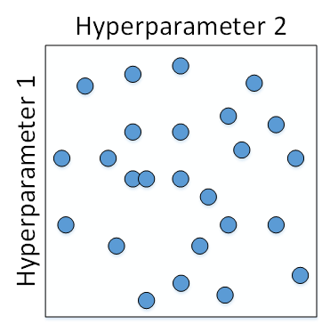
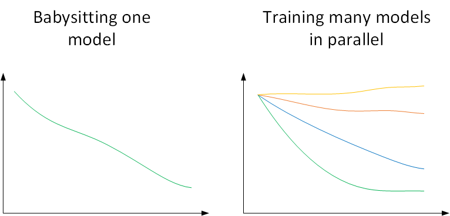
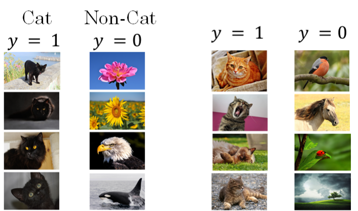
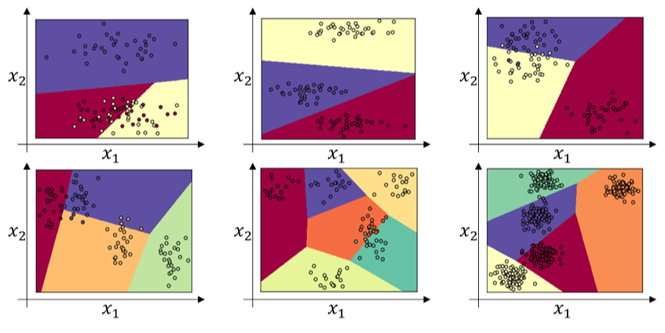

# **超参数调试、Batch正则化和编程框架**

本节课，我们将重点介绍三个方面的内容：超参数调试、Batch正则化和深度学习编程框架。

# 超参数调试

## 调试处理【调参大法】

### 超参数

深度神经网络需要调试的超参数（Hyperparameters）较多，包括：

- **$\alpha$：学习因子**
- **$\beta$：动量梯度下降因子**
- **$\beta_1,\beta_2,\varepsilon$：Adam算法参数**
- **layers：神经网络层数**
- **hidden units：各隐藏层神经元个数**
- **learning rate decay：学习因子下降参数**
- **mini-batch size：批量训练样本包含的样本个数**

### 超参数重要性差异

超参数之间也有重要性差异。

**1.**通常来说，学习因子$\alpha$是**最重要**的超参数，也是需要重点调试的超参数。

**2.**动量梯度下降因子$\beta$、hidden units和mini-batch size的重要性仅次于$\alpha$。

**3.**然后就是神经网络层数layers和学习因子下降参数learning rate decay。

**4.**最后，Adam算法的三个参数$\beta_1,\beta_2,\varepsilon$一般常设置为0.9，0.999和$10^{-8}$，不需要反复调试。

**注意：**这里超参数重要性的排名并不是绝对的，具体情况，具体分析。

### 如何选择和调试超参数？

#### 传统做法

传统的机器学习中，我们对每个参数**等距离**选取任意个数的点，然后，分别使用不同点对应的参数组合进行训练，最后根据验证集上的表现好坏，来选定最佳的参数。

例如有两个待调试的参数，分别在每个参数上选取5个点，这样构成了5x5=25中参数组合，如下图所示：


#### 较好方法

这种做法在参数比较少的时候效果较好。但是在深度神经网络模型中，我们一般不采用这种均匀间隔取点的方法，比较好的做法是使用**随机选择**。也就是说，对于上面这个例子，我们随机选择25个点，作为待调试的超参数，如下图所示：



随机化选择参数的目的是为了**尽可能地得到更多种参数组合**。还是上面的例子，如果使用均匀采样的话，每个参数只有5种情况；而使用随机采样的话，每个参数有25种可能的情况，因此**更有可能得到最佳的参数组合**。

这种做法带来的另外一个好处就是对**重要性不同**的参数之间的选择效果更好。

假设超参数1为$\alpha$，超参数2为$\varepsilon$，显然二者的重要性是不一样的。如果使用第一种均匀采样的方法，$\varepsilon$的影响很小，相当于只选择了5个$\alpha$值。而如果使用第二种随机采样的方法，$\varepsilon$和$\alpha$都有可能选择25种不同值。这大大增加了$\alpha$调试的个数，更有可能选择到最优值。其实，在实际应用中完全不知道哪个参数更加重要的情况下，随机采样的方式能有效解决这一问题，但是均匀采样做不到这点。

#### 由粗到细的采样

在经过随机采样之后，我们可能得到某些区域模型的表现较好。然而，为了得到更精确的最佳参数，我们应该继续**对选定的区域进行由粗到细的采样**。也就是放大表现较好的区域，再对此区域做更密集的随机采样。例如，对下图中右下角的方形区域再做25点的随机采样，以获得最佳参数。


## 选择合适范围

### 尺度均匀采样

上一部分讲的调试参数使用随机采样，对于某些超参数是可以进行**尺度均匀采样**的，但是某些超参数需要选择不同的合适尺度进行随机采样。

什么意思呢？例如对于超参数layers和hidden units，都是正整数，是可以进行均匀随机采样的，即超参数每次变化的尺度都是一致的（如每次变化为1，犹如一个刻度尺一样，刻度是均匀的）。

### 非均匀随机采样

但是，对于某些超参数，可能需要**非均匀随机采样**（即非均匀刻度尺）。例如超参数$\alpha$，待调范围是[0.0001, 1]。如果使用均匀随机采样，那么有90%的采样点分布在[0.1, 1]之间，只有10%分布在[0.0001, 0.1]之间。这在实际应用中是不太好的，因为最佳的$\alpha$值可能主要分布在[0.0001, 0.1]之间，而[0.1, 1]范围内$\alpha$值效果并不好。因此我们更关注的是区间[0.0001, 0.1]，应该在这个区间内细分更多刻度。

通常的做法是将**直线标度**转换为**对数标度**，将均匀尺度转化为非均匀尺度，然后再**在对数标度下进行均匀采样**。这样，[0.0001, 0.001]，[0.001, 0.01]，[0.01, 0.1]，[0.1, 1]各个区间内随机采样的超参数个数基本一致，也就扩大了之前[0.0001, 0.1]区间内采样值个数。


一般解法是，如果线性区间为[a, b]，令m=log(a)，n=log(b)，则对应的log区间为[m,n]。对log区间的[m,n]进行随机均匀采样，然后得到的采样值r，最后反推到线性区间，即$10^r$。$10^r$就是最终采样的超参数。

### Python代码

```python
m = np.log10(a)
n = np.log10(b)
r = np.random.rand()
r = m + (n-m)*r
r = np.power(10,r)
```

除了$\alpha$之外，动量梯度因子$\beta$也是一样，在超参数调试的时候也需要进行非均匀采样。一般$\beta$的取值范围在[0.9, 0.999]之间，那么$1−β$的取值范围就在[0.001, 0.1]之间。那么直接对$1−β$在[0.001, 0.1]区间内进行log变换即可。

### $\beta$ 也需要随机采样

这里解释下为什么$\beta$也需要向$\alpha$那样做非均匀采样。假设$\beta$从0.9000变化为0.9005，那么$\frac{1}{1−β}$基本没有变化。但假设$\beta$从0.9990变化为0.9995，那么$\frac{1}{1−β}$前后差别1000。

$\beta$越接近1，指数加权平均的个数越多，变化越大。所以对$\beta$接近1的区间，应该采集得更密集一些。

## 超参数训练的实践: Pandas vs Caviar

经过调试选择完最佳的超参数并不是一成不变的，一段时间之后（例如一个月），需要根据新的数据和实际情况，再次调试超参数，以获得实时的最佳模型。

### 熊猫方式(Panda approach)

在训练深度神经网络时，一种情况是没有足够的算力，我们只能对一个模型进行训练，调试不同的超参数，使得这个模型有最佳的表现。我们称之为Babysitting one model。由于其需要人工不断监测其效果并调整，像熊猫带幼崽一样，类比做**熊猫方式(Panda approach)**。

### 鱼子酱方式(Caviar approach)

另外一种情况是可以对多个模型同时进行训练，每个模型上调试不同的超参数，根据表现情况，选择最佳的模型。我们称之为Training many models in parallel。并行训练多组模型，就和鱼产卵一样，产好就不管了，等待其孵化即可，类比做**鱼子酱方式(Caviar approach)。**



使用哪种模型是由计算资源、计算能力所决定的。一般来说，对于非常复杂或者数据量很大的模型，使用Panda approach更多一些。

## 正则化网络的激活函数

### Batch正则化

Sergey Ioffe和Christian Szegedy两位学者提出了**Batch正则化/批正则化**(Batch Normalization)。批正则化不仅可以让调试超参数更加简单，而且可以让神经网络模型更加“健壮”。也就是说较好模型可接受的超参数范围更大一些，包容性更强，使得更容易去训练一个深度神经网络。接下来，我们就来介绍什么是**批正则化**，以及它是如何工作的。

之前，我们在[深度学习的实用层面](Usage.md)中提到过在训练神经网络时，标准化输入可以提高训练的速度。方法是对训练数据集进行归一化的操作，即将原始数据减去其均值$μ$后，再除以其方差$σ^2$。但是标准化输入只是对输入进行了处理，那么对于神经网络，又该如何对各隐藏层的输入进行标准化处理呢？

其实在神经网络中，第$l$层隐藏层的输入就是第$l−1$层隐藏层的输出$A^{[l−1]}$。对$A^{[l−1]}$进行标准化处理，从原理上来说可以提高$W^{[l]}$和$b^{[l]}$的训练速度和准确度。这种对各隐藏层的标准化处理就是Batch正则化。值得注意的是，实际应用中，一般是对$Z^{[l−1]}进行处$理而不是$A^{[l−1]}$，其实差别不是很大。

Batch正则化对第$l$层隐藏层的输入$Z^{[l−1]}$做如下标准化处理，忽略上标$[l−1]$
$$
\mu=\frac 1 m \sum_{i} z^{(i)}
$$

$$
\sigma^2=\frac 1 m \sum_{i} (z_i-\mu)^2
$$

$$
z^{(i)}_{norm}=\frac{z^{(i)}−\mu} {\sqrt{\sigma ^2+\varepsilon}}
$$

其中，m是单个mini-batch包含样本个数，$\varepsilon$是为了防止分母为零，可取值$10^{−8}$。这样，使得该隐藏层的所有输入$z^{(i)}$均值为0，方差为1。

### 进一步处理

但是，大部分情况下并不希望所有的$z^{(i)}$均值都为0，方差都为1，也不太合理。通常需要对$z^{(i)}$进行进一步处理：
$$
\tilde{z}^{(i)}=\gamma⋅z^{(i)}_{norm}+β
$$
上式中，$\gamma$和$\beta$是可学习参数，类似于W和b一样，可以通过梯度下降等算法求得。这里，$\gamma$和$\beta$的作用是让$z^{(i)}$的均值和方差为任意值，只需调整其值就可以了。例如，令：

$$
\gamma=\sqrt{\sigma ^2+\varepsilon}, \beta=\mu
$$
则$\tilde{z}^{(i)}=z^{(i)}$，即恒等函数。可见，设置$\gamma$和$\beta$为不同的值，可以得到任意的均值和方差。

这样，通过Batch正则化，对隐藏层的各个$z^{[l](i)}$进行标准化处理，得到$\tilde{z}^{[l](i)}$，替代$z^{[l](i)}$。

### 注意区别！

值得注意的是，**输入**的标准化处理**正则化输入**和**隐藏层**的标准化处理**Batch正则化**是有区别的。

**正则化输入**使所有输入的均值为0，方差为1。

而**Batch正则化**可使各隐藏层输入的均值和方差为任意值。

实际上，从激活函数的角度来说，如果各隐藏层的输入均值在靠近0的区域即处于**激活函数的线性区域**，这样**不利于训练**好的非线性神经网络，得到的模型效果也不会太好。这也解释了为什么需要用$\gamma$和$\beta$来对$z^{[l](i)}$作进一步处理。

### 将Batch Norm拟合进神经网络

我们已经知道了如何对某单一隐藏层的所有神经元进行Batch Norm，接下来将研究如何把Bath Norm应用到整个神经网络中。

对于L层神经网络，经过Batch Norm的作用，整体流程如下：


实际上，Batch Norm经常使用在mini-batch上，这也是其名称的由来。

值得注意的是，因为Batch Norm对各隐藏层$Z^{[l]}=W^{[l]}A^{[l−1]}+b^{[l]}$有去均值的操作。

所以我们可以消去$b^{[l]}$，其数值效果完全可以由$\tilde{z}^{(l)}$中的$\beta$来实现。

在使用梯度下降算法时，分别对$W^{[l]}$，$\beta^{[l]}$和$\gamma^{[l]}$进行迭代更新。除了传统的梯度下降算法之外，还可以使用我们之前介绍过的动量梯度下降、RMSprop或者Adam等优化算法。

### Batch Norm工作原理

我们可以把输入特征做均值为0，方差为1的规范化处理，来加快学习速度。而Batch Norm也是对隐藏层各神经元的输入做类似的规范化处理。

总的来说，Batch Norm不仅能够提高神经网络训练速度，而且能让神经网络的权重W的更新更加“稳健”，尤其在深层神经网络中更加明显。比如神经网络很后面的W对前面的W包容性更强，即前面的W的变化对后面W造成的影响很小，整体网络更加健壮。

#### 协变量偏移

举个例子来说明，假如用一个浅层神经网络（类似逻辑回归）来训练识别猫的模型。如下图所示，提供的所有猫的训练样本都是黑猫。然后，用这个训练得到的模型来对各种颜色的猫样本进行测试，测试的结果可能并不好。其原因是训练样本不具有一般性（即不是所有的猫都是黑猫），这种训练样本（黑猫）和测试样本（猫）分布的变化称之为**协变量偏移(covariate shift)**。



对于这种情况，如果实际应用的样本与训练样本**分布不同**，即发生了协变量偏移，则一般是要对模型重新进行训练的。

在神经网络，尤其是深度神经网络中，协变量偏移会导致模型预测效果变差，重新训练的模型各隐藏层的$W^{[l]}$和$B^{[l]}$均产生偏移、变化。而Batch Norm的作用恰恰是**减小协变量偏移的影响**，让模型变得更加健壮【鲁棒性(Robust健壮性)更强】。

Batch Norm减少了各层$W^{[l]}$，$B^{[l]}$之间的耦合性，让各层更加独立，实现自我训练学习的效果。

也就是说，如果输入发生协变量偏移，那么因为Batch Norm的作用，对个隐藏层输出$Z^{[l]}$进行均值和方差的归一化处理，$W^{[l]}$和$B^{[l]}$更加稳定，使得原来的模型也有不错的表现。

针对上面这个黑猫的例子，如果我们使用深层神经网络，使用Batch Norm，那么该模型对花猫的识别能力应该也是不错的。

#### 正则化效果

从另一个方面来说，Batch Norm也起到轻微的正则化（regularization）效果。具体表现在：

- **每个mini-batch都进行均值为0，方差为1的归一化操作**
- **每个mini-batch中，对各个隐藏层的$Z^{[l]}$添加了随机噪声，效果类似于Dropout**
- **mini-batch越小，正则化效果越明显**

但是，Batch Norm的正则化效果比较微弱，正则化也不是Batch Norm的主要功能。

## 测试时的Batch Norm

训练过程中，Batch Norm是对单个mini-batch进行操作的，但在测试过程中，如果是单个样本，该如何使用Batch Norm进行处理呢？

首先，回顾一下训练过程中Batch Norm的主要过程：

$$
\mu=\frac 1 m \sum_{i} z^{(i)}
$$

$$
\sigma^2=\frac 1 m \sum_{i} (z_i-\mu)^2
$$

$$
z^{(i)}_{norm}=\frac{z^{(i)}−\mu} {\sqrt{\sigma ^2+\varepsilon}}
$$

$$
\tilde{z}^{(i)}=\gamma⋅z^{(i)}_{norm}+β
$$

其中，$\mu$和$\sigma ^2$是对单个mini-batch中所有m个样本求得的。在测试过程中，如果只有一个样本，求其均值和方差是没有意义的，就需要对$\mu$和$\sigma ^2$进行估计。

估计的方法有很多，理论上我们可以将所有训练集放入最终的神经网络模型中，然后将每个隐藏层计算得到的$\mu^{[l]}$和$\sigma ^{2[l]}$直接作为测试过程的$\mu$和$\sigma ^2$来使用。但是，实际应用中一般不使用这种方法，而是使用我们之前介绍过的**指数加权平均**的方法来预测测试过程单个样本的$\mu$和$\sigma ^2$。

指数加权平均的做法很简单，对于第$l$层隐藏层，考虑所有mini-batch在该隐藏层下的$\mu^{[l]}$和$\sigma ^{2[l]}$，然后用指数加权平均的方式来预测得到当前单个样本的$\mu^{[l]}$和$\sigma ^{2[l]}$。这样就实现了对测试过程单个样本的均值和方差估计。最后，再利用训练过程得到的$\gamma$和$\beta$值计算出各层$\tilde{z}^{(l)}$的值。

## Softmax回归

### 二分类问题

目前我们介绍的都是二分类问题，神经网络输出层只有一个神经元，表示预测输出$\hat y$是正类的概率$P(y=1|x)$，$\hat y$>0.5 则判断为正类，$\hat y$<0.5则判断为负类。

### 多分类问题

对于多分类问题，用C表示种类个数，神经网络中**输出层**就有C个神经元，即$n^{[L]}=C$。其中，每个神经元的输出依次对应属于该类的概率，即$P(y=c|x)$。

为了处理多分类问题，我们一般使用**Softmax回归模型**。

### Softmax回归模型

Softmax回归模型输出层的激活函数如下所示：
$$
z^{[L]}=W^{[L]}a^{[L−1]}+b^{[L]}
$$

$$
a^{[L]}_i=\frac {e^{z^{[L]}_i}}{\sum^C_{i=1}e^{z^{[L]}_i}}
$$

输出层每个神经元的输出$a^{[L]}_i$对应属于该类的概率，满足：

$$
\sum^{C}_{i=1}a^{[L]}_i=1
$$


所有的$a^{[L]}_i$，即$\hat y$，维度为(C, 1)。

下面给出几个简单的线性多分类的例子：



如果使用神经网络，特别是深层神经网络，可以得到更复杂、更精确的非线性模型。

### 训练softmax分类器

Softmax分类器的训练过程与我们之前介绍的二元分类问题有所不同。先来看一下softmax分类器的成本函数。

举例来说，假如C=4，某个样本的预测输出$\hat y$和真实输出$y$为：

$$
\hat y=\left[ \begin{matrix} 0.3\\ 
0.2 \\ 0.1 \\ 0.4
\end{matrix} \right],
y=\left[ \begin{matrix} 0\\ 
1 \\ 0 \\ 0
\end{matrix} \right]
$$

从$\hat y$值来看，$P(y=4|x)=0.4$，概率最大，而真实样本属于第2类，概率只有0.2，因此该预测效果不佳。

#### 成本函数

我们定义softmax分类器的成本函数为：
$$
L(\hat y,y)=−\sum^4_{j=1}y_j⋅log\ \hat y_j
$$
然而，只有当$j=2$时，$y_2=1$，其它情况下，$y_j=0$。所以，上式中的L(y^,y)L(y^,y)可以简化为：

$$
L(\hat y,y)=-y_2\cdot log\ \hat y_2=-log\ \hat y_2
$$
要让$L(\hat y,y)$更小，就应该让$\hat y_2$越大越好。$\hat y_2$反映的是概率，完全符合我们之前的定义。

所有m个样本的成本函数为：

$$
J=\frac 1 m \sum ^m_{i=1}L(\hat y,y)
$$
其预测输出向量$A^{[L]}$即$\hat Y$的维度为(4, m)。

#### 反向传播

softmax分类器的反向传播过程仍然使用梯度下降算法，其推导过程与二元分类有一点点不一样。因为只有输出层的激活函数不一样，我们先推导$dZ^{[L]}$：
$$
da^{[L]}=-\frac{1}{a^{[L]}}
$$

$$
\frac{\partial a^{[L]}}{\partial z^{[L]}}=\frac{\partial}{\partial z^{[L]}}\cdot (\frac{e^{z^{[L]}_i}}{\sum_{i=1}^Ce^{z^{[L]}_i}})=a^{[L]}\cdot (1-a^{[L]})
$$

$$
dz^{[L]}=da^{[L]}\cdot \frac{\partial a^{[L]}}{\partial z^{[L]}}=a^{[L]}-1=a^{[L]}-y
$$

对于所有m个训练样本：

$$
dZ^{[L]}=A^{[L]}-Y
$$
可见$dZ^{[L]}$的表达式与二元分类结果是一致的，虽然推导过程不太一样。然后就可以继续进行反向传播过程的梯度下降算法了，推导过程与二元分类神经网络完全一致。

## 深度学习框架

深度学习框架有很多，例如：

- **Caffe/Caffe2**
- **CNTK**
- **DL4J**
- **Keras**
- **Lasagne**
- **mxnet**
- **PaddlePaddle**
- **TensorFlow**
- **Theano**
- **Torch**

一般选择深度学习框架的基本准则是：

- **易于编程(扩展与部署)**
- **运行速度**
- **开源并稳定增长**

实际应用中，我们应该根据自己的需求选择最合适的深度学习框架。

## TensorFlow

这里简单介绍一下最近几年比较火的一个深度学习框架：TensorFlow。

举个例子来说明，例如成本函数是参数w的函数：

$$
J=w^2-10w+25
$$
如果使用TensorFlow对成本函数进行优化，求出最小值对应的w，程序如下：

```python
import numpy as np
import tensorflow as tf

w = tf.Variable(0,dtype=tf.float32)
#cost = tf.add(tf.add(w**2,tf.multiply(-10,w)),25)
cost = w**2 - 10*w +25
train = tf.train.GradientDescentOptimizer(0.01).minimize(cost)

init = tf.global_variables_initializer()
session = tf.Session()
session.run(init)
print(session.run(w))
```

\>>0.0

```python
session.run(train)
print(session.run(w))12
```

\>>0.1

```python
for i in range(1000):
    session.run(train)
print(session.run(w))123
```

\>>4.99999

TensorFlow框架内可以直接调用梯度下降优化算法，不需要我们自己再写程序了，大大提高了效率。在运行1000次梯度下降算法后，w的解为4.99999，已经非常接近w的最优值5了。

针对上面这个例子，如果对w前的系数用变量x来代替，程序如下：

```python
import numpy as np
import tensorflow as tf

cofficients = np.array([[1.],[-10.],[25.]])

w = tf.Variable(0,dtype=tf.float32)
x = tf.placeholder(tf.float32,[3,1])
#cost = tf.add(tf.add(w**2,tf.multiply(-10,w)),25)
#cost = w**2 - 10*w +25
cost = x[0][0]*w**2 + x[1][0]*w + x[2][0]
train = tf.train.GradientDescentOptimizer(0.01).minimize(cost)

init = tf.global_variables_initializer()
session = tf.Session()
session.run(init)
print(session.run(w))
```

\>>0.0

```python
session.run(train, feed_dict=(x:coefficients))
print(session.run(w))
```

\>>0.1

```python
for i in range(1000):
    session.run(train, feed_dict=(x:coefficients))
print(session.run(w))
```

\>>4.99999

结果跟之前是一样的。除此之外，我们还可以更改x即cofficients的值，而得到不同的优化结果w。

另外，上段程序中的：

```python
session = tf.Session()
session.run(init)
print(session.run(w))
```

有另外一种写法：

```python
with tf.Session() as session:
    session.run(init)
    print(session.run(w))
```

TensorFlow的最大优点就是采用数据流图（data flow graphs）来进行数值运算。图中的节点（Nodes）表示数学操作，图中的线（edges）则表示在节点间相互联系的多维数据数组，即张量（tensor）。而且它灵活的架构让你可以在多种平台上展开计算，例如台式计算机中的一个或多个CPU（或GPU），服务器，移动设备等等。

# TensorFlow练习

欢迎来到本周的编程任务。到目前为止，你一直使用numpy来建立神经网络。现在我们将引导您深入学习框架，让您更容易地建立神经网络。TensorFlow，PaddlePaddle，Torch，Caffe，Keras等机器学习框架可以显着加速您的机器学习开发。这些框架有很多文档，你可以随意阅读。在这个任务中，您将学习如何在TensorFlow中执行以下操作：

- 初始化变量
- 开始你自己的会话
- 训练算法
- 实现一个神经网络

编程框架不仅可以缩短您的编码时间，但有时也可以执行优化来加速您的代码。


## Tensorflow相关库

首先导入相关库

```python
import math
import numpy as np
import h5py
import matplotlib.pyplot as plt
import tensorflow as tf
from tensorflow.python.framework import ops
from tf_utils import load_dataset, random_mini_batches, convert_to_one_hot, predict

%matplotlib inline
np.random.seed(1)
```

### 创建会话并运行

我们将从一个例子开始，这个例子里需要计算一个训练样例的损失。
$$
loss = \mathcal{L}(\hat{y}, y) = (\hat y^{(i)} - y^{(i)})^2 \tag{1}
$$

```python
# 定义 y_hat为constant，值为36
y_hat = tf.constant(36, name='y_hat')            
# 定义 y为39
y = tf.constant(39, name='y')          

# 建立一个loss变量=(y - y_hat)^2
loss = tf.Variable((y - y_hat)**2, name='loss')  

# 先建一个初始化函数，之后建好网络后运行(session.run(init)),
init = tf.global_variables_initializer()         
# loss变量将会被初始化，并准备好被计算
# 建立一个session会话并打印输出
with tf.Session() as session:         
    # 初始化变量
    session.run(init)                            
    # 打印损失
    print(session.run(loss))                     
```

结果

```
9
```

用TensorFlow编写和运行程序通常有以下步骤：

1. 创建尚未执行/评估的张量（变量）
2. 在这些张量之间写入操作。
3. 初始化您的张量。
4. 创建一个会话。
5. 运行会话。这将运行你上面已经完成的写操作。 

现在让我们看一个简单的例子。运行下面的单元格：

```python
a = tf.constant(2)
b = tf.constant(10)
c = tf.multiply(a,b)
print(c)
```

```
Tensor("Mul:0", shape=(), dtype=int32)
```

正如所料，你不会看到20！你得到是一个类型为“int32”且没有shape属性的张量。你目前所做的只是把它放到“计算图”中，你还没有运行这个计算。为了让这两个数实际上相乘，你需要去**创建一个会话并运行它**.

```python
sess = tf.Session()
print(sess.run(c))
```

```
20
```

Great! 总结一下, **，记得初始化你的变量，创建一个会话并运行会话中的操作**. 

### 占位符

接下来，您还必须了解占位符.占位符是一个您可以稍后指定值的对象. 
要为占位符指定值，可以使用 "feed dictionary" (`feed_dict` variable)传值。 下面，我们为x创建了一个占位符。这允许我们稍后在运行会话时传入一个数字。

```python
# Change the value of x in the feed_dict

x = tf.placeholder(tf.int64, name = 'x')
print(sess.run(2 * x, feed_dict = {x: 3}))
sess.close()
```

```
6
```

当你第一次定义x你不必为它指定一个值。占位符只是一个变量，您将在稍后运行会话时将数据分配给该变量。

以下是发生了的事情：当您指定计算所需的操作时，您正在告诉TensorFlow如何构建计算图。计算图可以有一些占位符，其值将在稍后指定。最后，当你运行会话时，你正在告诉TensorFlow执行计算图。

### Linear函数

```python
# GRADED FUNCTION: linear_function

def linear_function():
    """
    Implements a linear function: 
            Initializes W to be a random tensor of shape (4,3)
            Initializes X to be a random tensor of shape (3,1)
            Initializes b to be a random tensor of shape (4,1)
    Returns: 
    result -- runs the session for Y = WX + b 
    """
    
    np.random.seed(1)
    
    ### START CODE HERE ### (4 lines of code)
    X = tf.constant(np.random.randn(3,1), name = "X")
    W = tf.constant(np.random.randn(4,3), name = "W")
    b = tf.constant(np.random.randn(4,1), name = "b")
#     print(X)
#     print(W)
#     print(b)
	#矩阵乘法
    Y = tf.add(tf.matmul(W,X), b)
    ### END CODE HERE ### 
    
    # 使用 tf.Session() 创建一个会话并且用 sess.run(...) 运行它，来计算你想要的变量
    
    ### START CODE HERE ###
    sess = tf.Session()
    result = sess.run(Y)
    ### END CODE HERE ### 
    
    # close the session 
    sess.close()

    return result
```

### 计算 sigmoid 
你刚刚实现了一个线性函数. Tensorflow 提供了很多类似 `tf.sigmoid` 和 `tf.softmax`这样的常用的神经网络功能。

#### 创建会话的两种典型方法

请注意，有两种典型的方法来去创建和使用tensor流中的会话：

##### 法一

```python
sess = tf.Session()
# Run the variables initialization (if needed), run the operations
result = sess.run(..., feed_dict = {...})
sess.close() # Close the session
```
##### 法二

```python
with tf.Session() as sess: 
    # run the variables initialization (if needed), run the operations
    result = sess.run(..., feed_dict = {...})
    # This takes care of closing the session for you :)
```

#### 实现sigmoid

```python
# GRADED FUNCTION: sigmoid

def sigmoid(z):
    """
    Computes the sigmoid of z
    
    Arguments:
    z -- input value, scalar or vector
    
    Returns: 
    results -- the sigmoid of z
    """
    
    ### START CODE HERE ### ( approx. 4 lines of code)
    # 创建x占位符
    x = tf.placeholder(tf.float32, name="x")

    # 计算sigmoid(x)
    sigmoid = tf.sigmoid(x)

    # 创建session
    # 使用feed_dict 将 z 的值传递给占位符 x. 
    with tf.Session() as sess:
        # 运行
        result = sess.run(sigmoid, feed_dict={x:z})
    
    ### END CODE HERE ###
    
    return result
```

### 计算 Cost函数（交叉熵损失）

你可以使用内置函数来计算您的神经网络的成本，即计算下列式子。

for i=1...m: 
$$
J = - \frac{1}{m}  \sum_{i = 1}^m  \large ( \small y^{(i)} \log a^{ [2] (i)} + (1-y^{(i)})\log (1-a^{ [2] (i)} )\large )\small
$$

```python
# GRADED FUNCTION: cost

def cost(logits, labels):
    """
    Computes the cost using the sigmoid cross entropy
    
    Arguments:
    logits -- vector containing z, output of the last linear unit (before the final sigmoid activation)
    labels -- vector of labels y (1 or 0) 
    
    Note: What we've been calling "z" and "y" in this class are respectively called "logits" and "labels" 
    in the TensorFlow documentation. So logits will feed into z, and labels into y. 
    
    Returns:
    cost -- runs the session of the cost (formula (2))
    """
    
    ### START CODE HERE ### 
    
    # 创建占位符 "logits" (z) 和 "labels" (y) (approx. 2 lines)
    z = tf.placeholder(tf.float32, name="logits")
    y = tf.placeholder(tf.float32, name="labels")
    
    # 使用成本函数 (approx. 1 line)
    cost = tf.nn.sigmoid_cross_entropy_with_logits(logits=z, labels=y)
    
    # 创建session (approx. 1 line)
    sess = tf.Session()
    
    # 运行session (approx. 1 line).
    cost = sess.run(cost, feed_dict={z:logits, y:labels})
    
    
    # 关闭session (approx. 1 line). See method 1 above.
    sess.close()
    
    ### END CODE HERE ###
    
    return cost
```

### 使用One Hot encodings

很多机器学习任务中，特征并不总是连续值，有可能是分类值。

考虑以下三个特征：

> ["male", "female"]
>
> ["from Europe", "from US", "from Asia"]
>
> ["uses Firefox", "uses Chrome", "uses Safari", "uses Internet Explorer"]

如果将上述特征用数字表示，效率会高很多。例如：

> ["male", "from US", "uses Internet Explorer"] 表示为[0, 1, 3]
>
> ["female", "from Asia", "uses Chrome"]表示为[1, 2, 1]

但是，转化为数字表示后，上述数据不能直接用在我们的分类器中。因为，分类器往往默认数据数据是连续的，并且是有序的。但按上述表示的数字并不有序的，而是随机分配的。

解决上述问题的一种方法是采用One-Hot Encoding。

独热编码，又称一位有效编码，其方法是使用N位状态寄存器来对N个状态进行编码，每个状态都有它独立的寄存器位，并且在任意时候，其中只有一位有效。

例如：

> 自然状态码为：000,001,010,011,100,101
>
> 独热编码为：000001,000010,000100,001000,010000,100000

可以这样理解，对于每一个特征，如果它有m个可能值，那么经过独热编码后，就变成了m个二元特征。并且，这些特征互斥，每次只有一个激活。因此，数据会变成稀疏的。

这样做的好处主要有：

1. 解决了分类器不好处理属性数据的问题
2. 在一定程度上也起到了扩充特征的作用

在tensorflow中，你可以使用一行代码:`tf.one_hot(labels, depth, axis) `

```python
# GRADED FUNCTION: one_hot_matrix

def one_hot_matrix(labels, C):
    """
    Creates a matrix where the i-th row corresponds to the ith class number and the jth column
                     corresponds to the jth training example. So if example j had a label i. Then entry (i,j) 
                     will be 1. 
                     
    Arguments:
    labels -- vector containing the labels 
    C -- number of classes, the depth of the one hot dimension
    
    Returns: 
    one_hot -- one hot matrix
    """
    
    ### START CODE HERE ###
    
    # 设置占位符C (approx. 1 line)
    C = tf.constant(C)
    
    # 使用tf.one_hot，注意axis变量 (approx. 1 line)
    one_hot_matrix = tf.one_hot(labels, C, axis=0)
    sess = tf.Session()
    one_hot = sess.run(one_hot_matrix)
    sess.close()
    
    ### END CODE HERE ###
    
    return one_hot
```

### 用全0或1初始化

现在您将学习如何用 0 和 1 去初始化一个向量. 你可以使用 `tf.ones(shape)`和` tf.zeros(shape) `

```python
# GRADED FUNCTION: ones

def ones(shape):
    """
    Creates an array of ones of dimension shape
    
    Arguments:
    shape -- shape of the array you want to create
        
    Returns: 
    ones -- array containing only ones
    """
    
    ### START CODE HERE ###
    
    # 用tf.ones(...)创建一个 "ones" tensor。(approx. 1 line)
    ones = tf.ones(shape)
    sess = tf.Session()
    ones = sess.run(ones)
    sess.close()
    
    ### END CODE HERE ###
    return ones
```

## 用tensorflow构建神经网络

在这个任务中，您将使用tensorflow建立一个神经网络. 通常有如下两步：

- 创建计算图
- 运行计算图

### 问题描述

某天下午，你和一群朋友一起决定去教电脑破解手语。你们花了几个小时在白墙前拍摄照片，然后得到了下面的数据集。现在你的工作是建立一个算法，以促进语言障碍人士和不懂手语的人进行沟通。

- **训练集**: 1080个图片（64×64像素），代表从0到5的数字（每个数字180张图片）.
- **测试集**: 120张图片（64×64像素），代表从0到5的数字（每张数20张）.

请注意，这是SIGNS数据集的一个子集。完整的数据集包含更多的signs。


运行以下代码以加载数据集

```python
# Loading the dataset
X_train_orig, Y_train_orig, X_test_orig, Y_test_orig, classes = load_dataset()
```

更改下面的索引并运行单元格去可视化数据集中的一些样例。

```python
# Example of a picture
index = 0
plt.imshow(X_train_orig[index])
print ("y = " + str(np.squeeze(Y_train_orig[:, index])))
```

和往常一样，将图像数据集展开变平，然后除以255进行归一化。**最重要的是**，你要把每个标签转换为一个热点向量(a one-hot vector). 运行下面的单元格来执行此操作

```python
# Flatten the training and test images
X_train_flatten = X_train_orig.reshape(X_train_orig.shape[0], -1).T
X_test_flatten = X_test_orig.reshape(X_test_orig.shape[0], -1).T
# Normalize image vectors
X_train = X_train_flatten/255.
X_test = X_test_flatten/255.
# Convert training and test labels to one hot matrices
Y_train = convert_to_one_hot(Y_train_orig, 6)
Y_test = convert_to_one_hot(Y_test_orig, 6)

print ("number of training examples = " + str(X_train.shape[1]))
print ("number of test examples = " + str(X_test.shape[1]))
print ("X_train shape: " + str(X_train.shape))
print ("Y_train shape: " + str(Y_train.shape))
print ("X_test shape: " + str(X_test.shape))
print ("Y_test shape: " + str(Y_test.shape))
```

**请注意** ：12288 =$64 \times 64 \times 3$. 每个图像是64* 64 像素的正方形 , 3 是 RGB 颜色

**您的目标**是建立一个能够高准确度识别符号的算法。要做到这一点，你要建立一个tensorflow模型，这个模型和你之前用 python 实现的猫咪识别模型几乎一样(不同的是现在使用softmax输出). 这是一个很好的场合去对比两者实现的差异（numpy和tensorflow）。

模型为 LINEAR -> RELU ->LINEAR -> RELU -> LINEAR -> SOFTMAX*. SIGMOID输出层已被转换为SOFTMAX【包含了sigmoid的功能】

### 创建占位符

你的第一个任务是为`X` 和 `Y`创建占位符. 这将允许您稍后在运行会话时传递您的训练数据

```python
# GRADED FUNCTION: create_placeholders

def create_placeholders(n_x, n_y):
    """
    Creates the placeholders for the tensorflow session.
    
    Arguments:
    n_x -- scalar, size of an image vector (num_px * num_px = 64 * 64 * 3 = 12288)
    n_y -- scalar, number of classes (from 0 to 5, so -> 6)
    
    Returns:
    X -- placeholder for the data input, of shape [n_x, None] and dtype "float"
    Y -- placeholder for the input labels, of shape [n_y, None] and dtype "float"
    
    Tips:
    - You will use None because it let's us be flexible on the number of examples you will for the placeholders.
      In fact, the number of examples during test/train is different.
    """

    ### START CODE HERE ### (approx. 2 lines)
    X = tf.placeholder(tf.float32, shape=(n_x,None), name="X")
    Y = tf.placeholder(tf.float32, shape=(n_y,None), name="Y")
    ### END CODE HERE ###
    
    return X, Y
```

### 初始化参数

```python
W1 = tf.get_variable("W1", [25,12288], initializer = tf.contrib.layers.xavier_initializer(seed = 1))
b1 = tf.get_variable("b1", [25,1], initializer = tf.zeros_initializer())
```
```python
# GRADED FUNCTION: initialize_parameters

def initialize_parameters():
    """
    Initializes parameters to build a neural network with tensorflow. The shapes are:
                        W1 : [25, 12288]
                        b1 : [25, 1]
                        W2 : [12, 25]
                        b2 : [12, 1]
                        W3 : [6, 12]
                        b3 : [6, 1]
    
    Returns:
    parameters -- a dictionary of tensors containing W1, b1, W2, b2, W3, b3
    """
    
    tf.set_random_seed(1)                   # so that your "random" numbers match ours
        
    ### START CODE HERE ### (approx. 6 lines of code)
    W1 = tf.get_variable("W1", [25,12288], initializer = tf.contrib.layers.xavier_initializer(seed = 1))
    b1 = tf.get_variable("b1", [25,1], initializer = tf.zeros_initializer())
    W2 = tf.get_variable("W2", [12,25], initializer = tf.contrib.layers.xavier_initializer(seed = 1))
    b2 = tf.get_variable("b2", [12,1], initializer = tf.zeros_initializer())
    W3 = tf.get_variable("W3", [6,12], initializer = tf.contrib.layers.xavier_initializer(seed = 1))
    b3 = tf.get_variable("b3", [6,1], initializer = tf.zeros_initializer())
    ### END CODE HERE ###

    parameters = {"W1": W1,
                  "b1": b1,
                  "W2": W2,
                  "b2": b2,
                  "W3": W3,
                  "b3": b3}
    
    return parameters
```

### 正向传播

您现在将实现tensorflow中的正向传播模块。该函数将带有一个参数字典，它将完成正向传递。您将使用的功能是：

- `tf.add(...,...)` 进行加运算
- `tf.matmul(...,...)` 进行矩阵乘法
- `tf.nn.relu(...)` 使用ReLU激活函数

```python
# GRADED FUNCTION: forward_propagation

def forward_propagation(X, parameters):
    """
    Implements the forward propagation for the model: LINEAR -> RELU -> LINEAR -> RELU -> LINEAR -> SOFTMAX
    
    Arguments:
    X -- input dataset placeholder, of shape (input size, number of examples)
    parameters -- python dictionary containing your parameters "W1", "b1", "W2", "b2", "W3", "b3"
                  the shapes are given in initialize_parameters

    Returns:
    Z3 -- the output of the last LINEAR unit
    """
    
    # Retrieve the parameters from the dictionary "parameters" 
    W1 = parameters['W1']
    b1 = parameters['b1']
    W2 = parameters['W2']
    b2 = parameters['b2']
    W3 = parameters['W3']
    b3 = parameters['b3']
    
    ### START CODE HERE ### (approx. 5 lines)              # Numpy Equivalents:
    Z1 = tf.matmul(W1, X)+b1                               # Z1 = np.dot(W1, X) + b1
    A1 = tf.nn.relu(Z1)                                    # A1 = relu(Z1)
    Z2 = tf.matmul(W2, A1)+b2                              # Z2 = np.dot(W2, a1) + b2
    A2 = tf.nn.relu(Z2)                                    # A2 = relu(Z2)
    Z3 = tf.matmul(W3, A2)+b3                              # Z3 = np.dot(W3,Z2) + b3
    ### END CODE HERE ###
    
    return Z3
```

您可能已经注意到，前向传播不会输出任何缓存。你会在下面的反向传播里知道为什么。

### 计算成本

就像之前看到的，我们使用下面的方法计算成本非常简单：
```python
tf.reduce_mean(tf.nn.softmax_cross_entropy_with_logits(logits = ..., labels = ...))
```
```python
# GRADED FUNCTION: compute_cost 

def compute_cost(Z3, Y):
    """
    Computes the cost
    
    Arguments:
    Z3 -- output of forward propagation (output of the last LINEAR unit), of shape (6, number of examples)
    Y -- "true" labels vector placeholder, same shape as Z3
    
    Returns:
    cost - Tensor of the cost function
    """
    
    # 转置来满足tf.nn.softmax_cross_entropy_with_logits(...,...)函数要求
    logits = tf.transpose(Z3)
    labels = tf.transpose(Y)
    
    ### START CODE HERE ### (1 line of code)
    cost = tf.reduce_mean(tf.nn.softmax_cross_entropy_with_logits(logits = logits, labels = labels))
    ### END CODE HERE ###
    
    return cost
```

### 反向传播

所有的反向传播和参数更新都在1行代码中处理。

计算成本函数后。你将创建一个"`optimizer`"对象. 在运行`tf.session`时，你必须调用这个对象和成本函数. 当被调用时，它将根据所选择的方法和学习率对给定的成本进行优化。

例如，对于梯度下降，优化器将是：
```python
optimizer = tf.train.GradientDescentOptimizer(learning_rate = learning_rate).minimize(cost)
```

要进行优化，您可以这样做：
```python
_ , c = sess.run([optimizer, cost], feed_dict={X: minibatch_X, Y: minibatch_Y})
```

**注**：在编码时，我们经常使用“一次性”变量 下滑线 `_` 来存储我们稍后不需要使用的值。 

### 建立模型

```python
def model(X_train, Y_train, X_test, Y_test, learning_rate = 0.0001,
          num_epochs = 1500, minibatch_size = 32, print_cost = True):
    """
    Implements a three-layer tensorflow neural network: LINEAR->RELU->LINEAR->RELU->LINEAR->SOFTMAX.
    
    Arguments:
    X_train -- training set, of shape (input size = 12288, number of training examples = 1080)
    Y_train -- test set, of shape (output size = 6, number of training examples = 1080)
    X_test -- training set, of shape (input size = 12288, number of training examples = 120)
    Y_test -- test set, of shape (output size = 6, number of test examples = 120)
    learning_rate -- learning rate of the optimization
    num_epochs -- number of epochs of the optimization loop
    minibatch_size -- size of a minibatch
    print_cost -- True to print the cost every 100 epochs
    
    Returns:
    parameters -- parameters learnt by the model. They can then be used to predict.
    """
    
    ops.reset_default_graph()                         # 能够在不覆盖tf变量的情况下重新运行模型
    tf.set_random_seed(1)                             # 固定种子
    seed = 3                                          # 固定种子
    (n_x, m) = X_train.shape                          # (n_x: 输入大小, m : 训练集数量)
    n_y = Y_train.shape[0]                            # n_y : 输出大小
    costs = []                                        # 追踪cost
    
    # 创建占位符 shape (n_x, n_y)
    ### START CODE HERE ### (1 line)
    X, Y = create_placeholders(n_x, n_y)
    ### END CODE HERE ###

    # 初始化 parameters
    ### START CODE HERE ### (1 line)
    parameters = initialize_parameters()
    ### END CODE HERE ###
    
    # 正向传播
    ### START CODE HERE ### (1 line)
    Z3 = forward_propagation(X, parameters)
    ### END CODE HERE ###
    
    # 成本函数
    ### START CODE HERE ### (1 line)
    cost = compute_cost(Z3, Y)
    ### END CODE HERE ###
    
    # 反向传播+优化器
    ### START CODE HERE ### (1 line)
    optimizer = tf.train.AdamOptimizer(learning_rate).minimize(cost)
    ### END CODE HERE ###
    
    # 初始化所有变量
    init = tf.global_variables_initializer()

    # 开启session运行计算图
    with tf.Session() as sess:
        
        # 初始化
        sess.run(init)
        
        # 训练循环
        for epoch in range(num_epochs):

            epoch_cost = 0.                       # 定义一个与epoch相关的cost
            num_minibatches = int(m / minibatch_size) # minibatch的数量
            seed = seed + 1
            minibatches = random_mini_batches(X_train, Y_train, minibatch_size, seed)

            for minibatch in minibatches:

                # 选择 minibatch
                (minibatch_X, minibatch_Y) = minibatch
                
                # 运行！
                ### START CODE HERE ### (1 line)
                _ , minibatch_cost = sess.run([optimizer, cost], feed_dict={X: minibatch_X, Y: minibatch_Y})
                ### END CODE HERE ###
                
                epoch_cost += minibatch_cost / num_minibatches

            # 打印成本
            if print_cost == True and epoch % 100 == 0:
                print ("Cost after epoch %i: %f" % (epoch, epoch_cost))
            if print_cost == True and epoch % 5 == 0:
                costs.append(epoch_cost)
                
        # 绘制成本曲线
        plt.plot(np.squeeze(costs))
        plt.ylabel('cost')
        plt.xlabel('iterations (per tens)')
        plt.title("Learning rate =" + str(learning_rate))
        plt.show()

        # 运行/训练
        parameters = sess.run(parameters)
        print ("Parameters have been trained!")

        # 计算正确的预测
        correct_prediction = tf.equal(tf.argmax(Z3), tf.argmax(Y))

        # 计算测试集的准确度
        accuracy = tf.reduce_mean(tf.cast(correct_prediction, "float"))

        print ("Train Accuracy:", accuracy.eval({X: X_train, Y: Y_train}))
        print ("Test Accuracy:", accuracy.eval({X: X_test, Y: Y_test}))
        
        return parameters
```

运行下面的单元格来训练你的模型！在我们的机器上大约需要5分钟. 你的"Cost after epoch 100"应该是1.016458. 如果不是，不要浪费时间; 通过点击 notebook 上方的方块 (⬛)去中断训练, 并尝试更正您的代码. 如果成本是正确的，请休息一下，5分钟后回来！

```python
parameters = model(X_train, Y_train, X_test, Y_test)
```

### 结果

| 训练准确度 | 0.999074 |
| ---------- | -------- |
| 测试准确度 | 0.716667 |

太令人惊讶了，您的算法可以识别代表0到5之间的数字的符号，准确率为71.7％。

#### 注意

- 你的模型似乎足够大去拟合训练集。但是，考虑到训练集和测试集精确度之间的差异，您可以尝试添加 L2 或 dropout 正则化去减少过拟合。
- 把会话视为一组训练模型的代码。每次在小批量集上运行会话时，都会训练参数。总的来说，你已经运行了会话很多次(1500个epoch)，直到您获得了经过良好训练的参数。

## 测试自己的图片吧

```python
import scipy
from PIL import Image
from scipy import ndimage

## START CODE HERE ## (PUT YOUR IMAGE NAME) 
my_image = "thumbs_up.jpg"
## END CODE HERE ##

# We preprocess your image to fit your algorithm.
fname = "images/" + my_image
image = np.array(ndimage.imread(fname, flatten=False))
my_image = scipy.misc.imresize(image, size=(64,64)).reshape((1, 64*64*3)).T
my_image_prediction = predict(my_image, parameters)

plt.imshow(image)
print("Your algorithm predicts: y = " + str(np.squeeze(my_image_prediction)))
```

你确实应该得到“thumbs-up”，尽管你可以看到算法似乎分类不正确。原因是训练集不包含任何“竖起大拇指”的图像，所以模型不知道该如何处理!我们称这个为 "不匹配的数据分布"，是下一个课程要讲解的内容之一.

## 注意：！！

- 在深度学习中 Tensorflow 是一个编程框架
- tensorflow 有两个很重要的对象类 Tensors 和 Operators. 
- 当你用 tensorflow 编码时，你的编码步骤必须是：
    - 创建一个包含 Tensors (Variables, Placeholders ...) 和 Operations (tf.matmul, tf.add, ...)的计算图
    - 创建一个会话
    - 初始化会话
    - 运行会话以执行计算图
- 您能多次执行计算图就像你在 model（）中看到的那样
- 当运行会话里的 "optimizer" 对象时，反向传播和优化会自动完成。