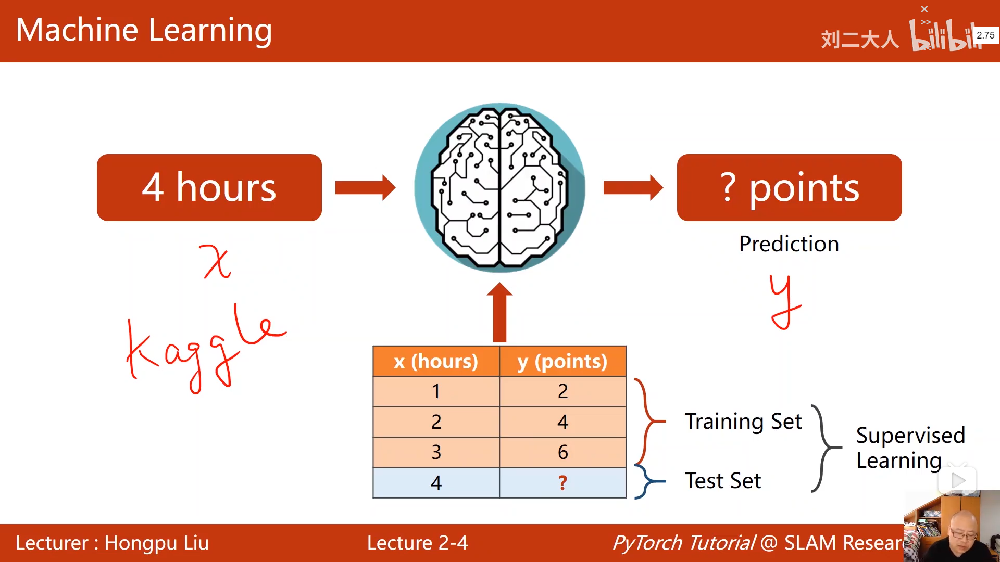
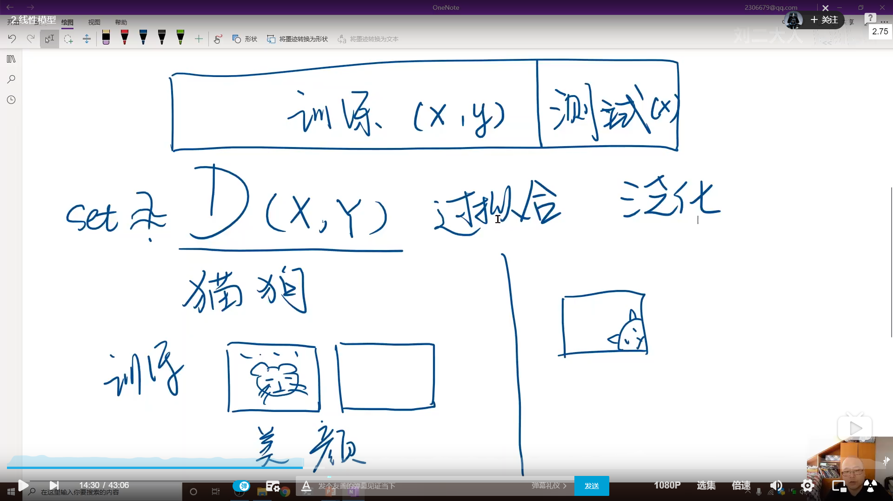
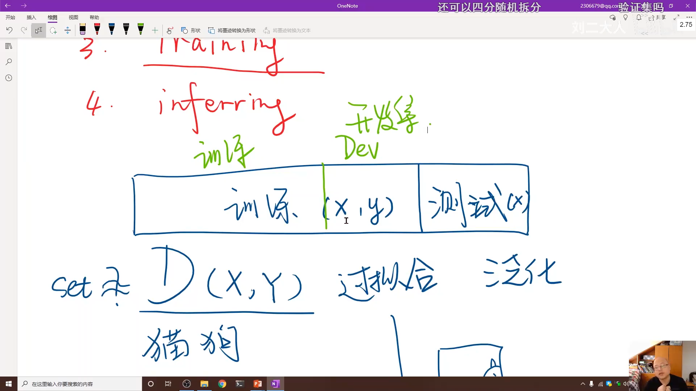
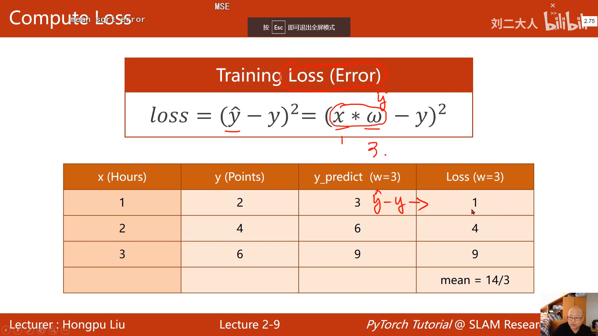
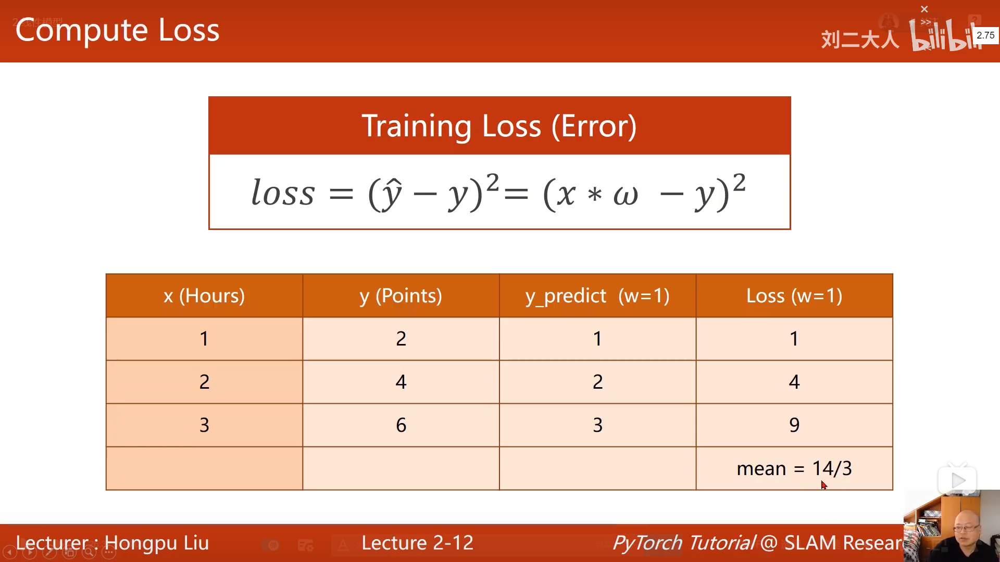
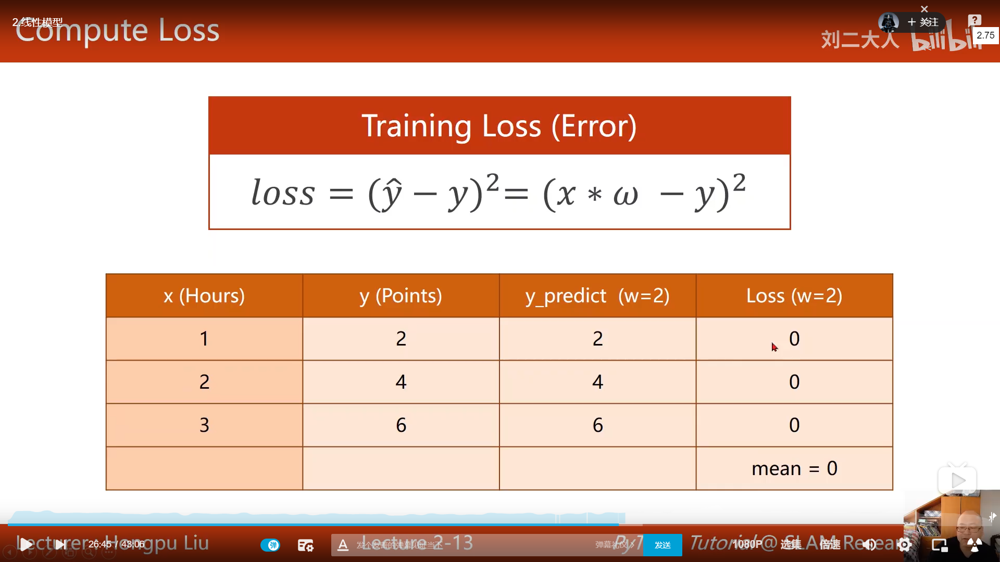
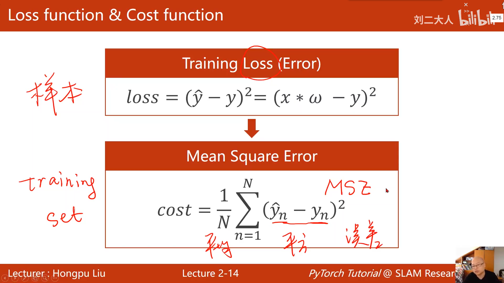
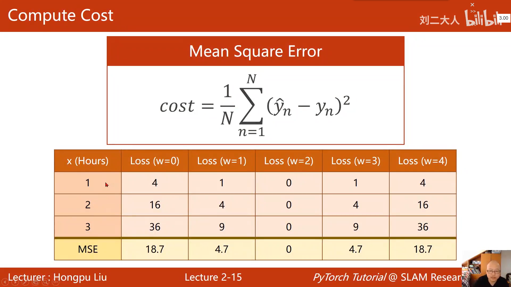
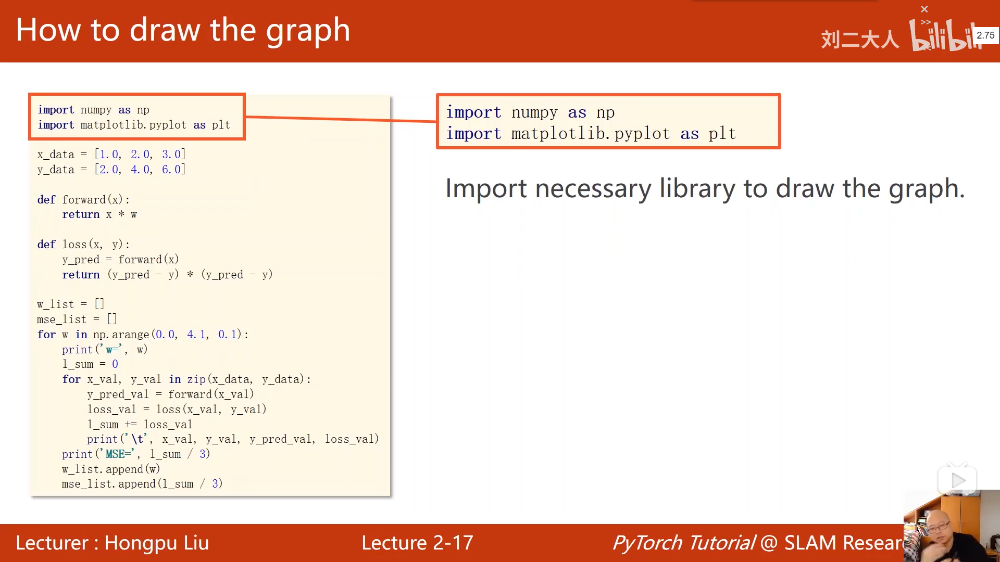

$$
\newcommand{\bx}{\boldsymbol{x}} \notag
\newcommand\dd{\,\mathrm{d}} \notag
\DeclareMathOperator{\sign}{sign}
$$
# PyTorch

## 概述

### 目标

#### 实现基于pyTorch的学习系统

#### 理解深度学习与神经网络的概念

### 要求

#### 算法+概率论

#### Python基础

### 引入

#### 什么是智能

做快速决策前，通过已有或接受的信息（内部+外部信息）来进行推理的过程

将具象的事物【例如照片】与抽象的事物【例如单个词语】连接起来

#### 常用手段

监督学习

#### 常用的算法思维方式

##### 1.穷举法

##### 2.贪心法

##### 3.分治

##### 4.动态规划

DataSet->算法->训练数据->验证->部署

#### 深度学习

是机器学习的一个分支

表示学习等等。。。

### 构建学习系统的历史过程

#### 1.基于规则的系统

$$
\int f(x)dx\,.
$$
求其原函数，基于已有的知识库

#### 2.经典的机器学习方法

表现学习

#### 维度诅咒

input中特征(feature)越多所需样本量越多

#### 流形

对于三维空间中的物体，较扁平平滑而且可导，则可以把这个三维空间映射到二维空间

#### 深度学习

经典机器学习方法

#### 神经网络的研究

研究发现，猫的大脑对于切换的画面有较强的兴奋。后来发现，哺乳动物的神经元是分层的，首先是对变化的初步感知，然后才是识别物体

##### 人工神经元

##### 人工神经网络

##### 感知机

##### 反向传播

求导

进行一系列原子计算（加减乘除矩阵运算等）

前馈过程

反向传播，链式求导，在图中传播这些导数，并且将它乘起来，具有灵活性

## 线性模型

1.数据集

2.建立模型

3.训练

4.应用

评估模型

穷举法

