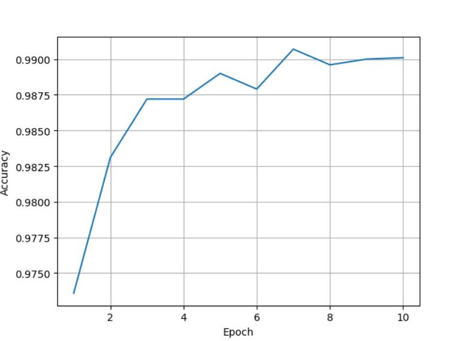

---
html:
  embed_local_images: false
  embed_svg: true
  offline: false
  toc: true
print_background: false
---
# **PyTorch**

# 概述

## 目标

### 实现基于pyTorch的学习系统

### 理解深度学习与神经网络的概念

## 要求

### 算法+概率论

### Python基础

## 引入

### 什么是智能

做快速决策前，通过已有或接受的信息（内部+外部信息）来进行推理的过程。将具象的事物【例如照片】与抽象的事物【例如单个词语】连接起来。

信息->事物

### 常用手段

监督学习

### 常用的算法思维方式

#### 1.穷举法

#### 2.贪心法

#### 3.分治

#### 4.动态规划

DataSet->算法->训练数据->验证->部署

### 深度学习

是机器学习的一个分支

$AI\supset 机器学习\supset 表示学习\supset 深度学习（如MLPs） $

## 构建学习系统的历史过程

### 1.基于规则的系统

基于规则的学习系统，输入->手动编写的程序->输出
		例如，$\int f(x)dx$求其原函数，基于已有的知识库，各种积分法则，定理等等。

### 2.经典的机器学习方法

输入->手动编写的特征->基于特征的映射->输出


#### 新的挑战

1.手动编写特征有极限

2.SVN不能很好地解决大数据问题

3.对非结构型数据的应用需求增大


### 3.表现学习

输入->特征->基于特征的映射->输出

#### 维度诅咒

输入中特征(feature)越多所需样本量越多。例如，一维10->二维$10^2$ ->三维$10^3$->...

#### 流形Manifold

对于三维空间中的物体，较扁平平滑而且可导，则可以把这个三维空间映射到二维空间

### 4.深度学习

输入->简单特征->更多抽象特征的额外层->基于特征的映射->输出

经典机器学习方法

#### 神经网络的研究

研究发现，猫的大脑对于切换的画面有较强的兴奋。后来发现，哺乳动物的神经元是分层的，首先是对变化的初步感知，然后才是识别物体

##### 人工神经元


##### 人工神经网络


#### 感知器


#### 原子计算

进行一系列原子计算（加减乘除矩阵运算等）

#### 正向传播/前馈过程


a=1,b=1

=>c=3,d=3

=>e=9

#### 反向传播/反馈过程

求导

$\frac{\partial e}{\partial a}=\frac{\partial e}{\partial c}\frac{\partial c}{\partial a}$        $\frac{\partial e}{\partial b}=\frac{\partial e}{\partial c}\frac{\partial c}{\partial b}+\frac{\partial e}{\partial d}\frac{\partial d}{\partial b}$

e=9

=>$\frac{\partial e}{\partial c}=d=3$	$\frac{\partial e}{\partial d}=c=3$	

=>$\frac{\partial c}{\partial a}=1$		$\frac{\partial c}{\partial b}=1$		$\frac{\partial d}{\partial b}=1$

反向传播，链式求导，在图中传播这些导数，并且将它乘起来，具有灵活性

#### LeNet-5


#### 发展历程


# 线性模型

## 1.数据集

## 2.建立模型

## 3.训练

## 4.应用

已知如下表格，通过机器学习预测x=4时y=?

| x(小时) | y(得分) |
| ------- | ------- |
| 1       | 2       |
| 2       | 4       |
| 3       | 6       |
| 4       | ？      |

x=1,2,3时的数据集称为**训练集**，x=4时的数据集称为**测试集**，这是一个典型的**监督学习**

所有机器学习都有**训练集(x,y)**【告诉你输入和输出】和**测试集(x)**【仅告诉你输入】检测是否符合要求。在竞赛中，往往会在训练集中切分出一部分作为**开发集/验证集**，作为开发和调试使用

由于数据集同一类型过于集中，有可能会产生数据的**过拟合**现象【比如开个美颜，换个角度就认不出你了，现象：训练结果先降后增】，所以我们要进行**泛化**。

## 评估模型

### 线性模型

$$
\hat y=w*x
$$

### 评估模型误差

计算预估w与实际的差值【这里指差别，不是单纯的求差】来评估误差


## 计算误差

### 简单的非零训练误差

$$
loss=(\hat y-y)^2=(x*w-y)^2
$$

| x(小时) | y(得分) | 预测y值 | 损失(w=3)   | 预测y值 | 损失（w=2)  |
| ------- | ------- | ------- | ----------- | ------- | ----------- |
| 1       | 2       | 3       | 1           | 2       | 0           |
| 2       | 4       | 6       | 4           | 4       | 0           |
| 3       | 6       | 9       | 9           | 6       | 0           |
|         |         |         | 平均值=14/3 |         | 平均值=0    |
| x(小时) | y(得分) | 预测y值 | 损失(w=1)   | 预测y值 | 损失（w=0)  |
| 1       | 2       | 1       | 1           | 0       | 4           |
| 2       | 4       | 2       | 4           | 0       | 16          |
| 3       | 6       | 3       | 9           | 0       | 36          |
|         |         |         | 平均值=14/3 |         | 平均值=56/3 |

### 均方误差（MSE Mean Square Error)

$$
cost=\frac{1}{N} \sum^N_{n=1}(\hat y_n-y_n)^2
$$

| x(小时) | w=0  | w=1  | w=2  | w=3  | w=4  |
| ------- | ---- | ---- | ---- | ---- | ---- |
| 1       | 4    | 1    | 0    | 1    | 4    |
| 2       | 16   | 4    | 0    | 4    | 16   |
| 3       | 36   | 9    | 0    | 9    | 36   |
| MSE     | 18.7 | 4.7  | 0    | 4.7  | 18.7 |

## 穷举法

```python
import numpy as np
import matplotlib.pyplot as plt
#数据集
x_data=[1.0,2.0,3.0]
y_data=[2.0,4.0,6.0]
#线性模型y^=x*w
def forward(x):
    return x*w
#损失函数loss=(x*w-y)^2
def loss(x,y):
    y_pred=forward(x)
    return (y_pred-y)*(y_pred-y)

w_list=[]#权重
mse_list=[]#权重损失值
#采样0.0-4.1间隔为0.1
for w in np.arange(0.0,4.1,0.1):
    print('w=',w)
    l_sum=0
    #从数据集中取数据并拼成所需的val值
    for x_val,y_val in zip(x_data,y_data):
        #预测
        y_pred_val=forward(x_val)
        #计算损失
        loss_val=loss(x_val,y_val)
        #求和
        l_sum+=loss_val
        print('\t',x_val,y_val,y_pred_val,loss_val)
    print('MSE=',l_sum/3)
    w_list.append(w)
    mse_list.append(l_sum/3)
plt.plot(w_list,mse_list)
plt.ylabel('Loss')
plt.xlabel('w')
plt.show()
```


## 练习


# 梯度下降算法

## 分治法：


## 贪心：

每一次迭代都朝着下降最快的方向进行迭代。
梯度：$\frac{\partial cost}{\partial w}$

更新：$w=w-\alpha \frac{\partial cost}{\partial w}$


对于贪心，是有风险的，比如下图中，可能会停止在局部最优点。对于鞍点，w一直不变。


损失函数的导数：
$$
\frac{\partial cost(w)}{\partial w}=\frac{\partial}{\partial w} \frac{1}{N}\sum^N_{n=1}(x_n·w-y_n)^2
$$
$$
=\frac{1}{N}\sum^N_{n=1}2x_n(x_n·w-y_n)
$$
$$
\Rightarrow \frac{\partial loss_n}{\partial w}=2x_n(x_n·w-y_n)
$$
下降梯度：
$$
w=w-\alpha \frac{\partial cost}{\partial w}
$$

$$
\Rightarrow w=w-\alpha \frac{\partial loss}{\partial w}
$$
由上述式子，可以看出，若要避免产生贪心的弊端，就要采取随机选取N的方式，但是这样时间花费太大，所以折中考虑性能和时间，将数据集分成许多**Mini-Batch小块**进行随机操作。

# 神经网络

对于线性模型$\hat y=x*w$

$\frac{\partial loss_n}{\partial w}=2x_n(x_n·w-y_n)$

$w=w-\alpha \frac{\partial loss}{\partial w}$

## 神经元


## 神经网络


## 为什么要使用非线性层？
$$
\hat y=W_2(W_1X+b_1)+b_2
$$
$$
=W_2·W_1·X+(W_2·b_1+b_2)
$$
$$
=W·X+b
$$
由上文，线性反复迭代只能的到线性。和迭代一次效果是一样的，还难以做到修正的效果。

# 正向/反向传播算法


在pytorch中，tensor是一个很重要的动态计算图的组成部分。它包含了数据以及反向的梯度。【梯度被存储在节点中，节点，梯度，损失，各自存储】

```python
import torch

x_data=[1.0,2.0,3.0]
y_data=[2.0,4.0,6.0]
#创建tensor变量，只有一个值
w=torch.Tensor([1.0])
#需要计算梯度
w.requires_grad=True
```


# 使用PyTorch
## 1.准备数据集
## 2.设计模型

计算$\hat y$

## 3.构建损失及优化的对象

使用pytorch 的API

## 4.训练周期


## 广播机制

由于有很多组$\hat y$以及x，w，所以，很自然的我们将所有的$\hat y$，x各自拼接成矩阵。

即：
$$
\hat Y=W·X+b
$$
演示：

不妨设(注W可能不仅为向量，可能是矩阵但要保证W是n\*m,X是m\*1)

$W=\left[
 \begin{matrix}
   w_1 \\ w_2 \\ * \\ * \\ w_m
  \end{matrix} 
\right]_{m×1}$

$X=\left[
 \begin{matrix}
   x_1 \\ x_2 \\ * \\ * \\ x_m
  \end{matrix} 
\right]_{m×1}$

则W会被广播机制拓展为
$$W=\left[
 \begin{matrix}
   w_1 & w_1 & * & w_1 \\
   w_2 & w_2 & * & w_2 \\
   \vdots & \vdots & * & \vdots \\
   w_m & w_m & * & w_m \\
  \end{matrix} 
\right]_{m×m}$$


解得
$$
W·X=\left[
 \begin{matrix}
   \vdots \\
   \vdots \\
   \vdots \\
   \vdots 
  \end{matrix} 
\right]_{m×1}
$$
b是单个实数或向量，但是python拥有广播机制，可以自动将其扩展一个符合大小的矩阵。

假设B=b

B会由广播机制拓展为：
$$
B=\left[
 \begin{matrix}
   b\\ 
   b\\
   \vdots \\ 
   \vdots\\ 
   b
  \end{matrix} 
\right]_{m×1}
$$
以上的操作
$$
\hat Y=W·X+b
$$
也被称之为**线性单元**。

## 线性单元

在Pytorch中，有这样一个类来表示线性单元

```python
class torch.nn.Linear(in_features,out_features,bias=True)
```

### 用途：

这个类用于将输入的数据进行线性变换。即y=Ax+b

### 参数：

【初始化参数】

**in_features**--即将输入的参数的尺寸size

**out_features**--输出的参数的尺寸size

**bias=True**--是否开启后面的尾缀b，False表示成比例,即b=0

【注：bias--b】

### Shape要求

**输入**：(N,*,in_features)

*表示任何额外的维度

**输出**：(N,*,out_features)

除了最后一维，其余要求和输入相同。

比如$Y:n×2=X:n×3·W:3×2$

当然也常常使用W的转置
$$
Y^T:2×n=W^T:2×3·X^T:3×n
$$
## 损失函数

### MSELoss

矩阵表达式为：

$Loss=(\hat Y-Y)^2$

即
$$
loss=\frac {1}{N}\sum^N_iloss_i$$$$
\left[
 \begin{matrix}
   loss_1 \\ loss_2 \\ loss_3
  \end{matrix} 
\right]_{3×1}=
(\left[
 \begin{matrix}
   \hat y_1 \\ \hat y_2 \\ \hat y_3
  \end{matrix} 
\right]_{3×1}-
\left[
 \begin{matrix}
   y_1 \\ y_2 \\ y_3
  \end{matrix} 
\right]_{m×1})**2
$$
在Pytorch中，有这样一个类来表示上述计算

```python
class torch.nn.MSELoss(size_average=True,reduce=True)
```

#### 用途：

封装了上述函数，计算平均损失，用来得到目标y。

#### 参数：

size_average：是否开启求平均

reduce：是否返回标量

#### 样式：
$$
l(x,y)=L=\{l_1,...,l_N\}^T,l_n=(x_n-y_n)^2
$$
此时N是batch_size

##### 缺点

使用MSE的一个缺点就是其偏导值在输出概率值接近0或者接近1的时候非常小，这可能会造成模型刚开始训练时，偏导值几乎消失。

## 优化器

### SGD

```python
class torch.optim.SGD(params, lr=, momentum=0, dampening=0, weight_decay=0, nesterov=False)
```

#### 应用

实现随机梯度下降算法（momentum可选）。

#### 参数：

**params** (iterable) – 待优化参数的iterable或者是定义了参数组的dict

**lr** (`float`) – 学习率

**momentum** (`float`, 可选) – 动量因子（默认：0）

**weight_decay** (`float`, 可选) –正则化 权重衰减（L2惩罚）（默认：0）

**dampening** (`float`, 可选) – 动量的抑制因子（默认：0）

**nesterov** (`bool`, 可选) – 使用Nesterov动量（默认：False）

### 其他优化器

- torch.optim.Adagrad
- torch.optim.Adam
- torch.optim.Adamax
- torch.optim.ASGD
- torch.optim.LBFGS
- torch.optim.RMSprop
- torch.optim.Rprop
- torch.optim.SGD

## **注意：多去查阅Pytorch官方文档**

## 代码

```python
import torch
#3×1矩阵
#1.准备数据集
x_data=torch.Tensor([[1.0],[2.0],[3.0]])
y_data=torch.Tensor([[2.0],[4.0],[6.0]])
#继承自nn.model是神经网络模型的基础
#2.设计模型模块
class LinearModel(torch.nn.Module):
    #初始化
    def __init__(self):
        super(LinearModel,self).__init__()
        #构造对象（包含__call__()构造函数）
        self.linear=torch.nn.Linear(1,1)
    #函数重载
    def forward(self,x):
        y_pred=self.linear(x)
        return y_pred
#Callable
model =LinearModel()
#均方损失函数，size_average=False损失求和,否则求均值。reduce是否求和降维
#3.构建损失函数和优化器
criterion=torch.nn.MSELoss(size_average=False)
#优化模型model.parameters()获取你的model中的所有参数
optimizer=torch.optim.SGD(model.parameters(),lr=0.01)
#与前面的for x,y in zip(x_data,y_data):...等价
#4.训练循环
for epoch in range(100):
    #1.前馈中计算y^
    y_pred=model(x_data)
    #2.计算损失
    loss=criterion(y_pred,y_data)
    print(epoch,loss)
    #3.梯度归零
    optimizer.zero_grad()
    #4.反向传播
    loss.backward()
    #5.更新
    optimizer.step()
print('w=',model.linear.weight.item())
print('b=',model.linear.bias.item())
#测试预测
x_test=torch.Tensor([[4.0]])
y_test=model(x_test)
print('y_pred=',y_test.data)
```
最终x=4时的预测结果

```
w= 1.9999569654464722
b= 9.796061203815043e-05
y_pred= tensor([[7.9999]])
```


# Logistic回归/分类

## 获取数据集

比如MNIST数据集（手写数字分类）等等。

结果$y\in \{0,1,2,...,9\}$结果可能不能完全映射到一个数字上(因为7和9两个数字手写上更加接近)，所以输出会是一系列概率值P(0),P(1),P(2),...P(9)

```python
#下载MNIST数据集
import torchvision
#训练集，tain=True，download=True，若在包中找不到该数据集，开启自动下载
train_set=torchvision.datasets.MNIST(root='../dataset/mnist',train=True,download=True)
#测试集
test_set=torchvision.datasets.MNIST(root='../dataset/mnist',train=False,download=True)
```

比如CIFAR-10数据集（32*32彩色小图片的简单分类）。

```python
#下载CIFAR10数据集
import torchvision
#训练集
train_set=torchvision.datasets.CIFAR10(...)
#测试集
test_set=torchvision.datasets.CIFAR10(...)
```

## 回归

回归的结果$y\in R$,而分类的$y\in{离散集}$。

原来的梯度下降算法，结果是这样的：

| x(小时) | y(分数) |
| ------- | ------- |
| 1       | 2       |
| 2       | 4       |
| 3       | 6       |
| 4       | ?       |
现在的线性回归算法，应该的结果是这样的：

| x(小时) | y(True/False) |
| ------- | ------------- |
| 1       | 0(False)      |
| 2       | 0(False)      |
| 3       | 1(True)       |
| 4       | ?             |

在分类问题中，模式的输出是在所有确定类别中的元素概率。且所有的概率均大于等于0，小于等于1。

## 饱和函数

### logisic函数
$$
\sigma(x)=\frac 1 {1+e^{-x}}
$$
本来上文中，$\hat y=wx+b \in R$，现在设$z=wx+b$，$\hat y=\sigma(z)\in [0,1]$。

图像如图所示：


所以，一次$\hat y=wx+b$被称之为**线性单元**，一次$\hat y=\sigma(wx+b)$被称之为logistic回归单元

### 其他饱和函数


## 损失函数：

### 线性回归损失函数：MSELoss
$$
loss=(\hat y-y)^2=(x·w-y)^2
$$

### 二分类的损失函数：BCELoss
$$
loss=-(ylog\hat y+(1-y)log(1-\hat y))
$$
#### 性质：

分类讨论研究其性质

①y=0时

y=P(class=1)=0

$loss=-log(1-\hat y)$

$1-\hat y=P(class=0)$

②y=1时

y=P(class=0)=1

$loss=-log(\hat y)$

$\hat y=P(class=1)$

易知：
$$
\sum_i P_D(x=i) ln(P_T(x=i))
$$
这个和反映了分布间的**差异大小**

所以Mini-Batch的二分类损失函数公式为
$$
loss=-\frac 1 N \sum^N_{n=1}(y_nlog\hat y_n+(1-y_n)log(1-\hat y_n))
$$
| y    | $\hat y$ | BEC Loss |
| ---- | -------- | -------- |
| 1    | 0.2      | 1.609    |
| 1    | 0.8      | 0.223($\hat y$接近y,损失小) |
| 0    | 0.3      | 0.357    |
| 0    | 0.7      | 1.204    |
| Mini-Batch Loss|       | 0.8483    |


## logistic回归函数（单特征量）计算代码

```python
import torch
import torch.nn.functional as F
#3×1矩阵
#1.准备数据集
x_data=torch.Tensor([[1.0],[2.0],[3.0]])
y_data=torch.Tensor([[0],[0],[1]])
#继承自nn.model是神经网络模型的基础
#2.设计模型模块
class LogisticRegressionModel(torch.nn.Module):
    #初始化
    def __init__(self):
        super(LogisticRegressionModel, self).__init__()
        #构造对象（包含__call__()构造函数）
        self.linear=torch.nn.Linear(1,1)
    #函数重载
    def forward(self,x):
        #y^=σ(w*x+b) 
        #注：旧版F.sigmoid(self.linear(x))
        y_pred=torch.sigmoid(self.linear(x))
        return y_pred
#Callable
model =LogisticRegressionModel()
#交叉熵损失函数，size_average=False损失求和,否则求均值。reduce是否求和降维
#3.构建损失函数和优化器 老师用的老版本size_average=False,现版本reduction='sum’
criterion=torch.nn.BCELoss(reduction='sum')
#优化模型model.parameters()获取你的model中的所有参数
optimizer=torch.optim.SGD(model.parameters(),lr=0.01)
#与前面的for x,y in zip(x_data,y_data):...等价
#4.训练循环
for epoch in range(1000):
    #1.前馈中计算y^
    y_pred=model(x_data)
    #2.计算损失
    loss=criterion(y_pred,y_data)
    #print(epoch,loss.item())
    #3.梯度归零
    optimizer.zero_grad()
    #4.反向传播
    loss.backward()
    #5.更新
    optimizer.step()
    import numpy as np
import matplotlib.pyplot as plt
#0-10取200个点
x=np.linspace(0,10,200)
#200*1的矩阵，类似于reshape
x_t=torch.Tensor(x).view((200,1))
y_t=model(x_t)
y=y_t.data.numpy()
plt.plot(x,y)
plt.plot([0,10],[0.5,0.5],c='r')
plt.xlabel('Hours')
plt.ylabel('Probability of Pass')
plt.grid()
plt.show()
```

### 结果：


# 多维特征输入

## 数据

### 样本Sample

一条条数据+结果，一条数据包含多个信息【特征/字段】。

### 分类Record

随后的分类结果。

例如，本章采用的数据集是糖尿病病人的数据集。图示如下：

横着的是一条条**样本**

竖着的是一个个**特征/字段**


## 多特征logistic回归

上一章说明了单特征的logistic回归，同理，多特征logistic回归只需要将上文中的变量全部转换为向量/矩阵即可。
$$
\hat y^{(i)}=\sigma(\sum^8_{n=1}x_n^{(i)}·w_n+b) $$$$
\Rightarrow \hat y^{(i)}=\sigma(
\left[
 \begin{matrix}
   x_1^{(i)} & ... & x_8^{(i)}
  \end{matrix} 
\right]_{1×8}
\left[
 \begin{matrix}
   w_1 \\ .\\. \\ w_8
  \end{matrix} 
\right]_{8×1}+b)
= \sigma(z^{(i)})
$$
所以易得Z的向量运算公式
$$
\left[
 \begin{matrix}
   z^{(1)} \\ .\\. \\ z^{(N)}
  \end{matrix} 
\right]_{N×1}=
\left[
 \begin{matrix}
   x_1^{(1)} & ... & x_8^{(1)}\\
   .       & ... & .\\
   .       & ... & .\\
   x_1^{(N)} & ... & x_8^{(N)}\\
  \end{matrix} 
\right]_{N×8}
\left[
 \begin{matrix}
   w_1 \\ .\\. \\ w_8
  \end{matrix} 
\right]_{8×1}+\left[
 \begin{matrix}
   b \\ .\\. \\ b
  \end{matrix} 
\right]_{N×1}
$$
### 空间维度变换

空间转换，将N维映射到M维上。
$$
Y_{M×1}=A_{M×N}X_{N×1}
$$
#### Pytorch函数实现空间维度变换

例如：8维转变为2维

```python
self.linear=torch.nn.Linear(8,2)
```

#### 首尾相连一步步空间维度转换

将这些维度变换首尾相连，通过非线性变换，将8维降到1维。

8->6->2->1。

很明显的，可以分成多步首尾相连维度逐层递减。当然，也可以局部放大特征后在逐步进行缩小。可以这样：

8->24->12->6->2->1

层数不一定越多越好，过多可能就会**过拟合**。

但是该如何更好地取得层数呢？**超参数的搜索！**

## **开发注意：!!!**

### 1.抠书本

多读书，西瓜书，花书等等

### 2.读文档

理解基本的架构理念--泛化能力

## 代码：


```python
import torch
import numpy as np
#读取文件，以“,”为分隔符，N卡一般只支持32位浮点数
#1.准备数据
xy=np.loadtxt('diabetes.csv.gz',delimiter=',',dtype=np.float32)
x_data=torch.from_numpy(xy[:,:-1])
y_data=torch.from_numpy(xy[:,[-1]])
#2.设计模型模块
class Model(torch.nn.Module):
    #初始化
    def __init__(self):
        super(Model, self).__init__()
        #构造对象 8*6 6*4 4*1三层
        self.linear1=torch.nn.Linear(8,6)
        self.linear2=torch.nn.Linear(6,4)
        self.linear3=torch.nn.Linear(4,1)
        self.sigmoid=torch.nn.Sigmoid()
        self.activate=torch.nn.ReLU()
    #函数重载
    def forward(self,x):
        #y^=σ(w*x+b) 反复迭代多层（激活函数）
        x=self.activate(self.linear1(x))
        x=self.activate(self.linear2(x))
        x=self.sigmoid(self.linear3(x))
        return x
#Callable
model =Model()
#3.构建损失函数和优化器 旧版写法size_average=True
criterion=torch.nn.BCELoss(reduction='mean')
#优化模型model.parameters()获取你的model中的所有参数
optimizer=torch.optim.SGD(model.parameters(),lr=0.01)
#4.训练循环
for epoch in range(1000):
    #1.前馈中计算y^
    y_pred=model(x_data)
    #2.计算损失
    loss=criterion(y_pred,y_data)
    print(epoch,loss.item())
    #3.梯度归零
    optimizer.zero_grad()
    #4.反向传播
    loss.backward()
    #5.更新
    optimizer.step()
```


各种激活函数


# 数据集

## Dataset

数据集+索引

## DataLoader

加载+Mini_Batch 

## 取得数据集过程


## 代码

```python
import torch
import numpy as np
#Dataset抽象类,DataLoader用于加载数据
from torch.utils.data import Dataset,DataLoader
#1.准备数据
class DiabetesDataset(Dataset):
    def __init__(self,filepath):
        #1.获取全部数据
        #2.文件名列表或标签列表
        xy=np.loadtxt(filepath,delimiter=',',dtype=np.float32)
        #print(xy)
        #shape->(N,9) shape[0]=N
        self.len=xy.shape[0]
        #:-1到最后第二个为止,m个数据m*8矩阵
        self.x_data=torch.from_numpy(xy[:,:-1])
        #[-1]最后一个,m*1矩阵
        self.y_data=torch.from_numpy(xy[:,[-1]])
    #支持索引下标操作
    def __getitem__(self,index):
        return self.x_data[index],self.y_data[index]
    #获得长度
    def __len__(self):
        return self.len

dataset=DiabetesDataset('diabetes.csv.gz')
#初始化加载器,自动转换成tensor
train_loader=DataLoader(dataset=dataset,#数据集
                       batch_size=32,#Mini-Batch大小
                       shuffle=True,#是否随机读取/打乱
                       num_workers=2)#并行进程个数
#2.设计模型模块
class Model(torch.nn.Module):
    #初始化
    def __init__(self):
        super(Model, self).__init__()
        #构造对象 8*6 6*4 4*1三层
        self.linear1=torch.nn.Linear(8,6)
        self.linear2=torch.nn.Linear(6,4)
        self.linear3=torch.nn.Linear(4,1)
        self.sigmoid=torch.nn.Sigmoid()
        self.activate=torch.nn.ReLU()
    #函数重载
    def forward(self,x):
        #y^=σ(w*x+b) 反复迭代多层（激活函数）
        x=self.activate(self.linear1(x))
        x=self.activate(self.linear2(x))
        x=self.sigmoid(self.linear3(x))
        return x
#Callable
model =Model()
#3.构建损失函数和优化器 旧版写法size_average=True
criterion=torch.nn.BCELoss(reduction='mean')
#优化模型model.parameters()获取你的model中的所有参数
optimizer=torch.optim.SGD(model.parameters(),lr=0.01)
#4.训练循环
#windows上运行需要加上这一行，防止线程出现RuntimeError的错误
if __name__ == '__main__':
    for epoch in range(10):
        #获得trainloader的迭代器，从0开始
        #纠错，老师讲课好像是直接enumerate(train_loader,0)会取不到data
        #下两行也可以写成for i,(inputs,labels) in enumerate(train_loader.dataset,0):
        for i,data in enumerate(train_loader.dataset,0):
            #1.准备数据,获取输入x与标签（结果y）
            inputs,labels=data
            #2.正向传播
            y_pred=model(inputs)
            loss=criterion(y_pred,labels)
            if i==720:
                print(epoch,i,loss.item())
            #3.梯度归零
            optimizer.zero_grad()
            #4.反向传播
            loss.backward()
            #5.更新
            optimizer.step()
```

结果

```
0 720 0.4055490493774414
1 720 0.38245439529418945
2 720 0.30611085891723633
3 720 0.1746852695941925
4 720 0.09982635825872421
5 720 0.07228878885507584
6 720 0.06219954416155815
7 720 0.058494314551353455
8 720 0.056936316192150116
9 720 0.05493342503905296
```

## 其他有趣的数据集

- MNIST
- Fashion-MNIST
- EMNIST
- COCO
- LSUN
-  ImageFolder
- DatasetFolder
- Imagenet-12
- CIFAR
- STL10
- PhotoTour

## 练习


# 多分类问题

## 从最经典的案例出发

多分类问题中的图像识别，有一个最为经典的数据集，就是识别手写的0-9的数字了。

那么我们上述所有的方法都是基于二分类问题的，那么如果要求多个分类呢？我们该如何设计？

如果使用上文的sigmoid，可以求出$\hat y_i$，但是这些$\hat y_i$的分布是不满足概率条件的【即不满足所有的$\hat y_i$和为1，或概率不一定大于0】，而且，可能有好几种的概率都特别大，所以我们希望能够使输出相互抑制，形成竞争型关系，从而显示出其概率。

## Softmax层

softmax--**归一化指数函数**
$$
P(y=i)=\frac{e^{z_i}}{\sum^{K-1}_{j=0}e^{z_j}},i\in\{0,...,K-1\}
$$
这样就能使其概率相互抑制，所有概率大于0且和为1。


## 损失函数


### NLLLoss:

经过上述的softmax计算我们获得了一个概率向量$\hat Y$，与训练集的结果Y构成如下的损失函数：
$$
Loss(\hat Y,Y)=-Ylog\hat Y
$$
#### 代码：
```python
import numpy as np
y=np.array([1,0,0])
z=np.array([0.2,0.1,-0.1])
#---CrossEntropyLoss交叉熵损失---#
#y_hat=e^z/sum(e^z)，使其满足概率分布，softmax
y_pred=np.exp(z)/np.exp(z).sum()
#-ylog(y_hat)
loss=(-y*np.log(y_pred)).sum()
#-------------------------------#
print(loss)
```
#### 结果
```
0.9729189131256584
```

### torch.nn.CrossEntropyLoss() 

NLLLoss+softmax。

#### 简单的交叉熵使用实例：

##### 代码：


```python
import torch
#长整型张量
y=torch.LongTensor([0])
z=torch.Tensor([[0.2,0.1,-0.1]])
#交叉熵损失（上文是numpy的实现，本节是pytorch的实现）
criterion=torch.nn.CrossEntropyLoss()
loss=criterion(z,y)
print(loss)
```

##### 结果

```
tensor(0.9729)
```

#### 具体示例：

batch_size=3

##### 代码：

```python
import torch
criterion=torch.nn.CrossEntropyLoss()
#假设标签为2,0,1
y=torch.LongTensor([2,0,1])
y_pred1=torch.Tensor([[0.1,0.2,0.9],#0.9概率为2
                      [1.1,0.1,0.2],#1.1概率为0
                      [0.2,2.1,0.1]])#2.1概率为1【预测结果不错】
y_pred2=torch.Tensor([[0.8,0.2,0.3],#0.8概率为2
                      [0.2,0.3,0.5],#0.5概率为1
                      [0.2,0.2,0.5]])#0.5概率为1【预测结果不佳】
l1=criterion(y_pred1,y)
l2=criterion(y_pred2,y)
print("Batch Loss1=",l1.data,"\nBatch Loss2=",l2.data)
```

结果

```
Batch Loss1= tensor(0.4966) 
Batch Loss2= tensor(1.2389)
```

### 练习：


## MNIST数据集

所有数据是由28\*28=784个像素点组成。每个点用不同数值表示其亮度大小，具体如图所示：


### 多通道的数据

对于一张纯黑白的图片数据，仅有单通道【即一个图层】仅包含一个W×H的矩阵。

但是现在保存的彩色照片都是由三种颜色RGB的三通道（Channel）叠合而成的，所以形成的矩阵为W×H×C。不过为了进行高效的数据转换，我们经常讲数据矩阵转换为C×W×H。

### 代码：

```python
import torch
import torchvision
#准备构建数据加载器
from torchvision import transforms
from torchvision import datasets
from torch.utils.data import DataLoader
#使用ReLU()
import torch.nn.functional as F
#优化器
import torch.optim as optim
batch_size=64
#Compose将所有[]内的转变为C（通道）*W（宽）*H（高）的张量
transform=transforms.Compose([
    transforms.ToTensor(),#将PIL图像转换为张量
    #标准化0.1307->平均值  0.3081->标准差/前人计算好的
    transforms.Normalize((0.1307, ),(0.3081, ))
])
```

标准化0.1307->mean  0.3081->std

此时标准化像素的公式为：
$$
Pixel_{normal}=\frac {Pixel_{origin}-mean} {std}
$$
```python
train_dataset=datasets.MNIST(root='../dataset/mnist/',
                             train=True,
                             download=True,
                             transform=transform)
train_loader=DataLoader(train_dataset,
                       shuffle=True,
                       batch_size=batch_size)
test_dataset=datasets.MNIST(root='../dataset/mnist/',
                             train=False,
                             download=True,
                             transform=transform)
test_loader=DataLoader(train_dataset,
                       shuffle=False,
                       batch_size=batch_size)
class Net(torch.nn.Module):
    def __init__(self):
        super(Net,self).__init__()
        self.l1=torch.nn.Linear(784,512)
        self.l2=torch.nn.Linear(512,256)
        self.l3=torch.nn.Linear(256,128)
        self.l4=torch.nn.Linear(128,64)
        self.l5=torch.nn.Linear(64,10)
        
    def forward(self,x):
        #N*1*28*28转变为N*784的矩阵,-1自动计算第N*1个矩阵
        x=x.view(-1,784)
        #激活
        x=F.relu(self.l1(x))
        x=F.relu(self.l2(x))
        x=F.relu(self.l3(x))
        x=F.relu(self.l4(x))
        #最后一层不激活，接入到softmax
        return self.l5(x)

model=Net()
#3.构建损失函数和优化器 旧版写法size_average=True
criterion=torch.nn.CrossEntropyLoss()
#lr=0.01学习率 momentum=0.5冲量优化
optimizer=optim.SGD(model.parameters(),lr=0.01,momentum=0.5)
def train(epoch):
    running_loss=0.0
    for batch_idx,data in enumerate(train_loader,0):
        inputs,target=data
        optimizer.zero_grad()
        #正向传播+反向传播+更新
        outputs=model(inputs)
        loss=criterion(outputs,target)
        loss.backward()
        optimizer.step()
        
        running_loss+=loss.item()
        if(batch_idx%300==299):
            print('[%d,%5d] loss:%.3f'%(epoch+1,batch_idx+1,running_loss/300))
            running_loss=0.0
            def test():
    correct=0
    total=0
    #测试集不需要开启梯度计算
    with torch.no_grad():
        for data in test_loader:
            images,labels=data
            outputs=model(images)
            #沿着第1维度（横向）寻找最大可能的解
            _,predicted=torch.max(outputs.data,dim=1)
            #总共的值
            total+=labels.size(0)
            #统计猜对的值
            correct+=(predicted==labels).sum().item()
    print('Accuracy on test set:%d %%'%(100*correct/total))

if __name__ == '__main__':
    for epoch in range(10):
        train(epoch)
        test()
```

### 结果：

```
[1,  300] loss:2.179
[1,  600] loss:0.710
[1,  900] loss:0.401
Accuracy on test set:90 %
[2,  300] loss:0.310
[2,  600] loss:0.252
[2,  900] loss:0.224
Accuracy on test set:94 %
[3,  300] loss:0.181
[3,  600] loss:0.167
[3,  900] loss:0.142
Accuracy on test set:96 %
[4,  300] loss:0.129
[4,  600] loss:0.116
[4,  900] loss:0.115
Accuracy on test set:97 %
[5,  300] loss:0.096
[5,  600] loss:0.083
[5,  900] loss:0.096
Accuracy on test set:97 %
[6,  300] loss:0.074
[6,  600] loss:0.074
[6,  900] loss:0.071
Accuracy on test set:98 %
[7,  300] loss:0.058
[7,  600] loss:0.060
[7,  900] loss:0.063
Accuracy on test set:98 %
[8,  300] loss:0.049
[8,  600] loss:0.045
[8,  900] loss:0.050
Accuracy on test set:98 %
[9,  300] loss:0.036
[9,  600] loss:0.042
[9,  900] loss:0.041
Accuracy on test set:99 %
[10,  300] loss:0.031
[10,  600] loss:0.032
[10,  900] loss:0.034
Accuracy on test set:99 %
```

## 练习：


# 卷积神经网络

## 基础【串行结构】

### 全连接网络

全是线性层连接的网络称之为全连接网络，例如：

```python
self.l1=torch.nn.Linear(784,512)
self.l2=torch.nn.Linear(512,256)
self.l3=torch.nn.Linear(256,128)
self.l4=torch.nn.Linear(128,64)
self.l5=torch.nn.Linear(64,10)
```

任意输出节点都要参与到下一轮节点的计算上。784->512->256->128->64->10。

但是每一次都直接使用线性降维，运算太大了。所以提出了下一个结构。

### 二维卷积神经网络

按照原始的结构，来保留空间结构。图像->三维张量。

然后经过2*2的下采样，减少元素数量，降低运算的需求。


这个框【卷积核】反复滑动，对每一个块进行扫描卷积，来综合每个点的信息，减少运算成本。

### 示例

​																	输入					卷积核					输出
$$
\left[\begin{matrix}
3 & 4 & 6 & 5 & 7\\
2 & 4 & 6 & 8 & 2\\
1 & 6 & 7 & 8 & 4\\
9 & 7 & 4 & 6 & 2\\
3 & 7 & 5 & 4 & 1
\end{matrix} \right]⊙
\left[\begin{matrix}
1 & 2 & 3\\
4 & 5 & 6\\
7 & 8 & 9\\
\end{matrix} \right]=
\left[\begin{matrix}
211 & 295 & 262\\
259 & 282 & 214\\
251 & 253 & 169\\
\end{matrix} \right]
$$
#### 卷积过程示例：

取左上角的3\*3矩阵$\left[\begin{matrix}
3 & 4 & 6\\
2 & 4 & 6\\
1 & 6 & 7\\
\end{matrix} \right]$先进行与卷积核相乘卷积

即：3·1+4·2+6·3+2·4+4·5+6·6+1·7+6·8+7·9=211，所以输出第一个是就是211

所以，**三通道**就是将三个通道的矩阵与卷积核进行**卷积**【**卷积核不一定相同**】，将卷积后的结果**相加**依然能得到单通道的3*3矩阵【这里的维度是5-2=3】，从而大大减少了计算量。多通道->过滤器->特征图->拼接->

#### 卷积过程示意图：


### 卷积层

#### 压缩

设，输入数据为：$m×width_{in}×height_{in}$。

每层降维需要m个过滤器【卷积核】它们的大小为：$n×kernel_size_{width}×kernel_size_{height}$。

即，若输入n维通道，则由n个卷积核组成1个filter。因为1个filter可以将n个维度压缩到1维。

那么通过m个filter就将整个数据压缩成$m×width_{out}×height_{out}$

##### 维度演示代码：

```python
import torch
#n层图像 m个卷积核【必要】
in_channels,out_channels=5,10
#图像大小
width,height=100,100
#卷积核大小【必要】
kernel_size=3
#注：pytorch只接受小批量数据
batch_size=1
input=torch.randn(batch_size,
                 in_channels,
                 width,
                 height)
#创建卷积层
conv_layer=torch.nn.Conv2d(in_channels,
                          out_channels,
                          kernel_size=kernel_size)
output=conv_layer(input)
print(input.shape)
print(output.shape)
print(conv_layer.weight.shape)
```
##### 结果：

```
torch.Size([1, 5, 100, 100])
torch.Size([1, 10, 98, 98])
torch.Size([10, 5, 3, 3])
```

#### 填充

如果想输出时过得更大的维数来精确信息，我们该怎么做呢？

当然是将，输出往外扩充一格啦，然后将所有扩充的格数填0就好了！

​				                                          输入					卷积核					输出
$$
\left[\begin{matrix}
0 & 0 & 0 & 0 & 0 & 0 & 0\\
0 & 3 & 4 & 6 & 5 & 7 & 0\\
0 & 2 & 4 & 6 & 8 & 2 & 0\\
0 & 1 & 6 & 7 & 8 & 4 & 0\\
0 & 9 & 7 & 4 & 6 & 2 & 0\\
0 & 3 & 7 & 5 & 4 & 1 & 0\\
0 & 0 & 0 & 0 & 0 & 0 & 0\\
\end{matrix} \right]⊙
\left[\begin{matrix}
1 & 2 & 3\\
4 & 5 & 6\\
7 & 8 & 9\\
\end{matrix} \right]=
\left[\begin{matrix}
91 & 168 & 224 & 215 & 127\\
114 & 211 & 295 & 262 & 149\\
192 & 259 & 282 & 214 & 122\\
194 & 251 & 253 & 169 & 86\\
96 & 112 & 110 & 68 & 31\\
\end{matrix} \right]
$$
#### torch.nn.Conv2d

为此Pytorch提供了这个torch.nn.Conv2d函数，来方便的进行卷积

#### 示意代码：

```python
import torch
input=[3,4,6,5,7,
      2,4,6,8,2,
      1,6,7,8,4,
      9,7,4,6,2,
      3,7,5,4,1]
#Batch=1 Channel=1 Width=5 Height=5
input=torch.Tensor(input).view(1,1,5,5)
#卷积层 输入通道=1 输出通道=1 卷积核大小=3 扩充填0=1【3*3变成5*5】 不需要偏移
conv_layer=torch.nn.Conv2d(1,1,kernel_size=3,padding=1,bias=False)
#Output=1 Input=1 Width=3 Height=3
kernel=torch.Tensor([1,2,3,4,5,6,7,8,9]).view(1,1,3,3)
#将自定义的卷积核权数赋值给卷积层
conv_layer.weight.data=kernel.data
output=conv_layer(input)
print(output)
```

#### 结果：

```
tensor([[[[ 91., 168., 224., 215., 127.],
          [114., 211., 295., 262., 149.],
          [192., 259., 282., 214., 122.],
          [194., 251., 253., 169.,  86.],
          [ 96., 112., 110.,  68.,  31.]]]], grad_fn=<ThnnConv2DBackward>)
```


### Stride跳步

将torch.nn.Conv2d中的参数stride=2【默认=1，即逐块扫描】，将中心一次走两格跳着扫描【比如卷积核中心从(2,2)走到了(2,5)】。这样就能有效的降低维度和运算量【不过信息可能会丢失】

#### 示意代码：

```python
import torch
input=[3,4,6,5,7,
      2,4,6,8,2,
      1,6,7,8,4,
      9,7,4,6,2,
      3,7,5,4,1]
#Batch=1 Channel=1 Width=5 Height=5
input=torch.Tensor(input).view(1,1,5,5)
#卷积层 输入通道=1 输出通道=1 卷积核大小=3 隔2格扫描一下【3*3变成2*2】 不需要偏移
conv_layer=torch.nn.Conv2d(1,1,kernel_size=3,stride=2,bias=False)
#Output=1 Input=1 Width=3 Height=3
kernel=torch.Tensor([1,2,3,4,5,6,7,8,9]).view(1,1,3,3)
#将自定义的卷积核权数赋值给卷积层
conv_layer.weight.data=kernel.data
output=conv_layer(input)
print(output)
```

#### 结果

```
tensor([[[[211., 262.],
          [251., 169.]]]], grad_fn=<ThnnConv2DBackward>)
```

### MaxPooling层

最大池化层，可以有效的将数据矩阵边长缩小到1/2【向上取整】。

#### 原理：

将矩阵划分成四个元素为一组的区块，并选出其中的最大值组成新的矩阵
$$
\left[
    \begin{array}{cc|cc}
    3 & 4 & 6 & 5\\ 
    2 & *4 & 6 & *8\\\hline
    1 & 6 & *7 & 5\\
    *9 & 7 & 4 & 6\\
    \end{array}
\right]\Longrightarrow
\left[
    \begin{matrix}
    4 & 8\\
    9 & 7
    \end{matrix}
\right]
$$
#### 代码

```python
import torch
input=[3,4,6,5,
      2,4,6,8,
      1,6,7,8,
      9,7,4,6,]
input=torch.Tensor(input).view(1,1,4,4)
#默认stride=2，将input分成4个2*2矩阵，取每个矩阵最大值
maxpooling_layer=torch.nn.MaxPool2d(kernel_size=2)
output=maxpooling_layer(input)
print(output)
```

#### 结果

```
tensor([[[[4., 8.],
          [9., 8.]]]])
```

### 简单的卷积神经网络示意图:


### 实现代码：

```python
import torch
import torchvision
#准备构建数据加载器
from torchvision import transforms
from torchvision import datasets
from torch.utils.data import DataLoader
#使用ReLU()
import torch.nn.functional as F
#优化器
import torch.optim as optim
batch_size=64
#Compose将所有[]内的转变为C（通道）*W（宽）*H（高）的张量
transform=transforms.Compose([
    transforms.ToTensor(),#将PIL图像转换为张量
    #标准化0.1307->平均值  0.3081->标准差/前人计算好的
    transforms.Normalize((0.1307, ),(0.3081, ))
])
train_dataset=datasets.MNIST(root='../dataset/mnist/',
                             train=True,
                             download=True,
                             transform=transform)
train_loader=DataLoader(train_dataset,
                       shuffle=True,
                       batch_size=batch_size)
test_dataset=datasets.MNIST(root='../dataset/mnist/',
                             train=False,
                             download=True,
                             transform=transform)
test_loader=DataLoader(train_dataset,
                       shuffle=False,
                       batch_size=batch_size)
class Net(torch.nn.Module):
    def __init__(self):
        super(Net,self).__init__()
        self.conv1=torch.nn.Conv2d(1,10,kernel_size=5)
        self.conv2=torch.nn.Conv2d(10,20,kernel_size=5)
        self.pooling=torch.nn.MaxPool2d(2)
        self.fc=torch.nn.Linear(320,10)
        
    def forward(self,x):
        batch_size=x.size(0)
        x=F.relu(self.pooling(self.conv1(x)))
        x=F.relu(self.pooling(self.conv2(x)))
        x=x.view(batch_size,-1)
        x=self.fc(x)
        return x

model=Net()
#选择GPU如果没有安装cuda或没有gpu则使用cpu,cuda:0表示第0个GPU
device=torch.device("cuda:0"if torch.cuda.is_available() else "cpu")
#选择设备
model.to(device)
#3.构建损失函数和优化器 旧版写法size_average=True
criterion=torch.nn.CrossEntropyLoss()
#lr=0.01学习率 momentum=0.5冲量优化
optimizer=optim.SGD(model.parameters(),lr=0.01,momentum=0.5)
def train(epoch):
    running_loss=0.0
    for batch_idx,data in enumerate(train_loader,0):
        inputs,target=data
        inputs,target=inputs.to(device),target.to(device)
        optimizer.zero_grad()
        #正向传播+反向传播+更新
        outputs=model(inputs)
        loss=criterion(outputs,target)
        loss.backward()
        optimizer.step()
        
        running_loss+=loss.item()
        if(batch_idx%300==299):
            print('[%d,%5d] loss:%.3f'%(epoch+1,batch_idx+1,running_loss/300))
            running_loss=0.0
def test():
    correct=0
    total=0
    #测试集不需要开启梯度计算
    with torch.no_grad():
        for data in test_loader:
            inputs,target=data
            inputs,target=inputs.to(device),target.to(device)
            outputs=model(inputs)
            #沿着第1维度（横向）寻找最大可能的解
            _,predicted=torch.max(outputs.data,dim=1)
            #总共的值
            total+=target.size(0)
            #统计猜对的值
            correct+=(predicted==target).sum().item()
    print('Accuracy on test set:%d %% [%d/%d]'%(100*correct/total,correct,total))
if __name__ == '__main__':
    for epoch in range(10):
        train(epoch)
        test()
```

### 结果

```
[1,  300] loss:0.110
[1,  600] loss:0.105
[1,  900] loss:0.093
Accuracy on test set:97 % [58580/60000]
[2,  300] loss:0.083
[2,  600] loss:0.077
[2,  900] loss:0.073
Accuracy on test set:97 % [58641/60000]
[3,  300] loss:0.065
[3,  600] loss:0.066
[3,  900] loss:0.063
Accuracy on test set:98 % [58902/60000]
[4,  300] loss:0.055
[4,  600] loss:0.058
[4,  900] loss:0.058
Accuracy on test set:98 % [59198/60000]
[5,  300] loss:0.050
[5,  600] loss:0.052
[5,  900] loss:0.050
Accuracy on test set:98 % [59227/60000]
[6,  300] loss:0.049
[6,  600] loss:0.043
[6,  900] loss:0.047
Accuracy on test set:98 % [59279/60000]
[7,  300] loss:0.047
[7,  600] loss:0.043
[7,  900] loss:0.040
Accuracy on test set:99 % [59401/60000]
[8,  300] loss:0.037
[8,  600] loss:0.040
[8,  900] loss:0.042
Accuracy on test set:99 % [59418/60000]
[9,  300] loss:0.032
[9,  600] loss:0.039
[9,  900] loss:0.040
Accuracy on test set:98 % [59370/60000]
[10,  300] loss:0.030
[10,  600] loss:0.034
[10,  900] loss:0.040
Accuracy on test set:99 % [59429/60000]
```


### 练习


## 高级

### Inception Module

由上一章基础可得，基础卷积的流程大致如下图所示：


我们可以很清楚的发现，这样的卷积有大量的重复，但有些略有不同，如果完全按照上文的基础来的话，会造成代码大量的冗余，而且不高。所以，基于上述问题，提出了Inception Module(也称GoogLeNet)。

基础的卷积神经网络会通过增大网络的深度（层数）来获得更好的训练效果，但层数的增加会带来很多负作用，比如overfit、梯度消失、梯度爆炸等。inception的提出则从另一种角度来提升训练结果：能更高效的利用计算资源，在相同的计算量下能提取到更多的特征，从而提升训练结果。

#### 示意图


由上文可知，卷积不仅能降低输出的size，还能降低通道数，所以，Inception进行了1×1卷积核的卷积，从而降低了过多的通道数，防止过量的计算，优化了计算速度。

#### 示例：

【注：D表示维数】

192D×28×28--5×5卷积-->32D×28×28

操作数：$5^2×28^2×192×32=120,422,400$

192D×28×28--1×1卷积-->16D×28×28--5×5卷积-->32D×28×28

操作数：$1^2×28^2×192×16+5^2×28^2×16×32=12,433,648$

#### 示意图实现


### 代码:

```python
import torch
import torchvision
#准备构建数据加载器
from torchvision import transforms
from torchvision import datasets
from torch.utils.data import DataLoader
import torch.nn as nn
#使用ReLU()
import torch.nn.functional as F
#优化器
import torch.optim as optim
batch_size=64
#Compose将所有[]内的转变为C（通道）*W（宽）*H（高）的张量
transform=transforms.Compose([
    transforms.ToTensor(),#将PIL图像转换为张量
    #标准化0.1307->平均值  0.3081->标准差/前人计算好的
    transforms.Normalize((0.1307, ),(0.3081, ))
])
train_dataset=datasets.MNIST(root='../dataset/mnist/',
                             train=True,
                             download=True,
                             transform=transform)
train_loader=DataLoader(train_dataset,
                       shuffle=True,
                       batch_size=batch_size)
test_dataset=datasets.MNIST(root='../dataset/mnist/',
                             train=False,
                             download=True,
                             transform=transform)
test_loader=DataLoader(train_dataset,
                       shuffle=False,
                       batch_size=batch_size)
class InceptionA(nn.Module):
    def __init__(self,in_channels):
        super(InceptionA,self).__init__()
        #进行1*1的卷积
        self.branch1x1=nn.Conv2d(in_channels,16,kernel_size=1)
        #5*5卷积
        self.branch5x5_1=nn.Conv2d(in_channels,16,kernel_size=1)
        self.branch5x5_2=nn.Conv2d(16,24,kernel_size=5,padding=2)
        #3*3卷积
        self.branch3x3_1=nn.Conv2d(in_channels,16,kernel_size=1)
        self.branch3x3_2=nn.Conv2d(16,24,kernel_size=3,padding=1)
        self.branch3x3_3=nn.Conv2d(24,24,kernel_size=3,padding=1)
        #创建池化分支
        self.branch_pool=nn.Conv2d(in_channels,24,kernel_size=1)

    def forward(self,x):
        branch1x1=self.branch1x1(x)
        
        branch5x5=self.branch5x5_1(x)
        branch5x5=self.branch5x5_2(branch5x5)
        
        branch3x3=self.branch3x3_1(x)
        branch3x3=self.branch3x3_2(branch3x3)
        branch3x3=self.branch3x3_3(branch3x3)
        
        #平均池化，降低维度
        branch_pool=F.avg_pool2d(x,kernel_size=3,stride=1,padding=1)
        #进行池化卷积
        branch_pool=self.branch_pool(branch_pool)
        
        outputs=[branch1x1,branch5x5,branch3x3,branch_pool]
        #构成列表，然后按第1个维度（channel）将列表拼起来
        return torch.cat(outputs,dim=1)

class Net(nn.Module):
    def __init__(self):
        super(Net,self).__init__()
        self.conv1=torch.nn.Conv2d(1,10,kernel_size=5)
        self.conv2=torch.nn.Conv2d(88,20,kernel_size=5)
        
        self.incep1=InceptionA(in_channels=10)
        self.incep2=InceptionA(in_channels=20)
        
        self.mp=nn.MaxPool2d(2)
        #第一遍通过求forward中x的size(0)求出1408
        self.fc=nn.Linear(1408,10)
        
    def forward(self,x):
        in_size=x.size(0)
        #卷积【通道->10】+relu
        x=F.relu(self.mp(self.conv1(x)))
        #返回3*24+16=88个通道
        x=self.incep1(x)
        x=F.relu(self.mp(self.conv2(x)))
        x=self.incep2(x)
        x=x.view(in_size,-1)
        x=self.fc(x)
        return x

model=Net()
#选择GPU如果没有安装cuda或没有gpu则使用cpu,cuda:0表示第0个GPU
device=torch.device("cuda:0"if torch.cuda.is_available() else "cpu")
#选择设备
model.to(device)
#3.构建损失函数和优化器 旧版写法size_average=True
criterion=torch.nn.CrossEntropyLoss()
#lr=0.01学习率 momentum=0.5冲量优化
optimizer=optim.SGD(model.parameters(),lr=0.01,momentum=0.5)
def train(epoch):
    running_loss=0.0
    for batch_idx,data in enumerate(train_loader,0):
        inputs,target=data
        inputs,target=inputs.to(device),target.to(device)
        optimizer.zero_grad()
        #正向传播+反向传播+更新
        outputs=model(inputs)
        loss=criterion(outputs,target)
        loss.backward()
        optimizer.step()
        
        running_loss+=loss.item()
        if(batch_idx%300==299):
            print('[%d,%5d] loss:%.3f'%(epoch+1,batch_idx+1,running_loss/300))
            running_loss=0.0
def test():
    correct=0
    total=0
    #测试集不需要开启梯度计算
    with torch.no_grad():
        for data in test_loader:
            inputs,target=data
            inputs,target=inputs.to(device),target.to(device)
            outputs=model(inputs)
            #沿着第1维度（横向）寻找最大可能的解
            _,predicted=torch.max(outputs.data,dim=1)
            #总共的值
            total+=target.size(0)
            #统计猜对的值
            correct+=(predicted==target).sum().item()
    print('Accuracy on test set:%d %% [%d/%d]'%(100*correct/total,correct,total))

if __name__ == '__main__':
    for epoch in range(10):
        train(epoch)
        test()
```

### 结果

```
[1,  300] loss:0.851
[1,  600] loss:0.212
[1,  900] loss:0.160
Accuracy on test set:95 % [57126/60000]
[2,  300] loss:0.123
[2,  600] loss:0.111
[2,  900] loss:0.095
Accuracy on test set:97 % [58433/60000]
[3,  300] loss:0.086
[3,  600] loss:0.081
[3,  900] loss:0.075
Accuracy on test set:97 % [58788/60000]
[4,  300] loss:0.065
[4,  600] loss:0.067
[4,  900] loss:0.064
Accuracy on test set:98 % [58926/60000]
[5,  300] loss:0.059
[5,  600] loss:0.059
[5,  900] loss:0.052
Accuracy on test set:98 % [59050/60000]
[6,  300] loss:0.056
[6,  600] loss:0.048
[6,  900] loss:0.052
Accuracy on test set:98 % [59143/60000]
[7,  300] loss:0.047
[7,  600] loss:0.047
[7,  900] loss:0.044
Accuracy on test set:98 % [59204/60000]
[8,  300] loss:0.044
[8,  600] loss:0.039
[8,  900] loss:0.046
Accuracy on test set:98 % [59332/60000]
[9,  300] loss:0.045
[9,  600] loss:0.037
[9,  900] loss:0.038
Accuracy on test set:99 % [59411/60000]
[10,  300] loss:0.037
[10,  600] loss:0.039
[10,  900] loss:0.034
Accuracy on test set:99 % [59405/60000]
```

### 结果图像：


同样的，CIFAR-10数据集下，我们也能发现这样的现象：


我们很明显的看到，这两个图像随着训练的深入，一开始是逐步上升的，但是后来会缓慢下降。那么我们该如何改进呢？

### 改进方法：

（RBM思想）假设要求有10个值，第一层784，第二层512，则连接层为512*10连接结果。将第二层充分进行训练，然后**锁住**，然后进入下一个层，然后再进行训练。然后逐层训练，解决梯度消失的问题。

### 残差网络（Residual Net）

#### 示意图：

左侧是原网络，右侧是改进的残差网络


我们可以发现最后返回的函数是

$z=H(x)=F(x)+x$，很显然，本来网络停滞的原因，是因为梯度逐渐趋于0，w就基本不再变化。但是，z经过这样的改造，即使原来的F(x)导数很小，也能使z的导数保持在1附近，从而不致使网络停滞。

#### 总流程示意图


### 总网络


### 改进代码：

```python
import torch
import torchvision
#准备构建数据加载器
from torchvision import transforms
from torchvision import datasets
from torch.utils.data import DataLoader
import torch.nn as nn
#使用ReLU()
import torch.nn.functional as F
#优化器
import torch.optim as optim
batch_size=64
#Compose将所有[]内的转变为C（通道）*W（宽）*H（高）的张量
transform=transforms.Compose([
    transforms.ToTensor(),#将PIL图像转换为张量
    #标准化0.1307->平均值  0.3081->标准差/前人计算好的
    transforms.Normalize((0.1307, ),(0.3081, ))
])
train_dataset=datasets.MNIST(root='../dataset/mnist/',
                             train=True,
                             download=True,
                             transform=transform)
train_loader=DataLoader(train_dataset,
                       shuffle=True,
                       batch_size=batch_size)
test_dataset=datasets.MNIST(root='../dataset/mnist/',
                             train=False,
                             download=True,
                             transform=transform)
test_loader=DataLoader(train_dataset,
                       shuffle=False,
                       batch_size=batch_size)
class ResidualBlock(nn.Module):
    def __init__(self,channels):
        super(ResidualBlock,self).__init__()
        self.channels=channels
        self.conv1=nn.Conv2d(channels,channels,kernel_size=3,padding=1)
        self.conv2=nn.Conv2d(channels,channels,kernel_size=3,padding=1)
    
    def forward(self,x):
        #卷积->激活
        y=F.relu(self.conv1(x))
        #卷积->求和->激活 f(x)+x【利于反向传播】
        y=self.conv2(y)
        return F.relu(x+y)
class Net(nn.Module):
    def __init__(self):
        super(Net,self).__init__()
        self.conv1=torch.nn.Conv2d(1,16,kernel_size=5)
        self.conv2=torch.nn.Conv2d(16,32,kernel_size=5)
        self.mp=nn.MaxPool2d(2)
        
        self.rblock1=ResidualBlock(16)
        self.rblock2=ResidualBlock(32)
        #第一遍通过求forward中x的size(0)求出1408
        self.fc=nn.Linear(512,10)
        
    def forward(self,x):
        in_size=x.size(0)
        #卷积【通道->10】+relu
        x=self.mp(F.relu(self.conv1(x)))
        #返回3*24+16=88个通道
        x=self.rblock1(x)
        x=self.mp(F.relu(self.conv2(x)))
        x=self.rblock2(x)
        x=x.view(in_size,-1)
        x=self.fc(x)
        return x
model=Net()
#选择GPU如果没有安装cuda或没有gpu则使用cpu,cuda:0表示第0个GPU
device=torch.device("cuda:0"if torch.cuda.is_available() else "cpu")
#选择设备
model.to(device)
#3.构建损失函数和优化器
criterion=torch.nn.CrossEntropyLoss()
#lr=0.01学习率 momentum=0.5冲量优化
optimizer=optim.SGD(model.parameters(),lr=0.01,momentum=0.5)
def train(epoch):
    running_loss=0.0
    for batch_idx,data in enumerate(train_loader,0):
        inputs,target=data
        inputs,target=inputs.to(device),target.to(device)
        optimizer.zero_grad()
        #正向传播+反向传播+更新
        outputs=model(inputs)
        loss=criterion(outputs,target)
        loss.backward()
        optimizer.step()
        
        running_loss+=loss.item()
        if(batch_idx%300==299):
            print('[%d,%5d] loss:%.3f'%(epoch+1,batch_idx+1,running_loss/300))
            running_loss=0.0
def test():
    correct=0
    total=0
    #测试集不需要开启梯度计算
    with torch.no_grad():
        for data in test_loader:
            inputs,target=data
            inputs,target=inputs.to(device),target.to(device)
            outputs=model(inputs)
            #沿着第1维度（横向）寻找最大可能的解
            _,predicted=torch.max(outputs.data,dim=1)
            #总共的值
            total+=target.size(0)
            #统计猜对的值
            correct+=(predicted==target).sum().item()
    print('Accuracy on test set:%d %% [%d/%d]'%(100*correct/total,correct,total))
if __name__ == '__main__':
    for epoch in range(10):
        train(epoch)
        test()
```

### 改进结果：

```
[1,  300] loss:0.530
[1,  600] loss:0.150
[1,  900] loss:0.115
Accuracy on test set:97 % [58336/60000]
[2,  300] loss:0.092
[2,  600] loss:0.077
[2,  900] loss:0.077
Accuracy on test set:98 % [58804/60000]
[3,  300] loss:0.063
[3,  600] loss:0.063
[3,  900] loss:0.051
Accuracy on test set:98 % [59136/60000]
[4,  300] loss:0.047
[4,  600] loss:0.046
[4,  900] loss:0.049
Accuracy on test set:98 % [59314/60000]
[5,  300] loss:0.042
[5,  600] loss:0.038
[5,  900] loss:0.039
Accuracy on test set:98 % [59271/60000]
[6,  300] loss:0.034
[6,  600] loss:0.034
[6,  900] loss:0.035
Accuracy on test set:99 % [59479/60000]
[7,  300] loss:0.032
[7,  600] loss:0.029
[7,  900] loss:0.029
Accuracy on test set:99 % [59568/60000]
[8,  300] loss:0.028
[8,  600] loss:0.026
[8,  900] loss:0.027
Accuracy on test set:99 % [59580/60000]
[9,  300] loss:0.024
[9,  600] loss:0.023
[9,  900] loss:0.023
Accuracy on test set:99 % [59694/60000]
[10,  300] loss:0.018
[10,  600] loss:0.024
[10,  900] loss:0.024
Accuracy on test set:99 % [59691/60000]
```

#### 结果图像




### 各种其他改进


## **如何学习深度学习！！！**

### 1.理论《深度学习》

### 2.阅读Pytorch文档

通读至少一遍

### 3.复现经典工作

形成读代码，写代码的学习良性循环。

### 4.扩充视野

# 循环神经网络RNN

## 引例

如果你是一位气象台的工作人员，你拥有若干天内每天若干个天气特征，以及是否是雨天。

那么每天的样本构成一个序列x.现在已知某天的若干特征需要你预测那天是否是雨天。

显然，输入size128，输出size64,5×5卷积核需要20w次运算，如果数据量大，输入size4096，输出size1024，那么运算量可以达到420w

所以为了**处理序列数据**，提出了RNN神经网络模型

## 处理序列数据

更为典型的是自然语言处理，是有固定的语序的。

比如：我爱北京天安门。可以分割为我 | 爱 | 北京 | 天安门，如果调换语序那么语句就会不通甚至意思完全改变。

## RNN


$$
h_{t-1}\in R^{hidden\_size}->W_{hh}h_{t-1}+b_{hh}->\ +\ ->W_{ih}x_t+b_{ih}(x_t \in R^{input\_size})->tanh->h_{t}\in R^{hidden\_size}
$$
### RNNCell

下面这一部分被称之为**RNNCell**，作为RNN的基本单元。
$$
W_{hh}h_{t-1}+b_{hh}->\ +\ ->W_{ih}x_t+b_{ih}->tanh
$$


### 使用Pytorch中的RNNCell

#### 举例：

- batch_size=1

- seq_len=3

- input_size=4

- hidden_size=2


所以RNNCell的输入的shape为(batch_size，input_size)=(1,4)

输出的shape为(batch_size，hidden_size)=(1,2)

序列数据集需要被打包成一个Tensor，而且shape为(seq_len,batch_size，input_size)=（3,1,4)

#### 示意代码

```python
#为了更好的理解RNN的维度，编写了以下代码
import torch
#设置参数
batch_size=1
seq_len=3
input_size=4
hidden_size=2
#构建RNNCell
cell=torch.nn.RNNCell(input_size=input_size,hidden_size=hidden_size)

#设置序列数据集
dataset=torch.randn(seq_len,batch_size,input_size)
#设置隐藏层，置为0（size->1*2）
hidden=torch.zeros(batch_size,hidden_size)

for idx,input in enumerate(dataset):
    print('='*20,idx,'='*20)
    print('Input size: ',input.shape)
    
    hidden=cell(input,hidden)
    
    print('outputs size: ',hidden.shape)
    print(hidden)
```


#### 结果

```
==================== 0 ====================
Input size:  torch.Size([1, 4])
outputs size:  torch.Size([1, 2])
tensor([[-0.6449, -0.4486]], grad_fn=<TanhBackward>)
==================== 1 ====================
Input size:  torch.Size([1, 4])
outputs size:  torch.Size([1, 2])
tensor([[-0.2133,  0.9107]], grad_fn=<TanhBackward>)
==================== 2 ====================
Input size:  torch.Size([1, 4])
outputs size:  torch.Size([1, 2])
tensor([[0.4980, 0.9697]], grad_fn=<TanhBackward>)
```

### 使用Pytorch中的RNN

#### 重要参数

batch_first：如果是True则需保证输入和输出的shape是(batch_size,seq_len,xxput_size)

#### 代码

```python
import torch
#设置参数
batch_size=1
seq_len=3
input_size=4
hidden_size=2
num_layers=1
#构建RNN,num_layers表示RNNCell层数（自动循环）
cell=torch.nn.RNN(input_size=input_size,
                  hidden_size=hidden_size,
                 num_layers=num_layers)
#设置序列数据集（size->3*1*4）
inputs=torch.randn(seq_len,batch_size,input_size)
#设置隐藏层，置为0（size->1*1*2）
hidden=torch.zeros(num_layers,batch_size,hidden_size)
#out输出（size->3*1*2）（inputs->3,hidden->2）
out,hidden=cell(inputs,hidden)
```

##### 模型示意图


```python
    
print('Output size: ',out.shape)
print('Output: ',out)
print('Hidden size: ',hidden.shape)
print('Hidden: ',hidden)
```

#### 运行结果

```
Output size:  torch.Size([3, 1, 2])
Output:  tensor([[[ 0.1269,  0.3381]],
        		[[ 0.4337, -0.1695]],
        		[[-0.9016, -0.6282]]], grad_fn=<StackBackward>)
Hidden size:  torch.Size([1, 1, 2])
Hidden:  tensor([[[-0.9016, -0.6282]]], grad_fn=<StackBackward>)
```

### 总体模型


## 应用RNNCell

通过训练模型能够使机器学会将"hello"->"ohlol"

首先RNNCell的输入应当是数字向量，所以，首先将多有的character映射成词典，所以，对于hello就可以构建词典

| character(字母) | index(索引) |
| --------------- | ----------- |
| e               | 0           |
| h               | 1           |
| l               | 2           |
| o               | 3           |

所以hello字符串就是向量$\{1,0,2,2,3\}^T$,目标向量ohlol为$\{3,1,2,3,2\}^T$

### 代码

```python
import torch
#设置参数
batch_size=1
input_size=4
hidden_size=4
num_layers=1
seq_len=5
#索引列表
idx2char=['e','h','l','o']
#hello
x_data=[1,0,2,2,3]
#ohlol
y_data=[3,1,2,3,2]
#查询序列表
one_hot_lookup=[[1,0,0,0],
               [0,1,0,0],
               [0,0,1,0],
               [0,0,0,1]]
#如果维度过多【例如词汇量多，字母表多等等】，会产生维度诅咒
x_one_hot=[one_hot_lookup[x] for x in x_data]
#-1->序列长度【自动检测长度】
inputs=torch.Tensor(x_one_hot).view(-1,batch_size,input_size)
labels=torch.LongTensor(y_data).view(-1,1)
class Model(torch.nn.Module):
    def __init__(self,input_size,hidden_size,batch_size):
        super(Model,self).__init__()
        self.batch_size=batch_size
        self.input_size=input_size
        self.hidden_size=hidden_size
        self.rnncell=torch.nn.RNNCell(input_size=self.input_size,
                                     hidden_size=hidden_size)
    def forward(self,input,hidden):
        #进行一层的RNNCell
        hidden=self.rnncell(input,hidden)
        return hidden
    def init_hidden(self):
        #生成默认的初始隐层
        return torch.zeros(self.batch_size,self.hidden_size)

net=Model(input_size,hidden_size,batch_size)
#3.构建损失函数和优化器
criterion=torch.nn.CrossEntropyLoss()
optimizer=torch.optim.Adam(net.parameters(),lr=0.1)
for epoch in range(15):
    loss=0
    optimizer.zero_grad()
    hidden=net.init_hidden()
    print('Predicted string: ',end=' ')
    #【inputs】 seqsize*batch_size*input_size 【labels】 seqsize*1
    #【input】 batch_size*input_size 【label】 1
    for input,label in zip(inputs,labels):
        hidden=net(input,hidden)
        #需要所有损失构建计算图，不能用.item()
        loss+=criterion(hidden,label)
        #idx表示其最大概率的字符下标
        _,idx=hidden.max(dim=1)
        print(idx2char[idx.item()],end=' ')
    loss.backward()
    optimizer.step()
    print(', Epoch [%d/15] loss=%.4f'%(epoch+1,loss.item()))
```

### 结果

```

Predicted string:  l e h e e , Epoch [1/15] loss=7.8793
Predicted string:  l e l l e , Epoch [2/15] loss=6.6443
Predicted string:  l l l l l , Epoch [3/15] loss=5.8061
Predicted string:  o l l l l , Epoch [4/15] loss=5.2148
Predicted string:  o l l l l , Epoch [5/15] loss=4.7051
Predicted string:  o h l o l , Epoch [6/15] loss=4.2045
Predicted string:  o h l o l , Epoch [7/15] loss=3.6896
Predicted string:  o h o o l , Epoch [8/15] loss=3.3227
Predicted string:  o h o o l , Epoch [9/15] loss=3.1075
Predicted string:  o h o o l , Epoch [10/15] loss=2.9185
Predicted string:  o h o o l , Epoch [11/15] loss=2.7532
Predicted string:  o h o o l , Epoch [12/15] loss=2.6227
Predicted string:  o h o o l , Epoch [13/15] loss=2.5303
Predicted string:  o h l o l , Epoch [14/15] loss=2.4689
Predicted string:  o h l o l , Epoch [15/15] loss=2.4265
```


## 应用Pytorch的RNN

### 代码：

```python
import torch
#设置参数
batch_size=1
input_size=4
hidden_size=4
num_layers=1
seq_len=5
#索引列表
idx2char=['e','h','l','o']
#hello
x_data=[1,0,2,2,3]
#ohlol
y_data=[3,1,2,3,2]
#查询序列表
one_hot_lookup=[[1,0,0,0],
               [0,1,0,0],
               [0,0,1,0],
               [0,0,0,1]]
x_one_hot=[one_hot_lookup[x] for x in x_data]
#-1->序列长度【自动检测长度】
inputs=torch.Tensor(x_one_hot).view(seq_len,batch_size,input_size)
labels=torch.LongTensor(y_data)
class Model(torch.nn.Module):
    def __init__(self,input_size,hidden_size,batch_size,num_layers=1):
        super(Model,self).__init__()
        self.num_layers=num_layers
        self.batch_size=batch_size
        self.input_size=input_size
        self.hidden_size=hidden_size
        self.rnn=torch.nn.RNN(input_size=self.input_size,
                                  hidden_size=hidden_size,
                                  num_layers=num_layers)
    def forward(self,input):
        #内部构造隐藏层
        hidden=torch.zeros(self.num_layers,self.batch_size,self.hidden_size)
        out,_=self.rnn(input,hidden)
        #seq_len*batch_size*hidden_size->(seq_len*batch_size,hidden_size)
        return out.view(-1,self.hidden_size)

net=Model(input_size,hidden_size,batch_size,num_layers)
#3.构建损失函数和优化器
criterion=torch.nn.CrossEntropyLoss()
optimizer=torch.optim.Adam(net.parameters(),lr=0.05)
for epoch in range(15):
    optimizer.zero_grad()
    outputs=net(inputs)
    loss=criterion(outputs,labels)
    loss.backward()
    optimizer.step()
    #idx表示其最大概率的字符下标
    _,idx=outputs.max(dim=1)
    idx=idx.data.numpy()
    print('Predicted string: ',''.join([idx2char[x] for x in idx]),end=' ')
    print(', Epoch [%d/15] loss=%.4f'%(epoch+1,loss.item()))
```

### 结果

```
Predicted string:  loeel , Epoch [1/15] loss=1.4715
Predicted string:  loeol , Epoch [2/15] loss=1.3534
Predicted string:  lolol , Epoch [3/15] loss=1.2531
Predicted string:  lolol , Epoch [4/15] loss=1.1646
Predicted string:  lolol , Epoch [5/15] loss=1.0851
Predicted string:  lolol , Epoch [6/15] loss=1.0114
Predicted string:  lolol , Epoch [7/15] loss=0.9425
Predicted string:  oolol , Epoch [8/15] loss=0.8805
Predicted string:  oolol , Epoch [9/15] loss=0.8272
Predicted string:  oolol , Epoch [10/15] loss=0.7814
Predicted string:  oolol , Epoch [11/15] loss=0.7413
Predicted string:  ohlol , Epoch [12/15] loss=0.7053
Predicted string:  ohlol , Epoch [13/15] loss=0.6723
Predicted string:  ohlol , Epoch [14/15] loss=0.6420
Predicted string:  ohlol , Epoch [15/15] loss=0.6143
```

## 缺点：

- one-hot向量是**高维**时运算复杂
- one-hot向量是**稀疏**时会大量耗费空间和内存
- one-hot向量是**硬编码**的

## 思考

我们是否有一种方法将向量与单词/字符连接在一起，并且能够满足如下特点：

- **低维**
- **密集**
- 从**数据**中获取**编码**

从而提出了一种流行而强大的方法叫做**嵌入**。


## 小拓展

降维——表示学习

## Enbedding嵌入层

### 分布式表示

实际上对颜色的RGB表示法就属于一种典型的分布式表示：


对于颜色，我们可以把它拆成三个特征维度，用这三个维度的组合理论上可以表示任意一种颜色。

同理，对于词，我们也可以把它拆成指定数量的特征维度，词表中的每一个词都可以用这些维度组合成的向量来表示，这个就是Word Embedding的含义。

### Embedding
$$
embedding\_size$$$$
input\_size\begin{cases}
\overbrace{
\left[\begin{matrix}
1 & 2 & 3\\
4 & 5 & 6\\
7 & 8 & 9\\
\end{matrix} \right]
}
\end{cases}
$$
这是一个矩阵类，里面初始化了一个随机矩阵，矩阵的shape为【词数/句数等】\*【字典维度】，向量的维度根据你想要表示的元素的复杂度而定。类实例化之后可以根据字典中元素的下标（按行来取）来查找元素对应的向量。


### torch.nn.Embedding

```python
class torch.nn.Embedding(num_embeddings, embedding_dim, padding_idx=None, max_norm=None, norm_type=2.0, scale_grad_by_freq=False, sparse=False, _weight=None)
```

#### 应用：

 torch.nn.Embedding 模块可以看做一个字典，字典中每个索引对应一个词和词的embedding形式。利用这个模块，可以给词做embedding的初始化操作。

#### 参数：

**num_embeddings** ：字典中词的个数

**embedding_dim**：embedding的维度

**padding_idx**（索引指定填充）：如果给定，则遇到padding_idx中的索引，则将其位置填0（0是默认值）。

大小说明：

**input**：(∗) , LongTensor 结构

**output**：(\*,e)：\*是input的大小，e是embedding_dim，即每个词的embedding的维度

注：embeddings中的值是正态分布N(0,1)中随机取值。

### 代码：

```python
import torch
#索引列表
idx2char=['e','h','l','o']
#hello
x_data=[[1,0,2,2,3]]
#ohlol
y_data=[3,1,2,3,2]

inputs=torch.LongTensor(x_data)
labels=torch.LongTensor(y_data)
#设置参数
num_class=4
input_size=4
hidden_size=8
embedding_size=10
num_layers=2
batch_size=1
seq_len=5
class Model(torch.nn.Module):
    def __init__(self):
        super(Model,self).__init__()
        #加入一个嵌入层，构建input_size*embedding_size矩阵
        self.emb=torch.nn.Embedding(input_size,embedding_size)
        #RNN输入 batchSize*seqLen*embeddingSize
        #RNN输出 batchSize*seqLen*hiddenSize
        self.rnn=torch.nn.RNN(input_size=embedding_size,
                              hidden_size=hidden_size,
                              num_layers=num_layers,
                              batch_first=True)
        #FC层输入 batchSize*seqLen*hiddenSize
        #FC层输出 batchSize*seqLen*numClass
        self.fc=torch.nn.Linear(hidden_size,num_class)
        
    def forward(self,x):
        #内部构造隐藏层
        hidden=torch.zeros(num_layers,x.size(0),hidden_size)
        #将长整型张量转变为嵌入层的稠密的向量表示
        x=self.emb(x)
        x, _ =self.rnn(x,hidden)
        x=self.fc(x)
        return x.view(-1,num_class)

net=Model()
#3.构建损失函数和优化器
criterion=torch.nn.CrossEntropyLoss()
optimizer=torch.optim.Adam(net.parameters(),lr=0.05)
for epoch in range(15):
    optimizer.zero_grad()
    outputs=net(inputs)
    loss=criterion(outputs,labels)
    loss.backward()
    optimizer.step()
    #idx表示其最大概率的字符下标
    _,idx=outputs.max(dim=1)
    idx=idx.data.numpy()
    print('Predicted string: ',''.join([idx2char[x] for x in idx]),end=' ')
    print(', Epoch [%d/15] loss=%.3f'%(epoch+1,loss.item()))
```

### 结果

```
Predicted string:  ooooo , Epoch [1/15] loss=1.319
Predicted string:  ohooo , Epoch [2/15] loss=0.970
Predicted string:  ohloo , Epoch [3/15] loss=0.766
Predicted string:  ohlol , Epoch [4/15] loss=0.575
Predicted string:  ohlol , Epoch [5/15] loss=0.417
Predicted string:  ohlol , Epoch [6/15] loss=0.312
Predicted string:  ohlol , Epoch [7/15] loss=0.227
Predicted string:  ohlol , Epoch [8/15] loss=0.160
Predicted string:  ohlol , Epoch [9/15] loss=0.111
Predicted string:  ohlol , Epoch [10/15] loss=0.077
Predicted string:  ohlol , Epoch [11/15] loss=0.054
Predicted string:  ohlol , Epoch [12/15] loss=0.039
Predicted string:  ohlol , Epoch [13/15] loss=0.028
Predicted string:  ohlol , Epoch [14/15] loss=0.021
Predicted string:  ohlol , Epoch [15/15] loss=0.016
```


## GRU

### 数学模型：

GRU能够很好的利用$h_{t-1}$来处理$h_t$，从而形成前后文相关。
$$
z_t=\sigma(W_z·[h_{t-1},x_t])$$$$
r_t=\sigma(W_r·[h_{t-1},x_t])$$$$
\tilde h_t=tanh(W·[r_t*h_{t-1},x_t])$$$$
h_t=(1-z_t)*h_{t-1}+z_t*\tilde h_t$$
### 示意图：


图中的$z_t$和$h_t$分别表示**更新门**和**重置门**。更新门用于控制前一时刻的状态信息被带入到当前状态中的程度，更新门的值越大说明前一时刻的状态信息带入越多。重置门控制前一状态有多少信息被写入到当前的候选集$\tilde h_t$上，重置门越小，前一状态的信息被写入的越少。

### torch.nn.GRU

#### 参数：

​    **input_size**: 输入`x`的特征维度，实际为词向量的维度。

   **hidden_size**:隐藏状态 `h`特征的个数，实际为隐藏神经元的个数。    

   **num_layers**: GRU的层数，默认值为1。    

   **bias**: 默认值为` True `；取` False `，既不使用偏置项。    

   **batch_first**: 默认值为` False `。表示input和output张量的形式，默认是 False，就是这样形式，(seq, batch, feature)，也就是将序列长度放在第一位，batch 放在第二位；如果是True，input和output张量的形式为 (batch, seq, feature)     

   **dropout**: 默认值为0 。

   **bidirectional**: 默认值为`False`，即为单向GRU； 取` True `，即为双向GRU。【由于前后文相关，后文可能影响前文，所以可以使用双向保证更好地准确率】

#### 注意：

GRU的输入**shape**：input->(seqLen,batchSize,hiddenSize)

​								hidden->(nLayers \* nDirections,batchSize,hiddenSize)

GRU的输出**shape**：output->(seqLen,batchSize,hiddenSize*nDirections)

​								hidden->(nLayers \* nDirections,batchSize,hiddenSize)


## 实例：

现在有一组名字，以及国别标签，现在要求训练模型，输入名字能够识别出国别。

| 名字       | 国别     |
| ---------- | -------- |
| Maclean    | English  |
| Vajnichy   | Russian  |
| Nasikovsky | Russian  |
| Usami      | Japanese |
| Fionin     | Russian  |
| Sharkey    | English  |
| Balagul    | Russian  |
| Pakhrin    | Russian  |
| Tansho     | Japanese |


### 原模型：


### 改进模型：


### 准备数据：

#### 名字数据：

我们将所有名字按照ASCII码转成数字向量

即：

| 名字       | ASCII                          |
| ---------- | ------------------------------ |
| Maclean    | [77 97 99 108 101 97 110]      |
| Vajnichy   | [86 97 106 110 105 99 104 121] |
| Nasikovsky | [...]                          |
| Usami      | [...]                          |
| Fionin     | [...]                          |
| Sharkey    | [...]                          |
| Balagul    | [...]                          |
| Pakhrin    | [80 97 107 104 114 105 110]    |
| Tansho     | [84 97 110 115 104 111]        |

为了使这些向量能够形成矩阵，就需要对较短的向量进行0填充。【先进行排序，下文会具体叙述】

#### 国别数据：

取得所有的国别数据，去重，按照首字母排序，然后进行增序的索引填充。


## 双向循环神经网络

### 示意图：


此时$hidden=[h_N^f,h_n^b]$【注：即最左边和最右边的两个输出的拼接】

### Embedding的优化

由于存在0填充，0填充对于结果没有影响，但是会造成冗余的计算。所以，如何去除冗余呢？

首先，要将所有的名字对应的数字向量进行转置，成为竖向量。

在Embedding层中，对字符串长度进行排序，然后再将所有短字符串进行0填充。【如果不排序，则无法将其放入包装向量中，无法进行加速运算】

#### 示意图


### 代码：

```python
import torch
import gzip
import csv
from torch.utils.data import DataLoader
import torch.optim as optim
import time
import math
HIDDEN_SIZE = 100
BATCH_SIZE = 256
N_LAYER = 2
N_EPOCHS = 100
N_CHARS = 128
USE_GPU =  False
#1.加载数据
class NameDataset():
    def __init__(self,  is_train_set= True):
        #读取数据，是否是训练集
        filename =  'names_train.csv.gz'  if is_train_set  else  'names_test.csv.gz'
        with gzip.open(filename,  'rt')  as f:
            reader = csv.reader(f)
            rows = list(reader)
        #获取的row每行包含（name，language）,names取得第一行，countries获得第二行
        self.names = [row[0]  for row  in rows]
        self.len = len(self.names)
        self.countries = [row[1]  for row  in rows]
        #变成集合+排序+制成列表
        self.country_list = list(sorted(set(self.countries)))
        #制成字典
        self.country_dict = self.getCountryDict()
        self.country_num = len(self.country_list)
    def __getitem__(self, index):
        #获得name和countries的值组成的键值对【countries通过其索引查询字典得知】
        return self.names[index], self.country_dict[self.countries[index]]
    def __len__(self):
        return self.len
    def getCountryDict(self):
        country_dict = dict()
        for idx, country_name  in enumerate(self.country_list, 0):
            country_dict[country_name] = idx
        return country_dict
    def idx2country(self, index):
        return self.country_list[index]
    def getCountriesNum(self):
        return self.country_num
#获取数据
trainset = NameDataset(is_train_set= True)
trainloader = DataLoader(trainset, batch_size=BATCH_SIZE, shuffle= True)
testset = NameDataset(is_train_set= False)
testloader = DataLoader(testset, batch_size=BATCH_SIZE, shuffle= False)
#获取城市数量
N_COUNTRY = trainset.getCountriesNum()
class RNNClassifier(torch.nn.Module):
    def __init__(self, input_size, hidden_size, output_size, n_layers=1, bidirectional= True):
        super(RNNClassifier, self).__init__()
        #使用GRU,获取其参数
        self.hidden_size = hidden_size
        self.n_layers = n_layers
        #确定单向还是双向
        self.n_directions = 2  if bidirectional  else 1
        #input_size字典长度
        #注意维度：
        #输入 seqLen*batchSize
        #输出 seqLen*batchSize*hiddenSize
        self.embedding = torch.nn.Embedding(input_size, hidden_size)
        self.gru = torch.nn.GRU(hidden_size, hidden_size, n_layers,
                                bidirectional=bidirectional)
        #输出如果是双向，则含有两个hidden序列，拼在一起需要相乘
        self.fc = torch.nn.Linear(hidden_size * self.n_directions, output_size)
    #初始化
    def _init_hidden(self, batch_size):
        hidden = torch.zeros(self.n_layers * self.n_directions,
                            batch_size, self.hidden_size)
        return create_tensor(hidden)
    def forward(self, input, seq_lengths):
        # B x S -> S x B转置
        input = input.t()
        batch_size = input.size(1)
        hidden = self._init_hidden(batch_size)
        embedding = self.embedding(input)
        # 包装优化扩充矩阵【因为长短不一要添0，但0不需要参与计算】
        #embedding 嵌入层, seq_lengths 字符串长度的列表
        gru_input =torch.nn.utils.rnn.pack_padded_sequence(embedding, seq_lengths)
        output, hidden = self.gru(gru_input, hidden)
        if self.n_directions == 2:
            #如果有2个hidden就拼起来
            hidden_cat = torch.cat([hidden[-1], hidden[-2]], dim=1)
        else:
            hidden_cat = hidden[-1]
        fc_output = self.fc(hidden_cat)
        return fc_output
def name2list(name):
    arr = [ord(c)  for c  in name]
    return arr, len(arr)
def create_tensor(tensor):
    if USE_GPU:
        device = torch.device( "cuda:0")
        tensor = tensor.to(device)
    return tensor
def make_tensors(names, countries):
    #获取ascii码列表
    sequences_and_lengths = [name2list(name)  for name  in names]
    #获得名字ASCII码值列表，以及名字长度列表
    name_sequences = [sl[0]  for sl  in sequences_and_lengths]
    seq_lengths = torch.LongTensor([sl[1]  for sl  in sequences_and_lengths])
    countries = countries.long()
    #先做全0列表，再贴过去
    seq_tensor = torch.zeros(len(name_sequences), seq_lengths.max()).long()
    for idx, (seq, seq_len)  in enumerate(zip(name_sequences, seq_lengths), 0):
        seq_tensor[idx, :seq_len] = torch.LongTensor(seq)
    # 为了满足pack_padded_sequence，通过 length 排序seq_lengths
    #获得排序后的seq_lengths，以及索引
    seq_lengths, perm_idx = seq_lengths.sort(dim=0, descending= True)
    seq_tensor = seq_tensor[perm_idx]
    countries = countries[perm_idx]
    return create_tensor(seq_tensor), \
            create_tensor(seq_lengths),\
            create_tensor(countries)
def trainModel():
    total_loss = 0
    for i, (names, countries)  in enumerate(trainloader, 1):
        inputs, seq_lengths, target = make_tensors(names, countries)
        output = classifier(inputs, seq_lengths)
        loss = criterion(output, target)
        optimizer.zero_grad()
        loss.backward()
        optimizer.step()
        total_loss += loss.item()
        if i % 10 == 0:
            print( f'[{time_since(start)}] Epoch {epoch} ', end= '')
            print( f'[{i *  len (inputs)}/{ len (trainset)}] ', end= '')
            print( f'loss={total_loss / (i *  len (inputs))}')
    return total_loss
def testModel():
    correct = 0
    total = len(testset)
    print( "evaluating trained model ...")
    with torch.no_grad():
        for i, (names, countries)  in enumerate(testloader, 1):
            inputs, seq_lengths, target = make_tensors(names, countries)
            output = classifier(inputs, seq_lengths)
            pred = output.max(dim=1, keepdim= True)[1]
            correct += pred.eq(target.view_as(pred)).sum().item()
        percent =  '%.2f' % (100 * correct / total)
        print( f'Test set: Accuracy {correct}/{total} {percent}%')
    return correct / total
def time_since(since):
    s = time.time() - since
    m = math.floor(s / 60)
    s -= m * 60
    return  '%dm %ds' % (m, s)
if __name__ ==  '__main__':
    #N_CHARS字母表大小,HIDDEN_SIZE GRU生成隐层的维度
    #N_COUNTRY 分类数【国家数】, N_LAYER GRU层数
    classifier = RNNClassifier(N_CHARS, HIDDEN_SIZE, N_COUNTRY, N_LAYER)
    #迁移到GPU
    if USE_GPU:
        device = torch.device( "cuda:0")
        classifier.to(device)
    criterion = torch.nn.CrossEntropyLoss()
    optimizer = torch.optim.Adam(classifier.parameters(), lr=0.001)
    #计时器
    start = time.time()
    print( "Training for %d epochs..." % N_EPOCHS)
    acc_list = []
    for epoch  in range(1, N_EPOCHS + 1):
        #训练
        trainModel()
        #测试
        acc = testModel()
        #将结果添加到列表
        acc_list.append(acc)
import matplotlib.pyplot  as plt
import numpy  as np
epoch = np.arange(1, len(acc_list) + 1, 1)
acc_list = np.array(acc_list)
plt.plot(epoch, acc_list)
plt.xlabel( 'Epoch')
plt.ylabel( 'Accuracy')
plt.grid()
plt.show()
    
```

### 结果


### 

## 练习


# 课外拓展+总结：

### 人工智能写诗：

人工智能，无非就是原始数据->Input->Output。尤其是语言类也是序列，所以都可以使用RNN模型。

那么写诗其实也是一个类似


## 总结

RNN更多是一维序列。

CNN更多是二维图像等二维信息。

还有ATT等，后来也出现了用于解决图论的graph CNN