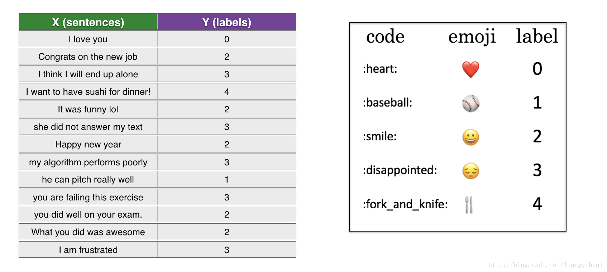
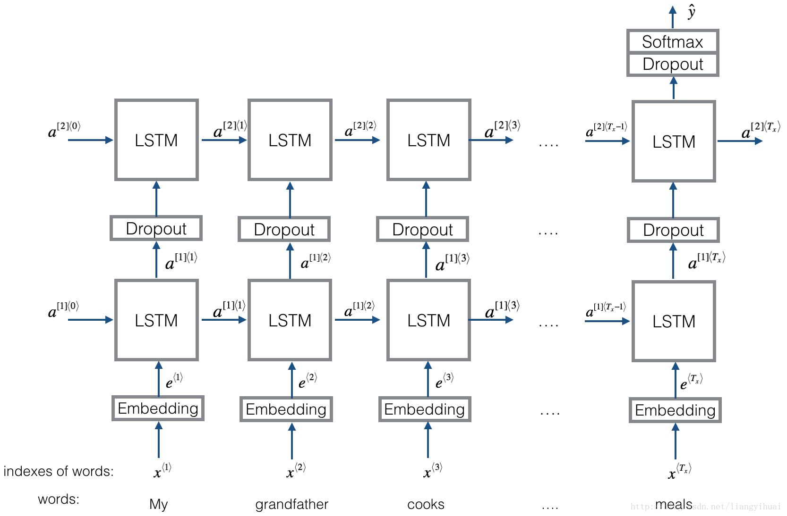

# Emojify!

欢迎来到第二周的第二个作业。您将使用单词向量表示来构建一个表情符号。

你曾经想过让你的短信更有表现力吗?你的表情应用会帮你做到这一点。所以不要写“恭喜你升职了!”我们喝杯咖啡聊聊天吧。这个表情符号可以自动转换成“恭喜你升职了!”👍让喝咖啡聊天。☕️爱你!❤️”

您将实现一个模型,输入一个句子(如“今晚我们去看棒球比赛!”),找到使用在这个句子上最合适的emoji(⚾️)。在许多emoji接口中,您需要记住,❤️是“心”而不是“爱”的象征符号。但使用词向量,你会发现即使你的训练集仅能显式地使一些单词与特定emoji相关,你的算法可以推广和测试集的关联词语相同的emoji即使这些话甚至不出现在训练集。这允许您甚至用一个小训练集就可以构建一个精确的分类器从句子到emoji的映射。

在这个练习中，您将使用词嵌入从一个基线模型 (Emojifier-V1)开始，然后构建一个更复杂的模型(Emojifier-V2) ，该模型进一步合并了一个LSTM。

## 导包

```python
import numpy as np
from emo_utils import *
import emoji
import matplotlib.pyplot as plt

%matplotlib inline
```

## 基线模型: Emojifier-V1

### 数据集EMOJISET

让我们从构建一个简单的基线分类器开始。

您有一个小数据集(X, Y)，其中:

- X包含127个句子(字符串)
- Y包含一个0到4之间的整数标签，对应每句话的表情符号



让我们使用下面的代码加载数据集。我们将数据集分割为训练(127个例子)和测试(56个例子)。

```python
X_train, Y_train = read_csv('data/train_emoji.csv')
X_test, Y_test = read_csv('data/tesss.csv')
```

#### 测试

```python
maxLen = len(max(X_train, key=len).split())
print(maxLen)
```

#### 结果

```
10
```


#### 查看数据

```python
index = 1
print(X_train[index], label_to_emoji(Y_train[index]))
```

#### 结果

```
I am proud of your achievements 😄
```

### Emojifier-V1概述

在本部分中，您将实现一个名为“Emojifier -V1”的基线模型。


模型的输入是一个与句子相对应的字符串(比如"I love you")。在代码中，输出将是一个shape为(1,5)的概率向量，然后传入一个argmax层以提取最可能的emoji符号输出的索引。

为了让我们的标签格式贴合softmax分类器训练，要让$Y$从目前的shape$(m, 1)$转换为“one-hot的表示”$(m, 5)$，其中每一行都是一个给定样本标签的one-hot向量【你可以使用下一个代码snipper来这么做】。

这里，` Y_oh `在变量名` Y_oh_train `和` Y_oh_test `中代表" Y-one-hot":

```python
Y_oh_train = convert_to_one_hot(Y_train, C = 5)
Y_oh_test = convert_to_one_hot(Y_test, C = 5)
```

让我们看看` convert_to_one_hot()`做了什么。您可以随意更改` index`以输出不同的值。

```python
index = 50
print(Y_train[index], "is converted into one hot", Y_oh_train[index])
```

结果

```
0 is converted into one hot [1. 0. 0. 0. 0.]
```

现在，所有数据都准备好了，可以输入Emojify-V1模型。让我们来实现这个模型!

### 实现Emojifier-V1

#### GloVe嵌入

第一步是将输入的句子转换为单词向量表示，然后将它们一起平均。与前面的练习类似，我们将使用预先训练好的50维GloVe嵌入。运行以下单元格以加载`word_to_vec_map`，其中包含所有向量表示。

```python
word_to_index, index_to_word, word_to_vec_map = read_glove_vecs('data/glove.6B.50d.txt')
```

你已经加载了：

- `word_to_index`: 从单词到词汇表中的索引的字典映射(400,001个单词，有效索引从0到400,000个单词不等)
- `index_to_word`: 字典从索引映射到词汇表中对应的单词
- `word_to_vec_map`: 字典映射单词到他们的GloVe向量表示。

##### 测试

运行下面的单元格检查它是否工作。

```python
word = "cucumber"
index = 289846
print("the index of", word, "in the vocabulary is", word_to_index[word])
print("the", str(index) + "th word in the vocabulary is", index_to_word[index])
```

##### 结果

```
the index of cucumber in the vocabulary is 113317
the 289846th word in the vocabulary is potatos
```


#### 平均句子

```python
# GRADED FUNCTION: sentence_to_avg

def sentence_to_avg(sentence, word_to_vec_map):
    """
    Converts a sentence (string) into a list of words (strings). Extracts the GloVe representation of each word
    and averages its value into a single vector encoding the meaning of the sentence.
    
    Arguments:
    sentence -- string, one training example from X
    word_to_vec_map -- dictionary mapping every word in a vocabulary into its 50-dimensional vector representation
    
    Returns:
    avg -- average vector encoding information about the sentence, numpy-array of shape (50,)
    """
    
    ### START CODE HERE ###
    # 步骤 1: 把句子分成一组小写的单词 (≈ 1 line)
    words = sentence.lower().split()

    # 零初始化平均单词向量，应该与你的单词向量具有相同的shpae。
    avg = np.zeros(word_to_vec_map[words[0]].shape)
    
    # 步骤 2: 平均单词向量。你可以循环遍历"words"列表中的单词。
    for w in words:
        avg += word_to_vec_map[w]
    avg = avg / len(words)
    
    ### END CODE HERE ###
    
    return avg
```

##### 测试

```python
avg = sentence_to_avg("Morrocan couscous is my favorite dish", word_to_vec_map)
print("avg = ", avg)
```

##### 结果

```
avg =  [-0.008005    0.56370833 -0.50427333  0.258865    0.55131103  0.03104983
 -0.21013718  0.16893933 -0.09590267  0.141784   -0.15708967  0.18525867
  0.6495785   0.38371117  0.21102167  0.11301667  0.02613967  0.26037767
  0.05820667 -0.01578167 -0.12078833 -0.02471267  0.4128455   0.5152061
  0.38756167 -0.898661   -0.535145    0.33501167  0.68806933 -0.2156265
  1.797155    0.10476933 -0.36775333  0.750785    0.10282583  0.348925
 -0.27262833  0.66768    -0.10706167 -0.283635    0.59580117  0.28747333
 -0.3366635   0.23393817  0.34349183  0.178405    0.1166155  -0.076433
  0.1445417   0.09808667]
```


#### 模型

现在，您已经完成了实现`model()`函数的所有工作。在使用`sentence_to_avg() `之后，您需要通过正向传播传递平均值，计算成本，然后反向传播以更新softmax的参数。

实现`model() `函数。假设$Yoh$ ("Y one hot")是输出标签的one-hot编码，在前传过程中需要实现的方程和计算交叉熵损失是:
$$
z^{(i)} = W . avg^{(i)} + b
$$
$$
a^{(i)} = softmax(z^{(i)})
$$
$$
\mathcal{L}^{(i)} = - \sum_{k = 0}^{n_y - 1} Yoh^{(i)}_k * log(a^{(i)}_k)
$$

有可能会有一个更有效的向量化实现。但是由于我们使用for循环将语句一次转换为$avg^{(i)}$表示，所以这次我们就不用费心了。

```python
# GRADED FUNCTION: model

def model(X, Y, word_to_vec_map, learning_rate = 0.01, num_iterations = 400):
    """
    Model to train word vector representations in numpy.
    
    Arguments:
    X -- input data, numpy array of sentences as strings, of shape (m, 1)
    Y -- labels, numpy array of integers between 0 and 7, numpy-array of shape (m, 1)
    word_to_vec_map -- dictionary mapping every word in a vocabulary into its 50-dimensional vector representation
    learning_rate -- learning_rate for the stochastic gradient descent algorithm
    num_iterations -- number of iterations
    
    Returns:
    pred -- vector of predictions, numpy-array of shape (m, 1)
    W -- weight matrix of the softmax layer, of shape (n_y, n_h)
    b -- bias of the softmax layer, of shape (n_y,)
    """
    
    np.random.seed(1)

    # 定义训练样本的数量
    # 训练样本的数量
    m = Y.shape[0]
    # 类别数量
    n_y = 5             
    # GloVe向量维度
    n_h = 50                               
    
    # 使用Xavier初始化参数
    W = np.random.randn(n_y, n_h) / np.sqrt(n_h)
    b = np.zeros((n_y,))
    
    # 使用n_y种类将Y转换为Y_onehot
    Y_oh = convert_to_one_hot(Y, C = n_y) 
    
    # 优化循环
    # 循环的迭代次数
    for t in range(num_iterations):
        # 循环的训练样本
        for i in range(m):
            
            ### START CODE HERE ### (≈ 4 lines of code)
            # 对第i个训练样本中的单词向量进行平均
            avg = sentence_to_avg(X[i], word_to_vec_map)

            # 通过softmax层正向传播avg
            z = np.matmul(W, avg) + b
            a = softmax(z)

            # 使用第i个训练标签的一个one-hot表示和“A”(softmax的输出)共同计算cost
            cost = - np.sum(Y_oh[i] * np.log(a))
            ### END CODE HERE ###
            
            # 计算梯度
            dz = a - Y_oh[i]
            dW = np.dot(dz.reshape(n_y,1), avg.reshape(1, n_h))
            db = dz

            # 用随机梯度下降更新参数
            W = W - learning_rate * dW
            b = b - learning_rate * db
        
        if t % 100 == 0:
            print("Epoch: " + str(t) + " --- cost = " + str(cost))
            pred = predict(X, Y, W, b, word_to_vec_map)

    return pred, W, b
```

##### 测试

```python
print(X_train.shape)
print(Y_train.shape)
print(np.eye(5)[Y_train.reshape(-1)].shape)
print(X_train[0])
print(type(X_train))
Y = np.asarray([5,0,0,5, 4, 4, 4, 6, 6, 4, 1, 1, 5, 6, 6, 3, 6, 3, 4, 4])
print(Y.shape)

X = np.asarray(['I am going to the bar tonight', 'I love you', 'miss you my dear',
 'Lets go party and drinks','Congrats on the new job','Congratulations',
 'I am so happy for you', 'Why are you feeling bad', 'What is wrong with you',
 'You totally deserve this prize', 'Let us go play football',
 'Are you down for football this afternoon', 'Work hard play harder',
 'It is suprising how people can be dumb sometimes',
 'I am very disappointed','It is the best day in my life',
 'I think I will end up alone','My life is so boring','Good job',
 'Great so awesome'])

print(X.shape)
print(np.eye(5)[Y_train.reshape(-1)].shape)
print(type(X_train))
```

##### 结果

```
(132,)
(132,)
(132, 5)
never talk to me again
<class 'numpy.ndarray'>
(20,)
(20,)
(132, 5)
<class 'numpy.ndarray'>
```

#### 训练模型

运行下一个单元来训练你的模型并学习softmax参数(W,b)。

```python
pred, W, b = model(X_train, Y_train, word_to_vec_map)
# print(pred)
```

##### 结果

```
Epoch: 0 --- cost = 1.9520498812810072
Accuracy: 0.3484848484848485
Epoch: 100 --- cost = 0.07971818726014807
Accuracy: 0.9318181818181818
Epoch: 200 --- cost = 0.04456369243681402
Accuracy: 0.9545454545454546
Epoch: 300 --- cost = 0.03432267378786059
Accuracy: 0.9696969696969697
```

太棒了!你的模型在训练集上有相当高的精确度。现在让我们看看它在测试集上是怎样的。

### 检验测试集性能

#### 测试

```python
print("Training set:")
pred_train = predict(X_train, Y_train, W, b, word_to_vec_map)
print('Test set:')
pred_test = predict(X_test, Y_test, W, b, word_to_vec_map)
```

#### 结果

```
Training set:
Accuracy: 0.9772727272727273
Test set:
Accuracy: 0.8571428571428571
```

假设有5类，随机猜测的准确率为20%。在只训练了127个示例之后，这已经是相当不错的性能了。

#### 不在训练集的单词测试

算法在训练集,看到这句话“*I love you*”标签❤️。你可以检查，但是单词“*adore*”没有出现在训练集中。尽管如此，让我们看看如果你写"*I adore You*"会发生什么。

##### 测试

```python
X_my_sentences = np.array(["i adore you", "i love you", "funny lol", "lets play with a ball", "food is ready", "not feeling happy"])
Y_my_labels = np.array([[0], [0], [2], [1], [4],[3]])

pred = predict(X_my_sentences, Y_my_labels , W, b, word_to_vec_map)
print_predictions(X_my_sentences, pred)
```

##### 结果

```
Accuracy: 0.8333333333333334

i adore you ❤️
i love you ❤️
funny lol 😄
lets play with a ball ⚾
food is ready 🍴
not feeling happy 😄
```


太神奇了!因为*adore*和*love*有相似的嵌入，算法正确地概括了一个词，甚至是它以前从未见过的词。像*heart*， *dear*， *beloved*或*adore*这样的词都有类似于*love*的嵌入向量，所以也可以这样做——随意修改上面的输入，尝试各种不同的输入句子。它是如何工作的呢?

请注意，“不开心”并不是正确的。这种算法忽略了单词排序，因此不能很好地理解像“not happy”这样的短语。

### 混淆矩阵

打印**混淆矩阵（confusion matrix）**还可以帮助理解哪些类对您的模型来说更困难。混淆矩阵显示了一个示例的标签是一个类(“实际的”类)被算法用另一个类(“预测的”类)错误标记的频率。

#### 测试

```python
print(Y_test.shape)
print('           '+ label_to_emoji(0)+ '    ' + label_to_emoji(1) + '    ' +  label_to_emoji(2)+ '    ' + label_to_emoji(3)+'   ' + label_to_emoji(4))
print(pd.crosstab(Y_test, pred_test.reshape(56,), rownames=['Actual'], colnames=['Predicted'], margins=True))
plot_confusion_matrix(Y_test, pred_test)
```

#### 结果

```
(56,)
           ❤️    ⚾    😄    😞   🍴
Predicted  0.0  1.0  2.0  3.0  4.0  All
Actual                                 
0            6    0    0    1    0    7
1            0    8    0    0    0    8
2            2    0   16    0    0   18
3            1    1    2   12    0   16
4            0    0    1    0    6    7
All          9    9   19   13    6   56
```


**你从这部分应该记住的**:

- 即使有127个训练例子，你可以得到一个相当好的模型来使用表情符号。这主要是由于泛化能力词向量。
- Emojify-V1会在*“This movie is not good and not enjoyable”*这样的句子中表现不佳，因为它**不理解单词的组合**——它只是将所有单词的嵌入向量**平均在一起**，而**没有注意单词的顺序**。在下一部分中，您将构建一个更好的算法。

## 使用Keras中的LSTM: Emojifier-V2

让我们构建一个接受输入单词序列的LSTM模型。这个模型将能够考虑到字的顺序。Emojifier - V2将继续使用预先训练好的嵌入单词来表示单词，但是会将它们输入到一个LSTM中，后者的工作就是预测出最合适的emoji。

### 导包

```python
import numpy as np
np.random.seed(0)
from keras.models import Model
from keras.layers import Dense, Input, Dropout, LSTM, Activation
from keras.layers.embeddings import Embedding
from keras.preprocessing import sequence
from keras.initializers import glorot_uniform
np.random.seed(1)
```

### 模型概述



### Keras 和 mini-batch

在这个练习中，我们希望使用mini-batch来训练Keras。然而，大多数深度学习框架都要求同一个mini-batch中的所有序列具有相同的长度。这就是矢量化工作的原因:如果您有一个3个词的句子和一个4个词的句子，那么它们需要的计算是不同的(一个需要LSTM的3个步骤，一个需要4个步骤)，所以不可能同时完成它们。

常见的解决方法是使用padding填充。

具体来说，设置一个最大序列长度，并填充所有序列到相同的长度。例如，最大序列长度为20时，我们可以用“0”填充每个句子，这样每个输入句子的长度为20。因此，句子"i love you"将被表示为$(e_{i}， e_{love}， e_{you}， \vec{0}， \vec{0}， \ldots， \vec{0})$。在这个例子中，任何超过20个单词的句子都必须被截断。选择最大序列长度的一个简单方法就是选择训练集中最长句子的长度。

### 嵌入层

Keras将嵌入矩阵表示为“层”，将正整数(词对应的索引)映射为固定大小的**密集向量**(嵌入向量)。它可以通过**预先训练好的嵌入来训练或初始化**。在本部分中，您将学习如何在Keras中创建[Embedding()](https://keras.io/layers/embeddings/)层，并用之前加载的GloVe 50维向量初始化它。因为我们的训练集非常小，所以我们不会更新词嵌入，而是将其值保持不变。但是在下面的代码中，我们将向您展示Keras是如何允许您训练或修复这一层的。

`Embedding()`层采用一个大小为整数的矩阵(batch大小，最大输入长度)作为输入。这对应于转换为索引(整数)列表的句子，如下图所示。


嵌入层。这个示例展示了通过嵌入层传播两个示例。两者都被零填充到` max_len=5 `的长度。表示的最后一个维度是`(2,max_len,50) `，因为我们使用的词嵌入是50维的。

输入的最大整数(即单词索引)不应大于词汇表的大小。该层输出一个形状数组(批大小，最大输入长度，字向量的尺寸)。

第一步是将所有的训练句子转换成索引列表，然后对所有这些列表进行零填充，使它们的长度等于最长句子的长度。

```python
# GRADED FUNCTION: sentences_to_indices

def sentences_to_indices(X, word_to_index, max_len):
    """
    Converts an array of sentences (strings) into an array of indices corresponding to words in the sentences.
    The output shape should be such that it can be given to `Embedding()` (described in Figure 4). 
    
    Arguments:
    X -- array of sentences (strings), of shape (m, 1)
    word_to_index -- a dictionary containing the each word mapped to its index
    max_len -- maximum number of words in a sentence. You can assume every sentence in X is no longer than this. 
    
    Returns:
    X_indices -- array of indices corresponding to words in the sentences from X, of shape (m, max_len)
    """
    
    m = X.shape[0]                                   # 训练样本数量
    
    ### START CODE HERE ###
    # 将X_indices零初始化为正确shape的numpy矩阵 (≈ 1 line)
    X_indices = np.zeros((m, max_len))
    
    for i in range(m):                               # 循环训练样本
        
        # 将第i个训练句子转换为小写，并拆分为单词。会得到一个单词列表。
        sentence_words = X[i].lower().split()
        
        # 初始化 j 为 0
        j = 0
        
        # 循环 sentence_words 的 words
        for w in sentence_words:
            # 将X_indices的第(i,j)项设置为正确单词的索引。
            X_indices[i, j] = word_to_index[w]
            # 自增
            j = j + 1
            
    ### END CODE HERE ###
    
    return X_indices
```

#### 测试

运行下面的单元格检查` sentences_to_indices() `做了什么，并检查结果。

```python
X1 = np.array(["funny lol", "lets play baseball", "food is ready for you"])
X1_indices = sentences_to_indices(X1,word_to_index, max_len = 5)
print("X1 =", X1)
print("X1_indices =", X1_indices)
```

#### 结果

```
X1 = ['funny lol' 'lets play baseball' 'food is ready for you']
X1_indices = [[155345. 225122.      0.      0.      0.]
 [220930. 286375.  69714.      0.      0.]
 [151204. 192973. 302254. 151349. 394475.]]
```

### 构建

让我们使用预先训练好的单词向量在Keras中构建`Embedding()`层。在构建此层之后，你将把`sentences_to_indices()`的输出作为输入传递给它，而` Embedding() `层将返回句子的embeddings。

```python
# GRADED FUNCTION: pretrained_embedding_layer

def pretrained_embedding_layer(word_to_vec_map, word_to_index):
    """
    Creates a Keras Embedding() layer and loads in pre-trained GloVe 50-dimensional vectors.
    
    Arguments:
    word_to_vec_map -- dictionary mapping words to their GloVe vector representation.
    word_to_index -- dictionary mapping from words to their indices in the vocabulary (400,001 words)

    Returns:
    embedding_layer -- pretrained layer Keras instance
    """
    
    vocab_len = len(word_to_index) + 1                  # 添加1来贴合Keras嵌入 (必需)
    emb_dim = word_to_vec_map["cucumber"].shape[0]      # 定义GloVe词向量的维数 (= 50)
    
    ### START CODE HERE ###
    # 零初始化嵌入矩阵，其shape为(vocab_len, dimensions of word vectors = emb_dim)
    emb_matrix = np.zeros((vocab_len, emb_dim))
    
    # 将嵌入矩阵的每一行“index”设为词汇表中单词索引的单词向量表示
    for word, index in word_to_index.items():
        emb_matrix[index, :] = word_to_vec_map[word]

    # 定义Keras嵌入层与正确的输出/输入大小，使其可训练。使用Embedding(...)。确保设置trainable=False。
    embedding_layer = Embedding(vocab_len, emb_dim, trainable=False)
    ### END CODE HERE ###

    # 构建嵌入层，这是在设置嵌入层权重之前所必需的。不要修改“None”。
    embedding_layer.build((None,))
    
    # 将嵌入层的权重设置为嵌入矩阵。你的层现在是预先训练好的。
    embedding_layer.set_weights([emb_matrix])
    
    return embedding_layer
```

#### 测试

```python
embedding_layer = pretrained_embedding_layer(word_to_vec_map, word_to_index)
print("weights[0][1][3] =", embedding_layer.get_weights()[0][1][3])
```

#### 结果

```
weights[0][1][3] = -0.3403
```


## 构建Emojifier-V2

### 构建Emojifier-V2模型

现在让我们构建Emojifier-V2模型。您将使用已构建的嵌入层来完成此操作，并将其输出提供给LSTM网络。

```python
# GRADED FUNCTION: Emojify_V2

def Emojify_V2(input_shape, word_to_vec_map, word_to_index):
    """
    Function creating the Emojify-v2 model's graph.
    
    Arguments:
    input_shape -- shape of the input, usually (max_len,)
    word_to_vec_map -- dictionary mapping every word in a vocabulary into its 50-dimensional vector representation
    word_to_index -- dictionary mapping from words to their indices in the vocabulary (400,001 words)

    Returns:
    model -- a model instance in Keras
    """
    
    ### START CODE HERE ###
    # 定义sentence_indices作为图的输入，shape=input_shape，dtype='int32'(因为它包含索引)。
    sentence_indices = Input(shape=input_shape, dtype='int32')
    
    # 使用GloVe向量创建预先训练好的嵌入层 (≈1 line)
    embedding_layer = pretrained_embedding_layer(word_to_vec_map, word_to_index)
    
    # 通过你的嵌入层传播sentence_indices，得到embeddings
    embeddings = embedding_layer(sentence_indices)
    
    # 通过具有128维隐藏状态的LSTM层传播embeddings
    # 注意，返回的输出应该是一批序列。
    X = LSTM(128, return_sequences=True)(embeddings)
    # 加上概率为0.5的dropout
    X = Dropout(0.5)(X)
    # 通过具有128维隐藏状态的LSTM层传播X
    # 注意，返回的输出应该是单个隐藏状态，而不是一批序列。
    X = LSTM(128)(X)
    # 加上概率为0.5的dropout
    X = Dropout(0.5)(X)
    # 传播X通过一个Dense层与softmax激活，以获得一批5维向量。
    X = Dense(5)(X)
    # 添加softmax激活
    X = Activation('softmax')(X)
    
    # 创建将sentence_indices转换为X的模型实例。
    model = Model(inputs=sentence_indices, output=X)
    
    ### END CODE HERE ###
    
    return model
```

#### 测试

运行以下单元格以创建模型并检查其摘要。因为数据集中所有的句子都少于10个单词，所以我们选择` max_len = 10`。你应该看到您的体系结构，它使用“20,223,927”参数，其中有20,000,050(单词embeddings)是不可训练的，其余的223,877是可以的。因为我们的词汇表大小有400,001个单词(有效索引从0到400,000)，所以有400,001*50 = 20,000,050不可训练的参数。

```python
model = Emojify_V2((maxLen,), word_to_vec_map, word_to_index)
model.summary()
```

#### 结果

```
_________________________________________________________________
Layer (type)                 Output Shape              Param #   
=================================================================
input_1 (InputLayer)         (None, 10)                0         
_________________________________________________________________
embedding_2 (Embedding)      (None, 10, 50)            20000050  
_________________________________________________________________
lstm_1 (LSTM)                (None, 10, 128)           91648     
_________________________________________________________________
dropout_1 (Dropout)          (None, 10, 128)           0         
_________________________________________________________________
lstm_2 (LSTM)                (None, 128)               131584    
_________________________________________________________________
dropout_2 (Dropout)          (None, 128)               0         
_________________________________________________________________
dense_1 (Dense)              (None, 5)                 645       
_________________________________________________________________
activation_1 (Activation)    (None, 5)                 0         
=================================================================
Total params: 20,223,927
Trainable params: 223,877
Non-trainable params: 20,000,050
_________________________________________________________________
```

### 编译训练模型

通常，在Keras中创建模型之后，您需要编译它并定义您想要使用的损失、优化器和度量。使用`categorical_crossentropy ` 损失，` adam ` 优化器和` ['accuracy'] `指标来编译你的模型:

```python
model.compile(loss='categorical_crossentropy', optimizer='adam', metrics=['accuracy'])
```

是时候训练你的模型了。 Emojifier-V2 `model`中：

输入：shape (`m`, `max_len`)数组

输出：shape (`m`, `number of classes`)概率向量。

因此，我们必须将X_train(句子数组作为字符串)转换为X_train_indices(句子数组作为单词索引列表)，将Y_train(标签作为索引)转换为Y_train_oh(标签作为one-hot向量)。

```python
X_train_indices = sentences_to_indices(X_train, word_to_index, maxLen)
Y_train_oh = convert_to_one_hot(Y_train, C = 5)
```

在` X_train_indices `和` Y_train_oh `上拟合Keras模型。我们将使用`epochs = 50` 和 `batch_size = 32`.

```python
model.fit(X_train_indices, Y_train_oh, epochs = 50, batch_size = 32, shuffle=True)
```

#### 结果

```
Epoch 1/50
132/132 [==============================] - 2s 17ms/step - loss: 1.6084 - acc: 0.1742
Epoch 2/50
132/132 [==============================] - 0s 1ms/step - loss: 1.5337 - acc: 0.3030
Epoch 3/50
132/132 [==============================] - 0s 1ms/step - loss: 1.5025 - acc: 0.3182
Epoch 4/50
132/132 [==============================] - 0s 1ms/step - loss: 1.4405 - acc: 0.3561
Epoch 5/50
132/132 [==============================] - 0s 1ms/step - loss: 1.3506 - acc: 0.4545
Epoch 6/50
132/132 [==============================] - 0s 1ms/step - loss: 1.2368 - acc: 0.5303
Epoch 7/50
132/132 [==============================] - 0s 1ms/step - loss: 1.1772 - acc: 0.4697
Epoch 8/50
132/132 [==============================] - 0s 970us/step - loss: 1.0549 - acc: 0.5758
Epoch 9/50
132/132 [==============================] - 0s 1ms/step - loss: 0.8770 - acc: 0.7045
Epoch 10/50
132/132 [==============================] - 0s 939us/step - loss: 0.8224 - acc: 0.7045
Epoch 11/50
132/132 [==============================] - 0s 939us/step - loss: 0.7017 - acc: 0.7424
Epoch 12/50
132/132 [==============================] - 0s 939us/step - loss: 0.5992 - acc: 0.7955
Epoch 13/50
132/132 [==============================] - 0s 909us/step - loss: 0.4907 - acc: 0.8333
Epoch 14/50
132/132 [==============================] - 0s 1ms/step - loss: 0.5112 - acc: 0.8333
Epoch 15/50
132/132 [==============================] - 0s 992us/step - loss: 0.4819 - acc: 0.8182
Epoch 16/50
132/132 [==============================] - 0s 1ms/step - loss: 0.3525 - acc: 0.8636
Epoch 17/50
132/132 [==============================] - 0s 970us/step - loss: 0.3909 - acc: 0.8561
Epoch 18/50
132/132 [==============================] - 0s 939us/step - loss: 0.6492 - acc: 0.8182
Epoch 19/50
132/132 [==============================] - 0s 1ms/step - loss: 0.5185 - acc: 0.8106
Epoch 20/50
132/132 [==============================] - 0s 1ms/step - loss: 0.3950 - acc: 0.8409
Epoch 21/50
132/132 [==============================] - 0s 1ms/step - loss: 0.4679 - acc: 0.8182
Epoch 22/50
132/132 [==============================] - 0s 1ms/step - loss: 0.3919 - acc: 0.8636
Epoch 23/50
132/132 [==============================] - 0s 1ms/step - loss: 0.3756 - acc: 0.8561
Epoch 24/50
132/132 [==============================] - 0s 1ms/step - loss: 0.3071 - acc: 0.9091
Epoch 25/50
132/132 [==============================] - 0s 962us/step - loss: 0.3457 - acc: 0.8864
Epoch 26/50
132/132 [==============================] - 0s 795us/step - loss: 0.2453 - acc: 0.9394
Epoch 27/50
132/132 [==============================] - 0s 1ms/step - loss: 0.3159 - acc: 0.8788
Epoch 28/50
132/132 [==============================] - 0s 977us/step - loss: 0.2440 - acc: 0.9318
Epoch 29/50
132/132 [==============================] - 0s 985us/step - loss: 0.3898 - acc: 0.8712
Epoch 30/50
132/132 [==============================] - 0s 985us/step - loss: 0.2634 - acc: 0.9091
Epoch 31/50
132/132 [==============================] - 0s 1ms/step - loss: 0.2933 - acc: 0.8864
Epoch 32/50
132/132 [==============================] - 0s 1ms/step - loss: 0.1983 - acc: 0.9318
Epoch 33/50
132/132 [==============================] - 0s 1ms/step - loss: 0.2088 - acc: 0.9470
Epoch 34/50
132/132 [==============================] - 0s 1ms/step - loss: 0.1604 - acc: 0.9621
Epoch 35/50
132/132 [==============================] - 0s 1ms/step - loss: 0.1653 - acc: 0.9621
Epoch 36/50
132/132 [==============================] - 0s 1ms/step - loss: 0.1929 - acc: 0.9394
Epoch 37/50
132/132 [==============================] - 0s 1ms/step - loss: 0.1983 - acc: 0.9470
Epoch 38/50
132/132 [==============================] - 0s 886us/step - loss: 0.2304 - acc: 0.9318
Epoch 39/50
132/132 [==============================] - 0s 909us/step - loss: 0.1445 - acc: 0.9545
Epoch 40/50
132/132 [==============================] - 0s 1ms/step - loss: 0.1670 - acc: 0.9470
Epoch 41/50
132/132 [==============================] - 0s 1ms/step - loss: 0.0886 - acc: 0.9848
Epoch 42/50
132/132 [==============================] - 0s 1ms/step - loss: 0.0877 - acc: 0.9697
Epoch 43/50
132/132 [==============================] - 0s 1ms/step - loss: 0.0845 - acc: 0.9773
Epoch 44/50
132/132 [==============================] - 0s 758us/step - loss: 0.0519 - acc: 0.9924
Epoch 45/50
132/132 [==============================] - 0s 795us/step - loss: 0.0753 - acc: 0.9848
Epoch 46/50
132/132 [==============================] - 0s 1ms/step - loss: 0.0811 - acc: 0.9697
Epoch 47/50
132/132 [==============================] - 0s 970us/step - loss: 0.1190 - acc: 0.9545
Epoch 48/50
132/132 [==============================] - 0s 947us/step - loss: 0.2948 - acc: 0.9167
Epoch 49/50
132/132 [==============================] - 0s 1ms/step - loss: 0.0945 - acc: 0.9773
Epoch 50/50
132/132 [==============================] - 0s 1ms/step - loss: 0.0784 - acc: 0.9773
```

### 评估

您的模型在训练集上的精度应该接近**100% **。您得到的精确精度可能略有不同。运行以下单元来评估测试集上的模型。

```python
X_test_indices = sentences_to_indices(X_test, word_to_index, max_len = maxLen)
Y_test_oh = convert_to_one_hot(Y_test, C = 5)
loss, acc = model.evaluate(X_test_indices, Y_test_oh)
print()
print("Test accuracy = ", acc)
```

#### 结果

```
56/56 [==============================] - 0s 286us/step

Test accuracy =  0.8035714200564793
```

### 查看误差

测试准确度应该在80%到95%之间。运行下面的单元格可以看到标记错误的示例。

```python
# 这段代码允许您查看标记错误的示例
C = 5
y_test_oh = np.eye(C)[Y_test.reshape(-1)]
X_test_indices = sentences_to_indices(X_test, word_to_index, maxLen)
pred = model.predict(X_test_indices)
for i in range(len(X_test)):
    x = X_test_indices
    num = np.argmax(pred[i])
    if(num != Y_test[i]):
        print('Expected emoji:'+ label_to_emoji(Y_test[i]) + ' prediction: '+ X_test[i] + label_to_emoji(num).strip())
```

#### 结果

```
Expected emoji:😄 prediction: she got me a nice present	❤️
Expected emoji:😞 prediction: work is hard	😄
Expected emoji:😞 prediction: This girl is messing with me	❤️
Expected emoji:🍴 prediction: any suggestions for dinner	😄
Expected emoji:❤️ prediction: I love taking breaks	😞
Expected emoji:😄 prediction: you brighten my day	❤️
Expected emoji:😞 prediction: she is a bully	❤️
Expected emoji:😄 prediction: will you be my valentine	❤️
Expected emoji:🍴 prediction: See you at the restaurant	❤️
Expected emoji:😞 prediction: go away	⚾
Expected emoji:🍴 prediction: I did not have breakfast ❤️
```

现在您可以在自己的示例中尝试它。在下面写下你自己的句子。

```python
# 改变下面的句子看看你的预测。确保所有的单词都在GloVe嵌入处。 
x_test = np.array(['not feeling happy'])
X_test_indices = sentences_to_indices(x_test, word_to_index, maxLen)
print(x_test[0] +' '+  label_to_emoji(np.argmax(model.predict(X_test_indices))))
not feeling happy 😞
```

之前，Emojify-V1模型并没有正确地标注“not feeling happy”，但是我们对Emojiy-V2的实现做到了这一点。(Keras的输出每次都有一点随机性，所以可能不会得到完全相同的结果。)目前的模型在理解否定(比如“not happy”)方面还不是很健全，因为训练集很小，所以没有太多的否定例子。但是如果训练集更大，LSTM模型在理解这样复杂的句子方面要比Emojify-V1模型好得多。

### 恭喜!

恭喜你完成了任务! ❤️❤️❤️

**你应该记住的**:

- 如果你有一个训练集很小的NLP任务，使用词嵌入可以显著帮助你的算法。词嵌入的让你的模型在测试集能够处理甚至不出现在你的训练集的单词。训练序列模型Keras(和大多数其他深度学习框架)需要一些重要的细节:
	- 使用mini-batches序列需要填充,这样所有的例子mini-batch**具有相同的长度**。
- `Embedding()`层可以用预先训练好的值进行初始化。这些值可以是固定的，也可以在数据集上进一步训练。但是，如果您的标记数据集很小，那么通常不值得尝试训练大量预先训练过的嵌入集。` LSTM() `有一个名为`return_sequences `的标志来决定你是想返回每个隐藏状态还是只返回最后一个。
- 您可以在` LSTM() `之后使用` Dropout() `来规范您的网络。

祝贺你完成了这项任务，并构建了一个表情符号!

# 😀😀😀😀😀😀
