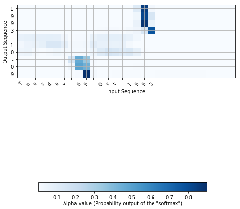

# 神经机器翻译

您将构建一个神经机器翻译(NMT)模型，将人类可读的日期(“2009年6月25日”)转换为机器可读的日期(“2009-06-25”)。您将使用注意力模型来完成此操作，这是最复杂的序列对序列模型之一。

这款笔记本是与英伟达的深度学习研究所共同生产的。

## 导包

让我们加载此任务所需的所有包。

```python
from keras.layers import Bidirectional, Concatenate, Permute, Dot, Input, LSTM, Multiply
from keras.layers import RepeatVector, Dense, Activation, Lambda
from keras.optimizers import Adam
from keras.utils import to_categorical
from keras.models import load_model, Model
import keras.backend as K
import numpy as np

from faker import Faker
import random
from tqdm import tqdm
from babel.dates import format_date
from nmt_utils import *
import matplotlib.pyplot as plt
%matplotlib inline
```

## 将人类可读的日期转换为机器可读的日期

您将在这里构建的模型可以用于从一种语言到另一种语言的转换，例如从英语到印地语的转换。然而，语言翻译需要大量的数据集，通常需要在gpu上训练几天。为了让您在不使用大量数据集的情况下试验这些模型，我们将使用一个更简单的“日期转换”任务。

网络将输入以各种可能的格式编写的日期(例如*“1958年8月29日”、“1968年3月30日”、“1987年6月24日”*)，并将它们翻译成标准的机器可读日期(*例如:“1958-08-29”、“1968-03-30”、“1987-06-24”*)。我们将让网络学会以机器可读的格式YYYY-MM-DD输出日期。

### 数据集

我们将在一个包含10000个人类可读日期及其等价的、标准化的、机器可读日期的数据集上训练模型。让我们运行以下单元格来加载数据集并打印一些示例。

```python
m = 10000
dataset, human_vocab, machine_vocab, inv_machine_vocab = load_dataset(m)
```

#### 加载条

```
100%|█████████████████████████████████| 10000/10000 [00:00<00:00, 18551.82it/s]
```

#### 测试

```python
print(dataset[:10])
print()
print(human_vocab)
print()
print(machine_vocab)
print()
print(inv_machine_vocab)
```

#### 结果

```
[('dec 5 1988', '1988-12-05'), ('february 24 2003', '2003-02-24'), ('19 august 1992', '1992-08-19'), ('friday january 9 1970', '1970-01-09'), ('wednesday april 29 1992', '1992-04-29'), ('6 june 2004', '2004-06-06'), ('17 oct 2014', '2014-10-17'), ('march 6 2008', '2008-03-06'), ('monday october 11 1971', '1971-10-11'), ('21 11 94', '1994-11-21')]

{'j': 22, 'u': 31, '8': 11, '4': 7, 'f': 18, '7': 10, 'l': 23, 't': 30, 'y': 34, 'b': 14, 'c': 15, '5': 8, '<pad>': 36, 'w': 33, '1': 4, 'g': 19, '/': 2, 'o': 26, ' ': 0, 'v': 32, 'p': 27, '3': 6, '0': 3, '.': 1, 'm': 24, '9': 12, 'i': 21, 's': 29, 'n': 25, '<unk>': 35, 'h': 20, 'e': 17, 'r': 28, '6': 9, '2': 5, 'd': 16, 'a': 13}

{'-': 0, '8': 9, '2': 3, '7': 8, '6': 7, '0': 1, '4': 5, '3': 4, '1': 2, '9': 10, '5': 6}

{0: '-', 1: '0', 2: '1', 3: '2', 4: '3', 5: '4', 6: '5', 7: '6', 8: '7', 9: '8', 10: '9'}
```

加载的数据:

- `dataset`: 元组的列表(人类可读日期，机器可读日期)
- `human_vocab`: 一个python字典，将人类可读日期中使用的所有字符映射为整数值索引
- `machine_vocab`: 一个python字典，将机器可读日期中使用的所有字符映射为整数值索引。这些索引不一定与`human_vocab`一致.
- `inv_machine_vocab`:`machine_vocab`的逆字典，从索引映射回字符。

让我们对数据进行预处理并将原始文本数据映射到索引值中。我们还将使用$T_x=30$(我们假设这是人类可读日期的最大长度;如果我们得到一个更长的输入，我们将不得不截断它)和$T_y=10$(因为“YYYY-MM-DD”是10个字符长)。

### 检查shape

#### 测试

```python
Tx = 30
Ty = 10
X, Y, Xoh, Yoh = preprocess_data(dataset, human_vocab, machine_vocab, Tx, Ty)

print("X.shape:", X.shape)
print("Y.shape:", Y.shape)
print("Xoh.shape:", Xoh.shape)
print("Yoh.shape:", Yoh.shape)

```

#### 结果

```
X.shape: (10000, 30)
Y.shape: (10000, 10)
Xoh.shape: (10000, 30, 37)
Yoh.shape: (10000, 10, 11)
```

你现在有:

- `X`:训练集中，人类可读日期的处理版本，其中每个字符都被一个通过`human_vocab `映射到字符的索引替换。每个日期都用一个特殊字符(< pad >)进一步填充为$T_x$值。`X.shape = (m, Tx) `

- ` Y `:训练集中，机器可读日期的处理版本，其中每个字符都被它在` machine_vocab `中映射到的索引替换。你应该有`Y.shape = (m, Ty)`。

- ` Xoh `: ` X `的一个one-hot版本，由于`human_vocab `，“1”分量的索引映射到字符。`Xoh.shape = (m, Tx, len(human_vocab)) `

- ` Yoh `:一个one-hot版本的` Y `'，由于`human_vocab `，“1”分量的索引映射到字符。`Yoh.shape = (m, Tx, len(machine_vocab))`. 这里，`len(machine_vocab) = 11 `，因为有11个字符('-'和0-9)。

### 预处理的训练示例

让我们看看一些预处理的训练示例。请随意使用下面单元格中的“index”导航数据集，并查看源/目标日期是如何预处理的。

#### 测试

```python
index = 0
print("Source date:", dataset[index][0])
print("Target date:", dataset[index][1])
print()
print("Source after preprocessing (indices):", X[index])
print("Target after preprocessing (indices):", Y[index])
print()
print("Source after preprocessing (one-hot):", Xoh[index])
print("Target after preprocessing (one-hot):", Yoh[index])

```

#### 结果

```
Source date: dec 5 1988
Target date: 1988-12-05

Source after preprocessing (indices): [16 17 15  0  8  0  4 12 11 11 36 36 36 36 36 36 36 36 36 36 36 36 36 36
 36 36 36 36 36 36]
Target after preprocessing (indices): [ 2 10  9  9  0  2  3  0  1  6]

Source after preprocessing (one-hot): [[0. 0. 0. ... 0. 0. 0.]
 [0. 0. 0. ... 0. 0. 0.]
 [0. 0. 0. ... 0. 0. 0.]
 ...
 [0. 0. 0. ... 0. 0. 1.]
 [0. 0. 0. ... 0. 0. 1.]
 [0. 0. 0. ... 0. 0. 1.]]
Target after preprocessing (one-hot): [[0. 0. 1. 0. 0. 0. 0. 0. 0. 0. 0.]
 [0. 0. 0. 0. 0. 0. 0. 0. 0. 0. 1.]
 [0. 0. 0. 0. 0. 0. 0. 0. 0. 1. 0.]
 [0. 0. 0. 0. 0. 0. 0. 0. 0. 1. 0.]
 [1. 0. 0. 0. 0. 0. 0. 0. 0. 0. 0.]
 [0. 0. 1. 0. 0. 0. 0. 0. 0. 0. 0.]
 [0. 0. 0. 1. 0. 0. 0. 0. 0. 0. 0.]
 [1. 0. 0. 0. 0. 0. 0. 0. 0. 0. 0.]
 [0. 1. 0. 0. 0. 0. 0. 0. 0. 0. 0.]
 [0. 0. 0. 0. 0. 0. 1. 0. 0. 0. 0.]]
```


## 神经机器注意力翻译

如果你必须将一本书的段落从法语翻译成英语，你不会阅读整个段落，然后合上书翻译。即使是在翻译的过程中，你也会读/重读法语段落，并把重点放在与你所写的英语段落相对应的部分上。

注意机制告诉神经机器翻译模型在任何步骤中应该注意哪里。

### 注意机制

```python
# 将共享层定义为全局变量
repeator = RepeatVector(Tx)
concatenator = Concatenate(axis=-1)
densor1 = Dense(10, activation = "tanh")
densor2 = Dense(1, activation = "relu")
activator = Activation(softmax, name='attention_weights') # We are using a custom softmax(axis = 1) loaded in this notebook
dotor = Dot(axes = 1, name='dot')
```

现在您可以使用这些层来实现` one_step_attention() `。为了将一个Keras张量对象X传播到这些层中的一个，使用`layer(X)`(或者`layer([X,Y])`(如果它需要多个输入)，例如。`densor(X)`将通过上面定义的 `Dense(1)`层传播X。

```python
# GRADED FUNCTION: one_step_attention

def one_step_attention(a, s_prev):
    """
    Performs one step of attention: Outputs a context vector computed as a dot product of the attention weights
    "alphas" and the hidden states "a" of the Bi-LSTM.
    
    Arguments:
    a -- hidden state output of the Bi-LSTM, numpy-array of shape (m, Tx, 2*n_a)
    s_prev -- previous hidden state of the (post-attention) LSTM, numpy-array of shape (m, n_s)
    
    Returns:
    context -- context vector, input of the next (post-attetion) LSTM cell
    """
    
    ### START CODE HERE ###
    # 使用repeator将s_prev重复为shape(m, Tx, n_s)，以便将其与所有隐藏状态“a”连接起来。 (≈ 1 line)
    s_prev = repeator(s_prev)
    # 使用连接器在最后一个轴上连接a和s_prev (≈ 1 line)
    concat = concatenator([a, s_prev])
    # 利用densor1通过一个小的全连接神经网络传播连接,来计算“中间能量”变量e。 (≈1 lines)
    e = densor1(concat)
    # 利用densor2传播到一个小的全连接神经网络来计算“能量”变量能量。 (≈1 lines)
    energies = densor2(e)
    # 使用"energies"上的"activator"来计算"alphas"的注意力权重 (≈ 1 line)
    alphas = activator(energies)
    # 将dotor与“alphas”和“a”一起使用，以计算要给下一个(注意后)LSTM-cell的上下文向量 (≈ 1 line)
    context = dotor([alphas, a])
    ### END CODE HERE ###
    
    return context
```

在编写了` model() `函数之后，您将能够检查`one_step_attention() `的预期输出。

```python
n_a = 32
n_s = 64
post_activation_LSTM_cell = LSTM(n_s, return_state = True)
output_layer = Dense(len(machine_vocab), activation=softmax)
```

现在，您可以在` for `循环中使用这些层$T_y$ 次来生成输出，它们的参数将不会被重新初始化。你必须执行以下步骤:

1. 将输入传播到一个 [双向](https://keras.io/layers/wrappers/#bidirectional) [LSTM](https://keras.io/layers/recurrent/#lstm)
2. 循环 $t = 0, \dots, T_y-1$: 
    1. 在 $[\alpha^{<t,1>},\alpha^{<t,2>}, ..., \alpha^{<t,T_x>}]$ 和 $s^{<t-1>}$ 上，调用`one_step_attention()` 来获得上下文向量$context^{<t>}$.
    2. 将$context^{<t>}$ 分配给post-attention的LSTM单元。请记住，使用`initial_state=[前一个隐藏状态，前一个单元格状态]`传递此LSTM的前一个隐藏状态$s^{\langle t-1\rangle}$和单元状态$c^{\langle t-1\rangle}$。返回新的隐藏状态$s^{}$和新的单元格状态 $c^{<t>}$。
    3. 对$s^{<t>}$应用 softmax层 , 获取输出
    4. 通过将输出添加到输出列表来保存输出。
3. 创建你的Keras模型实例，它应该有三个输入(“input”，$s^{<0>}$和$c^{<0>}$)并输出“output”列表。

#### 构建模型

```python
# GRADED FUNCTION: model

def model(Tx, Ty, n_a, n_s, human_vocab_size, machine_vocab_size):
    """
    Arguments:
    Tx -- length of the input sequence
    Ty -- length of the output sequence
    n_a -- hidden state size of the Bi-LSTM
    n_s -- hidden state size of the post-attention LSTM
    human_vocab_size -- size of the python dictionary "human_vocab"
    machine_vocab_size -- size of the python dictionary "machine_vocab"

    Returns:
    model -- Keras model instance
    """
    
    # 用shape(Tx,)定义模型的输入
    # 定义s0和c0, shape (n_s，)的译码器LSTM初始隐藏状态
    X = Input(shape=(Tx, human_vocab_size))
    s0 = Input(shape=(n_s,), name='s0')
    c0 = Input(shape=(n_s,), name='c0')
    s = s0
    c = c0
    
    # 初始化输出的空列表
    outputs = []
    
    ### START CODE HERE ###
    
    # 步骤 1: 定义你的预注意Bi-LSTM。记住使用return_sequences=True。(≈ 1 line)
    a = Bidirectional(LSTM(n_a, return_sequences=True), name='bidirectional_1')(X)
    
    # 步骤 2:循环 Ty 步
    for t in range(Ty):
    
        # 步骤 2.A: 执行注意机制的第一步，在第t步得到上下文向量 (≈ 1 line)
        context = one_step_attention(a, s)
        
        # 步骤 2.B: 将post-attention的LSTM单元应用到“context”向量。
        # 不要忘记传递:initial_state =[隐藏状态，单元格状态] (≈ 1 line)
        s, _, c = post_activation_LSTM_cell(context, initial_state=[s, c])
        
        # 步骤 2.C: 对post-attention的LSTM的隐藏状态输出应用稠密层 (≈ 1 line)
        out = output_layer(s)
        
        # 步骤 2.D: Append "out" to the "outputs" list (≈ 1 line)
        outputs.append(out)
    
    # Step 3: 创建具有三个输入并返回输出列表的模型实例。 (≈ 1 line)
    model = Model(inputs=[X, s0, c0], outputs=outputs)
    
    ### END CODE HERE ###
    
    return model
```

#### 创建模型

```python
model = model(Tx, Ty, n_a, n_s, len(human_vocab), len(machine_vocab))
```

让我们对模型进行总结，以检查它是否与预期的输出匹配。

##### 测试

```python
model.summary()
```

##### 结果

```
__________________________________________________________________________________________________
Layer (type)                    Output Shape         Param #     Connected to                     
==================================================================================================
input_1 (InputLayer)            (None, 30, 37)       0                                            
__________________________________________________________________________________________________
s0 (InputLayer)                 (None, 64)           0                                            
__________________________________________________________________________________________________
bidirectional_1 (Bidirectional) (None, 30, 64)       17920       input_1[0][0]                    
__________________________________________________________________________________________________
repeat_vector_1 (RepeatVector)  (None, 30, 64)       0           s0[0][0]                         
                                                                 lstm_1[0][0]                     
                                                                 lstm_1[1][0]                     
                                                                 lstm_1[2][0]                     
                                                                 lstm_1[3][0]                     
                                                                 lstm_1[4][0]                     
                                                                 lstm_1[5][0]                     
                                                                 lstm_1[6][0]                     
                                                                 lstm_1[7][0]                     
                                                                 lstm_1[8][0]                     
__________________________________________________________________________________________________
concatenate_1 (Concatenate)     (None, 30, 128)      0           bidirectional_1[0][0]            
                                                                 repeat_vector_1[0][0]            
                                                                 bidirectional_1[0][0]            
                                                                 repeat_vector_1[1][0]            
                                                                 bidirectional_1[0][0]            
                                                                 repeat_vector_1[2][0]            
                                                                 bidirectional_1[0][0]            
                                                                 repeat_vector_1[3][0]            
                                                                 bidirectional_1[0][0]            
                                                                 repeat_vector_1[4][0]            
                                                                 bidirectional_1[0][0]            
                                                                 repeat_vector_1[5][0]            
                                                                 bidirectional_1[0][0]            
                                                                 repeat_vector_1[6][0]            
                                                                 bidirectional_1[0][0]            
                                                                 repeat_vector_1[7][0]            
                                                                 bidirectional_1[0][0]            
                                                                 repeat_vector_1[8][0]            
                                                                 bidirectional_1[0][0]            
                                                                 repeat_vector_1[9][0]            
__________________________________________________________________________________________________
dense_1 (Dense)                 (None, 30, 10)       1290        concatenate_1[0][0]              
                                                                 concatenate_1[1][0]              
                                                                 concatenate_1[2][0]              
                                                                 concatenate_1[3][0]              
                                                                 concatenate_1[4][0]              
                                                                 concatenate_1[5][0]              
                                                                 concatenate_1[6][0]              
                                                                 concatenate_1[7][0]              
                                                                 concatenate_1[8][0]              
                                                                 concatenate_1[9][0]              
__________________________________________________________________________________________________
dense_2 (Dense)                 (None, 30, 1)        11          dense_1[0][0]                    
                                                                 dense_1[1][0]                    
                                                                 dense_1[2][0]                    
                                                                 dense_1[3][0]                    
                                                                 dense_1[4][0]                    
                                                                 dense_1[5][0]                    
                                                                 dense_1[6][0]                    
                                                                 dense_1[7][0]                    
                                                                 dense_1[8][0]                    
                                                                 dense_1[9][0]                    
__________________________________________________________________________________________________
attention_weights (Activation)  (None, 30, 1)        0           dense_2[0][0]                    
                                                                 dense_2[1][0]                    
                                                                 dense_2[2][0]                    
                                                                 dense_2[3][0]                    
                                                                 dense_2[4][0]                    
                                                                 dense_2[5][0]                    
                                                                 dense_2[6][0]                    
                                                                 dense_2[7][0]                    
                                                                 dense_2[8][0]                    
                                                                 dense_2[9][0]                    
__________________________________________________________________________________________________
dot (Dot)                       (None, 1, 64)        0           attention_weights[0][0]          
                                                                 bidirectional_1[0][0]            
                                                                 attention_weights[1][0]          
                                                                 bidirectional_1[0][0]            
                                                                 attention_weights[2][0]          
                                                                 bidirectional_1[0][0]            
                                                                 attention_weights[3][0]          
                                                                 bidirectional_1[0][0]            
                                                                 attention_weights[4][0]          
                                                                 bidirectional_1[0][0]            
                                                                 attention_weights[5][0]          
                                                                 bidirectional_1[0][0]            
                                                                 attention_weights[6][0]          
                                                                 bidirectional_1[0][0]            
                                                                 attention_weights[7][0]          
                                                                 bidirectional_1[0][0]            
                                                                 attention_weights[8][0]          
                                                                 bidirectional_1[0][0]            
                                                                 attention_weights[9][0]          
                                                                 bidirectional_1[0][0]            
__________________________________________________________________________________________________
c0 (InputLayer)                 (None, 64)           0                                            
__________________________________________________________________________________________________
lstm_1 (LSTM)                   [(None, 64), (None,  33024       dot[0][0]                        
                                                                 s0[0][0]                         
                                                                 c0[0][0]                         
                                                                 dot[1][0]                        
                                                                 lstm_1[0][0]                     
                                                                 lstm_1[0][2]                     
                                                                 dot[2][0]                        
                                                                 lstm_1[1][0]                     
                                                                 lstm_1[1][2]                     
                                                                 dot[3][0]                        
                                                                 lstm_1[2][0]                     
                                                                 lstm_1[2][2]                     
                                                                 dot[4][0]                        
                                                                 lstm_1[3][0]                     
                                                                 lstm_1[3][2]                     
                                                                 dot[5][0]                        
                                                                 lstm_1[4][0]                     
                                                                 lstm_1[4][2]                     
                                                                 dot[6][0]                        
                                                                 lstm_1[5][0]                     
                                                                 lstm_1[5][2]                     
                                                                 dot[7][0]                        
                                                                 lstm_1[6][0]                     
                                                                 lstm_1[6][2]                     
                                                                 dot[8][0]                        
                                                                 lstm_1[7][0]                     
                                                                 lstm_1[7][2]                     
                                                                 dot[9][0]                        
                                                                 lstm_1[8][0]                     
                                                                 lstm_1[8][2]                     
__________________________________________________________________________________________________
dense_3 (Dense)                 (None, 11)           715         lstm_1[0][0]                     
                                                                 lstm_1[1][0]                     
                                                                 lstm_1[2][0]                     
                                                                 lstm_1[3][0]                     
                                                                 lstm_1[4][0]                     
                                                                 lstm_1[5][0]                     
                                                                 lstm_1[6][0]                     
                                                                 lstm_1[7][0]                     
                                                                 lstm_1[8][0]                     
                                                                 lstm_1[9][0]                     
==================================================================================================
Total params: 52,960
Trainable params: 52,960
Non-trainable params: 0
__________________________________________________________________________________________________
```

#### 编译模型

通常，在Keras中创建模型之后，您需要编译它并定义您想要使用的损失、优化器和度量。使用以下命令编译您的模型`categorical_crossentropy` 损失, 一般使用 [Adam](https://keras.io/optimizers/#adam) [optimizer](https://keras.io/optimizers/#usage-of-optimizers) (`learning rate = 0.005`, $\beta_1 = 0.9$, $\beta_2 = 0.999$, `decay = 0.01`)  和 `metrics=['accuracy']` :

```python
### START CODE HERE ### (≈2 lines)
opt = Adam(lr=0.005, beta_1=0.9, beta_2=0.999, decay=0.001)
model.compile(loss='categorical_crossentropy', optimizer=opt, metrics=['accuracy'])
### END CODE HERE ###
```

#### 适应模型

最后一步是定义所有输入和输出以适应模型:

- 你已经有了X的shape$(m = 10000, T_x = 30)$，其中包含了训练样本。

- 你需要创建` s0 `和` c0 `来零初始化你的`post_activation_LSTM_cell `。

- 给定您编写的`model() `，您需要“outputs”是一个包含11个shape为 (m, T_y)的元素的列表。因此:`outputs[i][0], ..., outputs[i][Ty]`表示与第$i$个训练样本(`X[i] `)对应的真实标签(字符)。更一般地，` outputs[i][j] `是第$i$个训练样本中的第$j$个字符的真实标签。

```python
s0 = np.zeros((m, n_s))
c0 = np.zeros((m, n_s))
outputs = list(Yoh.swapaxes(0,1))
```

##### 测试

现在让我们拟合模型并运行一个epoch。

```python
model.fit([Xoh, s0, c0], outputs, epochs=1, batch_size=100)
```

##### 结果

```
Epoch 1/1
10000/10000 [==============================] - 44s - loss: 16.1049 - dense_7_loss_1: 1.1658 - dense_7_loss_2: 0.9782 - dense_7_loss_3: 1.7125 - dense_7_loss_4: 2.6600 - dense_7_loss_5: 0.7006 - dense_7_loss_6: 1.2248 - dense_7_loss_7: 2.6146 - dense_7_loss_8: 0.8589 - dense_7_loss_9: 1.6483 - dense_7_loss_10: 2.5412 - dense_7_acc_1: 0.4692 - dense_7_acc_2: 0.6734 - dense_7_acc_3: 0.3216 - dense_7_acc_4: 0.0752 - dense_7_acc_5: 0.9240 - dense_7_acc_6: 0.3802 - dense_7_acc_7: 0.0750 - dense_7_acc_8: 0.9453 - dense_7_acc_9: 0.2649 - dense_7_acc_10: 0.1150    
```

在训练时，您可以看到输出的10个位置中的每个位置的损失和准确性。下面的表格给了你一个例子，如果该批次有2个例子，精确度是多少:

因此，` dense_2_acc_8: 0.89 `意味着在当前一批数据中，您有89%的时间正确地预测了输出的第七个字符。

我们运行这个模型的时间更长了，也节省了权重。运行下列代码以加载权重。(通过对一个模型进行几分钟的训练，您应该能够获得一个类似精度的模型，但加载我们的模型将节省您的时间。)

```python
model.load_weights('models/model.h5')
```

现在可以看到新示例的结果。

```python
EXAMPLES = ['3 May 1979', '5 April 09', '21th of August 2016', 'Tue 10 Jul 2007', 'Saturday May 9 2018', 'March 3 2001', 'March 3rd 2001', '1 March 2001']
for example in EXAMPLES:
    
    source = string_to_int(example, Tx, human_vocab)
    source = np.array(list(map(lambda x: to_categorical(x, num_classes=len(human_vocab)), source))).swapaxes(0,1)
    prediction = model.predict([source, s0, c0])
    prediction = np.argmax(prediction, axis = -1)
    output = [inv_machine_vocab[int(i)] for i in prediction]
    
    print("source:", example)
    print("output:", ''.join(output))
```

您还可以更改这些示例以使用您自己的示例进行测试。接下来的部分会让你更好地了解注意力机制在做什么，即网络在生成特定输出字符时要注意输入的哪一部分。

## 可视化的关注 (选做)

由于该问题的输出长度是固定的10，因此也可以使用10个不同的softmax单元来执行此任务，以生成输出的10个字符。但是注意力模型的一个优点是输出的每个部分(比如月份)都知道它只需要依赖于输入的一小部分(输入中的字符给出月份)。我们可以把输出的哪一部分看成输入的哪一部分。

以将"Saturday 9 May 2018" 翻译为 "2018-05-09"为例。如果我们将计算出来的$\alpha^{\langle t, t' \rangle}$可视化，我们得到:

注意输出是如何忽略输入的“Saturday”部分的。没有一个输出time-step会注意到输入的那部分。我们还看到，9被翻译成09,5被正确的翻译成05，输出关注了翻译需要输入的部分。year主要要求关注输入中的“18”，以生成“2018”。

### 从网络中获取激活

现在让我们可视化你的网络中的注意力值。我们将通过网络传播一个示例，然后可视化$\alpha^{\langle t, t' \rangle}$的值。

#### 打印模型摘要

为了找出注意值的位置，我们首先打印模型摘要。

```python
model.summary()
```

##### 结果

```
____________________________________________________________________________________________________
Layer (type)                     Output Shape          Param #     Connected to                     
====================================================================================================
input_6 (InputLayer)             (None, 30, 37)        0                                            
____________________________________________________________________________________________________
s0 (InputLayer)                  (None, 64)            0                                            
____________________________________________________________________________________________________
bidirectional_1 (Bidirectional)  (None, 30, 64)        17920       input_6[0][0]                    
____________________________________________________________________________________________________
repeat_vector_2 (RepeatVector)   (None, 30, 64)        0           s0[0][0]                         
                                                                   lstm_8[0][0]                     
                                                                   lstm_8[1][0]                     
                                                                   lstm_8[2][0]                     
                                                                   lstm_8[3][0]                     
                                                                   lstm_8[4][0]                     
                                                                   lstm_8[5][0]                     
                                                                   lstm_8[6][0]                     
                                                                   lstm_8[7][0]                     
                                                                   lstm_8[8][0]                     
____________________________________________________________________________________________________
concatenate_2 (Concatenate)      (None, 30, 128)       0           bidirectional_1[0][0]            
                                                                   repeat_vector_2[0][0]            
                                                                   bidirectional_1[0][0]            
                                                                   repeat_vector_2[1][0]            
                                                                   bidirectional_1[0][0]            
                                                                   repeat_vector_2[2][0]            
                                                                   bidirectional_1[0][0]            
                                                                   repeat_vector_2[3][0]            
                                                                   bidirectional_1[0][0]            
                                                                   repeat_vector_2[4][0]            
                                                                   bidirectional_1[0][0]            
                                                                   repeat_vector_2[5][0]            
                                                                   bidirectional_1[0][0]            
                                                                   repeat_vector_2[6][0]            
                                                                   bidirectional_1[0][0]            
                                                                   repeat_vector_2[7][0]            
                                                                   bidirectional_1[0][0]            
                                                                   repeat_vector_2[8][0]            
                                                                   bidirectional_1[0][0]            
                                                                   repeat_vector_2[9][0]            
____________________________________________________________________________________________________
dense_5 (Dense)                  (None, 30, 10)        1290        concatenate_2[0][0]              
                                                                   concatenate_2[1][0]              
                                                                   concatenate_2[2][0]              
                                                                   concatenate_2[3][0]              
                                                                   concatenate_2[4][0]              
                                                                   concatenate_2[5][0]              
                                                                   concatenate_2[6][0]              
                                                                   concatenate_2[7][0]              
                                                                   concatenate_2[8][0]              
                                                                   concatenate_2[9][0]              
____________________________________________________________________________________________________
dense_6 (Dense)                  (None, 30, 1)         11          dense_5[0][0]                    
                                                                   dense_5[1][0]                    
                                                                   dense_5[2][0]                    
                                                                   dense_5[3][0]                    
                                                                   dense_5[4][0]                    
                                                                   dense_5[5][0]                    
                                                                   dense_5[6][0]                    
                                                                   dense_5[7][0]                    
                                                                   dense_5[8][0]                    
                                                                   dense_5[9][0]                    
____________________________________________________________________________________________________
attention_weights (Activation)   (None, 30, 1)         0           dense_6[0][0]                    
                                                                   dense_6[1][0]                    
                                                                   dense_6[2][0]                    
                                                                   dense_6[3][0]                    
                                                                   dense_6[4][0]                    
                                                                   dense_6[5][0]                    
                                                                   dense_6[6][0]                    
                                                                   dense_6[7][0]                    
                                                                   dense_6[8][0]                    
                                                                   dense_6[9][0]                    
____________________________________________________________________________________________________
dot (Dot)                        (None, 1, 64)         0           attention_weights[0][0]          
                                                                   bidirectional_1[0][0]            
                                                                   attention_weights[1][0]          
                                                                   bidirectional_1[0][0]            
                                                                   attention_weights[2][0]          
                                                                   bidirectional_1[0][0]            
                                                                   attention_weights[3][0]          
                                                                   bidirectional_1[0][0]            
                                                                   attention_weights[4][0]          
                                                                   bidirectional_1[0][0]            
                                                                   attention_weights[5][0]          
                                                                   bidirectional_1[0][0]            
                                                                   attention_weights[6][0]          
                                                                   bidirectional_1[0][0]            
                                                                   attention_weights[7][0]          
                                                                   bidirectional_1[0][0]            
                                                                   attention_weights[8][0]          
                                                                   bidirectional_1[0][0]            
                                                                   attention_weights[9][0]          
                                                                   bidirectional_1[0][0]            
____________________________________________________________________________________________________
c0 (InputLayer)                  (None, 64)            0                                            
____________________________________________________________________________________________________
lstm_8 (LSTM)                    [(None, 64), (None, 6 33024       dot[0][0]                        
                                                                   s0[0][0]                         
                                                                   c0[0][0]                         
                                                                   dot[1][0]                        
                                                                   lstm_8[0][0]                     
                                                                   lstm_8[0][2]                     
                                                                   dot[2][0]                        
                                                                   lstm_8[1][0]                     
                                                                   lstm_8[1][2]                     
                                                                   dot[3][0]                        
                                                                   lstm_8[2][0]                     
                                                                   lstm_8[2][2]                     
                                                                   dot[4][0]                        
                                                                   lstm_8[3][0]                     
                                                                   lstm_8[3][2]                     
                                                                   dot[5][0]                        
                                                                   lstm_8[4][0]                     
                                                                   lstm_8[4][2]                     
                                                                   dot[6][0]                        
                                                                   lstm_8[5][0]                     
                                                                   lstm_8[5][2]                     
                                                                   dot[7][0]                        
                                                                   lstm_8[6][0]                     
                                                                   lstm_8[6][2]                     
                                                                   dot[8][0]                        
                                                                   lstm_8[7][0]                     
                                                                   lstm_8[7][2]                     
                                                                   dot[9][0]                        
                                                                   lstm_8[8][0]                     
                                                                   lstm_8[8][2]                     
____________________________________________________________________________________________________
dense_7 (Dense)                  (None, 11)            715         lstm_8[0][0]                     
                                                                   lstm_8[1][0]                     
                                                                   lstm_8[2][0]                     
                                                                   lstm_8[3][0]                     
                                                                   lstm_8[4][0]                     
                                                                   lstm_8[5][0]                     
                                                                   lstm_8[6][0]                     
                                                                   lstm_8[7][0]                     
                                                                   lstm_8[8][0]                     
                                                                   lstm_8[9][0]                     
====================================================================================================
Total params: 52,960
Trainable params: 52,960
Non-trainable params: 0
____________________________________________________________________________________________________
```

浏览上面` model.summary() `的输出。您可以看到，名为`attention_weights`的层在`dot_2`为每个time-step $t = 0, \ldots, T_y-1$计算上下文向量之前，输出shape为(m, 30, 1)的`alphas`。让我们从这个层获取激活。

函数` attention_map() `从模型中提取注意值并绘制它们。

```python
attention_map = plot_attention_map(model, human_vocab, inv_machine_vocab, "Tuesday 09 Oct 1993", num = 7, n_s = 64)
```



在生成的图中，您可以观察到预测输出中每个字符的注意权重值。检查这个地方，看看网络关注的地方是否对你有意义。

在日期转换应用程序中，您将观察到注意力在大多数情况下有助于预测年份，而对预测日/月没有太大影响。

## 恭喜你!	

你已经完成了这项任务

**以下是你应该从这个笔记本中记住的东西**:

- 机器翻译模型可以用于从一个序列映射到另一个序列。它们不仅对于翻译人类语言(如法语->英语)有用，而且对于翻译日期格式之类的任务也有用。

- 当产生特定的输出部分时，注意机制允许网络专注于最相关的输入部分。

- 使用注意机制的网络可以将长度$T_x$的输入转换为长度$T_y$的输出，其中$T_x$和$T_y$可以是不同的。

- 您可以可视化注意权重$\alpha^{\langle t,t' \rangle}$，以查看在生成每个输出时网络正在关注什么。

祝贺你完成了这项任务!现在，您可以实现一个注意力模型，并使用它学习从一个序列到另一个序列的复杂映射。
