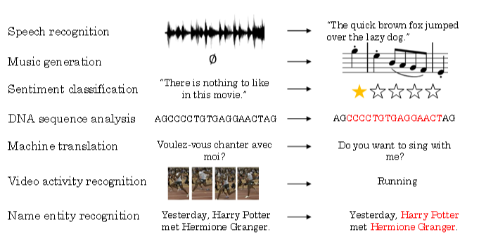
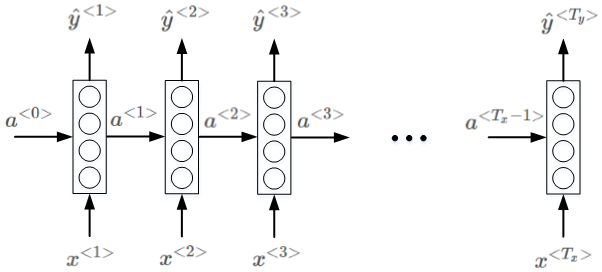
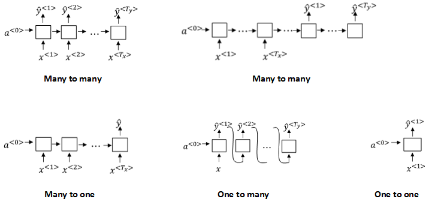
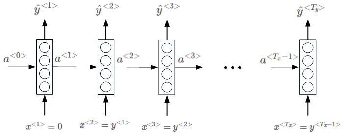
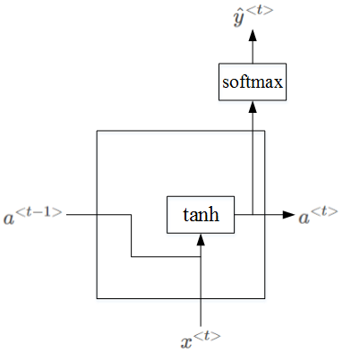
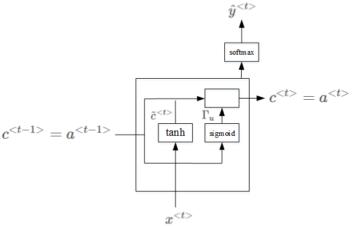
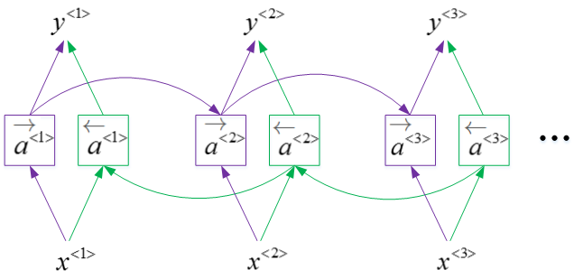
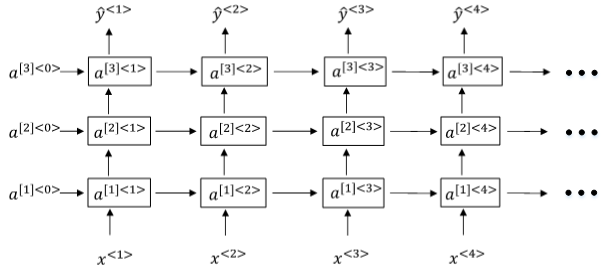
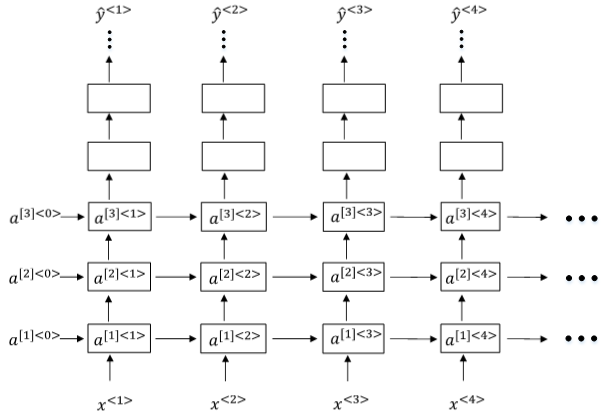

# 循环神经网络（RNN）

## 什么是序列模型

序列模型能够应用在许多领域，例如：

- **语音识别**
- **音乐发生器**
- **情感分类**
- **DNA序列分析**
- **机器翻译**
- **视频动作识别**
- **命名实体识别**

这些序列模型基本都属于**监督式学习**，输入x和输出y不一定都是序列模型。如果都是序列模型的话，模型长度不一定完全一致。

## 命名规则

下面以命名实体识别为例，介绍序列模型的命名规则。示例语句为：

**Harry Potter and Hermione Granger invented a new spell.**

该句话包含9个单词，输出y即为1 x 9向量，每位表征对应单词是否为人名的一部分，1表示是，0表示否。很明显，该句话中“Harry”，“Potter”，“Hermione”，“Granger”均是人名成分，所以，对应的输出y可表示为：

$$
y=[1\ \ 1\ \ 0\ \ 1\ \ 1\ \ 0\ \ 0\ \ 0\ \ 0]
$$
一般约定使用$T_y$表示输出**序列长度**，使用$y^{<t>}$表示序列对应位置的**输出**，其中$1\leq t\leq T_y$。

对于输入x，表示为：

$$
[x^{<1>}\ \ x^{<2>}\ \ x^{<3>}\ \ x^{<4>}\ \ x^{<5>}\ \ x^{<6>}\ \ x^{<7>}\ \ x^{<8>}\ \ x^{<9>}]
$$

同样，$T_x$表示输入**序列长度**，$x^{<t>}$表示序列对应位置的**输入**。注意，此例中，$T_x=T_y$，但是也存在$T_x\neq T_y$的情况。

如何来表示每个$x^{<t>}$呢？方法是首先建立一个词汇库，尽可能包含更多的词汇。例如一个包含10000个词汇的词汇库为：

$$
\left[
\begin{matrix}
a \\
and \\
\cdot \\
\cdot \\
\cdot \\
harry \\
\cdot \\
\cdot \\
\cdot \\
potter \\
\cdot \\
\cdot \\
\cdot \\
zulu
\end{matrix}
\right]
$$

该词汇库可看成是10000 x 1的向量。值得注意的是自然语言处理NLP实际应用中的词汇库可达百万级别的词汇量。

然后，使用one-hot编码，例句中的每个单词$x^{<t>}$都可以表示成10000 x 1的向量，词汇表中与$x^{<t>}$对应的位置为1，其它位置为0。该$x^{<t>}$为one-hot向量。值得一提的是如果出现词汇表之外的单词，可以使用UNK(Unknown)或其他字符串来表示。

对于多样本，以上序列模型对应的命名规则可表示为：$x^{(i)<t>}$，$y^{(i)<t>}$，$T^{(i)}_x$，$T^{(i)}_y$。其中，$i$表示第i个样本。不同样本的$T^{(i)}_x$或$T^{(i)}_y$都有可能不同。

## 循环神经网络模型

### 传统模型

对于序列模型，如果使用标准的神经网络，其模型结构如下：

使用标准的神经网络模型存在两个问题：

**第一个问题**，不同样本的输入序列长度或输出序列长度不同，即$T_x^{(i)}\neq T_x^{(j)}$，$T_y^{(i)}\neq T_y^{(j)}$，造成**模型难以统一**。解决办法之一是设定一个最大序列长度，对每个输入和输出序列补零并统一到最大长度。但是这种做法实际效果并不理想。

**第二个问题，**也是主要问题，这种标准神经网络结构**无法共享**序列不同$x^{<t>}$之间的**特征**。

例如，如果某个$x^{<t>}$即“Harry”是人名成分，那么句子其它位置出现了“Harry”，也很可能也是人名。这是共享特征的结果，如同CNN网络特点一样。但是，上图所示的网络不具备共享特征的能力。值得一提的是，共享特征还有助于减少神经网络中的参数数量，一定程度上**减小了模型的计算复杂度**。例如上图所示的标准神经网络，假设每个扩$x^{<t>}$展到最大序列长度为100，且词汇表长度为10000，则输入层就已经包含了100 x 10000个神经元了，权重参数很多，运算量将是庞大的。

### 模型结构

标准的神经网络不适合解决序列模型问题，而循环神经网络（RNN）是专门用来解决序列模型问题的。**RNN模型结构**如下：

序列模型从左到右，依次传递，此例中，$T_x=T_y$。$x^{<t>}$到$\hat y^{<t>}$之间是隐藏神经元。$a^{<t>}$会传入到第$t+1$个元素中，作为输入。其中，$a^{<0>}$一般为零向量。

RNN模型包含三类权重系数，分别是$W_{ax}，W_{aa}，W_{ya}$。且不同元素之间同一位置共享同一权重系数。

### 正向传播

RNN的正向传播（Forward Propagation）过程为：
$$
a^{<t>}=g(W_{aa}\cdot a^{<t-1>}+W_{ax}\cdot x^{<t>}+b_a)
$$

$$
\hat y^{<t>}=g(W_{ya}\cdot a^{<t>}+b_y)
$$

其中，$g(*)$表示激活函数，不同的问题需要使用不同的激活函数。

为了简化表达式，可以对$a^{<t>}$项进行整合：

$$
W_{aa}\cdot a^{<t-1>}+W_{ax}\cdot x^{<t>}=[W_{aa}\ \ W_{ax}]\left[
\begin{matrix}
a^{<t-1>} \\
x^{<t>}
\end{matrix}
\right]\rightarrow W_a[a^{<t-1>},x^{<t>}]
$$
则正向传播可表示为：

$$
a^{<t>}=g(W_a[a^{<t-1>},x^{<t>}]+b_a)
$$

$$
\hat y^{<t>}=g(W_{y}\cdot a^{<t>}+b_y)
$$

### 双向RNN

值得一提的是，以上所述的RNN为**单向RNN**，即按照从左到右顺序，单向进行，$\hat y^{<t>}$只与左边的元素有关。但是，有时候$\hat y^{<t>}$也可能与右边元素有关。

例如下面两个句子中，单凭前三个单词，无法确定“Teddy”是否为人名，必须根据右边单词进行判断。

**He said, “Teddy Roosevelt was a great President.”**

**He said, “Teddy bears are on sale!”**

因此，有另外一种RNN结构是**双向RNN**，简称为BRNN。$\hat y^{<t>}$与左右元素均有关系，我们之后再详细介绍。

## 通过时间的反向传播

### 损失函数

针对上面识别人名的例子，经过RNN正向传播，单个元素的损失函数为：

$$
L^{<t>}(\hat y^{<t>},y^{<t>})=-y^{<t>}log\ \hat y^{<t>}-(1-y^{<t>})log\ (1-\hat y^{<t>})
$$
该样本所有元素的损失函数为：

$$
L(\hat y,y)=\sum_{t=1}^{T_y}L^{<t>}(\hat y^{<t>},y^{<t>})
$$

### 反向传播

然后，反向传播（Backpropagation）过程就是从右到左分别计算$L(\hat y,y)$对参数$W_a，W_y，b_a，b_y$的偏导数。思路与做法与标准的神经网络是一样的。一般可以通过成熟的深度学习框架自动求导，例如PyTorch、Tensorflow等。这种从右到左的求导过程被称为**通过时间的反向传播(Backpropagation through time)**。

## 不同类型的RNN

以上介绍的例子中，$T_x=T_y$。但是在很多RNN模型中，$T_x$是不等于$T_y$的。例如第1节介绍的许多模型都是$T_x\neq T_y$。

根据$T_x$与$T_y$的关系，RNN模型包含以下几个类型：

- **多对多: $T_x=T_y$**
- **多对多: $T_x\neq T_y$**
- **多对一: $T_x>1,T_y=1$**
- **一对多: $T_x=1,T_y>1$**
- **一对一: $T_x=1,T_y=1$**

不同类型相应的示例结构如下：

## 语言模型和序列生成

语言模型是自然语言处理（NLP）中最基本和最重要的任务之一。使用RNN能够很好地建立需要的不同语言风格的语言模型。

什么是语言模型呢？举个例子，在语音识别中，某句语音有两种翻译：

- **The apple and pair salad.**
- **The apple and pear salad.**

很明显，第二句话更有可能是正确的翻译。语言模型实际上会计算出这两句话各自的出现概率。比如第一句话概率为$10^{−13}$，第二句话概率为$10^{−10}$。也就是说，利用语言模型得到各自语句的概率，**选择概率最大的语句作为正确的翻译**。

概率计算的表达式为：
$$
P(y^{<1>},y^{<2>},\cdots,y^{<T_y>})
$$
如何使用RNN构建语言模型？首先，我们需要一个足够大的训练集，训练集由大量的单词语句语料库（corpus）构成。然后，对corpus的每句话进行切分词（tokenize）。做法就跟第2节介绍的一样，建立词汇库，对每个单词进行one-hot编码。例如下面这句话：

**The Egyptian Mau is a bread of cat.**

One-hot编码已经介绍过了，不再赘述。还需注意的是，每句话结束末尾，需要加上**< EOS >**作为语句结束符。另外，若语句中有词汇表中没有的单词，用**< UNK >**表示。假设单词“Mau”不在词汇表中，则上面这句话可表示为：

**The Egyptian < UNK > is a bread of cat. < EOS >**

准备好训练集并对语料库进行切分词等处理之后，接下来构建相应的RNN模型。

语言模型的RNN结构如上图所示，$x^{<1>}$和$a^{<0>}$均为零向量。Softmax输出层$\hat y^{<1>}$表示出现该语句第一个单词的概率，softmax输出层$\hat y^{<2>}$表示在第一个单词基础上出现第二个单词的概率，即条件概率，以此类推，最后是出现**< EOS >**的条件概率。

单个元素的**softmax损失函数**为：

$$
L^{<t>}(\hat y^{<t>},y^{<t>})=-\sum_iy_i^{<t>}log\ \hat y_i^{<t>}
$$

该样本所有元素的**损失函数**为：

$$
L(\hat y,y)=\sum_tL^{<t>}(\hat y^{<t>},y^{<t>})
$$

对语料库的每条语句进行RNN模型训练，最终得到的模型可以根据给出语句的前几个单词预测其余部分，将语句补充完整。例如给出**“Cats average 15”**，RNN模型可能预测完整的语句是**“Cats average 15 hours of sleep a day.”**。

最后补充一点，整个语句出现的概率等于语句中所有元素出现的条件概率乘积。例如某个语句包含$y^{<1>},y^{<2>},y^{<3>}$，则整个语句出现的概率为：

$$
P(y^{<1>},y^{<2>},y^{<3>})=P(y^{<1>})\cdot P(y^{<2>}|y^{<1>})\cdot P(y^{<3>}|y^{<1>},y^{<2>})
$$

## 新序列采样

利用训练好的RNN语言模型，可以进行新的序列采样，从而随机产生新的语句。与上一节介绍的一样，相应的RNN模型如下所示：

首先，从第一个元素输出$\hat y^{<1>}$的softmax分布中随机选取一个单词作为新语句的首单词。然后，$y^{<1>}$作为$x^{<2>}$，得到$\hat y^{<2>}$的softmax分布。从中选取概率最大的单词作为$y^{<2>}$，继续将$y^{<2>}$作为$x^{<3>}$，以此类推。直到产生**< EOS >**结束符，则标志语句生成完毕。当然，也可以设定语句长度上限，达到长度上限即停止生成新的单词。最终，根据随机选择的首单词，RNN模型会生成一条新的语句。

**注**：如果不希望新的语句中包含**< UNK >**标志符，可以在每次产生**< UNK >**时重新采样，直到生成非**< UNK >**标志符为止。

### 两种级别的RNN

#### 单词级RNN

以上介绍的是**单词级RNN**(Word level RNN)，即每次生成单个word，语句由多个words构成。

#### 字母级RNN

另外一种情况是**字母级RNN**(Character level RNN)，即词汇表由单个英文字母或字符组成，如下所示：
$$
Vocabulay=[a,b,c,\cdots,z,.,;,\ ,0,1,\cdots,9,A,B,\cdots,Z]
$$
字母级RNN与单词级RNN不同的是，$\hat y^{<t>}$由单个字符组成而不是单词。训练集中的每句话都当成是由许多字符组成的。

##### 优点

字母级RNN的优点是能**有效避免遇到词汇表中不存在的单词< UNK >**。

##### 缺点

但是，字母级RNN的缺点也很突出。由于是字符表征，每句话的字符数量很大，这种大的跨度**不利于寻找语句前部分和后部分之间的依赖性**。另外，字母级RNN的在训练时的**计算量也是庞大**的。

基于这些缺点，目前字母级RNN的应用并不广泛，但是在特定应用下仍然有发展的趋势。

## 带有RNN的梯度消失

语句中可能存在**跨度很大的依赖关系**，即某个单词可能与它距离较远的某个单词具有强依赖关系。例如下面这两条语句：

**The cat, which already ate fish, was full.**

**The cats, which already ate fish, were full.**

第一句话中，was受cat影响；第二句话中，were受cats影响。它们之间都跨越了很多单词。

而一般的RNN模型每个元素受其周围附近的影响较大，难以建立跨度较大的依赖性。上面两句话的这种依赖关系，由于跨度很大，普通的RNN网络容易出现**梯度消失**，捕捉不到它们之间的依赖，造成语法错误。

另一方面，RNN也可能出现梯度爆炸的问题。常用的解决办法是设定一个阈值，一旦梯度最大值达到这个阈值，就对整个梯度向量进行尺度缩小。这种做法被称为**梯度剪裁(gradient clipping)。**

## Gated Recurrent Unit(GRU)

RNN的隐藏层单元结构如下图所示：

$a^{<t>}$的表达式为：

$$
a^{<t>}=tanh(W_a[a^{<t-1>},x^{<t>}]+b_a)
$$
为了解决梯度消失问题，对上述单元进行修改，添加了记忆单元，构建GRU，如下图所示：

相应的表达式为：

$$
\tilde c^{<t>}=tanh(W_c[c^{<t-1>},x^{<t>}]+b_c)
$$

$$
\Gamma_u=\sigma(W_u[c^{<t-1>},x^{<t>}]+b_u)
$$

$$
c^{<t>}=\Gamma_u*\tilde c^{<t>}+(1-\Gamma_u)*c^{<t-1>}
$$

其中，$c^{<t-1>}=a^{<t-1>}$，$c^{<t>}=a^{<t>}$。$\Gamma_u$意为门(gate)【记忆单元】。当$\Gamma_u=1$时，代表更新；当$\Gamma_u=0$时，代表记忆，保留之前的模块输出。这一点跟CNN中的残差网络的作用有点类似。因此，$\Gamma_u$能够保证RNN模型中跨度很大的依赖关系不受影响，消除梯度消失问题。

上面介绍的是简化的GRU模型，完整的GRU添加了另外一个gate，即$\Gamma_r$，表达式如下：

$$
\Gamma_r=\sigma(W_r[c^{<t-1>},x^{<t>}]+b_r)
$$

$$
\Gamma_u=\sigma(W_u[c^{<t-1>},x^{<t>}]+b_u)
$$

$$
\tilde c^{<t>}=tanh(W_c[\Gamma_r*c^{<t-1>},x^{<t>}]+b_c)
$$

$$
c^{<t>}=\Gamma_u*\tilde c^{<t>}+(1-\Gamma_u)*c^{<t-1>}
$$

$$
a^{<t>}=c^{<t>}
$$

注意，以上表达式中的$*$表示元素相乘，而非矩阵相乘。

## Long Short Term Memory(LSTM)

LSTM是另一种更强大的解决梯度消失问题的方法。它对应的RNN隐藏层单元结构如下图所示：

相应的表达式为：

$$
\tilde c^{<t>}=tanh(W_c[a^{<t-1>},x^{<t>}]+b_c)
$$

$$
\Gamma_u=\sigma(W_u[a^{<t-1>},x^{<t>}]+b_u)
$$

$$
\Gamma_f=\sigma(W_f[a^{<t-1>},x^{<t>}]+b_f)
$$

$$
\Gamma_o=\sigma(W_o[a^{<t-1>},x^{<t>}]+b_o)
$$

$$
c^{<t>}=\Gamma_u*\tilde c^{<t>}+\Gamma_f*c^{<t-1>}
$$

$$
a^{<t>}=\Gamma_o*c^{<t>}
$$

LSTM包含三个gates：$\Gamma_u,\Gamma_f,\Gamma_o$，分别对应更新门(update gate)，遗忘门(forget gate)和输出门(output gate)。

如果考虑$c^{<t−1>}$对$\Gamma_u,\Gamma_f,\Gamma_o$的影响，可加入peephole connection，对LSTM的表达式进行修改：

$$
\tilde c^{<t>}=tanh(W_c[a^{<t-1>},x^{<t>}]+b_c)
$$

$$
\Gamma_u=\sigma(W_u[a^{<t-1>},x^{<t>},c^{<t-1>}]+b_u)
$$

$$
\Gamma_f=\sigma(W_f[a^{<t-1>},x^{<t>},c^{<t-1>}]+b_f)
$$

$$
\Gamma_o=\sigma(W_o[a^{<t-1>},x^{<t>},c^{<t-1>}]+b_o)
$$

$$
c^{<t>}=\Gamma_u*\tilde c^{<t>}+\Gamma_f*c^{<t-1>}
$$

$$
a^{<t>}=\Gamma_o*c^{<t>}
$$

GRU可以看成是简化的LSTM，两种方法都具有各自的优势。

## 双向RNN

我们在第3节中简单提过双向RNN，它的结构如下图所示：

BRNN对应的输出$y^{<t>}$表达式为：

$$
\hat y^{<t>}=g(W_{y}[a^{\rightarrow <t>},a^{\leftarrow <t>}]+b_y)
$$
BRNN能够同时对序列进行双向处理，性能大大提高。但是计算量较大，且在处理实时语音时，需要等到**完整的一句话结束时**才能进行分析。

## 深层RNN

深层RNN由多层RNN组成，其结构如下图所示：

与DNN(深度神经网络)一样，用上标$[l]$表示层数。深层RNN中$a^{[l]<t>}$的表达式为：

$$
a^{[l]<t>}=g(W_a^{[l]}[a^{[l]<t-1>},a^{[l-1]<t>}]+b_a^{[l]})
$$
我们知道DNN层数可达100多，而深层RNN一般没有那么多层，3层RNN已经较复杂了。

另外一种深层RNN结构是每个输出层上还有一些垂直单元，如下图所示：

