# 序列模型与注意力机制

## 基础模型

Sequence to sequence(Seq2Seq)模型在机器翻译和语音识别方面都有着广泛的应用。下面，我们来看一个机器翻译的简单例子：

针对该机器翻译问题，可以使用“编码网络（encoder network）”+“解码网络（decoder network）”两个RNN模型组合的形式来解决。编码网络将输入语句编码为一个特征向量，传递给解码网络，完成翻译。具体模型结构如下图所示：

其中，嵌入向量代表了输入语句的编码特征。编码网络和解码网络都是RNN模型，可使用GRU或LSTM单元。这种“编码网络（encoder network）”+“解码网络（decoder network）”的模型，在实际的机器翻译应用中有着不错的效果。

这种模型也可以应用到图像捕捉领域。图像捕捉，即捕捉图像中主体动作和行为，描述图像内容。例如下面这个例子，根据图像，捕捉图像内容。

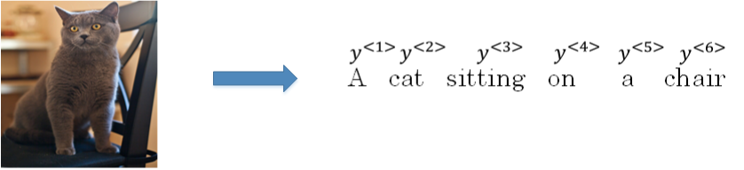

首先，可以将图片输入到CNN，例如使用预训练好的AlexNet，删去最后的softmax层，保留至最后的全连接层。则该全连接层就构成了一个图片的特征向量（编码向量），表征了图片特征信息。

然后，将编码向量输入至RNN，即解码网络中，进行解码翻译。

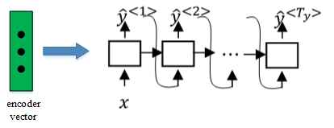

## 选择最可能的句子

Seq2Seq 机器翻译模型与我们第一节课介绍的语言模型有一些相似，但也存在不同之处。二者模型结构如下所示：

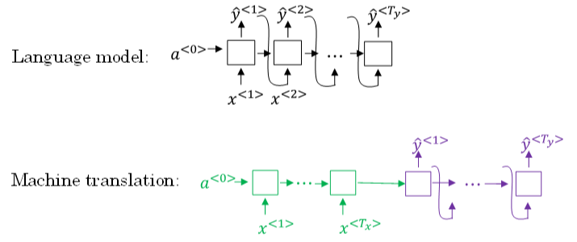

语言模型是自动生成一条完整语句，语句是随机的。

而机器翻译模型是根据输入语句，进行翻译，生成另外一条完整语句。上图中，绿色部分表示编码网络，紫色部分表示解码网络。解码网络与语言模型是相似的，编码网络可以看成是语言模型的$a^{<0>}$，是模型的一个条件。

也就是说，在输入语句的条件下，生成正确的翻译语句。因此，机器翻译可以看成是条件语言模型（conditional language model）。这就是二者之间的区别与联系。

所以，机器翻译的目标就是根据输入语句，作为条件，找到最佳翻译语句，使其概率最大：

$$
max\ P(y^{<1>},y^{<2>},\cdots,y^{<T_y>}|x^{<1>},x^{<2>},\cdots,x^{<T_x>})
$$
例如，本节笔记开始介绍的例子，列举几个模型可能得到的翻译：

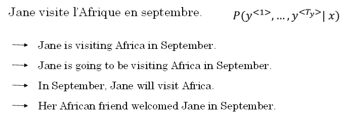

显然，第一条翻译“Jane is visiting Africa in September.”最为准确。那我们的优化目标就是要让这条翻译对应的$P(y^{<1>},\cdots,y^{<T_y>}|x)$最大化。

实现优化目标的方法之一是使用贪心搜索（greedy search）。贪心搜索根据条件，每次只寻找一个最佳单词作为翻译输出，力求把每个单词都翻译准确。例如，首先根据输入语句，找到第一个翻译的单词“Jane”，然后再找第二个单词“is”，再继续找第三个单词“visiting”，以此类推。这也是其“贪心”名称的由来。

贪心搜索存在一些缺点。首先，因为贪心搜索每次只搜索一个单词，没有考虑该单词前后关系，概率选择上有可能会出错。

例如，上面翻译语句中，第三个单词“going”比“visiting”更常见，模型很可能会错误地选择了“going”，而错失最佳翻译语句。其次，贪心搜索大大增加了运算成本，降低运算速度。

因此，贪心搜索并不是最佳的方法。下一小节，我们将介绍定向搜索(Beam Search)，使用**近似最优**的查找方式，最大化输出概率，寻找最佳的翻译语句。

## 定向搜索(Beam Search)

贪心搜索每次是找出预测概率最大的单词，而定向搜索则是每次找出**预测概率最大的B个单词**。其中，参数B表示取概率最大的单词个数，**可调**。本例中，令B=3。

按照定向搜索的搜索原理，首先，先从词汇表中找出翻译的第一个单词概率最大的B个预测单词。例如上面的例子中，预测得到的第一个单词为：in，jane，september。

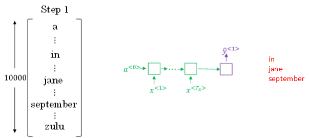

概率表示为：P(y^<1>|x)P(y^<1>|x)

然后，再分别以in，jane，september为条件，计算每个词汇表单词作为预测第二个单词的概率。从中选择概率最大的3个作为第二个单词的预测值，得到：in september，jane is，jane visits。

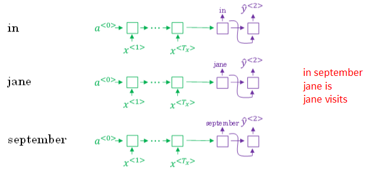

概率表示为：$P(\hat y^{<1>} | x)$。

此时，得到的前两个单词的3种情况的概率为：

$$
P(\hat y^{<1>},\hat y^{<2>}|x)=P(\hat y^{<1>} | x)\cdot P(\hat y^{<2>}|x,\hat y^{<1>})
$$
接着，再预测第三个单词。方法一样，分别以in September，Jane is，Jane visits为条件，计算每个词汇表单词作为预测第三个单词的概率。从中选择概率最大的3个作为第三个单词的预测值，得到：in September Jane，Jane is visiting，Jane visits Africa。

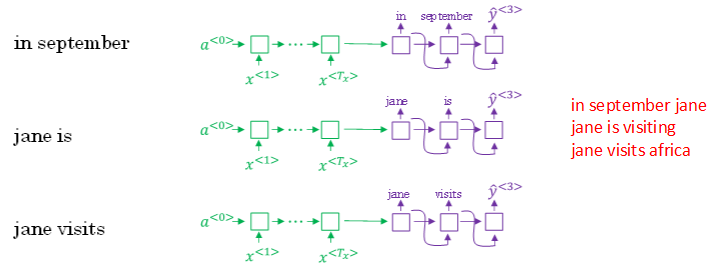

概率表示为：$P(\hat y^{<3>}|x,\hat y^{<1>},\hat y^{<2>})$。

此时，得到的前三个单词的3种情况的概率为：

$$
P(\hat y^{<1>},\hat y^{<2>},\hat y^{<3>}|x)=P(\hat y^{<1>} | x)\cdot P(\hat y^{<2>}|x,\hat y^{<1>})\cdot P(\hat y^{<3>}|x,\hat y^{<1>},\hat y^{<2>})
$$
以此类推，每次都取概率最大的三种预测。最后，选择概率最大的那一组作为最终的翻译语句。

**Jane is visiting Africa in September.**

值得注意的是，如果参数B=1，则就等同于greedy search。实际应用中，可以根据不同的需要设置B为不同的值。一般B越大，机器翻译越准确，但同时也会增加计算复杂度。

## 改进定向搜索

定向搜索中，最终机器翻译的概率是乘积的形式：

$$
arg\ max\prod_{t=1}^{T_y} P(\hat y^{<t>}|x,\hat y^{<1>},\cdots,\hat y^{<t-1>})
$$
多个概率相乘可能会使乘积结果很小，远小于1，造成数值下溢。为了解决这个问题，可以对上述乘积形式进行取对数log运算，即：

$$
arg\ max\sum_{t=1}^{T_y} P(\hat y^{<t>}|x,\hat y^{<1>},\cdots,\hat y^{<t-1>})
$$
因为取对数运算，将乘积转化为求和形式，**避免了数值下溢**，使得数据更加稳定有效。

这种概率表达式还存在一个问题，就是机器翻译的单词越多，乘积形式或求和形式得到的概率就越小，这样会造成模型倾向于选择单词数更少的翻译语句，使机器翻译受单词数目的影响，这显然是不太合适的。因此，一种改进方式是进行长度归一化，消除语句长度影响。

$$
arg\ max\ \frac{1}{T_y}\sum_{t=1}^{T_y} P(\hat y^{<t>}|x,\hat y^{<1>},\cdots,\hat y^{<t-1>})
$$
实际应用中，通常会引入归一化因子$\alpha$：

$$
arg\ max\ \frac{1}{T_y^{\alpha}}\sum_{t=1}^{T_y} P(\hat y^{<t>}|x,\hat y^{<1>},\cdots,\hat y^{<t-1>})
$$
若$\alpha=1$，则完全进行长度归一化；若$\alpha=0$，则不进行长度归一化。一般令$\alpha=0.7$，效果不错。

值得一提的是，与BFS (Breadth First Search) 、DFS (Depth First Search)算法不同，**beam search运算速度更快，但是并不保证一定能找到正确的翻译语句。**

## 定向搜索的误差分析

定向搜索是一种近似搜索算法。实际应用中，如果机器翻译效果不好，需要通过错误分析，判断是RNN模型问题还是定向搜索算法问题。

一般来说，增加训练样本、增大定向搜索参数B都能提高准确率。但是，这种做法并不能得到我们期待的性能，且并不实际。

首先，为待翻译语句建立人工翻译，记为$y^*$。在RNN模型上使用定向搜索算法，得到机器翻译，记为$\hat y$。显然，人工翻译$y^*$最为准确。

**Jane visite l’Afrique en septembre.**

**Human: Jane visits Africa in September.**  $y^*$

**Algorithm: Jane visited Africa last September.**  $\hat y$

这样，整个模型包含两部分：RNN和定向搜索算法。

然后，将输入语句输入到RNN模型中，分别计算输出是$y^*$的概率$P(y^*|x)$和$\hat y$的概率$P(\hat y|x)$。

接下来就是比较$P(y^*|x)$和$P(\hat y|x)$的大小。

- $P(y^*|x)>P(\hat y|x)$：Beam search算法有误
- $P(y^*|x)<P(\hat y|x)$：RNN模型有误

如果定向搜索算法表现不佳，可以调试参数B；若RNN模型不好，则可以增加网络层数，使用正则化，增加训练样本数目等方法来优化。更多错误分析方法，可以参照之前的笔记 机器学习策略（下）

## Bleu得分(选修)

使用bleu得分，对机器翻译进行打分。

首先，对原语句建立人工翻译参考，一般有多个人工翻译（利用验证集火测试集）。例如下面这个例子：

**French: Le chat est sur le tapis.**

**Reference 1: The cat is on the mat.**

**Reference 2: There is a cat on the mat.**

上述两个人工翻译都是正确的，作为参考。相应的机器翻译如下所示：

**French: Le chat est sur le tapis.**

**Reference 1: The cat is on the mat.**

**Reference 2: There is a cat on the mat.**

**MT output: the the the the the the the.**

如上所示，机器翻译为“the the the the the the the.”，效果很差。Bleu得分的宗旨是机器翻译越接近参考的人工翻译，其得分越高，方法原理就是看机器翻译的各个单词是否出现在参考翻译中。

最简单的**准确度评价方法**是看机器翻译的每个单词是否出现在参考翻译中。显然，上述机器翻译的每个单词都出现在参考翻译里，准确率为$\frac 7 7 =1$，其中，分母为机器翻译单词数目，分子为相应单词是否出现在参考翻译中。但是，这种方法很不科学，并不可取。

另外一种评价方法是**看机器翻译单词出现在参考翻译单个语句中的次数**，取最大次数。上述例子对应的准确率为$\frac 2 7$，其中，分母为机器翻译单词数目，分子为相应单词出现在参考翻译中的次数（分子为2是因为“the”在参考1中出现了两次）。这种评价方法较为准确。

上述两种方法都是对单个单词进行评价。按照定向搜索的思想，另外一种更科学的打分方法是双字母组bleu得分(bleu score on bigrams)，即同时对两个连续单词进行打分。仍然是上面那个翻译例子：

**French: Le chat est sur le tapis.**

**Reference 1: The cat is on the mat.**

**Reference 2: There is a cat on the mat.**

**MT output: The cat the cat on the mat.**

对机器翻译输出进行分解，得到的双字母组及其出现在机器翻译输出中的次数count为：

**the cat: 2**

**cat the: 1**

**cat on: 1**

**on the: 1**

**the mat: 1**

然后，统计上述双字母组出现在参考翻译单个语句中的次数（取最大次数）$count_{clip}$为：

**the cat: 1**

**cat the: 0**

**cat on: 1**

**on the: 1**

**the mat: 1**

相应的双字母组精度为：

$$
\frac{count_{clip}}{count}=\frac{1+0+1+1+1}{2+1+1+1+1}=\frac46=\frac23
$$
如果只看单个单词，相应的联合字母组(unigrams)精度为：

如果是n个连续单词，相应的n个字母组(n-grams)精度为：

总结一下，可以同时计算$p_1,\cdots,p_n$，再对其求平均：

$$
p=\frac1n\sum_{i=1}^np_i
$$
通常，对上式进行指数处理，并引入参数因子过短惩罚因子(brevity penalty)，记为BP。顾名思义，BP是为了“惩罚”机器翻译语句过短而造成的得分“虚高”的情况。

$$
p=BP\cdot exp(\frac1n\sum_{i=1}^np_i)
$$

其中，BP值由机器翻译长度和参考翻译长度共同决定。

## 注意力模型直观理解

如果原语句很长，要对整个语句输入RNN的编码网络和解码网络进行翻译，则效果不佳。相应的bleu得分会随着单词数目增加而逐渐降低。

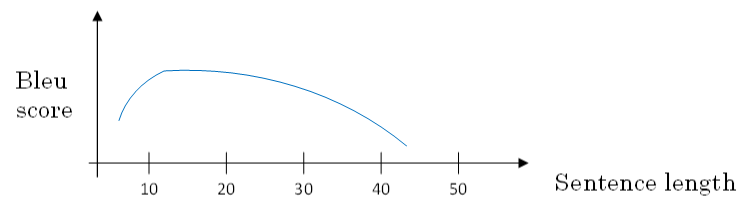

对待长语句，正确的翻译方法是将长语句分段，每次只对长语句的一部分进行翻译。人工翻译也是采用这样的方法，高效准确。也就是说，每次翻译只注重一部分区域，这种方法使得bleu得分不太受语句长度的影响。

根据这种“**局部聚焦**”的思想，建立相应的注意力模型（attention model）。

如上图所示，注意力模型仍由类似的编码网络（下）和解码网络（上）构成。其中，$S^{<t>}$由原语句附近单元共同决定，原则上说，离得越近，注意力权重（attention weights）越大，相当于在你当前的注意力区域有个滑动窗。

## 注意力模型

注意力中选择双向RNN，可以使用GRU单元或者LSTM。由于是双向RNN，每个$a^{<t'>}$表示：

$$
a^{<t'>}=(a^{\rightarrow <t'>},a^{\leftarrow <t'>})
$$
RNN编码生成特征，注意力权重用$\alpha$表示，C是各个RNN神经元经过注意力权重得到的参数值。例如，$\alpha^{<1,t′>}$表示机器翻译的第一个单词“jane”对应的第t’个RNN神经元，$C^{<1>}$表示机器翻译第一个单词“jane”对应的解码网络输入参数。满足：

$$
\sum_{t'}\alpha^{<1,t'>}=1
$$

$$
C^{<1>}=\sum_{t'}\alpha^{<1,t'>}\cdot a^{<t'>}
$$

也就是说，$\alpha^{<t,t′>}$表示输出$\hat y^{<t>}$对RNN单元$\alpha^{<t′>}$的注意力权重因子。

为了让$\alpha^{<t,t′>}$之和为1，利用softamx思想，引入参数$e^{<t,t′>}$，使得：

$$
\alpha^{<t,t'>}=\frac{e^{<t,t'>}}{\sum_{t'}^{Tx}e^{<t,t'>}}
$$
这样，只要求出$e^{<t,t′>}$，就能得到$\alpha^{<t,t′>}$。

如何求出$e^{<t,t′>}$呢？方法是建立一个简单的神经网络，如下图所示。输入是$S^{<t-1>}$和$a^{<t′>}$,输出是$e^{<t,t′>}$。

然后，利用梯度下降算法迭代优化，计算得到$e^{<t,t′>}$和$\alpha^{<t,t′>}$。

注意力模型的一个缺点是其计算量较大，若输入句子长度为$T_x$，输出句子长度为$T_y$，则计算时间约为$T_x∗T_y$。但是，其性能提升很多，计算量大一些也是可以接受的。

有趣的是，注意力模型在图像捕捉方面也有应用。

注意力模型能有效处理很多机器翻译问题，例如下面的时间格式归一化：

下图将注意力权重可视化：

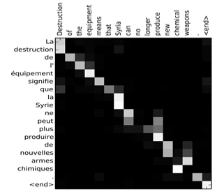

上图中，颜色越白表示注意力权重越大，颜色越深表示权重越小。可见，输出语句单词与其输入语句单词对应位置的注意力权重较大，即对角线附近。

## 语音识别

深度学习中，语音识别的输入是声音，量化成时间序列。更一般地，可以把信号转化为频域信号，即声谱图（spectrogram），再进入RNN模型进行语音识别。

之前，语言学家们会将语音中每个单词分解成多个音素（phoneme），构建更精准的传统识别算法。但在端到端深度神经网络模型中，一般不需要这么做也能得到很好的识别效果。通常训练样本很大，需要上千上万个小时的语音素材。

语音识别的注意力模型（attention model）如下图所示：

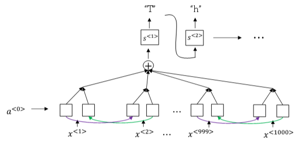

一般来说，语音识别的输入时间序列都比较长，例如是10s语音信号，采样率为100Hz，则语音长度为1000。而翻译的语句通常很短，例如“the quick brown fox”，包含19个字符。这时候，$T_x$与$T_y$差别很大。为了让$T_x=T_y$，可以把输出相应字符重复并加入空白（blank），形如：

$$
ttt \_ h\_eee\_ \_ \_ \sqcup\_ \_ \_ qqq\_ \_ \cdots
$$
其中，下划线”\_“表示空白，”⊔“表示两个单词之间的空字符。这种写法的一个基本准则是没有被空白符”\_“分割的重复字符将被折叠到一起，即表示一个字符。

这样，加入了重复字符和空白符、空字符，可以让输出长度也达到1000，即$T_x=T_y$。这种模型被称为CTC（Connectionist temporal classification）【连接式时间分类】。

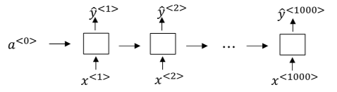

## 触发字检测

触发字检测（Trigger Word Detection）在很多产品中都有应用，操作方法就是说出触发字通过语音来启动相应的设备。例如Amazon Echo的触发字是”Alexa“，百度DuerOS的触发字是”小度你好“，Apple Siri的触发字是”Hey Siri“，Google Home的触发字是”Okay Google“。

触发字检测系统可以使用RNN模型来建立。如下图所示，输入语音中包含一些触发字，其余都是非触发字。RNN检测到触发字后输出1，非触发字输出0。这样训练的RNN模型就能实现触发字检测。

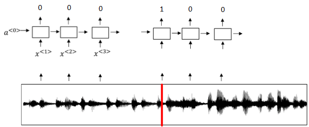

但是这种模型有一个缺点，就是通常训练样本语音中的触发字较非触发字数目少得多，即正负样本分布不均。一种解决办法是在出现一个触发字时，将其附近的RNN都输出1。这样就简单粗暴地增加了正样本。

