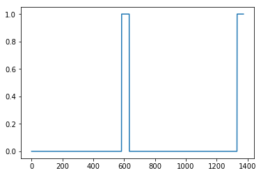
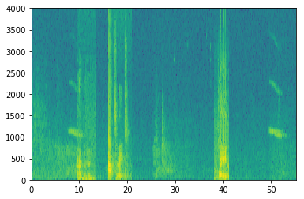
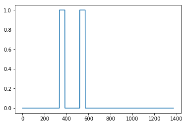
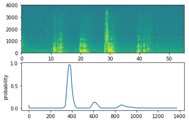

# 触发词检测

欢迎来到这个专业的最终编程任务!

在这周的视频中，你学习了如何将深度学习应用到语音识别中。在这个作业中，您将构建一个语音数据集，并实现一个触发词检测算法(有时也称为关键字检测，或唤醒字检测)。触发词检测技术可以让亚马逊Alexa、谷歌Home、苹果Siri和百度DuerOS等设备在听到某个特定单词后自动唤醒。

在这个练习中，我们的触发词将是“Activate”。每次它听到你说"activate"，它就会发出"chiming"。在这个作业结束时，你将能够录制一段你自己说话的片段，并让算法在检测到你说"activate"时触发铃声。

完成这个任务后，也许你还可以把它扩展到你的笔记本电脑上，这样每当你说"activate"时，它就会启动你最喜欢的应用程序，或者打开你家里的联网灯，或者触发其他事件?

在这个作业中，你将学会:

- 构造一个语音识别项目

- 合成和处理音频记录，以创建训练/开发数据集

- 训练一个触发词检测模型并做出预测

## 导包

让我们开始吧!运行以下单元格以加载将要使用的包。

```python
import numpy as np
from pydub import AudioSegment
import random
import sys
import io
import os
import glob
import IPython
from td_utils import *
%matplotlib inline
```

## 数据合成:创建一个语音数据集

让我们首先为触发词检测算法构建一个数据集。理想情况下，语音数据集应该尽可能接近您希望在其上运行的应用程序。在这种情况下，你会在工作环境(图书馆、家里、办公室、开放空间……)中发现"activate"这个词。因此，你需要在不同的背景声音中创建一段录音，其中包含积极词汇("activate")和消极词汇(除了"activate"之外的随机词汇)。让我们看看如何创建这样的数据集。

### 听数据

你的一个朋友正在帮你做这个项目，他们到图书馆、咖啡馆、餐馆、家里和办公室去记录背景噪音，以及人们说积极/消极词汇的音频片段。这个数据集包括用各种口音说话的人。

在raw_data目录中，您可以找到包含积极词、消极词和背景噪声的原始音频文件的子集。您将使用这些音频文件来合成一个数据集来训练模型。"activate"目录包含了人们说"activate"这个词的积极例子。"negatives"目录包含消极的例子，人们说随机单词而不是"activate"。每段录音只有一个词。"backgrounds"目录包含了10秒的不同环境下的背景噪音剪辑。

运行下面的单元格来听一些示例。

A

```python
IPython.display.Audio("./raw_data/activates/1.wav")
```

B

```python
IPython.display.Audio("./raw_data/negatives/4.wav")
```

C

```python
IPython.display.Audio("./raw_data/backgrounds/1.wav")
```

您将使用这三种类型的记录(positives/negatives/backgrounds)来创建一个标记数据集。

## 1.2 -从录音到声谱图

什么是真正的录音?麦克风会记录下气压随时间的微小变化，而正是这些气压的微小变化，你的耳朵也会感知到声音。你可以把音频录音想象成一个长长的数字列表，用来测量由麦克风检测到的微小气压变化。我们将使用44100Hz采样的音频。这意味着麦克风每秒给我们44100个数字。因此，一个10秒的音频片段用441000(= $10 \times 44100$)个数表示。

很难从这些“原始”的音频呈现中判断是否说了"activate"这个词。为了帮助您的序列模型更容易地学习检测触发词，我们将计算音频的声谱图。声谱图告诉我们一个音频片段在某一时刻有多少不同的频率。

(如果你曾经上过关于信号处理或傅里叶变换的高级课程，声谱图是通过在原始音频信号上滑动一个窗口来计算的，然后使用傅里叶变换来计算每个窗口中最活跃的频率。如果你不明白前面的句子，不要担心。)

让我们看一个例子。

```python
IPython.display.Audio("audio_examples/example_train.wav")
```

### 绘图

```python
x = graph_spectrogram("audio_examples/example_train.wav")
```


上面的图表表示每个频率(y轴)在一段时间(time-step)内(x轴)的活跃程度。

### 查看shape

输出谱图的尺寸取决于谱图软件的超参数和输入谱图的长度。在这里，我们将使用10秒的音频片段作为我们的训练例子的“标准长度”。谱图的time-step将为5511。稍后您将看到，声谱图将是网络的输入$x$，因此$T_x = 5511$。

```python
_, data = wavfile.read("audio_examples/example_train.wav")
print("Time steps in audio recording before spectrogram", data[:,0].shape)
print("Time steps in input after spectrogram", x.shape)
```

#### 结果

```
Time steps in audio recording before spectrogram (441000,)
Time steps in input after spectrogram (101, 5511)
```

现在你可以定义:

```python
Tx = 5511 # The number of time steps input to the model from the spectrogram
n_freq = 101 # Number of frequencies input to the model at each time step of the spectrogram
```

请注意，即使我们的默认训练示例长度是10秒，10秒的时间也可以被离散成不同数量的值。您已经看到了441000(原始音频)和5511(声谱图)。在前一种情况下，每步表示 $10/441000 \approx 0.000023$ 秒。在第二种情况下，每个步骤表示 $10/5511 \approx 0.0018$ 秒。

对于10秒的音频，你将在这个任务中看到的关键值是:

- $441000$ (原始音频)
- $5511 = T_x$(声谱图输出和神经网络的输入维数)
- $10000$ (用于`pydub`模块合成音频) 
- $1375 = T_y$ (您将构建的GRU输出中的步骤数). 

请注意，每一种表示都恰好对应10秒的时间。只是它们在不同程度上离散了它们。所有这些都是超参数，并且可以更改(441000除外，它是麦克风的一个功能)。我们选择了语音系统使用的标准范围内的值。

考虑上面的$T_y = 1375$数字。这意味着对于模型的输出，我们将10离散为1375个**时间间隔**(每个时间间隔的长度为$10/1375 \approx 0.0072$s)，并尝试预测每个时间间隔是否有人最近说过“activate”。

再考虑一下上面的10000个数字。这相当于将10秒剪辑离散为10/10000 = 0.001s迭代。0.001s也叫1ms，或1ms。当我们说按照1ms的间隔进行离散化时，意味着我们使用了10000步。

```python
Ty = 1375 # The number of time steps in the output of our model
```

## 1.3 -生成一个单一的训练示例

因为语音数据很难获取和标记，你将使用activates, negatives 和 backgrounds的音频剪辑片段来合成你的训练数据。记录许多10秒带有随机"activate"的音频剪辑片段是相当慢的。相反，它更容易记录大量的积极和消极的词，并**分别记录**背景噪音(或从免费的在线资源下载背景噪音)。

要合成一个单一的训练示例，您将:

- 选择一个随机的10秒背景音频剪辑片段

- 随机插入0-4个"activate"片段到这个10秒的剪辑片段中

- 随机插入0-2个负面词片段到这个10秒的剪辑片段中

因为你已经把"activate"这个词合成到背景片段中，所以你知道在10秒的片段中"activate"这个词是什么时候出现的。稍后您将发现,这使得它更容易生成标签$y^{\langle t \rangle}$。

### 加载音频片段

您将使用pydub包来操作音频。Pydub将原始音频文件转换为Pydub数据结构列表(这里了解细节并不重要)。Pydub使用1ms作为离散时间间隔(1ms = 1/1000s)，这就是为什么一个10秒的剪辑总是使用10,000步来表示。

```python
# 使用pydub加载音频片段
activates, negatives, backgrounds = load_raw_audio()

print("background len: " + str(len(backgrounds[0])))    # 应该是10000，因为它是一个10秒的剪辑片段
print("activate[0] len: " + str(len(activates[0])))     # 大概在1000左右，因为一个"activate"的音频片段通常在1秒左右 (but varies a lot)
print("activate[1] len: " + str(len(activates[1])))     # 不同的"activate"剪辑片段可以有不同的长度
```

#### 结果

```
background len: 10000
activate[0] len: 916
activate[1] len: 1579
```

### 随机生成片段

**在背景上叠加积极/消极词汇**:

给定一个10秒的背景片段和一个简短的音频片段(积极或消极的单词)，您需要能够“添加”或“插入”单词的简短音频片段到背景中。为了确保插入到背景中的音频片段不会重叠，您将跟踪之前插入的音频片段的时间。你将插入多个正/负单词的片段到背景上，你不想插入一个"activate"或一个随机的单词在某个地方与你之前添加的另一个片段重叠。

为了清晰，当你将1秒的"activate"插入到一个10秒的咖啡馆噪音剪辑中，你会得到一个10秒的剪辑片段，听起来像是有人在咖啡馆里说了"activate"，而"activate"是在背景噪音中叠加的。你不会以11秒的剪辑片段结束。稍后您将看到pydub是如何允许您这样做的。

**创建标签的同时，您覆盖**:

标签$y^{\langle t \rangle}$表示是否有人刚刚说完"activate"。给定一个背景剪辑片段，我们可以为所有的$t$初始化$y^{\langle t \rangle}=0$，因为该片段不包含任何"activate"。

当您插入或覆盖一个"activate"剪辑时，您还将更新$y^{\langle t \rangle}$的标签，以便现在输出的50步有目标标签1。你将训练一个GRU来检测当某人完整地说完"activate"。例如，假设合成的"activate"片段在10秒音频中的5秒标记处结束——恰好是片段的一半。回想一下，$T_y = 1375$，所以time-step为 $687 = $ ` int(1375*0.5) `对应于音频进入5秒的时刻。因此，您将设置$y^{\langle 688 \rangle} = 1$。此外，如果GRU检测到“activate”在很短的时间内(此时之后)的任何地方，您将非常满意，因此我们实际上将标签$y^{\langle t \rangle}$设置为1。具体来说，我们有 $y^{\langle 688 \rangle} = y^{\langle 689 \rangle} = \cdots = y^{\langle 737 \rangle} = 1$。

这是合成训练数据的另一个原因:如前所述，生成这些标签$y^{\langle t \rangle}$相对简单。相比之下，如果你有10秒的音频记录在麦克风上，听它和手动标记什么时候“激活”结束是相当耗费时间的。

要实现训练集合成过程，您将使用以下辅助函数。所有这些函数都将使用1ms的离散时间间隔，所以10s的音频被离散成10,000步。

1. `get_random_time_segment(segment_ms)` 在我们的背景音频中获得一个随机的时间片段
2. `is_overlapping(segment_time, existing_segments)` 检查一个时间片段是否与现有的段重叠
3. `insert_audio_clip(background, audio_clip, existing_times)` 使用` get_random_time_segment `和` is_overlap `在我们的背景音频中随机插入一个音频片段
4. `insert_ones(y, segment_end_ms)` 将1插入到单词“activate”后面的标签向量y中。

函数`get_random_time_segment(segment_ms) `返回一个随机的时间段，我们可以插入一个持续时间` segment_ms `的音频剪辑片段。

```python
def get_random_time_segment(segment_ms):
    """
    Gets a random time segment of duration segment_ms in a 10,000 ms audio clip.
    
    Arguments:
    segment_ms -- the duration of the audio clip in ms ("ms" stands for "milliseconds")
    
    Returns:
    segment_time -- a tuple of (segment_start, segment_end) in ms
    """
    
    segment_start = np.random.randint(low=0, high=10000-segment_ms)   # 确保片段没有运行超过10秒的背景片段
    segment_end = segment_start + segment_ms - 1
    
    return (segment_start, segment_end)
```

### 判断重叠

接下来，假设在片段(1000、1800)和片段(3400、4500)上插入了音频剪辑片段。即。，第一个片段从步骤1000开始，到步骤1800结束。现在，如果我们考虑插入一个新的音频片段(3000,3600)，这是否与之前插入的片段之一重叠?在本例中，(3000,3600)和(3400,4500)是重叠的，所以我们不应该在这里插入一个片段。

为了实现这个函数，将(100,200)和(200,250)定义为重叠，因为它们在时间步长200重叠。但是(100,199)和(200,250)没有重叠。

```python
# GRADED FUNCTION: is_overlapping

def is_overlapping(segment_time, previous_segments):
    """
    Checks if the time of a segment overlaps with the times of existing segments.
    
    Arguments:
    segment_time -- a tuple of (segment_start, segment_end) for the new segment
    previous_segments -- a list of tuples of (segment_start, segment_end) for the existing segments
    
    Returns:
    True if the time segment overlaps with any of the existing segments, False otherwise
    """
    
    segment_start, segment_end = segment_time
    
    ### START CODE HERE ### (≈ 4 line)
    # 步骤 1: 初始化overlap为“False”标志。 (≈ 1 line)
    overlap = False
    
    # 步骤 2: 循环
    # 比较开始/结束时间，如果有重叠，则将overlap设置为True(≈ 3 lines)
    for previous_start, previous_end in previous_segments:
        if segment_start >= previous_start and segment_start <= previous_end:
            overlap = True
    ### END CODE HERE ###

    return overlap
```

#### 测试

```python
overlap1 = is_overlapping((950, 1430), [(2000, 2550), (260, 949)])
overlap2 = is_overlapping((2305, 2950), [(824, 1532), (1900, 2305), (3424, 3656)])
print("Overlap 1 = ", overlap1)
print("Overlap 2 = ", overlap2)
```

#### 结果

```
Overlap 1 =  False
Overlap 2 =  True
```

### 插入片段

现在，让我们使用前面的helper函数在随机的时间将一个新的音频剪辑插入到10秒的背景中，但是要确保任何新插入的片段不会与前面的片段重叠。

```python
# GRADED FUNCTION: insert_audio_clip

def insert_audio_clip(background, audio_clip, previous_segments):
    """
    Insert a new audio segment over the background noise at a random time step, ensuring that the 
    audio segment does not overlap with existing segments.
    
    Arguments:
    background -- a 10 second background audio recording.  
    audio_clip -- the audio clip to be inserted/overlaid. 
    previous_segments -- times where audio segments have already been placed
    
    Returns:
    new_background -- the updated background audio
    """
    
    # 获取音频剪辑片段的持续时间(ms)
    segment_ms = len(audio_clip)
    
    ### START CODE HERE ### 
    # 步骤 1: 选择一个随机的时间片段，将新的音频片段插入到该时间片段上。 (≈ 1 line)
    segment_time = get_random_time_segment(segment_ms)
    
    # 步骤 2: 检查新的segment_time是否与previous_segment中的一个重叠。如果是，继续随机选择新的segment_time，直到它不重叠。 (≈ 2 lines)
    while is_overlapping(segment_time, previous_segments):
        segment_time = get_random_time_segment(segment_ms)

    # 步骤 3: 将新的segment_time添加到previous_segments列表中 (≈ 1 line)
    previous_segments.append(segment_time)
    ### END CODE HERE ###
    
    # 步骤 4: 叠加音频段和背景
    new_background = background.overlay(audio_clip, position = segment_time[0])
    
    return new_background, segment_time
```

#### 测试

```python
np.random.seed(5)
audio_clip, segment_time = insert_audio_clip(backgrounds[0], activates[0], [(3790, 4400)])
audio_clip.export("insert_test.wav", format="wav")
print("Segment Time: ", segment_time)
IPython.display.Audio("insert_test.wav")
```

#### 结果

```
Segment Time:  (2915, 3830)
```

### 更新标签

最后，实现更新标签$y^{\langle t \rangle}$的代码，假设您刚刚插入了一个“activate”。在下面的代码中，因为$T_y = 1375$，所以`y `是一个`(1,1375)`维向量。

如果"activate"在time-step$t$结束，那么设置$y^{\langle t+1 \rangle} = 1$以及最多49个连续的值。但是，请确保您没有运行完数组的末尾并尝试更新` y[0][1375] `，因为有效的索引是` y[0][0] `到` y[0][1374] `因此，如果“activate”在第1370步结束，您将只得到` y[0][1371] = y[0][1372] = y[0][1373] = y[0][1374] = 1 `

```python
# GRADED FUNCTION: insert_ones

def insert_ones(y, segment_end_ms):
    """
    Update the label vector y. The labels of the 50 output steps strictly after the end of the segment 
    should be set to 1. By strictly we mean that the label of segment_end_y should be 0 while, the
    50 followinf labels should be ones.
    
    
    Arguments:
    y -- numpy array of shape (1, Ty), the labels of the training example
    segment_end_ms -- the end time of the segment in ms
    
    Returns:
    y -- updated labels
    """
    
    # 背景音持续时间 (in terms of spectrogram time-steps)
    segment_end_y = int(segment_end_ms * Ty / 10000.0)
    
    # 在背景标签(y)的正确索引中添加1
    ### START CODE HERE ### (≈ 3 lines)
    for i in range(segment_end_y + 1, segment_end_y + 51):
        if i < Ty:
            y[0, i] = 1
    ### END CODE HERE ###
    
    return y
```

#### 测试

```python
arr1 = insert_ones(np.zeros((1, Ty)), 9700)
plt.plot(insert_ones(arr1, 4251)[0,:])
print("sanity checks:", arr1[0][1333], arr1[0][634], arr1[0][635])
```

#### 结果

```
sanity checks: 1.0 0.0 0.0
```



### 创建训练样本

最后，您可以使用`insert_audio_clip`和` insert_ones `来创建一个新的训练样本。

```python
# GRADED FUNCTION: create_training_example

def create_training_example(background, activates, negatives):
    """
    Creates a training example with a given background, activates, and negatives.
    
    Arguments:
    background -- a 10 second background audio recording
    activates -- a list of audio segments of the word "activate"
    negatives -- a list of audio segments of random words that are not "activate"
    
    Returns:
    x -- the spectrogram of the training example
    y -- the label at each time step of the spectrogram
    """
    
    # 设置随机种子
    np.random.seed(18)
    
    # 让背景更安静
    background = background - 20

    ### START CODE HERE ###
    # 步骤 1: 零初始化 y (标签向量) (≈ 1 line)
    y = np.zeros((1, Ty))

    # 步骤 2: 初始化片段时间为空列表 (≈ 1 line)
    previous_segments = []
    ### END CODE HERE ###
    
    # 从"activate"录音的整个列表中选择0-4个随机"activate"音频剪辑
    number_of_activates = np.random.randint(0, 5)
    random_indices = np.random.randint(len(activates), size=number_of_activates)
    random_activates = [activates[i] for i in random_indices]
    
    ### START CODE HERE ### (≈ 3 lines)
    # 步骤 3: 循环随机选择的"activate"剪辑片段并插入背景
    for random_activate in random_activates:
        # 在背景音频上插入音频剪辑片段
        background, segment_time = insert_audio_clip(background, random_activate, previous_segments)
        # 从segment_time检索segment_start和segment_end
        segment_start, segment_end = segment_time
        # 插入到标签"y"
        y = insert_ones(y, segment_end)
    ### END CODE HERE ###

    # 从"negatives"录音的整个列表中选择0-2个随机负音频片段
    number_of_negatives = np.random.randint(0, 3)
    random_indices = np.random.randint(len(negatives), size=number_of_negatives)
    random_negatives = [negatives[i] for i in random_indices]

    ### START CODE HERE ### (≈ 2 lines)
    # 步骤 4: 循环随机选择的"negative"剪辑片段并插入背景
    for random_negative in random_negatives:
        # 在背景音频上插入音频剪辑片段
        background, _ = insert_audio_clip(background, random_negative, previous_segments)
    ### END CODE HERE ###
    
    # 标准化音频剪辑的音量
    background = match_target_amplitude(background, -20.0)

    # 导出新的训练样本
    file_handle = background.export("train" + ".wav", format="wav")
    print("File (train.wav) was saved in your directory.")
    
    # 获取并绘制新记录的声谱图(正底片叠加背景)
    x = graph_spectrogram("train.wav")
    
    return x, y
```

#### 绘图

```python
x, y = create_training_example(backgrounds[0], activates, negatives)
```

#### 结果

```
File (train.wav) was saved in your directory.
```



现在您可以收听您创建的训练示例，并将其与上面生成的声谱图进行比较。

```python
IPython.display.Audio("train.wav")
```

最后，您可以为生成的训练示例绘制相关的标签。

```python
plt.plot(y[0])
```



## 完整训练集

现在，您已经实现了生成单个训练示例所需的代码。我们使用这个过程来生成一个大型的训练集。为了节省时间，我们已经生成了一组训练样本。

```python
# 加载预处理的训练样本
X = np.load("./XY_train/X.npy")
Y = np.load("./XY_train/Y.npy")
```

### 开发集

为了测试我们的模型，我们记录了一个包含25个示例的开发集。当我们的训练数据被合成时，我们希望创建一个使用与实际输入相同分布的开发集。因此，我们录制了25个10秒的音频片段，其中人们说了"activate"和其他随机单词，然后用手给它们贴上标签。我们应该创建尽可能类似于测试集发行版的开发集;这就是为什么我们的开发集使用真实的音频而不是合成的音频。

```python
# 加载预处理的开发样本
X_dev = np.load("./XY_dev/X_dev.npy")
Y_dev = np.load("./XY_dev/Y_dev.npy")
```


# 模型

现在您已经构建了一个数据集，让我们编写并训练一个触发词检测模型!

模型将使用1-D卷积层、GRU层和dense层。让我们加载允许您在Keras中使用这些层的包。加载可能需要一分钟。

```python
from keras.callbacks import ModelCheckpoint
from keras.models import Model, load_model, Sequential
from keras.layers import Dense, Activation, Dropout, Input, Masking, TimeDistributed, LSTM, Conv1D
from keras.layers import GRU, Bidirectional, BatchNormalization, Reshape
from keras.optimizers import Adam
Using TensorFlow backend.
```

## 创建模型

该模型的一个关键步骤是1D卷积，输入5511步声谱图，输出1375 step输出，再经过多层处理得到$T_y = 1375$ 步输出。这一层的作用类似于您在课程4中看到的2D卷积，即提取低级特征，然后可能生成较小维度的输出。

在计算上，1D卷积层还有助于加速模型，因为现在GRU只需要处理1375个time-step，而不是5511个time-step。这两个GRU层从左到右读取输入序列，然后最终使用一个dense+sigmoid层对$y^{\langle t \rangle}$进行预测。因为$y$是二进制值(0或1)，我们在最后一层使用一个sigmoid输出来估计输出为1的概率，对应于用户刚刚说的“activate”。

请注意，我们使用的是单向RNN而不是双向RNN。这对于触发词检测是非常重要的，因为我们希望能够在说了触发词之后立即检测到它。如果我们使用一个双向RNN，我们将不得不等待整个10秒的音频记录，我们才能知道是否在音频剪辑的第一秒说了“activate”。

```python
# GRADED FUNCTION: model

def model(input_shape):
    """
    Function creating the model's graph in Keras.
    
    Argument:
    input_shape -- shape of the model's input data (using Keras conventions)

    Returns:
    model -- Keras model instance
    """
    
    X_input = Input(shape = input_shape)
    
    ### START CODE HERE ###
    
    # 步骤 1: CONV 层 (≈4 lines)
    X = Conv1D(196, 15, strides=4)(X_input)                  # CONV1D
    X = BatchNormalization()(X)                              # Batch归一化
    X = Activation('relu')(X)                                # ReLu激活函数
    X = Dropout(0.8)(X)                                      # dropout正则化 (使用 0.8)

    # 步骤 2: 第一个 GRU 层 (≈4 lines)
    X = GRU(128, return_sequences=True)(X)                    # GRU (使用128个单位并返回序列)
    X = Dropout(0.8)(X)                                       # dropout (use 0.8)
    X = BatchNormalization()(X)                               # Batch 归一化
    
    # 步骤 3: 第二个 GRU 层 (≈4 lines)
    X = GRU(128, return_sequences=True)(X)                    # GRU (使用128个单位并返回序列)
    X = Dropout(0.8)(X)                                       # dropout (use 0.8)
    X = BatchNormalization()(X)                               # Batch归一化
    X = Dropout(0.8)(X)                                       # dropout正则化 (use 0.8)
    
    # 步骤 4: 分布式Dense层 (≈1 line)
    X = TimeDistributed(Dense(1, activation = "sigmoid"))(X)  # 分布式 (sigmoid)

    ### END CODE HERE ###

    model = Model(inputs = X_input, outputs = X)
    
    return model  
```

### 创建模型实例

```python
model = model(input_shape = (Tx, n_freq))
```

#### 跟踪形状

让我们打印模型摘要来跟踪形状。

```python
model.summary()
```

#### 结果

```
_________________________________________________________________
Layer (type)                 Output Shape              Param #   
=================================================================
input_3 (InputLayer)         (None, 5511, 101)         0         
_________________________________________________________________
conv1d_3 (Conv1D)            (None, 1375, 196)         297136    
_________________________________________________________________
batch_normalization_4 (Batch (None, 1375, 196)         784       
_________________________________________________________________
activation_2 (Activation)    (None, 1375, 196)         0         
_________________________________________________________________
dropout_5 (Dropout)          (None, 1375, 196)         0         
_________________________________________________________________
gru_3 (GRU)                  (None, 1375, 128)         124800    
_________________________________________________________________
dropout_6 (Dropout)          (None, 1375, 128)         0         
_________________________________________________________________
batch_normalization_5 (Batch (None, 1375, 128)         512       
_________________________________________________________________
gru_4 (GRU)                  (None, 1375, 128)         98688     
_________________________________________________________________
dropout_7 (Dropout)          (None, 1375, 128)         0         
_________________________________________________________________
batch_normalization_6 (Batch (None, 1375, 128)         512       
_________________________________________________________________
dropout_8 (Dropout)          (None, 1375, 128)         0         
_________________________________________________________________
time_distributed_1 (TimeDist (None, 1375, 1)           129       
=================================================================
Total params: 522,561
Trainable params: 521,657
Non-trainable params: 904
_________________________________________________________________
```

网络的输出是shape (None, 1375, 1)，输入是(None, 5511, 101)。Conv1D将声谱图上的5511个步减少到1375个步。

## 拟合模型

### 加载预训练模型

触发词检测需要很长时间的训练。为了节省时间，我们已经用你上面构建的架构在GPU上训练了大约3个小时的模型，还有大约4000个例子的大型训练集。让我们加载这个模型。

```python
model = load_model('./models/tr_model.h5')
```

### 进一步训练

可以使用Adam优化器和二进制交叉熵损失进一步训练这个模型，如下所示。这将运行得很快，因为我们只训练了一个epoch和26个示例的小训练集。

```python
opt = Adam(lr=0.0001, beta_1=0.9, beta_2=0.999, decay=0.01)
model.compile(loss='binary_crossentropy', optimizer=opt, metrics=["accuracy"])
```

### 拟合

```python
model.fit(X, Y, batch_size = 5, epochs=1)
```

#### 结果

```
Epoch 1/1
26/26 [==============================] - 23s - loss: 0.0732 - acc: 0.9775    
```

## 测试模型

最后，让我们看看模型在开发集上的表现如何。

```python
loss, acc = model.evaluate(X_dev, Y_dev)
print("Dev set accuracy = ", acc)
```

### 结果

```
25/25 [==============================] - 4s
Dev set accuracy =  0.946327269077
```

这看起来很不错!然而，对于这个任务，精确度并不是一个很好的度量标准，因为标签严重偏向于0，所以一个只输出0的神经网络将获得略高于90%的精度。我们可以定义更有用的指标，比如F1得分或精度/召回率。但我们在这里就不麻烦了，我们只是用经验来看看这个模型是怎么做的。

## 预测

现在您已经构建了一个用于触发词检测的工作模型，让我们使用它来进行预测。此代码片段通过网络运行音频(保存在wav文件中)。

```python
def detect_triggerword(filename):
    plt.subplot(2, 1, 1)

    x = graph_spectrogram(filename)
    # the spectogram outputs (freqs, Tx) and we want (Tx, freqs) to input into the model
    x  = x.swapaxes(0,1)
    x = np.expand_dims(x, axis=0)
    predictions = model.predict(x)
    
    plt.subplot(2, 1, 2)
    plt.plot(predictions[0,:,0])
    plt.ylabel('probability')
    plt.show()
    return predictions
```

一旦您估计了在每个输出步骤中检测到单词"activate"的概率，您就可以在概率超过某个阈值时触发 "chiming"声音播放。进一步, $y^{\langle t \rangle}$可能在听到一次"activate"后连续多个time-step接近1，这样就会响很多次，但我们想只响一次。所以我们每75步输出最多插入一次报时声。这将有助于防止我们为一个单一的"activate"实例插入两个钟声。(这与计算机视觉的非最大抑制作用类似。)

```python
chime_file = "audio_examples/chime.wav"
def chime_on_activate(filename, predictions, threshold):
    audio_clip = AudioSegment.from_wav(filename)
    chime = AudioSegment.from_wav(chime_file)
    Ty = predictions.shape[1]
    # 步骤 1: 将连续输出步骤的数目初始化为0
    consecutive_timesteps = 0
    # 步骤 2: 循环y中的输出步骤
    for i in range(Ty):
        # 步骤 3: 自增consecutive_timesteps
        consecutive_timesteps += 1
        # 步骤 4: 如果预测高于阈值，连续75个以上的输出步骤已经通过
        if predictions[0,i,0] > threshold and consecutive_timesteps > 75:
            # 步骤 5: 使用pydub叠加音频和背景
            audio_clip = audio_clip.overlay(chime, position = ((i / Ty) * audio_clip.duration_seconds)*1000)
            # 步骤 6: 将连续的输出步骤重置为0
            consecutive_timesteps = 0
        
    audio_clip.export("chime_output.wav", format='wav')
```

## 在开发样本上测试

让我们看看我们的模型在开发集的两个没见过的音频剪辑片段上是如何运行的。

A

```python
IPython.display.Audio("./raw_data/dev/1.wav")
```

B

```python
IPython.display.Audio("./raw_data/dev/2.wav")
```

现在让我们在这些音频剪辑上运行模型，看看它是否会在"activate"之后添加一个铃声!

```python
filename = "./raw_data/dev/1.wav"
prediction = detect_triggerword(filename)
chime_on_activate(filename, prediction, 0.5)
IPython.display.Audio("./chime_output.wav")
```



```python
filename  = "./raw_data/dev/2.wav"
prediction = detect_triggerword(filename)
chime_on_activate(filename, prediction, 0.5)
IPython.display.Audio("./chime_output.wav")
```

## 恭喜

你已经完成了这项任务!

以下是你应该记住的:

- **数据合成**是一种有效的方法，为语音问题创建一个大型训练集，特别是触发词检测。

- 在将音频数据传递到RNN、GRU或LSTM之前，使用声谱图和可选的1D conv层是一个常见的**预处理步骤。**

- **端到端的深度学习方法**可以用来建立一个非常有效的触发词检测系统。

## 尝试自己的样本(选做)

您可以尝试您的模型在自己的音频剪辑!

录制一段10秒的视频，视频中你说“activate”这个单词和其他随机单词。请确保将音频上传为wav文件。如果你的音频是用不同的格式(如mp3)录制的，你可以在网上找到免费软件将其转换为wav。如果你的音频录音不是10秒，下面的代码将修剪或垫它需要使它10秒。

```python
# Preprocess the audio to the correct format
def preprocess_audio(filename):
    # Trim or pad audio segment to 10000ms
    padding = AudioSegment.silent(duration=10000)
    segment = AudioSegment.from_wav(filename)[:10000]
    segment = padding.overlay(segment)
    # Set frame rate to 44100
    segment = segment.set_frame_rate(44100)
    # Export as wav
    segment.export(filename, format='wav')
```

### 加载你的音频

```python
your_filename = "audio_examples/my_audio.wav"
```

### 预处理你的音频

```python
preprocess_audio(your_filename)
IPython.display.Audio(your_filename) # 听听你上传的音频
```

最后，使用这个模型来预测你在10秒的音频片段中何时说"actitvate"，并触发一个铃声。如果蜂鸣声没有被适当地添加，尝试调整chime_threshold。

```
chime_threshold = 0.5
prediction = detect_triggerword(your_filename)
chime_on_activate(your_filename, prediction, chime_threshold)
IPython.display.Audio("./chime_output.wav")
```

