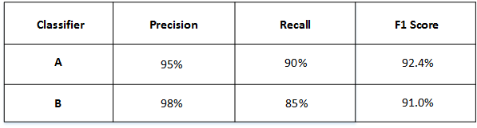

# 机器学习策略（上）

## 为什么是ML策略

当我们最初得到一个深度神经网络模型时，我们可能希望从很多方面来对它进行优化，例如：

- **搜集更多数据**
- **搜集更加多样化的训练集**
- **用梯度下降训练更长时间**
- **尝试用Adam代替梯度下降**
- **尝试更大的神经网络**
- **尝试更小的神经网络**
- **尝试dropout**
- **添加L2回归**
- **神经网络架构：激活函数，隐藏单元…**

可选择的方法很多，也很复杂、繁琐。盲目选择、尝试不仅耗费时间而且可能收效甚微。因此，使用快速、有效的策略来优化机器学习模型是非常必要的。

## 正交化

机器学习中有许多参数、超参数需要调试。通过每次只调试一个参数，保持其它参数不变，而得到的模型某一性能改变是一种最常用的调参策略，我们称之为正交化方法（Orthogonalization）。

正交化的核心在于每次调试**一个参数**只会影响模型的某**一个性能**。

例如老式电视机旋钮，每个旋钮就对应一个功能，调整旋钮会调整对应的功能，而不会影响其它功能。也就是说彼此旋钮之间是互不影响的，是正交的，这也是正交化名称的由来。这种方法能够让我们更快更有效地进行机器学习模型的调试和优化。【可以把它类比为多维空间的坐标轴上的单位向量】

### 四个功能

对应到机器学习监督式学习模型中，可以大致分成四个独立的“功能”，每个“功能”对应一些可调节的唯一的旋钮。四个“功能”如下：

- **在cost函数上很好地拟合训练集**
- **在cost函数上很好地拟合开发集**
- **在cost函数上很好地拟合测试集**
- **在现实情况下表现很好**

第一条优化训练集可以通过使用更复杂NN，使用Adam等优化算法来实现；

第二条优化验证集可以通过正则化，采用更多训练样本来实现；

第三条优化测试集可以通过使用更多的验证集样本来实现；

第四条提升实际应用模型可以通过更换验证集，使用新的cost function来实现。

概括来说，每一种“功能”对应不同的调节方法。而这些调节方法（旋钮）只会对应一个“功能”，是正交的。

### 注意

early stopping在模型功能调试中并不推荐使用。因为early stopping在提升验证集性能的同时降低了训练集的性能。也就是说early stopping同时影响两个“功能”，不具有独立性、正交性。

## 指标

### 单一数字评估指标

构建、优化机器学习模型时，单值评价指标非常必要。有了**量化的单值评价指标**后，我们就能根据这一指标比较不同超参数对应的**模型的优劣**，从而选择最优的那个模型。

#### 例子

比如有A和B两个模型，它们的查准率（Precision）和查全率（Recall）【搜索数据库搜出来的同类个数占总的同类个数的比】分别如下：

如果只看查准率的话，B模型更好。如果只看查全率的话，A模型更好。实际应用中，我们通常使用单值评价指标**F1分数**(F1 Score)来评价模型的好坏。F1分数综合查准率和查全率的大小，计算方法如下：

$$
F1=\frac{2}{\frac 1 P+\frac 1 R}=\frac{2\cdot P\cdot R}{P+R}
$$
然后得到了A和B模型各自的F1分数：

从F1分数来看，A模型比B模型更好一些。通过引入单值评价指标F1分数，很方便对不同模型进行比较。

除了F1分数之外，我们还可以使用**平均值**作为单值评价指标来对模型进行评估。如下图所示，A, B, C, D, E, F六个模型对不同国家样本的错误率不同，可以计算其平均性能，然后选择平均错误率最小的那个模型（C模型）。

### 满足和优化指标

有时候，要把所有的性能指标都综合在一起，构成单值评价指标是比较困难的。解决办法是，我们可以把某些性能作为优化指标（Optimizing metic），寻求最优化值；而某些性能作为满意指标（Satisficing metic），只要满足阈值就行了。

举个猫类识别的例子，有A，B，C三个模型，各个模型的**准确度**和**运行时间**如下表中所示：

准确度和运行时间这两个性能不太合适**综合**成单值评价指标。因此，我们可以将**准确度**作为**优化指标**（Optimizing metic），将**运行时间**作为**满意指标**（Satisficing metic）。也就是说，给运行时间设定一个阈值，在其满足阈值的情况下，选择准确度最大的模型。如果设定运行时间必须在100ms以内，那么很明显，模型C不满足阈值条件，首先剔除；模型B相比较模型A而言，准确度更高，性能更好。

概括来说，性能指标（Optimizing metic）是需要优化的，越优越好；而满意指标（Satisficing metic）只要满足设定的**阈值**就好了。

## 训练/开发/测试集

### 划分

训练/开发/测试集如何设置对机器学习的模型训练非常重要，合理设置能够大大**提高模型训练效率和模型质量**。

原则上应该尽量保证开发集和测试集来源于**同一分布**且都**反映了实际样本的情况**。如果开发集和测试集不来自同一分布，那么我们从开发集上选择的“最佳”模型往往不能够在测试集上表现得很好。

这就好比我们在开发集上找到最接近一个靶的靶心的箭，但是我们测试集提供的靶心却远远偏离开发集上的靶心，结果这支肯定无法射中测试集上的靶心位置。

### 开发集合测试集的大小

在之前的课程中我们已经介绍过，当样本数量不多（小于一万）的时候，通常将训练/开发/测试集的比例设为60%/20%/20%，在没有开发集的情况下，训练/测试集的比例设为70%/30%。当样本数量很大（百万级别）的时候，通常将相应的比例设为98%/1%/1%或者99%/1%。

对于开发集数量的设置，应该遵循的**准则**是通过开发集**能够检测**不同算法或模型的**区别**，以便选择出更好的模型。

对于测试集数量的设置，应该遵循的**准则**是通过测试集**能够反映**出模型在实际中的**表现**。

实际应用中，可能只有训练/开发集，而没有测试集。这种情况也是允许的，只要算法模型**没有对开发集过拟合**。但是，条件允许的话，最好是有test sets，实现无偏估计。

### 什么时候该改变开发/测试集和指标

算法模型的评价标准有时候需要根据实际情况进行动态调整，目的是让算法模型在实际应用中有更好的效果。

举个猫类识别的例子。初始的评价标准是错误率，算法A错误率为3%，算法B错误率为5%。显然，A更好一些。

但是，实际使用时发现算法A会通过一些色情图片，但是B没有出现这种情况。从用户的角度来说，他们可能更倾向选择B模型，虽然B的错误率高一些。

这时候，我们就需要改变之前单纯只是使用错误率作为评价标准，而考虑新的情况进行改变。例如增加色情图片的权重，**增加其代价**。

原来的成本函数：

$$
J=\frac1m\sum_{i=1}^mL(\hat y^{(i)},y^{(i)})
$$
更改评价标准后的成本函数：

$$
J=\frac{1}{w^{(i)}}\sum_{i=1}^mw^{(i)}L(\hat y^{(i)},y^{(i)})
$$

$$
w^{(i)}=\begin{cases} 
		1, & x^{(i)}\ is\ non-porn\\ 
		10, & x^{(i)}\ is\ porn 
	\end{cases}
$$

概括来说，机器学习可分为两个过程：

- **定义一个度量标准来评估分类器**
- **如何在这个标准下做得更好**

也就是说，第一步是**找靶心**，第二步是**通过训练，射中靶心**。但是在训练的过程中可能会根据实际情况改变算法模型的评价标准，进行动态调整。

另外一个需要动态改变评价标准的情况是开发/训练集与实际使用的样本分布不一致。比如猫类识别样本图像分辨率差异。

## 表现

### 为什么是人的表现

机器学习模型的表现通常会跟人类水平表现作比较，如下图所示：

图中，横坐标是训练时间，纵坐标是准确性。机器学习模型经过训练会不断接近人类级表现甚至超过它。但是，超过人类级表现之后，准确性会上升得比较缓慢，最终不断接近理想的最优情况，我们称之为**贝叶斯最优误差**。理论上任何模型都不能超过它，贝叶斯最优误差代表了最佳表现。

实际上，人类级表现在某些方面有不俗的表现。例如图像识别、语音识别等领域，人类是很擅长的。所以，让机器学习模型性能不断接近人类级表现非常必要也做出很多努力：

- **从人类那里获取带标签的数据**
- **从人工错误分析中提升洞察力:为什么一个人能做对**
- **更好的分析方差/偏差**

### 可避免偏差

实际应用中，要看**人类误差，训练误差和开发误差**的相对值。

例如猫类识别的例子中，如果人类误差为1%，训练误差为8%，dev error为10%。由于训练误差与人类误差相差7%，开发误差与训练误差只相差2%，所以目标是尽量在训练过程中减小训练误差，即减小偏差bias。

如果图片很模糊，肉眼也看不太清，人类误差提高到7.5%。这时，由于训练误差与人类误差只相差0.5%，开发误差与训练误差只相差2%，所以目标是尽量在训练过程中减小开发误差，即方差variance。这是相对而言的。

对于物体识别这类CV问题，人类误差是很低的，很接近理想情况下的贝叶斯最优误差。因此，上面例子中的1%和7.5%都可以近似看成是两种情况下对应的贝叶斯最优误差。实际应用中，我们一般会用人类误差代表贝叶斯最优误差。

#### 定义

通常，我们把训练误差与人类误差之间的差值称为bias，也称作**可避免偏差**(avoidable bias)；把开发误差与训练误差之间的差值称为**方差**(variance)。根据偏差和方差值的**相对大小**，可以判断算法模型是否发生了**欠拟合**或者**过拟合**。

### 理解人的表现

我们说过人类级表现能够代表贝叶斯最优误差。但是，人类级表现如何定义呢？举个医学图像识别的例子，不同人群的误差有所不同：

**普通人 : 3% 错误率**

**普通医生 : 1% 错误率**

**有经验的医生 : 0.7% 错误率**

**专家团: 0.5% 错误率**

不同人群他们的错误率不同。一般来说，我们将表现最好的那一组，即专家团的表现作为**人类级表现**。那么，这个例子中，人类误差就为0.5%。但是实际应用中，不同人可能选择的人类级表现基准是不同的，这会带来一些影响。

假如该模型训练误差为0.7%，开发误差为0.8%。如果选择专家团表现，即0.5%，则偏差比方差更加突出。

如果选择有经验的医生的表现，即0.7%，则方差更加突出。

**也就是说，选择什么样的人类误差，有时候会影响偏差和方差值的相对变化。**

当然这种情况一般只会在模型表现很好，接近贝叶斯最优误差的时候出现。越接近贝叶斯最优误差，模型越难继续优化，因为这时候的人类表现是模糊，难以界定的。

### 超过人的表现

对于自然感知类问题，例如视觉、听觉等，机器学习的表现不及人类。但是在很多其它方面，机器学习模型的表现已经超过人类了，包括：

- **在线广告**
- **产品推荐**
- **物流(预测运输时间)**
- **贷款核准**

实际上，机器学习模型超过人类级表现是比较困难的。但是只要提供足够多的样本数据，训练复杂的神经网络，模型预测准确性会大大提高，很有可能接近甚至超过人类级表现。

值得一提的是当算法模型的表现超过人类级表现时，很难再通过人的直觉来解决如何继续提高算法模型性能的问题。

### 改善模型表现

提高机器学习模型性能主要要解决两个问题：可避免偏差和方差。我们之前介绍过，**训练误差与人类误差之间的差值反映的是可避免误差**，**训练误差和开发误差之间的差值反映的是方差。**

解决**可避免误差**的常用方法包括：

- **训练一个更大的模型**
- **训练一个更长/更好的优化算法： momentum, RMSprop, Adam**
- **NN 架构/超参数搜索**

解决**方差**的常用方法包括：

- **更多数据**
- **正则化: L2, dropout, 增加数据**
- **NN 架构/超参数搜索**