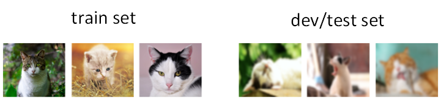
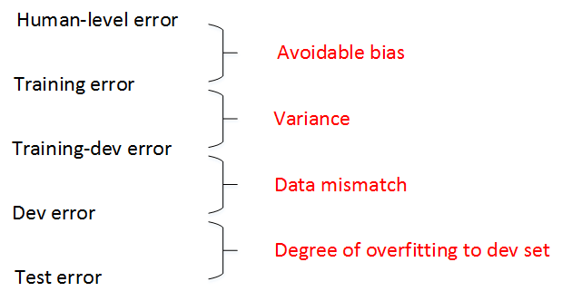
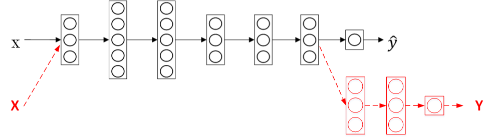
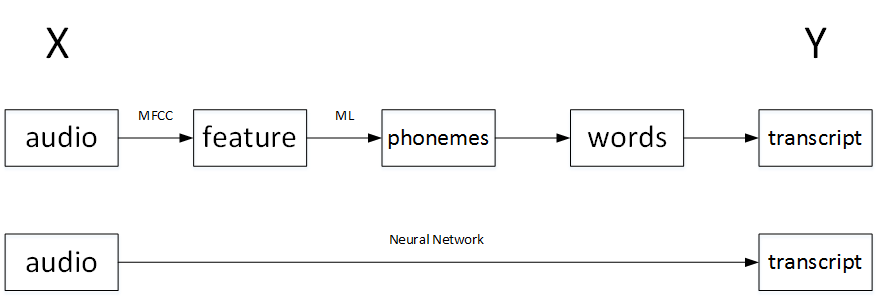

# 机器学习策略（下）

## 进行错误分析

对已经建立的机器学习模型进行错误分析（error analysis）十分必要，而且有针对性地、正确地进行错误分析更加重要。

举个例子，猫类识别问题，已经建立的模型的错误率为10%。为了提高正确率，我们发现该模型会将一些狗类图片错误分类成猫。一种常规解决办法是扩大狗类样本，增强模型对够类（负样本）的训练。但是，这一过程可能会花费几个月的时间，耗费这么大的时间成本到底是否值得呢？也就是说扩大狗类样本，重新训练模型，对提高模型准确率到底有多大作用？这时候我们就需要进行错误分析，帮助我们做出判断。

错误后的模型错误率有望降低到5%，性能改善很大。因此，值得去花费更多的时间扩大狗类样本。

假如狗类样本所占所有错误的比重仅为5%，即时我们花费几个月的时间扩大狗类样本，提升模型对其识别率，改进后的模型错误率最多只会降低到9.5%。相比之前的10%，并没有显著改善。我们把这种性能限制称为**性能上限**。

相反，假如错误样本中狗类所占比重为50%，那么改进后的模型错误率有望降低到5%，性能改善很大。因此，值得去花费更多的时间扩大狗类样本。

这种错误分析可以同时评估多个影响模型性能的因素，通过各自在错误样本中所占的比例来判断其重要性。例如，猫类识别模型中，可能有以下几个影响因素：

- **修正被识别为猫的狗的照片**
- **修正大型猫科动物(如狮子黑豹等)被误认的错误**
- **提升对模糊图片的识别表现**

通常来说，比例越大，影响越大，越应该花费时间和精力着重解决这一问题。这种误差分析让我们改进模型更加有针对性，从而提高效率。

## 清除错误标注的数据

监督式学习中，训练样本有时候会出现输出y标注错误的情况，即**非正确标注样本**。如果这些标签标错的情况是**随机性错误**（random errors），DL算法(深度学习算法)对其包容性是比较强的，即健壮性好，一般可以直接忽略，无需修复。然而，如果是**系统错误**（systematic errors），这将对DL算法造成影响，降低模型性能。

刚才说的是训练样本中出现非正确标注样本数据，如果是开发/测试集中出现非正确标注样本数据，该怎么办呢？

方法很简单，利用上节内容介绍的错误分析，统计开发集中所有分类错误的样本中非正确标注样本数据所占的比例。**根据该比例的大小**，决定是否需要修正所有非正确标注样本数据，还是可以忽略。举例说明，若：

- **所有开发集错误: 10%**
- **错误标注导致的错误: 0.6%**
- **其他原因导致的错误: 9.4%**

上面数据表明错误标注导致的错误所占的比例仅为0.6%，占开发集错误的6%，而其它类型错误占开发集错误的94%。因此，这种情况下，可以忽略非正确标注样本数据。

如果优化DL算法后，出现下面这种情况：

- **所有开发集错误: 2%**
- **错误标注导致的错误: 0.6%**
- **其他原因导致的错误: 1.4%**

上面数据表明错误标注导致的错误所占的比例依然为0.6%，但是却占开发集错误的30%，而其它类型错误占开发集错误的70%。因此，这种情况下，非正确标注样本数据不可忽略，需要手动修正。

我们知道，开发集的主要作用是在不同算法之间进行比较，选择错误率最小的算法模型。但是，如果有非正确标注样本数据的存在，当不同算法错误率比较接近的时候，我们无法仅仅根据所有开发集错误准确指出哪个算法模型更好，必须修正非正确标注样本数据。

### 建议

- **对您的开发和测试集应用相同的过程，以确保它们继续来自相同的分布**
- **考虑一个例子能够判断你的算法正确与否**
- **训练和开发/测试数据现在可能来自稍微不同的分布**

## 快速搭建你的第一个系统并进行迭代

对于如何构建一个机器学习应用模型，吴恩达给出的建议是先快速构建第一个简单模型，然后再反复迭代优化。

- **设置开发/测试集和度量标准**
- **快速构建初始化系统**
- **使用Bias/Variance（偏差/方差）分析 & 错误分析来确定下一步**

## 在不同的划分上进行训练并测试

当训练集与开发/测试集不来自同一个分布的时候，我们应该如何解决这一问题，构建准确的机器学习模型呢？

以猫类识别为例，训练集来自于网络下载（webpages），图片比较清晰；开发/测试集来自用户手机拍摄（mobile app），图片比较模糊。假如train set的大小为200000，而开发/测试集的大小为10000，显然训练集要远远大于开发/测试集。

虽然开发/测试集质量不高，但是模型最终主要**应用**在对这些模糊的照片的处理上。面对训练集与开发/测试集分布不同的情况，有两种解决方法。

### 解决方法

#### 法一

第一种方法是将训练集与开发/测试集完全混合，然后在随机选择一部分作为训练集，另一部分作为开发/测试集。例如，混合210000例样本，然后随机选择205000例样本作为训练集，2500例作为开发集，2500例作为测试集。

这种做法的**优点**是实现训练集与开发/测试集分布一致，**缺点**是开发/测试集中网络下载的图片所占的比重比手机拍摄的图片大得多。

例如开发集包含2500例样本，大约有2381例来自网络下载的图片，只有119例来自手机拍摄的图片。这样，开发集的算法模型对比验证，仍然主要由网络下载的图片决定，实际应用的手机拍摄的图片所占比重很小，达不到验证效果。因此，这种方法并不是很好。

#### 法二

第二种方法是将原来的训练集和一部分开发/测试集组合当成训练集，剩下的分别作为开发集和测试集。

例如，200000例网络下载的图片和5000例手机拍摄的图片组合成训练集，剩下的2500例手机拍摄的图片作为开发集，2500例手机拍摄的图片作为测试集。

其关键在于开发/测试集全部来自于手机拍摄的图片。这样保证了验证集最接近实际应用场合。这种方法较为常用，而且性能表现比较好。

## 分布不一致

### 不匹配数据划分的偏差与方差

#### 相对值的多种起因

我们之前介绍过，根据人类误差，训练误差和开发误差的相对值可以判定是否出现了偏差或者方差。

但是，需要注意的一点是，如果训练集与开发/测试集来源于不同分布，则无法直接根据相对值大小来判断。例如某个模型人类误差为0%（近似），训练误差为1%，开发误差为10%。根据我们之前的理解，显然该模型出现了方差。

但是，训练误差与开发误差之间的差值9%可能来自**算法本身**，也可能来自于**样本分布不同**。比如开发集都是很模糊的图片样本，本身就难以识别，跟算法模型关系不大。因此不能简单认为出现了方差。

##### 判断是否出现方差

如果可能训练集与开发/测试集分布不一致，定位是否出现方差的方法是设置训练-开发集。吴恩达给训练-开发集的定义是：“与训练及分布相同，但不用在训练集上。”也就是说，从原来的训练集中分割出一部分作为训练-开发集，训练-开发集不作为训练模型使用，而是与开发集一样用于验证。

这样，我们就有**训练误差**、**训练-开发误差**和**开发误差**三种误差。其中，训练误差和训练-开发误差的差值反映了**方差**；训练-开发误差和开发误差的差值反映了数据不匹配问题，即**样本分布不一致**。

##### 例子

训练误差 ：1%

训练-开发误差 ：9%

开发误差 ：10%

**方差**问题比较突出

训练误差 ：1%

训练-开发误差 ：1.5%

开发误差 ：10%

**样本分布不一致**问题比较突出。

通过引入训练-开发集，能够比较准确地定位出现了方差还是样本分布不一致。

总结一下人类误差、训练误差、训练-开发误差、开发误差以及测试误差之间的差值关系和反映的问题：

一般情况下，人类误差、训练误差、训练-开发误差、开发误差以及测试误差的数值是递增的，但是也会出现开发误差以及测试误差下降的情况。这主要可能是因为训练样本比验证/测试样本更加复杂，难以训练。

### 定位数据不匹配

关于如何解决训练集与开发/测试集样本分布不一致的问题，有两条建议：

- **进行人工错误分析，去搞明白训练、开发/测试集之间的差异**
- **使训练集数据更加相似; 或者搜集与开发/测试集类似的更多数据**

为了让训练集与开发/测试集类似，我们可以使用人工数据合成的方法（artificial data synthesis）。

例如说话人识别问题，实际应用场合（开发/测试集）是包含背景噪声的，而训练样本训练集很可能没有背景噪声。为了让训练集与开发/测试集分布一致，我们可以在训练集上人工添加背景噪声，合成类似实际场景的声音。这样会让模型训练的效果更准确。

但是，需要注意的是，我们不能给每段语音都增加同一段背景噪声，这样会出现对背景噪音的过拟合，效果不佳。这就是人工数据合成需要注意的地方。

## 迁移学习

深度学习非常强大的一个功能之一就是有时候你可以将已经训练好的模型的一部分知识（网络结构）直接应用到另一个类似模型中去。比如我们已经训练好一个猫类识别的神经网络模型，那么我们可以直接把该模型中的一部分网络结构应用到使用X光片预测疾病的模型中去。这种学习方法被称为**迁移学习**（Transfer Learning）。

### 过程

如果我们已经有一个训练好的神经网络，用来做图像识别。现在，我们想要构建另外一个通过X光片进行诊断的模型。迁移学习的做法是无需重新构建新的模型，而是利用之前的神经网络模型，只改变样本输入、输出以及输出层的权重系数$W^{[L]}, b^{[L]}$。也就是说对新的样本(X,Y)，重新训练**输出层**权重系数$W^{[L]}, b^{[L]}$，而其它层所有的权重系数$W^{[l]}, b^{[l]}$**保持不变**。

#### 样本量少

迁移学习，重新训练权重系数，如果需要构建新模型的**样本数量较少**，那么可以像刚才所说的，只训练输出层的权重系数$W^{[L]}, b^{[L]}$，保持其它层所有的权重系数$W^{[l]}, b^{[l]}$不变。

#### 样本量多

这种做法相对来说比较简单。如果**样本数量足够多**，那么也可以只保留网络结构，重新训练所有层的权重系数。这种做法使得模型更加精确，因为毕竟样本对模型的影响最大。选择哪种方法通常由数据量决定。

顺便提一下，如果重新训练所有权重系数，初始$W^{[l]}, b^{[l]}$由之前的模型训练得到，这一过程称为**预训练**（黑色箭头）。之后，不断调试、优化$W^{[l]}, b^{[l]}$的过程称为**微调**（红色箭头）。

### 原因

迁移学习之所以能这么做的**原因**是，神经网络**浅层部分能够检测出许多图片固有特征**，例如图像边缘、曲线等。使用之前训练好的神经网络部分结果有助于我们更快更准确地提取X光片特征。二者处理的都是图片，而图片处理是有相同的地方，第一个训练好的神经网络已经帮我们实现如何提取图片有用特征了。

 因此，即便是即将训练的第二个神经网络样本数目少，仍然可以根据第一个神经网络结构和权重系数得到健壮性好的模型。

迁移学习可以保留原神经网络的一部分，再添加新的网络层。具体问题，具体分析，可以去掉输出层后再增加额外一些神经层。

### 总结

总体来说，迁移学习的应用场合主要包括三点：

- **任务 A 与 B 有着相同的输出x.**
- **你对于任务 A 拥有更多数据**
- **从 A 中取得的低层特征是有利于完成任务 B 的**

## 多任务学习

顾名思义，多任务学习（multi-task learning）就是构建神经网络**同时执行多个任务**。这跟二元分类或者多元分类都不同，多任务学习类似将多个神经网络融合在一起，用一个网络模型来实现多种分类效果。如果有C个，那么输出y的维度是$(C,1)$。例如汽车自动驾驶中，需要实现的多任务为行人、车辆、交通标志和信号灯。如果检测出汽车和交通标志，则y为：

$$
y=
\left[
 \begin{matrix}
   0\\
   1\\
   1\\
   0
  \end{matrix}
  \right]
$$
多任务学习模型的成本函数为：

$$
\frac1m\sum_{i=1}^m\sum_{j=1}^cL(\hat y_j^{(i)},y_j^{(i)})
$$

其中，j表示任务下标，总有c个任务。对应的损失函数为：

$$
L(\hat y_j^{(i)},y_j^{(i)})=-y_j^{(i)}log\ \hat y_j^{(i)}-(1-y_j^{(i)})log\ (1-\hat y_j^{(i)})
$$

### 区别

值得一提的是，多任务学习与Softmax回归的区别在于Softmax回归是**单标签**的的，即输出向量y只有一个元素为1；而多任务学习是**多标签**的，即输出向量y可以有多个元素为1。

多任务学习是使用单个神经网络模型来实现多个任务。实际上，也可以分别构建多个神经网络来实现。但是，如果各个任务之间是**相似问题**（例如都是图片类别检测），则可以使用多任务学习模型。另外，多任务学习中，可能存在训练样本Y某些标签空白的情况，这并不影响多任务模型的训练。

### 应用场合

总体来说，多任务学习的应用场合主要包括三点：

- **对一组任务进行训练，这些任务可以通过共享较低级别的特征来获益。**
- **通常每个任务的数据量是相似的**
- **能够训练足够大的神经网络使所有任务都处理良好**

顺便提一下，迁移学习和多任务学习在实际应用中，迁移学习使用得更多一些。

## 端到端的深度学习

### 什么是端到端的深度学习

端到端（end-to-end）深度学习就是将所有不同阶段的数据处理系统或学习系统模块组合在一起，用一个单一的神经网络模型来实现所有的功能。它将所有模块混合在一起，只关心输入和输出。

以语音识别为例，传统的算法流程和端到端模型的区别如下：

如果训练样本足够大，神经网络模型足够复杂，那么end-to-end模型性能比传统机器学习分块模型更好。实际上，端到端让神经网络模型内部去自我训练模型特征，自我调节，增加了模型整体契合度。

### 是否要使用端到端的深度学习

端到端深度学习有优点也有缺点。

#### 优点：

- **让数据"说话"**
- **手工设计所需组件更少**

#### 缺点：

- **可能需要大量数据才能体现其优越性**
- **排除了可能有用的手工设计**