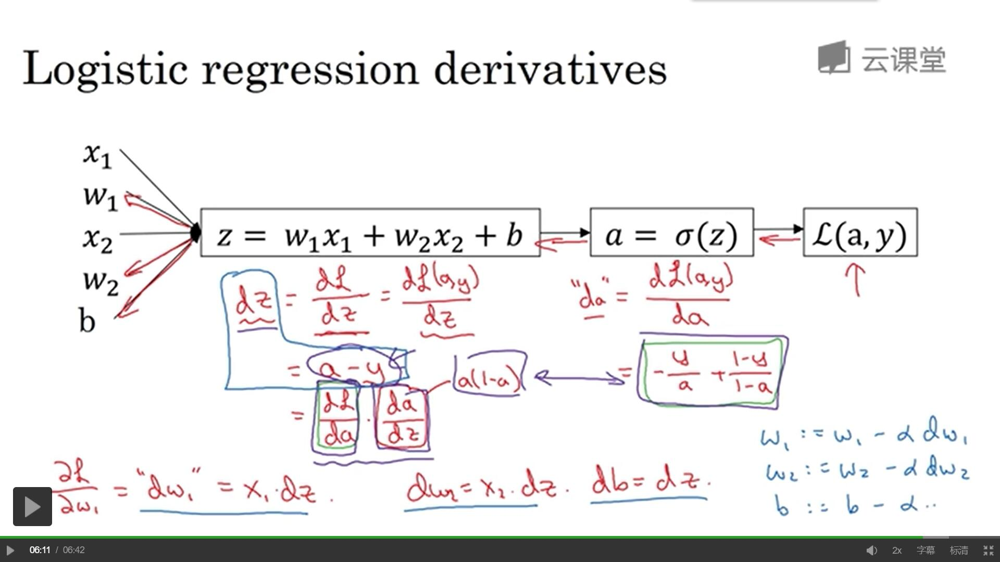

# **深度学习**

# 神经网络与深度学习

## 概论

### 深度学习是什么？

深度学习指的是训练很大的神经网络

### 神经网络是什么？

房价预测模型

假设有6间房屋的数据集（房屋面积s已知,价格已知）

想要找到一个函数能够很好地预测房价的趋势 

如果你懂得线性回归，就可以拟合一条曲线

由于房价永远不为负，所以纯粹的直线不大合适

这个房屋加上拟合曲线，看城市一个非常简单的神经网络。

#### 神经元

我们把房屋的面积，作为神经网络的输入x，通过一个节点，最后输出了价格y，这个节点就是独立的**神经元**

这个神经元所做的就是输入面积，进行线性运算，取不小于0的值最后得到输出预测价格。

#### ReLU函数

形如上文的这种函数，被称为ReLU函数（修正线性单元）rectified linear unit。修正指的是取不小于0的值

#### 神经网络

把这些单个的神经元堆叠，就形成了一张网络，及神经网络

同样的，如果不仅仅是房屋的面积，我们还知道一些其他的特征影响房价信息。比如卧室数量（影响家庭人口数量），邮编（影响高度步行化，学校质量），富裕程度（影响学校质量）

$x_i$为输入层， 中间三个圈称为隐藏单元，每个输入都同时来自四个特征（中间连接数很高）需要给予足够的x，y训练样本，神经网络就能计算从x到y的精准映射函数

### 监督学习

| 输入(x)   | 输出(y)        | 应用         |                                    |
| --------- | -------------- | ------------ | ---------------------------------- |
| 房产状况  | 价格           | 预测评估房价 | Standard NN                        |
| 用户信息  | 是否推送广告   | 在线广告     | Standard NN                        |
| 图像      | 判断物体       | 图像识别     | CNN                                |
| 音频      | 文本           | 语音识别     | RNN                                |
| 英语      | 中文           | 机器翻译     | RNNs                               |
| 图像+雷达 | 与其他车的距离 | 自动驾驶     | Hybrid neural network architecture |

对于序列数据，比如音频中的时间元素，音频是随着时间播放的，所以音频很自然的被表示为一维时间序列，对于序列数据，经常使用RNN循环神经网络。语言英语汉语字母或单词都是逐个出现的。所以语言最自然的表示方式也是序列数据。更为复杂的RNNs往往会应用这些方面。

更加复杂的如无人驾驶等等，包含图像(经常使用CNN卷积神经网络架构处理)，雷达（其他类型）等信息会使用更加复杂的混合神经网络结构

#### 图例

##### Standard NN

##### CNN

##### RNN

#### 结构化数据

有一定结构存放的数据

#### 非结构化数据

例如图片，音频等信息数据

多亏机器学习和深度学习，计算机现在能够更好的解释非结构化数据。同时也创造出了大量的应用场景，如语音识别，图像识别，自然语言文字处理。神经网络在很多短期经济价值的创造是基于结构化数据的，比如更好的广告，更好的获利建议。所以对于结构化数据，神经网络有更好的能力去处理海量的数据库。

### 深度学习的性能

#### 数据规模驱动

#### 计算性能提升

#### 算法改进

使卷积神经网络更快。

例如对于sigmoid函数，在两段倒数会无限趋近于0，学习效率会大大减慢，通过改变激活函数，将其优化成ReLU，使梯度下降法更快

#### 实践过程

## 神经网络基础

### 二分分类

#### 引子

比如有这样一张图

如果这张图判定为有小猫则输出1，否则输出0，我们用y来表示输出结果标签。

首先，图像在计算机中是由RGB三种颜色组成的。如果该图为64×64像素大小，那么就有三个64×64的矩阵。对应红绿蓝三种颜色的亮度。

把里面所有元素（即像素值）都提取出来放入一个特征向量x，那么结果就会是这样：

#### 将来用到的符号

用一对(x,y)来表示一个单独的样本，x是$n_x$维的特征向量，y值为0或1。训练集由m个训练样本构成。

$（x^{(1)},y^{(1)})$表示样本1的输入与输出，$（x^{(2)},y^{(2)})$表示样本2的输入与输出.....$（x^{(m)},y^{(m)})$表示样本m的输入与输出

m为训练集总数，$m=m_{train}$，$m_{test}$表示测试集的数量。

最后用更紧凑的符号表示训练集

$$
X=\left[
 \begin{matrix}
   | & | & | & | & |\\
   | & | & | & | & | \\
   x_1 & x_2 & * & * & x_m \\
   | & | & | & | & |
  \end{matrix} 
\right]_{m×n_x}
$$

$$
Y=\left[
 \begin{matrix}
   y_1 & y_2 & * & * & y_m\\
  \end{matrix} 
\right]_{1×m}
$$

### logistic回归

已知:	x，

要求:	$\hat{y}=P(y=1|x)$

参数:	X为$n_x$维向量($x∈R^{n_x}$)，回归参数$w∈R^{n_x}$,$b∈R$

输出:	$\hat{y}=w^Tx+b$

但是因为希望$\hat{y}$为y=1的概率，所以$\hat{y}$应介于0,1之间。

所以$\hat{y}=σ(w^Tx+b)$【取sigmoid函数】。

$σ(z)=\frac{1}{1+e^{-z}}$

为了训练logistic回归模型的参数w以及b，需要定义一个成本函数。

$\hat{y}$是对一个训练样本x来说，对于每个训练样本使用这些带有圆括号的上标。方便应用说明，还有区分样本，你的训练样本(i)对应的预测值是$\hat{y}^{(i)}$是用训练样本通过sigmoid函数作用到$w^Tx+b$得到的。

#### 损失函数/误差函数

可以用来衡量算法的运行情况。我们可以定义损失为$L(\hat{y},y)=\frac{(\hat{y}-y)^2}{2}$，但是大家一般不会这样做，因为之后讨论的优化问题会变成非凸的，最后会得到很多个局部最优解，梯度下降法可能找不到全局最优值。

因此，为了能够达到平方相似的目的，误差平方越小越好，我们定义损失函数为：
$$
L(\hat{y},y)=-(ylog\hat{y}+(1-y)log(1-\hat{y}))
$$
当y=1时：$L(\hat{y},y)=-log\hat{y}$ 需要$\hat{y}$足够的大，但$\hat{y}<1$,所以$\hat{y}->1$

当y=0时：$L(\hat{y},y)=-log(1-\hat{y})$ 需要$\hat{y}$足够的小，但$\hat{y}>0$,所以$\hat{y}->0$.

损失函数是在单个训练样本中定义的，它衡量了在单个训练样本上的表现。

#### 成本函数（Cost Function）

它衡量的是在全体训练样本上的表现

$$
J(w,b)=\frac{\sum { L(\hat{y}^{(i)},y^{(i)})}}{m}=-\frac{\sum { y^{(i)}log\hat{y}^{(i)}+(1-y^{(i)})log(1-\hat{y}^{(i)})}}{m}
$$

损失函数只适用于单个训练样本，成本函数基于参数总成本，所以在训练logistic回归模型时，我们要找到合适的w和b是这里的成本函数J尽可能地小

#### 梯度下降法

用梯度下降法训练或学习训练集上的参数w和b。

J(w,b)是在水平轴w和b上的曲面，其高度代表了J(w,b)在某一点的值。

如图，J是这样的一个凸函数。用某个初始值，初始化w和b。对于logistic回归而言，几乎任意的初始化方案都有效，通常用0。但是对于logistic回归，我们通常不这么做。但由于该函数是凸的，无论哪里初始化，都应该达到统一点火大致相同的点。梯度下降法所做的就是，从初始点开始，朝最陡的下坡方向一步步往下走，并很有希望收敛到这个（接近）全局最优解。

希望得到最小化J(w)，为了简化，首先忽略b，仅用一维曲线，代替多维曲线。

梯度下降法是这样做的：

重复执行以下的更新操作：
$$
w=w-\alpha\frac{dJ(w)}{dw}
$$

$\alpha$表示学习率，可以控制每一次迭代，可以控制每一次迭代，或者梯度下降法中的步长。之后会讨论如何选择$\alpha$。其次，在这里，这个数是导数，这就是对参数w的更新，或者变化量。代码中，我们会用dw表示导数。即:

$$
w=w-\alpha dw
$$

根据公式，该函数反复更新，会逐渐的接近最低点。

### 向量化

#### 什么是向量化？

在logistic回归中你需要去计算$z=w^Tx+b$，w是列向量，x也是列向量。如果有很多特征，他们就是非常大的向量，所以w和x都是R内的$n_x$维的向量。所以去计算W'X需要向量化，后会加快其速度

可以看到向量化速度远远快于for，所以一定要尽量避免for循环

所以以后使用for前先看看有没有numpy的内置方法

#### Python中的广播

优点：极其方便快捷

缺点：可能会产生一些奇怪的内在逻辑错误。

尽量少用形如（n,）的这种秩为1的数组，使用(n,1)确保不会出现a*a.T不会出现问题